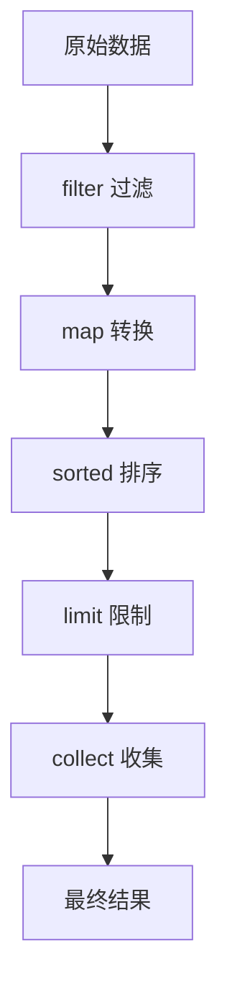
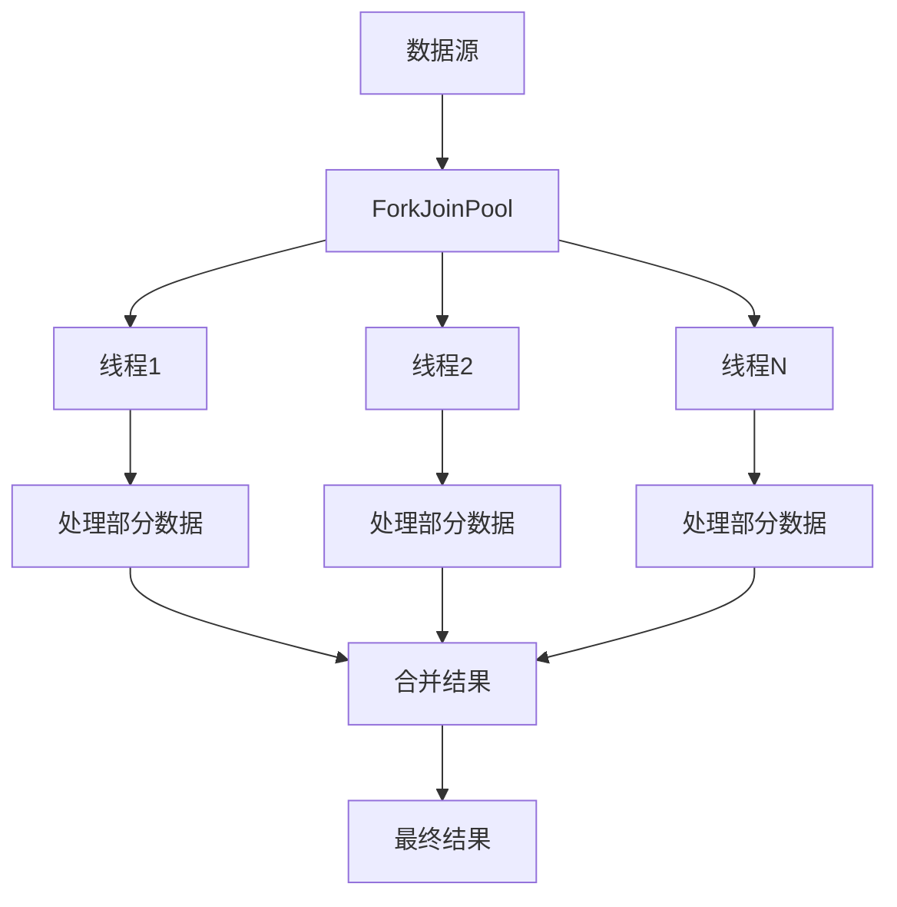

# Lambda 与 Stream 函数式编程

> Lambda 表达式和 Stream API 是 Java 8 引入的两个革命性特性，彻底改变了 Java 编程的方式。它们让代码更简洁、更函数化、更易于并行处理。

## 基础入门：Lambda 表达式

### 核心概念
Lambda 表达式是 Java 8 引入的最重要的特性之一，它允许我们将函数作为方法参数，或者将代码作为数据来处理。

```java
// 传统匿名内部类
Runnable r1 = new Runnable() {
    @Override
    public void run() {
        System.out.println("Hello World");
    }
};

// Lambda 表达式
Runnable r2 = () -> System.out.println("Hello World");

// 函数式接口示例
Function<String, Integer> strLength = s -> s.length();
Predicate<String> isEmpty = s -> s.isEmpty();
Consumer<String> print = s -> System.out.println(s);
```

### 函数式接口详解

#### Consumer&lt;T&gt; - 消费者
```java
// 消费一个参数，无返回值
Consumer<String> printConsumer = s -> System.out.println("消费: " + s);
printConsumer.accept("Hello Lambda");
```

#### Supplier&lt;T&gt; - 供给者
```java
// 无参数，返回一个值
Supplier<String> supplier = () -> "这是供给的字符串";
System.out.println(supplier.get());
```

#### Predicate&lt;T&gt; - 断言
```java
// 接收一个参数，返回布尔值
Predicate<Integer> isPositive = i -> i > 0;
System.out.println("5 is positive: " + isPositive.test(5));
System.out.println("-3 is positive: " + isPositive.test(-3));
```

#### Function&lt;T, R&gt; - 函数
```java
// 接收一个参数，返回一个值
Function<String, Integer> stringLength = s -> s.length();
Function<Integer, String> numberToString = i -> "Number: " + i;

// 函数组合
Function<String, String> composed = stringLength.andThen(numberToString);
System.out.println(composed.apply("Hello")); // 输出: Number: 5
```

## Stream API 深入

### Stream 基础操作

#### 创建 Stream
```java
// 从集合创建
List<String> names = Arrays.asList("Alice", "Bob", "Charlie", "David");
Stream<String> nameStream = names.stream();

// 从数组创建
String[] namesArray = {"Alice", "Bob", "Charlie"};
Stream<String> arrayStream = Arrays.stream(namesArray);

// 创建无限流
Stream<Integer> infiniteStream = Stream.iterate(0, n -> n + 1);
Stream<Double> randomStream = Stream.generate(Math::random);

// 从文件行创建
try {
    Stream<String> lines = Files.lines(Paths.get("file.txt"));
} catch (IOException e) {
    e.printStackTrace();
}
```

#### 中间操作

```java
List<Integer> numbers = Arrays.asList(1, 2, 3, 4, 5, 6, 7, 8, 9, 10);

// filter - 过滤
List<Integer> evenNumbers = numbers.stream()
    .filter(n -> n % 2 == 0)
    .collect(Collectors.toList());

// map - 转换
List<String> numberStrings = numbers.stream()
    .map(String::valueOf)
    .collect(Collectors.toList());

// limit - 限制数量
List<Integer> firstThree = numbers.stream()
    .limit(3)
    .collect(Collectors.toList());

// skip - 跳过前几个
List<Integer> skipped = numbers.stream()
    .skip(3)
    .collect(Collectors.toList());

// distinct - 去重
List<Integer> unique = Arrays.asList(1, 2, 2, 3, 3, 3).stream()
    .distinct()
    .collect(Collectors.toList());
```

### 终止操作

```java
List<Integer> numbers = Arrays.asList(1, 2, 3, 4, 5, 6, 7, 8, 9, 10);

// collect - 收集结果
List<Integer> evenNumbers = numbers.stream()
    .filter(n -> n % 2 == 0)
    .collect(Collectors.toList());

// forEach - 遍历
numbers.stream()
    .forEach(System.out::println);

// reduce - 归约
Optional<Integer> sum = numbers.stream()
    .reduce(Integer::sum);
    
Optional<Integer> product = numbers.stream()
    .reduce(1, (a, b) -> a * b);

// count - 计数
long count = numbers.stream().count();

// anyMatch/allMatch/noneMatch
boolean hasEven = numbers.stream().anyMatch(n -> n % 2 == 0);
boolean allPositive = numbers.stream().allMatch(n -> n > 0);
boolean hasNegative = numbers.stream().noneMatch(n -> n < 0);
```

### Stream 管道操作

```java
List<String> names = Arrays.asList("Alice", "Bob", "Charlie", "David", "Eve");

// 完整的 Stream 管道
List<String> result = names.stream()
    .filter(name -> name.length() > 3)        // 过滤长度大于3的
    .map(String::toUpperCase)              // 转换为大写
    .sorted()                              // 排序
    .limit(3)                             // 只取前3个
    .collect(Collectors.toList());          // 收集为List

// 流程图示例


### 高级 Stream 操作

#### 分组与分区
```java
List<Person> people = Arrays.asList(
    new Person("Alice", 25, "Female"),
    new Person("Bob", 30, "Male"),
    new Person("Charlie", 25, "Male"),
    new Person("David", 35, "Male")
);

// 按性别分组
Map<String, List<Person>> byGender = people.stream()
    .collect(Collectors.groupingBy(Person::getGender));

// 按年龄分组
Map<Integer, List<Person>> byAge = people.stream()
    .collect(Collectors.groupingBy(Person::getAge));

// 分组计数
Map<String, Long> genderCount = people.stream()
    .collect(Collectors.groupingBy(
        Person::getGender,
        Collectors.counting()
    ));

// 多级分组
Map<String, Map<Integer, List<Person>>> complexGroup = people.stream()
    .collect(Collectors.groupingBy(
        Person::getGender,
        Collectors.groupingBy(Person::getAge)
    ));

// 分区（boolean 分组）
Map<Boolean, List<Person>> byAge25 = people.stream()
    .collect(Collectors.partitioningBy(p -> p.getAge() > 25));
```

#### 统计操作
```java
List<Integer> numbers = Arrays.asList(1, 2, 3, 4, 5, 6, 7, 8, 9, 10);

// 收集器
IntSummaryStatistics stats = numbers.stream()
    .collect(Collectors.summarizingInt(Integer::intValue));

System.out.println("Sum: " + stats.getSum());
System.out.println("Average: " + stats.getAverage());
System.out.println("Min: " + stats.getMin());
System.out.println("Max: " + stats.getMax());
System.out.println("Count: " + stats.getCount());

// 自定义收集器
List<String> words = Arrays.asList("apple", "banana", "cherry", "date");
String joined = words.stream()
    .collect(Collectors.joining(", ", "Fruits: ", "!"));
// 输出: Fruits: apple, banana, cherry, date!
```

## 并行流处理

### 并行流基础
```java
List<Integer> numbers = IntStream.range(0, 1000000).boxed().collect(Collectors.toList());

// 串行流
long start = System.currentTimeMillis();
long sumSequential = numbers.stream()
    .mapToLong(Long::valueOf)
    .sum();
long end = System.currentTimeMillis();
System.out.println("串行流耗时: " + (end - start) + "ms");

// 并行流
start = System.currentTimeMillis();
long sumParallel = numbers.parallelStream()
    .mapToLong(Long::valueOf)
    .sum();
end = System.currentTimeMillis();
System.out.println("并行流耗时: " + (end - start) + "ms");
```

### 并行流性能分析
```java
// 并行流的工作原理
List<Integer> numbers = Arrays.asList(1, 2, 3, 4, 5, 6, 7, 8, 9, 10);

// 并行流会分割数据源，并行处理各个部分
List<Integer> result = numbers.parallelStream()
    .peek(n -> {
        System.out.println("Processing " + n + " on thread " + 
            Thread.currentThread().getName());
    })
    .map(n -> n * 2)
    .collect(Collectors.toList());



### 背压控制
```java
// 背压是指生产者速度超过消费者速度的情况
// 在并行流中，可以通过控制并行度来管理背压

// 创建指定并行度的流
ForkJoinPool customPool = new ForkJoinPool(4); // 4个线程
customPool.submit(() -> {
    IntStream.range(0, 100)
        .parallel()
        .forEach(i -> {
            System.out.println("Processing " + i + 
                " on thread " + Thread.currentThread().getName());
            try {
                Thread.sleep(10); // 模拟处理时间
            } catch (InterruptedException e) {
                e.printStackTrace();
            }
        });
}).get();
```

## Optional 类

### Optional 基础
```java
// 创建 Optional
Optional<String> empty = Optional.empty();
Optional<String> nullable = Optional.ofNullable("Hello");
Optional<String> nonNull = Optional.of("World");

// 判断是否存在
boolean hasValue = nullable.isPresent();
if (nullable.isPresent()) {
    System.out.println(nullable.get());
}

// 安全获取值
String value = nullable.orElse("Default");
String value2 = nullable.orElseGet(() -> "Generated Default");
String value3 = nullable.orElseThrow(() -> new RuntimeException("No value"));

// 条件处理
nullable.ifPresent(s -> System.out.println("Value: " + s));

// 转换
Optional<Integer> length = nullable.map(String::length);
Optional<Integer> safeLength = nullable.map(String::length)
    .orElse(0);
```

### Optional 高级用法
```java
// 链式调用
Optional<String> result = Optional.ofNullable("Hello World")
    .filter(s -> s.contains("Hello"))
    .map(String::toUpperCase)
    .map(s -> s.substring(0, 5));

// 组合多个 Optional
Optional<String> firstName = Optional.ofNullable("Alice");
Optional<String> lastName = Optional.ofNullable("Smith");

Optional<String> fullName = firstName.flatMap(f -> 
    lastName.map(l -> f + " " + l)
);

// 避免 NullPointerException
String name = Optional.ofNullable(user)
    .map(User::getName)
    .orElse("Unknown User");

// 获取嵌套值
Optional<String> street = Optional.ofNullable(address)
    .map(Address::getStreet)
    .map(Street::getName)
    .orElse("Unknown Street");
```

## 自定义收集器

### 自定义收集器原理
```java
// 收集器接口
public interface Collector<T, A, R> {
    Supplier<A> supplier();
    BiConsumer<A, T> accumulator();
    BinaryOperator<A> combiner();
    Function<A, R> finisher();
    Set<Characteristics> characteristics();
}

// 自定义收集器示例：统计每个单词出现的次数
Collector<String, Map<String, Integer>, Map<String, Integer>> wordCounter = 
    Collector.of(
        HashMap::new,  // supplier - 创建累加器
        (map, word) -> map.merge(word, 1, Integer::sum),  // accumulator - 累加
        (map1, map2) -> {  // combiner - 合并
            map2.forEach((k, v) -> map1.merge(k, v, Integer::sum));
            return map1;
        },
        Characteristics.IDENTITY_FINISH
    );

List<String> words = Arrays.asList("hello", "world", "hello", "java", "world", "java");
Map<String, Integer> wordCount = words.stream().collect(wordCounter);
System.out.println(wordCount); // {hello=2, world=2, java=2}
```

### 实用收集器示例
```java
// 分页收集器
public static <T> Collector<T, List<T>, List<T>> pageCollector(int pageSize) {
    return Collector.of(
        ArrayList::new,
        (list, item) -> {
            if (list.size() % pageSize == 0) {
                list.add(new ArrayList<>());
            }
            List<List<T>> pages = (List<List<T>>) list;
            pages.get(pages.size() - 1).add(item);
        },
        (list1, list2) -> {
            list1.addAll(list2);
            return list1;
        },
        list -> {
            List<List<T>> pages = new ArrayList<>();
            for (int i = 0; i < list.size(); i += pageSize) {
                int end = Math.min(i + pageSize, list.size());
                pages.add(list.subList(i, end));
            }
            return pages;
        }
    );
}

List<Integer> numbers = IntStream.range(1, 11).boxed().collect(Collectors.toList());
List<List<Integer>> pages = numbers.stream().collect(pageCollector(3));
System.out.println(pages);
// [[1, 2, 3], [4, 5, 6], [7, 8, 9], [10]]
```

## 性能优化

### Stream 性能考量

```java
// 性能优化示例
List<Person> people = getLargeListOfPeople(); // 假设有大量数据

// 1. 避免在流中创建不必要的对象
// 不好的做法
List<String> names1 = people.stream()
    .map(p -> new String(p.getName())) // 每次都创建新字符串
    .collect(Collectors.toList());

// 好的做法
List<String> names2 = people.stream()
    .map(Person::getName) // 直接引用，不创建新对象
    .collect(Collectors.toList());

// 2. 合并多个操作为一个
// 不好的做法
List<String> result1 = people.stream()
    .filter(p -> p.getAge() > 20)
    .map(Person::getName)
    .filter(name -> name.length() > 3)
    .collect(Collectors.toList());

// 好的做法
List<String> result2 = people.stream()
    .filter(p -> p.getAge() > 20 && p.getName().length() > 3)
    .map(Person::getName)
    .collect(Collectors.toList());

// 3. 合理使用并行流
List<Integer> largeList = IntStream.range(0, 100000).boxed().collect(Collectors.toList());

// 对于小型数据集，串行流更快
List<Integer> smallResult = largeList.stream()
    .filter(n -> n < 100)
    .collect(Collectors.toList());

// 对于大型数据集，并行流更快
List<Integer> largeResult = largeList.parallelStream()
    .filter(n -> n < 1000)
    .collect(Collectors.toList());
```

### JVM 优化建议

```java
// 1. 使用原始类型特化流
// 使用 IntStream, LongStream, DoubleStream 避免装箱
List<Integer> numbers = IntStream.range(0, 1000000)
    .boxed()
    .collect(Collectors.toList());

long sum = numbers.stream()
    .mapToInt(Integer::intValue) // 转换为原始类型
    .sum();

// 2. 避免在流中使用状态
// 不好的做法（使用可变状态）
AtomicInteger counter = new AtomicInteger();
List<String> result = people.stream()
    .peek(p -> counter.incrementAndGet())
    .map(Person::getName)
    .collect(Collectors.toList());

// 好的做法（无状态）
List<String> result2 = people.stream()
    .map(Person::getName)
    .collect(Collectors.toList());

// 3. 合理设置并行度
System.setProperty("java.util.concurrent.ForkJoinPool.common.parallelism", "8");
```

## 实战案例

### 案例1：数据分析
```java
// 分析销售数据
List<Sale> sales = Arrays.asList(
    new Sale("Product A", 100, 2),
    new Sale("Product B", 200, 1),
    new Sale("Product C", 150, 3),
    new Sale("Product A", 100, 1),
    new Sale("Product B", 200, 2)
);

// 总销售额
double totalRevenue = sales.stream()
    .mapToDouble(s -> s.getPrice() * s.getQuantity())
    .sum();

// 每个产品销售数量
Map<String, Long> productSales = sales.stream()
    .collect(Collectors.groupingBy(
        Sale::getProduct,
        Collectors.summingLong(Sale::getQuantity)
    ));

// 按销售额排序的产品列表
List<Map.Entry<String, Double>> sortedProducts = sales.stream()
    .collect(Collectors.groupingBy(
        Sale::getProduct,
        Collectors.summingDouble(s -> s.getPrice() * s.getQuantity())
    ))
    .entrySet()
    .stream()
    .sorted(Map.Entry.<String, Double>comparingByValue().reversed())
    .collect(Collectors.toList());

System.out.println("总销售额: " + totalRevenue);
System.out.println("产品销售数量: " + productSales);
System.out.println("按销售额排序的产品: " + sortedProducts);
```

### 案例2：文本处理
```java
// 文本处理：统计词频
String text = "Java is a programming language Java is widely used Java is powerful";
List<String> words = Arrays.asList(text.toLowerCase().split("\\s+"));

// 词频统计
Map<String, Long> wordFrequency = words.stream()
    .collect(Collectors.groupingBy(
        word -> word,
        Collectors.counting()
    ));

// 找出最常见的单词
List<Map.Entry<String, Long>> topWords = wordFrequency.entrySet().stream()
    .sorted(Map.Entry.<String, Long>comparingByValue().reversed())
    .limit(5)
    .collect(Collectors.toList());

// 过滤掉常见停用词
List<String> stopWords = Arrays.asList("is", "a", "the", "and", "or");
List<String> filteredWords = words.stream()
    .filter(word -> !stopWords.contains(word))
    .collect(Collectors.toList());

System.out.println("词频统计: " + wordFrequency);
System.out.println("最常见的单词: " + topWords);
System.out.println("过滤后的单词: " + filteredWords);
```

## 最佳实践

### 1. 合理使用 Stream API
```java
// 什么时候使用 Stream API？
// 适合：集合转换、过滤、聚合、统计分析
// 不适合：简单的遍历、需要精确控制遍历顺序

// 简单遍历 - 使用 for-each
for (String name : names) {
    System.out.println(name);
}

// 集合转换 - 使用 Stream
List<String> upperNames = names.stream()
    .map(String::toUpperCase)
    .collect(Collectors.toList());
```

### 2. 避免常见的 Stream 反模式
```java
// 反模式1：在流中修改外部状态
List<String> result = new ArrayList<>();
names.stream()
    .forEach(name -> result.add(name.toUpperCase())); // 不推荐

// 正确做法
List<String> result2 = names.stream()
    .map(String::toUpperCase)
    .collect(Collectors.toList());

// 反模式2：过度使用并行流
List<Integer> smallList = Arrays.asList(1, 2, 3, 4, 5);
List<Integer> result3 = smallList.parallelStream()
    .map(n -> n * 2)
    .collect(Collectors.toList()); // 小数据集不需要并行

// 正确做法
List<Integer> result4 = smallList.stream()
    .map(n -> n * 2)
    .collect(Collectors.toList());
```

### 3. 代码可读性
```java
// 保持代码清晰易读
List<Person> adults = people.stream()
    .filter(p -> p.getAge() >= 18)
    .filter(p -> p.getCountry().equals("China"))
    .sorted(Comparator.comparing(Person::getName))
    .collect(Collectors.toList());

// 使用有意义的变量名
List<Person> adultChinesePeople = people.stream()
    .filter(person -> person.isAdult() && person.isChinese())
    .sorted(Comparator.comparing(Person::getName))
    .collect(Collectors.toList());
```

## 面试高频题

**Q1：Lambda 表达式和匿名内部类的区别是什么？**
A：
- 语法差异：Lambda 更简洁，匿名内部类更冗长
- 实现方式：Lambda 是接口方法的实现，匿名内部类是类的实例化
- 性能：Lambda 在某些情况下性能更好，因为可以共享实现
- 限制：Lambda 不能访问非 final 变量（但可以访问 effectively final 变量）

**Q2：Stream 的中间操作和终止操作有什么区别？**
A：
- 中间操作：返回 Stream，是惰性的，不会立即执行
- 终止操作：返回非 Stream 结果，触发流的执行
- 常见中间操作：filter, map, sorted, limit, distinct
- 常见终止操作：collect, forEach, reduce, count, anyMatch

**Q3：并行流如何提高性能？**
A：
- 数据分割：将数据源分割成多个部分
- 并行处理：多个线程同时处理不同部分
- 结果合并：将各线程处理结果合并
- 适用场景：大数据集、计算密集型操作、无状态操作
- 注意事项：线程安全、避免共享状态、合理设置并行度

**Q4：Optional 的主要作用是什么？**
A：
- 避免 NullPointerException
- 提供更优雅的 null 值处理方式
- 支持链式调用和函数式编程
- 强制开发者考虑空值情况
- 常用方法：of, ofNullable, isPresent, get, orElse, ifPresent

**Q5：Stream 和 ParallelStream 的选择依据？**
A：
- 数据量大小：小数据用 Stream，大数据用 ParallelStream
- 操作类型：计算密集型适合并行，IO密集型不适合
- 线程安全：确保操作线程安全
- 资源消耗：并行流消耗更多资源
- 测试验证：实际测试性能差异

## 延伸阅读

- 上一篇：[反射](./reflection.md)
- 下一篇：[Java 新特性](./java-new-features.md)