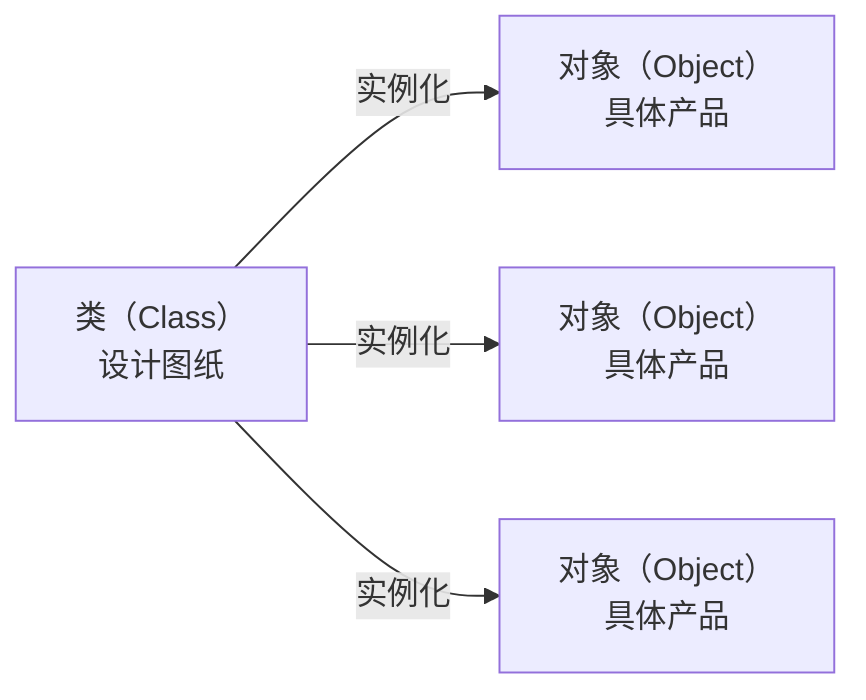
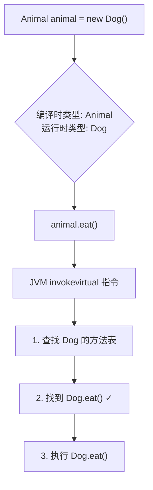
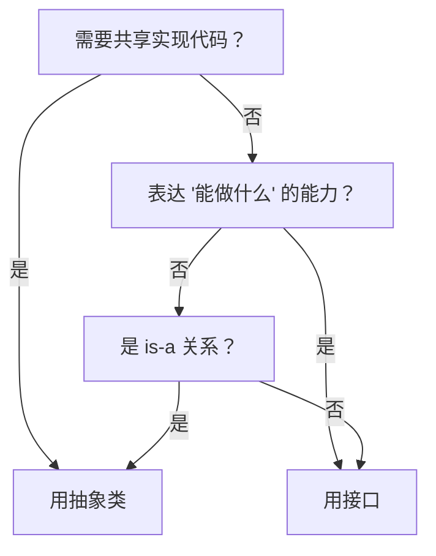

# Java 面向对象编程

> 很多人写了几年 Java，对 OOP 的理解还停留在"封装就是 private + getter/setter，继承就是 extends，多态就是重写"。但面试时一问 SOLID 原则就卡壳，一遇到设计问题就写出一堆 if-else。这篇文章从基础语法讲起，把 OOP 真正讲透。

## 基础入门：类与对象

### 什么是类？什么是对象？



类是对象的**模板**，对象是类的**实例**。类定义了属性和方法，对象是类在内存中的具体存在。

```java
// 定义一个类（模板）
public class Person {
    // 属性（字段）
    private String name;
    private int age;

    // 构造方法——创建对象时调用
    public Person(String name, int age) {
        this.name = name;  // this 指向当前对象
        this.age = age;
    }

    // 方法（行为）
    public void sayHello() {
        System.out.println("你好，我是" + name + "，今年" + age + "岁");
    }

    // getter/setter——外部访问私有属性的唯一方式
    public String getName() { return name; }
    public void setAge(int age) {
        if (age > 0 && age < 150) {
            this.age = age;
        }
    }
}

// 创建对象（实例化）
Person p1 = new Person("张三", 25);
Person p2 = new Person("李四", 30);
p1.sayHello();  // 你好，我是张三，今年25岁
p2.sayHello();  // 你好，我是李四，今年30岁
```

### this 和 super

```java
public class Student extends Person {
    private String school;

    public Student(String name, int age, String school) {
        super(name, age);     // super 调用父类构造方法，必须是第一行
        this.school = school; // this 指向当前对象的字段
    }

    @Override
    public void sayHello() {
        super.sayHello();     // super 调用父类的方法
        System.out.println("我在" + school + "上学");
    }
}
```

### 方法重载（Overload）

同一个类中，方法名相同但参数不同：

```java
public class Calculator {
    public int add(int a, int b) { return a + b; }
    public double add(double a, double b) { return a + b; }
    public int add(int a, int b, int c) { return a + b + c; }
    // 编译器根据参数类型和数量决定调用哪个方法
}
```

### 访问修饰符

| 修饰符 | 同类 | 同包 | 子类 | 不同包 |
|--------|------|------|------|--------|
| `public` | ✅ | ✅ | ✅ | ✅ |
| `protected` | ✅ | ✅ | ✅ | ❌ |
| 默认（无） | ✅ | ✅ | ❌ | ❌ |
| `private` | ✅ | ❌ | ❌ | ❌ |

---

## 为什么 OOP 值得认真学？

你可能会觉得：面向对象这么基础，谁不会？

但现实是，这些"基础"问题每天都在制造线上事故：

- 一个 5000 行的 Service 类，改一个功能要改 10 个地方——因为不知道开闭原则
- 新增一种支付方式，要在 20 个 if-else 里加分支——因为没用多态
- 父类改了一行代码，子类全部跑不通——因为没理解继承的本质是"契约"
- 用 `@Data` 生成 getter/setter 就叫"封装"了——其实封装已经被破坏了

OOP 不是语法，是一套**组织复杂性的思维方式**。

## 封装：不是把字段设成 private 就完了

### 封装的真正目的——变化隔离

封装的核心不是"隐藏数据"，而是**隔离变化**。你把可能变化的部分藏在内部，对外暴露稳定的接口。这样变化发生时，影响范围被限定在类内部。

```java
// ❌ 假封装：字段是 private 了，但 getter/setter 直接暴露了内部表示
public class Money {
    private long cents;  // 内部用"分"存储

    public long getCents() { return cents; }       // 暴露了"用分存储"这个实现细节
    public void setCents(long cents) { this.cents = cents; }
}

// 如果哪天要改成用 BigDecimal 存储，所有调用 getCents()/setCents() 的地方都要改

// ✅ 真封装：暴露的是"行为"，不是"数据"
public class Money {
    private long cents;

    public static Money yuan(double amount) { return new Money(Math.round(amount * 100)); }
    public static Money of(long yuan, int fen) { return new Money(yuan * 100 + fen); }

    public Money add(Money other) { return new Money(this.cents + other.cents); }
    public Money multiply(double factor) { return new Money(Math.round(this.cents * factor)); }
    public String display() { return String.format("¥%.2f", cents / 100.0); }

    // 不暴露 getCents()！外部不需要知道内部怎么存的
}
```

### Lombok 的 `@Data` 是不是破坏了封装？

严格来说，是的。

```java
@Data
public class Order {
    private String status;  // NEW, PAID, SHIPPED, COMPLETED
}
```

`@Data` 生成了 `setStatus()`，意味着任何地方都可以把状态改成任意字符串：

```java
order.setStatus("随便写");  // 编译通过，运行时爆炸
```

::: tip 正确做法
如果是简单的数据载体，用 `@Getter` + 字段初始化或构造函数，**不暴露 setter**。如果是需要复杂校验的领域对象，手写 setter 并加入业务规则。Java 14+ 的 `record` 更适合不可变数据载体。
:::

### Java Record——更好的封装

```java
// 不可变数据载体，没有 setter，天生线程安全
public record Point(int x, int y) {}

// 对比 Lombok @Data
// @Data 生成的是可变对象：有 setter，可以随便改
// record 生成的是不可变对象：没有 setter，只能通过构造函数创建
// 这才是封装应有的样子——告诉调用者"这个东西创建后就不应该被修改"
```

## 继承：用得不好比不用还糟

### 继承的基础语法

```java
// 父类（超类）
public class Animal {
    protected String name;

    public Animal(String name) {
        this.name = name;
    }

    public void eat() {
        System.out.println(name + "在吃东西");
    }
}

// 子类继承父类，获得父类的属性和方法
public class Dog extends Animal {
    private String breed;

    public Dog(String name, String breed) {
        super(name);       // 调用父类构造方法
        this.breed = breed;
    }

    // 方法重写（Override）：子类提供自己的实现
    @Override
    public void eat() {
        System.out.println(name + "（" + breed + "）在啃骨头");
    }

    // 子类特有的方法
    public void bark() {
        System.out.println(name + "：汪汪！");
    }
}

// 使用
Animal animal = new Dog("旺财", "柴犬");
animal.eat();   // 旺财（柴犬）在啃骨头（调用的是 Dog 的 eat，不是 Animal 的）
// animal.bark(); // 编译错误，Animal 类型没有 bark() 方法
```

### 继承的本质是"is-a"关系

继承表达的是**分类体系**：Dog is an Animal，Car is a Vehicle。如果两个类之间不是真正的"is-a"关系，就不该用继承。

```java
// ❌ 经典反面教材
// 有人为了让 ArrayList 有日志功能：
public class LogArrayList<E> extends ArrayList<E> {
    @Override
    public void add(E e) {
        System.out.println("Adding: " + e);
        super.add(e);
    }
}

// 这不是继承，这是"装饰"——但你用了继承，就继承了 ArrayList 的所有方法
// 如果有人调用 addAll()，日志不会触发，因为 addAll() 内部调用的是自己的 add()
```

### 脆弱基类问题

```java
// ❌ 脆弱基类问题
// 父类的 addAll() 内部可能调用了 add()
// 如果你 override 了 add()，那 addAll() 里每次 add 都会触发你的逻辑
// 计数器就会被重复计算

// ✅ 用组合替代继承
public class InstrumentedSet<E> implements Set<E> {
    private final Set<E> delegate;  // 组合：持有一个 Set 的引用
    private int addCount = 0;

    public InstrumentedSet(Set<E> delegate) {
        this.delegate = delegate;
    }

    @Override
    public boolean add(E e) {
        addCount++;
        return delegate.add(e);
    }
    // 其他方法全部委托给 delegate...
}
```

::: tip 设计原则
**组合优于继承**（Composition over Inheritance）。继承是白盒复用（你看到父类内部实现），组合是黑盒复用（你只看到接口）。除非是真正的 is-a 关系且父类设计就是为了被继承的（如 JPA 的 `JpaRepository`），否则优先用组合。
:::

## 多态：消灭 if-else 的武器

### 基础概念——方法重写

子类重写父类的方法，运行时调用的是**实际对象类型**的方法：

```java
Animal animal = new Dog("旺财", "柴犬");
animal.eat();   // 调用 Dog 的 eat()，不是 Animal 的

// 编译时看左边（Animal），运行时看右边（Dog）
// 这就是多态的核心
```

### 没有 if-else 的世界是什么样？

```java
// ❌ 每新增一种形状，就要改这个方法——违反开闭原则
public double calculateArea(Object shape) {
    if (shape instanceof Circle) {
        Circle c = (Circle) shape;
        return Math.PI * c.getRadius() * c.getRadius();
    } else if (shape instanceof Rectangle) {
        Rectangle r = (Rectangle) shape;
        return r.getWidth() * r.getHeight();
    }
    throw new IllegalArgumentException("未知形状");
}

// ✅ 多态：新增形状只需要新建一个类，不用改任何已有代码
public interface Shape {
    double area();
}

public record Circle(double radius) implements Shape {
    @Override
    public double area() { return Math.PI * radius * radius; }
}

public record Rectangle(double width, double height) implements Shape {
    @Override
    public double area() { return width * height; }
}

// 使用：不需要 if-else
public double totalArea(List<Shape> shapes) {
    return shapes.stream()
        .mapToDouble(Shape::area)  // 多态调用
        .sum();
}
```

### 多态的底层——动态分派



::: warning 方法重载 vs 方法重写
- **重载（Overload）**：编译时确定，静态分派。参数类型不同，方法名相同
- **重写（Override）**：运行时确定，动态分派。子类覆盖父类方法
- `invokevirtual` 处理重写，编译器处理重载。面试时经常拿来混淆
:::

### 模式匹配让多态更优雅（Java 16+）

```java
// Java 16+ pattern matching for instanceof
if (animal instanceof Dog d) {
    d.bark();  // 不需要手动强转了
}

// Java 21+ switch 中使用模式匹配
String desc = switch (animal) {
    case Dog d -> "一只叫" + d.getName() + "的狗";
    case Cat c -> "一只" + c.getColor() + "的猫";
    default -> "未知动物";
};
```

## 抽象类 vs 接口

### 基础语法

```java
// 抽象类：不能实例化，可以包含抽象方法和具体方法
public abstract class Animal {
    private String name;

    public Animal(String name) { this.name = name; }

    // 抽象方法：子类必须实现
    public abstract void speak();

    // 具体方法：子类直接继承
    public void eat() {
        System.out.println(name + "在吃东西");
    }
}

// 接口：只定义行为契约（Java 8+ 可以有 default 方法）
public interface Flyable {
    void fly();  // 抽象方法，默认 public abstract

    // default 方法：提供默认实现
    default void takeOff() {
        System.out.println("起飞！");
        fly();
    }
}

// 一个类只能继承一个抽象类，但可以实现多个接口
public class Duck extends Animal implements Flyable, Swimmable {
    public Duck(String name) { super(name); }

    @Override
    public void speak() { System.out.println("嘎嘎嘎"); }

    @Override
    public void fly() { System.out.println("鸭子飞起来了"); }
}
```

### 怎么选？



| 维度 | 抽象类 | 接口 |
|------|--------|------|
| 设计意图 | "是什么"（is-a） | "能做什么"（can-do） |
| 构造函数 | 可以有 | 不能有 |
| 字段 | 可以有实例字段 | 只有 static final 常量 |
| 方法 | 可以有具体方法 | Java 8+ 有 default 方法 |
| 多继承 | 单继承 | 多实现 |

## 内部类与枚举

### 内部类——让类只属于另一个类

```java
// 内部类可以直接访问外部类的私有成员
public class LinkedList<E> {
    private Node<E> head;

    // 内部类：Node 只被 LinkedList 使用，不需要暴露
    private static class Node<E> {
        E data;
        Node<E> next;
        Node(E data) { this.data = data; }
    }
}

// 匿名内部类 → Lambda（Java 8+）
button.addActionListener(e -> System.out.println("clicked"));
```

::: danger 内存泄漏高发场景
非静态内部类隐式持有外部类引用。如果内部类对象的生命周期长于外部类（如线程池中的任务），会导致外部类无法被 GC。**长期存活的内部类，一定要用 static。**
:::

### 枚举——替代 int 常量

```java
// ❌ int 常量：没有类型安全，可以随便传 int 值
public static final int SPRING = 0;
public static final int SUMMER = 1;

// ✅ 枚举：类型安全，可以携带方法和数据
public enum Season {
    SPRING("春天", 20),
    SUMMER("夏天", 35),
    AUTUMN("秋天", 22),
    WINTER("冬天", 5);

    private final String chineseName;
    private final int avgTemp;

    Season(String chineseName, int avgTemp) {
        this.chineseName = chineseName;
        this.avgTemp = avgTemp;
    }

    public String getChineseName() { return chineseName; }
    public int getAvgTemp() { return avgTemp; }
}

Season s = Season.SUMMER;
System.out.println(s.getChineseName());  // 夏天
```

## SOLID 原则——一句话 + 一个例子

### SRP：单一职责原则

> 一个类应该只有一个引起它变化的原因。

```java
// ❌ 一个类干了太多事
public class UserService {
    public void register(User user) { /* ... */ }
    public void sendEmail(User user, String content) { /* ... */ }
    public void logActivity(User user, String action) { /* ... */ }
}

// ✅ 拆分职责
public class UserService { public void register(User user) { /* ... */ } }
public class EmailService { public void send(User user, String content) { /* ... */ } }
public class AuditService { public void log(User user, String action) { /* ... */ } }
```

### OCP：开闭原则

> 对扩展开放，对修改关闭。

```java
// ❌ 新增支付方式要改已有代码
if ("ALIPAY".equals(type)) { /* ... */ }
else if ("WECHAT".equals(type)) { /* ... */ }

// ✅ 新增支付方式只需新建类（参见多态部分的例子）
```

### LSP：里氏替换原则

> 子类必须能替换其父类而不破坏程序正确性。

```java
// ❌ 正方形不是长方形的合法子类（设置宽度时高度也要变）
// ✅ 提取公共接口 Shape，让 Rectangle 和 Square 各自实现
```

### ISP：接口隔离原则

> 不应该强迫客户依赖它不使用的方法。

```java
// ❌ 胖接口
public interface Animal { void eat(); void fly(); void swim(); }
// 鱼不会飞，但被迫实现 fly()

// ✅ 接口隔离
public interface Eatable { void eat(); }
public interface Flyable { void fly(); }
public interface Swimmable { void swim(); }
```

### DIP：依赖倒置原则

> 高层模块不应该依赖低层模块，二者都应该依赖抽象。

```java
// ❌ 直接依赖具体实现
private MySQLOrderDao dao = new MySQLOrderDao();

// ✅ 依赖接口，通过构造函数注入
private final OrderDao dao;
public OrderService(OrderDao dao) { this.dao = dao; }
```

## 面试高频题

**Q1：重载（Overload）和重写（Override）的区别？**

重载是编译时多态，同一个类中方法名相同但参数不同。重写是运行时多态，子类覆盖父类方法，方法签名完全相同但实现不同。重载看参数类型决定调用哪个方法，重写看对象的实际类型决定调用哪个方法。

**Q2：`==` 和 `equals()` 的区别？**

`==` 比较引用地址（两个变量是否指向同一个对象）。`equals()` 比较内容（由具体类实现）。`String` 重写了 `equals()` 来比较字符序列，所以 `"hello".equals(new String("hello"))` 是 true，但 `"hello" == new String("hello")` 是 false。

**Q3：`hashCode()` 和 `equals()` 为什么要一起重写？**

HashMap 通过 hashCode 确定桶位置，通过 equals 判断是否同一个 key。如果两个对象 equals 相等但 hashCode 不同，它们会被放到不同的桶里，导致 HashMap 中出现重复。反过来，hashCode 相同但 equals 不同是可以的（哈希冲突）。

**Q4：为什么 String 要设计成不可变的？**

四个原因：字符串常量池安全（一个修改不影响所有引用）、HashMap key 安全（不可变对象的 hash 不变）、线程安全（无需同步）、安全敏感场景（如数据库连接字符串、文件路径不能被篡改）。

## 延伸阅读

- 上一篇：[语法基础](syntax.md) — 数据类型、运算符、字符串的深入理解
- 下一篇：[集合框架](collection.md) — ArrayList 扩容、HashMap 底层原理
- [并发编程](concurrency.md) — 线程安全、锁机制、AQS
