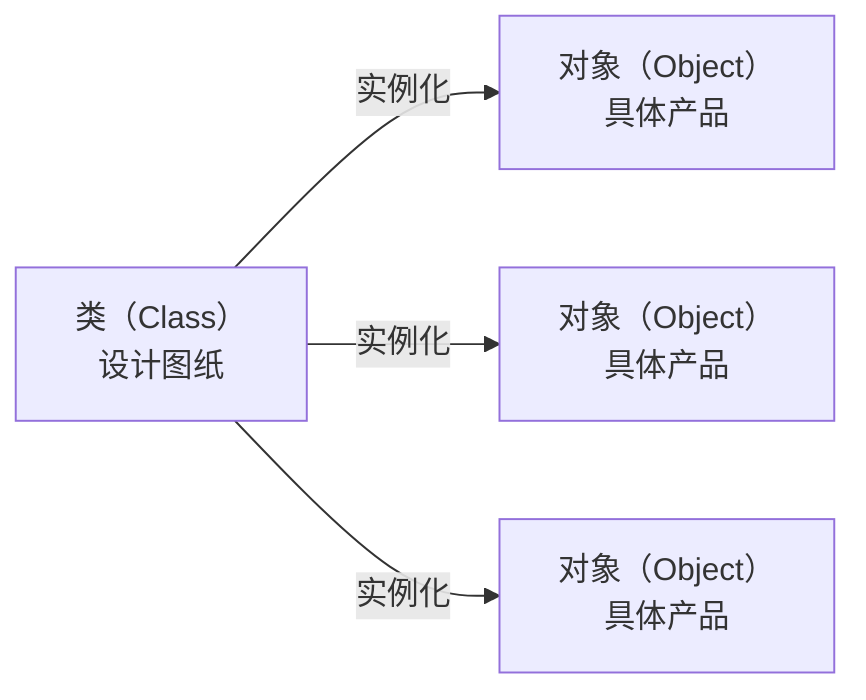
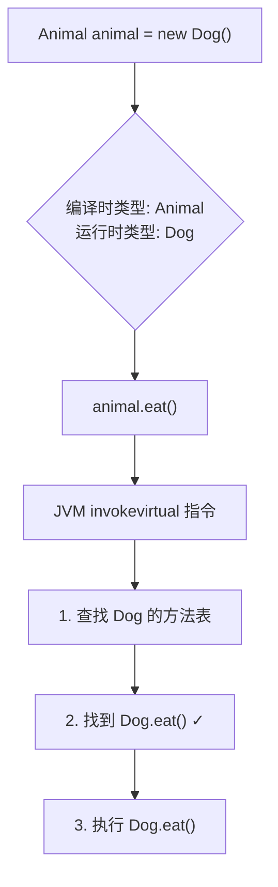
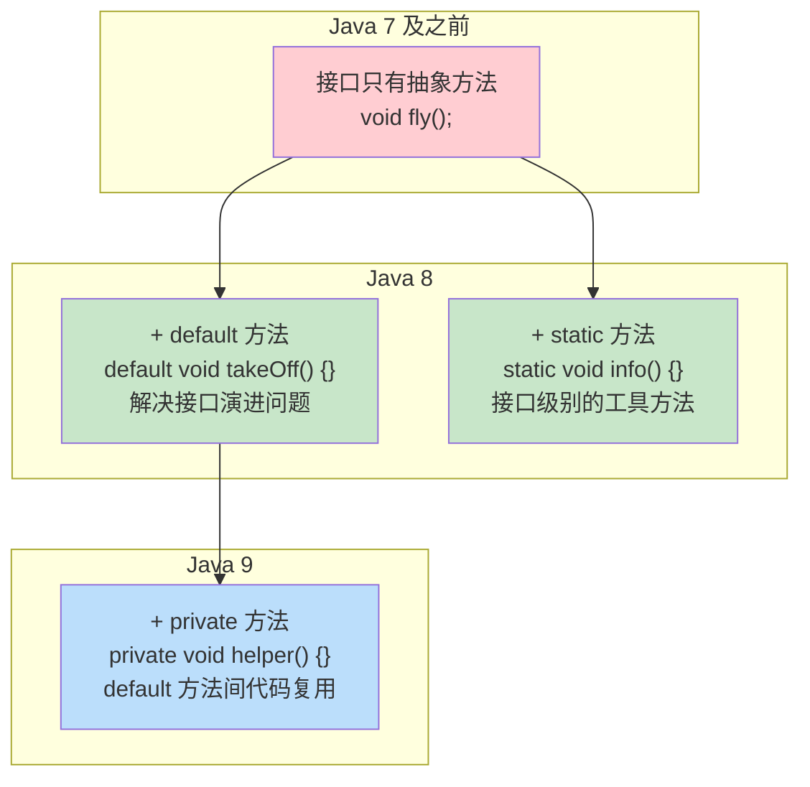
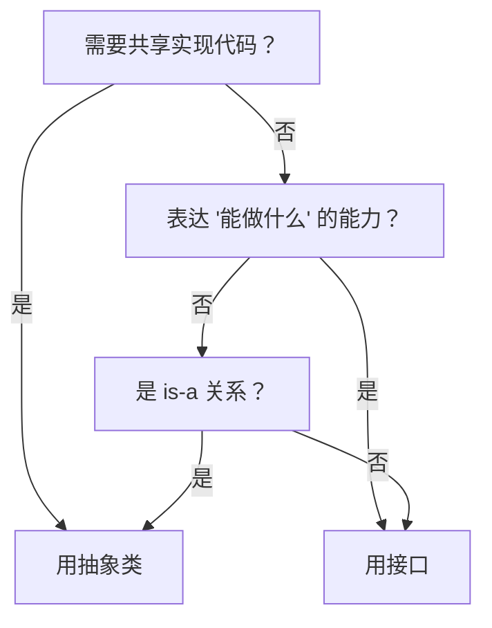
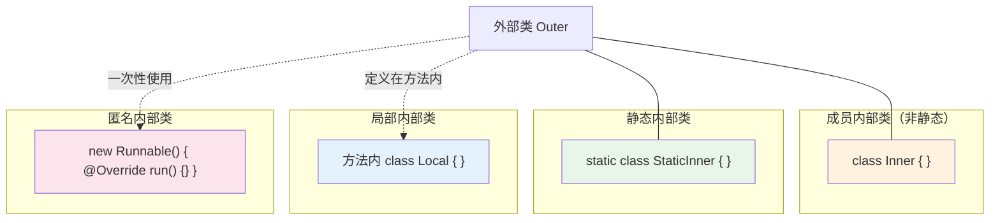
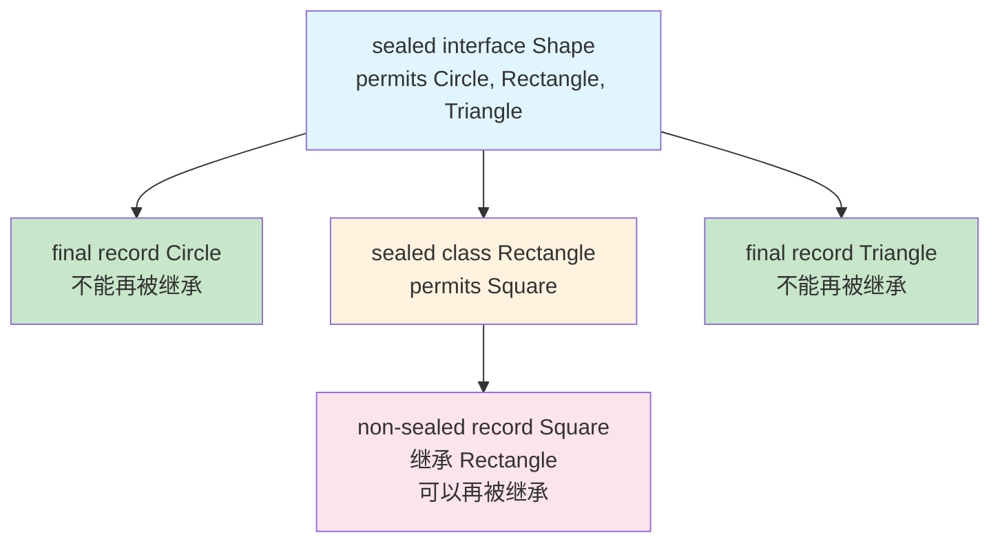
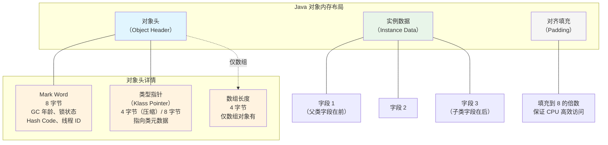

# Java 面向对象编程

> 很多人写了几年 Java，对 OOP 的理解还停留在"封装就是 private + getter/setter，继承就是 extends，多态就是重写"。但面试时一问 SOLID 原则就卡壳，一遇到设计问题就写出一堆 if-else。这篇文章从基础语法讲起，把 OOP 真正讲透。

## 基础入门：类与对象

### 什么是类？什么是对象？



类是对象的**模板**，对象是类的**实例**。类定义了属性和方法，对象是类在内存中的具体存在。

```java
// 定义一个类（模板）
public class Person {
    // 属性（字段）
    private String name;
    private int age;

    // 构造方法——创建对象时调用
    public Person(String name, int age) {
        this.name = name;  // this 指向当前对象
        this.age = age;
    }

    // 方法（行为）
    public void sayHello() {
        System.out.println("你好，我是" + name + "，今年" + age + "岁");
    }

    // getter/setter——外部访问私有属性的唯一方式
    public String getName() { return name; }
    public void setAge(int age) {
        if (age > 0 && age < 150) {
            this.age = age;
        }
    }
}

// 创建对象（实例化）
Person p1 = new Person("张三", 25);
Person p2 = new Person("李四", 30);
p1.sayHello();  // 你好，我是张三，今年25岁
p2.sayHello();  // 你好，我是李四，今年30岁
```

### this 和 super

```java
public class Student extends Person {
    private String school;

    public Student(String name, int age, String school) {
        super(name, age);     // super 调用父类构造方法，必须是第一行
        this.school = school; // this 指向当前对象的字段
    }

    @Override
    public void sayHello() {
        super.sayHello();     // super 调用父类的方法
        System.out.println("我在" + school + "上学");
    }
}
```

### 方法重载（Overload）

同一个类中，方法名相同但参数不同：

```java
public class Calculator {
    public int add(int a, int b) { return a + b; }
    public double add(double a, double b) { return a + b; }
    public int add(int a, int b, int c) { return a + b + c; }
    // 编译器根据参数类型和数量决定调用哪个方法
}
```

### 访问修饰符

| 修饰符 | 同类 | 同包 | 子类 | 不同包 |
|--------|------|------|------|--------|
| `public` | ✅ | ✅ | ✅ | ✅ |
| `protected` | ✅ | ✅ | ✅ | ❌ |
| 默认（无） | ✅ | ✅ | ❌ | ❌ |
| `private` | ✅ | ❌ | ❌ | ❌ |

---

## 为什么 OOP 值得认真学？

你可能会觉得：面向对象这么基础，谁不会？

但现实是，这些"基础"问题每天都在制造线上事故：

- 一个 5000 行的 Service 类，改一个功能要改 10 个地方——因为不知道开闭原则
- 新增一种支付方式，要在 20 个 if-else 里加分支——因为没用多态
- 父类改了一行代码，子类全部跑不通——因为没理解继承的本质是"契约"
- 用 `@Data` 生成 getter/setter 就叫"封装"了——其实封装已经被破坏了

OOP 不是语法，是一套**组织复杂性的思维方式**。

## 封装：不是把字段设成 private 就完了

### 封装的真正目的——变化隔离

封装的核心不是"隐藏数据"，而是**隔离变化**。你把可能变化的部分藏在内部，对外暴露稳定的接口。这样变化发生时，影响范围被限定在类内部。

```java
// ❌ 假封装：字段是 private 了，但 getter/setter 直接暴露了内部表示
public class Money {
    private long cents;  // 内部用"分"存储

    public long getCents() { return cents; }       // 暴露了"用分存储"这个实现细节
    public void setCents(long cents) { this.cents = cents; }
}

// 如果哪天要改成用 BigDecimal 存储，所有调用 getCents()/setCents() 的地方都要改

// ✅ 真封装：暴露的是"行为"，不是"数据"
public class Money {
    private long cents;

    public static Money yuan(double amount) { return new Money(Math.round(amount * 100)); }
    public static Money of(long yuan, int fen) { return new Money(yuan * 100 + fen); }

    public Money add(Money other) { return new Money(this.cents + other.cents); }
    public Money multiply(double factor) { return new Money(Math.round(this.cents * factor)); }
    public String display() { return String.format("¥%.2f", cents / 100.0); }

    // 不暴露 getCents()！外部不需要知道内部怎么存的
}
```

### Lombok 的 `@Data` 是不是破坏了封装？

严格来说，是的。

```java
@Data
public class Order {
    private String status;  // NEW, PAID, SHIPPED, COMPLETED
}
```

`@Data` 生成了 `setStatus()`，意味着任何地方都可以把状态改成任意字符串：

```java
order.setStatus("随便写");  // 编译通过，运行时爆炸
```

::: tip 正确做法
如果是简单的数据载体，用 `@Getter` + 字段初始化或构造函数，**不暴露 setter**。如果是需要复杂校验的领域对象，手写 setter 并加入业务规则。Java 14+ 的 `record` 更适合不可变数据载体。
:::

### Java Record——更好的封装

```java
// 不可变数据载体，没有 setter，天生线程安全
public record Point(int x, int y) {}

// 对比 Lombok @Data
// @Data 生成的是可变对象：有 setter，可以随便改
// record 生成的是不可变对象：没有 setter，只能通过构造函数创建
// 这才是封装应有的样子——告诉调用者"这个东西创建后就不应该被修改"
```

## 继承：用得不好比不用还糟

### 继承的基础语法

```java
// 父类（超类）
public class Animal {
    protected String name;

    public Animal(String name) {
        this.name = name;
    }

    public void eat() {
        System.out.println(name + "在吃东西");
    }
}

// 子类继承父类，获得父类的属性和方法
public class Dog extends Animal {
    private String breed;

    public Dog(String name, String breed) {
        super(name);       // 调用父类构造方法
        this.breed = breed;
    }

    // 方法重写（Override）：子类提供自己的实现
    @Override
    public void eat() {
        System.out.println(name + "（" + breed + "）在啃骨头");
    }

    // 子类特有的方法
    public void bark() {
        System.out.println(name + "：汪汪！");
    }
}

// 使用
Animal animal = new Dog("旺财", "柴犬");
animal.eat();   // 旺财（柴犬）在啃骨头（调用的是 Dog 的 eat，不是 Animal 的）
// animal.bark(); // 编译错误，Animal 类型没有 bark() 方法
```

### 继承的本质是"is-a"关系

继承表达的是**分类体系**：Dog is an Animal，Car is a Vehicle。如果两个类之间不是真正的"is-a"关系，就不该用继承。

```java
// ❌ 经典反面教材
// 有人为了让 ArrayList 有日志功能：
public class LogArrayList<E> extends ArrayList<E> {
    @Override
    public void add(E e) {
        System.out.println("Adding: " + e);
        super.add(e);
    }
}

// 这不是继承，这是"装饰"——但你用了继承，就继承了 ArrayList 的所有方法
// 如果有人调用 addAll()，日志不会触发，因为 addAll() 内部调用的是自己的 add()
```

### 脆弱基类问题

```java
// ❌ 脆弱基类问题
// 父类的 addAll() 内部可能调用了 add()
// 如果你 override 了 add()，那 addAll() 里每次 add 都会触发你的逻辑
// 计数器就会被重复计算

// ✅ 用组合替代继承
public class InstrumentedSet<E> implements Set<E> {
    private final Set<E> delegate;  // 组合：持有一个 Set 的引用
    private int addCount = 0;

    public InstrumentedSet(Set<E> delegate) {
        this.delegate = delegate;
    }

    @Override
    public boolean add(E e) {
        addCount++;
        return delegate.add(e);
    }
    // 其他方法全部委托给 delegate...
}
```

::: tip 设计原则
**组合优于继承**（Composition over Inheritance）。继承是白盒复用（你看到父类内部实现），组合是黑盒复用（你只看到接口）。除非是真正的 is-a 关系且父类设计就是为了被继承的（如 JPA 的 `JpaRepository`），否则优先用组合。
:::

## 多态：消灭 if-else 的武器

### 基础概念——方法重写

子类重写父类的方法，运行时调用的是**实际对象类型**的方法：

```java
Animal animal = new Dog("旺财", "柴犬");
animal.eat();   // 调用 Dog 的 eat()，不是 Animal 的

// 编译时看左边（Animal），运行时看右边（Dog）
// 这就是多态的核心
```

### 没有 if-else 的世界是什么样？

```java
// ❌ 每新增一种形状，就要改这个方法——违反开闭原则
public double calculateArea(Object shape) {
    if (shape instanceof Circle) {
        Circle c = (Circle) shape;
        return Math.PI * c.getRadius() * c.getRadius();
    } else if (shape instanceof Rectangle) {
        Rectangle r = (Rectangle) shape;
        return r.getWidth() * r.getHeight();
    }
    throw new IllegalArgumentException("未知形状");
}

// ✅ 多态：新增形状只需要新建一个类，不用改任何已有代码
public interface Shape {
    double area();
}

public record Circle(double radius) implements Shape {
    @Override
    public double area() { return Math.PI * radius * radius; }
}

public record Rectangle(double width, double height) implements Shape {
    @Override
    public double area() { return width * height; }
}

// 使用：不需要 if-else
public double totalArea(List<Shape> shapes) {
    return shapes.stream()
        .mapToDouble(Shape::area)  // 多态调用
        .sum();
}
```

### 多态的底层——动态分派



::: warning 方法重载 vs 方法重写
- **重载（Overload）**：编译时确定，静态分派。参数类型不同，方法名相同
- **重写（Override）**：运行时确定，动态分派。子类覆盖父类方法
- `invokevirtual` 处理重写，编译器处理重载。面试时经常拿来混淆
:::

### 模式匹配让多态更优雅（Java 16+）

```java
// Java 16+ pattern matching for instanceof
if (animal instanceof Dog d) {
    d.bark();  // 不需要手动强转了
}

// Java 21+ switch 中使用模式匹配
String desc = switch (animal) {
    case Dog d -> "一只叫" + d.getName() + "的狗";
    case Cat c -> "一只" + c.getColor() + "的猫";
    default -> "未知动物";
};
```

## 抽象类 vs 接口

### 基础语法

```java
// 抽象类：不能实例化，可以包含抽象方法和具体方法
public abstract class Animal {
    private String name;

    public Animal(String name) { this.name = name; }

    // 抽象方法：子类必须实现
    public abstract void speak();

    // 具体方法：子类直接继承
    public void eat() {
        System.out.println(name + "在吃东西");
    }
}

// 接口：只定义行为契约（Java 8+ 可以有 default 方法）
public interface Flyable {
    void fly();  // 抽象方法，默认 public abstract

    // default 方法：提供默认实现
    default void takeOff() {
        System.out.println("起飞！");
        fly();
    }
}

// 一个类只能继承一个抽象类，但可以实现多个接口
public class Duck extends Animal implements Flyable, Swimmable {
    public Duck(String name) { super(name); }

    @Override
    public void speak() { System.out.println("嘎嘎嘎"); }

    @Override
    public void fly() { System.out.println("鸭子飞起来了"); }
}
```

### 接口的演进——从 Java 8 到 Java 9+

接口在 Java 的演进中经历了重大变化：



#### Java 8 default 方法——解决接口演进问题

```java
// 问题：Java 8 之前，给接口加一个新方法，所有实现类都要改
// Java 8 引入 default 方法，可以给接口添加新方法而不破坏现有实现

public interface List<E> {
    // Java 8 之前就有的方法
    int size();
    E get(int index);
    
    // Java 8 新增：default 方法，不强制实现类重写
    default void forEach(Consumer<? super E> action) {
        for (int i = 0; i < size(); i++) {
            action.accept(get(i));
        }
    }
    
    default void replaceAll(UnaryOperator<E> operator) {
        for (int i = 0; i < size(); i++) {
            set(i, operator.apply(get(i)));
        }
    }
}

// default 方法的"钻石问题"：一个类实现了两个接口，两个接口有同名的 default 方法
public interface A {
    default void hello() { System.out.println("A"); }
}

public interface B {
    default void hello() { System.out.println("B"); }
}

// 必须显式指定使用哪个，或者重写
public class C implements A, B {
    @Override
    public void hello() {
        A.super.hello();  // 显式调用 A 的 default 方法
        // B.super.hello();  // 也可以调用 B 的
    }
}
```

#### Java 9 private 方法——default 方法间的代码复用

```java
public interface Validator {
    // Java 8：static 方法（工具方法，不属于任何实例）
    static boolean isNotEmpty(String s) {
        return s != null && !s.isBlank();
    }
    
    // Java 9：private 方法（default 方法之间的公共逻辑提取）
    private String trimAndLower(String s) {
        return s.trim().toLowerCase();
    }
    
    default boolean isValidEmail(String email) {
        String normalized = trimAndLower(email);  // 复用 private 方法
        return normalized.contains("@") && normalized.contains(".");
    }
    
    default boolean isValidPhone(String phone) {
        String normalized = trimAndLower(phone);  // 复用 private 方法
        return normalized.matches("\\d{11}");
    }
}
```

#### 函数式接口——Lambda 的基石

```java
// 函数式接口：只有一个抽象方法的接口
// @FunctionalInterface 注解是可选的，但推荐加上（编译器会检查）

@FunctionalInterface
public interface Function<T, R> {
    R apply(T t);
    // 只能有一个抽象方法
}

// JDK 内置的函数式接口
// Predicate<T>    → boolean test(T t)        → 判断（过滤）
// Function<T, R>  → R apply(T t)              → 转换（map）
// Consumer<T>     → void accept(T t)           → 消费（forEach）
// Supplier<T>     → T get()                    → 提供（工厂）
// BiFunction<T,U,R> → R apply(T t, U u)        → 双参数转换

// Lambda 就是函数式接口的匿名实现
List<String> names = List.of("Alice", "Bob", "Charlie");
names.stream()
     .filter(name -> name.length() > 3)      // Predicate<String>
     .map(String::toUpperCase)                // Function<String, String>
     .forEach(System.out::println);           // Consumer<String>

// 方法引用是 Lambda 的简写
// String::toUpperCase  等价于  s -> s.toUpperCase()
// System.out::println  等价于  s -> System.out.println(s)
// Integer::sum         等价于  (a, b) -> a + b
```

### 怎么选？



| 维度 | 抽象类 | 接口 |
|------|--------|------|
| 设计意图 | "是什么"（is-a） | "能做什么"（can-do） |
| 构造函数 | 可以有 | 不能有 |
| 字段 | 可以有实例字段 | 只有 static final 常量 |
| 方法 | 可以有具体方法 | Java 8+ 有 default 方法 |
| 多继承 | 单继承 | 多实现 |

## 内部类深入

### 四种内部类及其访问规则



#### 静态内部类——最推荐

```java
// 静态内部类不持有外部类引用，最安全
// 用法：与外部类关系密切，但不需要访问外部类实例
public class LinkedList<E> {
    private Node<E> head;
    
    // 静态内部类：Node 不需要访问 LinkedList 的实例字段
    private static class Node<E> {
        E data;
        Node<E> next;
        
        Node(E data) {
            this.data = data;
        }
    }
    
    public void add(E item) {
        head = new Node<>(item);  // 直接使用，不需要外部类实例
    }
}

// 访问规则：
// ✅ 可以访问外部类的 static 成员（包括 private）
// ❌ 不能访问外部类的实例成员（没有外部类引用）
// ✅ 可以有 static 成员
// ✅ 创建时不需要外部类实例：new Outer.StaticInner()

// 经典使用场景：Builder 模式
public class HttpRequest {
    private final String url;
    private final String method;
    private final Map<String, String> headers;
    
    private HttpRequest(Builder builder) {
        this.url = builder.url;
        this.method = builder.method;
        this.headers = builder.headers;
    }
    
    public static class Builder {
        private String url;
        private String method = "GET";
        private Map<String, String> headers = new HashMap<>();
        
        public Builder url(String url) { this.url = url; return this; }
        public Builder method(String method) { this.method = method; return this; }
        public Builder header(String key, String value) {
            headers.put(key, value);
            return this;
        }
        
        public HttpRequest build() { return new HttpRequest(this); }
    }
}

// 使用
HttpRequest request = new HttpRequest.Builder()
    .url("https://api.example.com/users")
    .method("POST")
    .header("Content-Type", "application/json")
    .build();
```

#### 成员内部类（非静态）——谨慎使用

```java
public class Outer {
    private String outerField = "outer";
    
    // 成员内部类：隐式持有外部类引用
    public class Inner {
        private String innerField = "inner";
        
        public void print() {
            // ✅ 可以直接访问外部类的所有成员（包括 private）
            System.out.println(outerField);
            // ✅ 可以用 Outer.this 区分同名成员
            System.out.println(Outer.this.outerField);
        }
    }
    
    public Inner createInner() {
        return new Inner();  // 隐式持有 this 引用
    }
}

// 创建成员内部类需要外部类实例
Outer outer = new Outer();
Outer.Inner inner = outer.new Inner();
```

#### 局部内部类——极少使用

```java
public void processData() {
    final int limit = 100;  // 局部内部类只能访问 effectively final 的局部变量
    
    // 局部内部类：定义在方法内，作用域仅限于该方法
    class DataProcessor {
        void process() {
            System.out.println("Processing with limit: " + limit);  // ✅ 可以访问
            // limit = 200;  // ❌ 如果 limit 不是 final，编译错误
        }
    }
    
    DataProcessor processor = new DataProcessor();
    processor.process();
}
// DataProcessor 在方法外不可见
```

#### 匿名内部类——Lambda 的前身

```java
// 匿名内部类：没有名字的内部类，一次性使用
// 在 Lambda 出现之前，匿名内部类是创建回调的主要方式

// 传统写法：匿名内部类
button.addActionListener(new ActionListener() {
    @Override
    public void actionPerformed(ActionEvent e) {
        System.out.println("clicked");
    }
});

// Java 8+ Lambda 写法（更简洁）
button.addActionListener(e -> System.out.println("clicked"));

// 匿名内部类仍然有用的场景：
// 1. 需要实现多个方法（非函数式接口）
Comparator<String> comp = new Comparator<String>() {
    @Override
    public int compare(String a, String b) { return a.length() - b.length(); }
    
    @Override
    public boolean equals(Object obj) { return false; }  // 只有一个抽象方法不算
};

// 2. 需要额外的字段或状态
Thread t = new Thread(new Runnable() {
    private int count = 0;
    @Override
    public void run() {
        while (count < 10) {
            System.out.println(count++);
        }
    }
});

// 3. 匿名类可以访问和修改外部类的实例字段
//    （Lambda 捕获的变量必须是 effectively final）
```

::: danger 内存泄漏高发场景
非静态内部类隐式持有外部类引用。如果内部类对象的生命周期长于外部类（如线程池中的任务），会导致外部类无法被 GC。**长期存活的内部类，一定要用 static。**
:::

## 枚举深入

### 枚举的底层实现——继承 Enum

```java
// 你写的代码
public enum Season {
    SPRING, SUMMER, AUTUMN, WINTER
}

// 编译器实际生成的代码（简化版）
public final class Season extends Enum<Season> {
    public static final Season SPRING = new Season("SPRING", 0);
    public static final Season SUMMER = new Season("SUMMER", 1);
    public static final Season AUTUMN = new Season("AUTUMN", 2);
    public static final Season WINTER = new Season("WINTER", 3);
    
    private static final Season[] $VALUES = {SPRING, SUMMER, AUTUMN, WINTER};
    
    private Season(String name, int ordinal) {
        super(name, ordinal);
    }
    
    public static Season[] values() { return $VALUES.clone(); }
    public static Season valueOf(String name) { return ... }
}
```

**枚举的本质：**
- 每个枚举值都是 `public static final` 的实例
- 枚举类**隐式继承** `java.lang.Enum`，不能再继承其他类
- 枚举类是 `final` 的（不能被继承）
- 枚举的构造函数**只能是 private**（不能在外部创建实例）

### 枚举单例——最佳的单例实现方式

```java
// Effective Java 推荐：用枚举实现单例
// 原因：
// 1. 天然防止反射攻击（Enum 的构造函数由 JVM 保护）
// 2. 天然防止序列化攻击（Enum 的反序列化返回已有实例）
// 3. 线程安全（类加载时就初始化）

public enum DatabaseConnection {
    INSTANCE;
    
    private Connection connection;
    
    DatabaseConnection() {
        // 枚举的构造函数只在初始化时执行一次
        this.connection = DriverManager.getConnection("jdbc:mysql://localhost:3306/mydb");
    }
    
    public Connection getConnection() {
        return connection;
    }
}

// 使用
Connection conn = DatabaseConnection.INSTANCE.getConnection();
```

### 枚举实现接口与携带行为

```java
// 枚举可以携带方法和实现接口
public enum Operation implements BiFunction<Double, Double, Double> {
    ADD {
        @Override
        public Double apply(Double a, Double b) { return a + b; }
    },
    SUBTRACT {
        @Override
        public Double apply(Double a, Double b) { return a - b; }
    },
    MULTIPLY {
        @Override
        public Double apply(Double a, Double b) { return a * b; }
    },
    DIVIDE {
        @Override
        public Double apply(Double a, Double b) {
            if (b == 0) throw new ArithmeticException("除数不能为 0");
            return a / b;
        }
    };
    
    // 每个枚举值必须实现接口方法
}

// 使用——多态调用
double result = Operation.MULTIPLY.apply(3.0, 4.0);  // 12.0
```

### 枚举与 switch

```java
// switch 对枚举有特殊支持
// 注意：case 中不需要写枚举类名，直接写枚举值
Season season = Season.SUMMER;

switch (season) {
    case SPRING -> System.out.println("春暖花开");
    case SUMMER -> System.out.println("烈日炎炎");
    case AUTUMN -> System.out.println("秋高气爽");
    case WINTER -> System.out.println("寒冬腊月");
}

// Java 12+ switch 表达式 + 穷举检查
String activity = switch (season) {
    case SPRING, AUTUMN -> "旅游";
    case SUMMER -> "游泳";
    case WINTER -> "滑雪";
    // 不需要 default，编译器知道 Season 只有四个值
};

// 编译器会在枚举值新增但 switch 未处理时报错（穷举检查）
```

### 枚举的高级用法

```java
// 枚举的常用方法
Season s = Season.SUMMER;
s.name();       // "SUMMER"——枚举值的名称
s.ordinal();    // 1——声明顺序（从 0 开始）
s.toString();   // "SUMMER"——默认和 name() 一样，但可以重写

// EnumSet——枚举专用的 Set，位向量实现，性能极高
EnumSet<Season> warmSeasons = EnumSet.of(Season.SPRING, Season.SUMMER);
EnumSet<Season> coldSeasons = EnumSet.range(Season.AUTUMN, Season.WINTER);
EnumSet<Season> all = EnumSet.allOf(Season.class);

// EnumMap——枚举专用的 Map，数组实现，性能极高
EnumMap<Season, String> description = new EnumMap<>(Season.class);
description.put(Season.SPRING, "春暖花开");
description.put(Season.SUMMER, "烈日炎炎");
// EnumMap 内部用枚举的 ordinal() 作为数组下标，查找 O(1)
```

### 枚举——替代 int 常量

```java
// ❌ int 常量：没有类型安全，可以随便传 int 值
public static final int SPRING = 0;
public static final int SUMMER = 1;

// ✅ 枚举：类型安全，可以携带方法和数据
public enum Season {
    SPRING("春天", 20),
    SUMMER("夏天", 35),
    AUTUMN("秋天", 22),
    WINTER("冬天", 5);

    private final String chineseName;
    private final int avgTemp;

    Season(String chineseName, int avgTemp) {
        this.chineseName = chineseName;
        this.avgTemp = avgTemp;
    }

    public String getChineseName() { return chineseName; }
    public int getAvgTemp() { return avgTemp; }
}

Season s = Season.SUMMER;
System.out.println(s.getChineseName());  // 夏天
```

## Record 类——不可变数据载体（Java 14+）

### record 的本质

```java
// record 是 Java 14 引入的不可变数据载体
// 编译器自动生成：构造函数、访问器、equals、hashCode、toString

public record Point(int x, int y) {}

// 编译器实际生成的代码（简化版）：
public final class Point {
    private final int x;
    private final int y;
    
    public Point(int x, int y) { this.x = x; this.y = y; }
    public int x() { return x; }  // 注意：不是 getX()
    public int y() { return y; }
    
    @Override public boolean equals(Object o) { /* 基于所有组件 */ }
    @Override public int hashCode() { /* 基于所有组件 */ }
    @Override public String toString() { return "Point[x=" + x + ", y=" + y + "]"; }
}
```

### record 的高级用法

```java
// 1. 紧凑构造函数——用于参数校验
public record Age(int value) {
    public Age {
        if (value < 0 || value > 150) {
            throw new IllegalArgumentException("年龄不合法: " + value);
        }
        value = Math.max(0, value);  // 可以对参数做规范化
    }
}

// 2. 自定义方法
public record Rectangle(double width, double height) {
    public double area() { return width * height; }
    public double perimeter() { return 2 * (width + height); }
    public Rectangle scaled(double factor) {
        return new Rectangle(width * factor, height * factor);
    }
}

// 3. 实现接口
public record Circle(double radius) implements Shape {
    @Override
    public double area() { return Math.PI * radius * radius; }
}

// 4. 嵌套 record
public record Person(String name, Address address) {}
public record Address(String city, String street, String zipCode) {}

// 5. record 与模式匹配（Java 21+）
static void printShape(Shape shape) {
    switch (shape) {
        case Circle(var radius) -> System.out.println("圆，半径: " + radius);
        case Rectangle(var w, var h) -> System.out.println("矩形，" + w + "x" + h);
        default -> System.out.println("未知形状");
    }
}
```

### record vs Lombok @Value 对比

| 维度 | `record`（Java 14+） | Lombok `@Value` |
|------|---------------------|-----------------|
| 不可变性 | 语言级别保证（字段 final） | 编译时生成 final 字段 |
| 访问器方法 | `x()`（无 get 前缀） | `getX()`（有 get 前缀） |
| equals/hashCode | 基于所有组件 | 基于所有非静态字段 |
| 自定义 | 紧凑构造函数、自定义方法 | `@EqualsAndHashCode.Exclude` 等注解 |
| 继承 | 不能继承其他类（但可以实现接口） | 可以继承其他类 |
| 构造函数 | 标准构造函数 + 紧凑构造函数 | `@AllArgsConstructor` |
| 空值处理 | 不处理 null | `@NonNull` 注解 |
| 兼容性 | Java 14+ | Java 8+ |
| 适用场景 | 纯数据载体，JDK 原生 | 需要更多灵活性时 |

```java
// Lombok @Value 等价的 record
// @Value
// public class Point {
//     int x;
//     int y;
// }
// 等价于：
public record Point(int x, int y) {}
```

## Sealed Class——密封类（Java 15+）

### 密封类的概念与模式匹配

```java
// sealed：精确控制哪些类可以继承/实现
// permits：列出允许的子类（必须在同一个模块或包中）
public sealed interface Shape
    permits Circle, Rectangle, Triangle {
    double area();
}

// 子类必须用 final、sealed 或 non-sealed 三个修饰符之一
public record Circle(double radius) implements Shape {
    @Override
    public double area() { return Math.PI * radius * radius; }
}
// Circle 是 final——不能再被继承

public sealed class Rectangle implements Shape permits Square {
    private final double width;
    private final double height;
    
    public Rectangle(double width, double height) {
        this.width = width;
        this.height = height;
    }
    
    @Override
    public double area() { return width * height; }
    public double width() { return width; }
    public double height() { return height; }
}
// Rectangle 是 sealed——只能被 Square 继承

public non-sealed record Square(double side) extends Rectangle(side, side) {
    // non-sealed——开放继承，任何人都可以继承 Square
}

public record Triangle(double base, double height) implements Shape {
    @Override
    public double area() { return 0.5 * base * height; }
}
```

### 密封类的继承层次



### 密封类 + 模式匹配的威力

```java
// 密封类最大的价值：配合模式匹配实现穷举检查
// 编译器知道 Shape 只有 Circle、Rectangle、Triangle 三种子类型

// Java 17+：switch 穷举检查，不需要 default
double area = switch (shape) {
    case Circle c -> c.area();
    case Rectangle r -> r.area();
    case Triangle t -> t.area();
    // 编译器确认所有子类型都已处理，不需要 default
    // 如果将来新增子类型，编译器会报错——编译时就能发现问题
};

// Java 21+：record patterns 解构
String desc = switch (shape) {
    case Circle(var r) when r > 10 -> "大圆（r=" + r + "）";
    case Circle(var r)             -> "小圆（r=" + r + "）";
    case Rectangle(var w, var h)   -> w == h ? "正方形" : "矩形";
    case Triangle(var b, var h)    -> "三角形（底=" + b + "，高=" + h + "）";
};
```

## 对象内存布局

### JVM 中对象的内存结构

每个 Java 对象在堆内存中的布局由三部分组成：



#### 对象头（Object Header）

```java
// 对象头 = Mark Word + 类型指针（+ 数组长度，仅数组对象）

// Mark Word（8 字节）存储的信息：
// - Hash Code（延迟计算，第一次调用 hashCode() 时才写入）
// - GC 年龄（每经历一次 Minor GC 且存活，年龄 +1，达到阈值晋升老年代）
// - 锁状态标志位（无锁、偏向锁、轻量级锁、重量级锁、GC 标记）
// - 线程持有的锁指针（偏向线程 ID）
// - 线程 ID

// 类型指针（4/8 字节）：
// - 指向方法区中的类元数据（Klass）
// - JVM 通过这个指针确定对象是哪个类的实例
// - 开启指针压缩（默认开启）时为 4 字节，否则 8 字节

// 数组长度（4 字节）：
// - 只有数组对象才有
// - 记录数组长度
```

#### 实例数据（Instance Data）

```java
public class Example {
    // 字段在内存中的排列顺序（不是源码中的声明顺序）：
    // 1. longs/doubles（8 字节）
    // 2. ints/floats（4 字节）
    // 3. shorts/chars（2 字节）
    // 4. bytes/booleans（1 字节）
    // 5. 引用类型（4/8 字节）
    // 这个顺序是为了内存对齐，减少填充浪费
    
    long a;     // 偏移量 12（对象头 12 字节）
    double b;   // 偏移量 20
    int c;      // 偏移量 28
    float d;    // 偏移量 32
    short e;    // 偏移量 36
    char f;     // 偏移量 38
    byte g;     // 偏移量 40
    boolean h;  // 偏移量 41
    Object ref; // 偏移量 44（指针压缩时 4 字节）
    // 填充到 48 字节（8 的倍数）
}

// 使用 JOL（Java Object Layout）工具查看实际布局：
// jvm -jar jol-cli.jar internals java.lang.Object
```

#### 对齐填充（Padding）

```
为什么需要对齐填充？
- HotSpot VM 的内存管理要求对象大小必须是 8 字节的整数倍
- 如果实例数据部分的大小不是 8 的倍数，需要填充到 8 的倍数
- CPU 读取对齐的内存地址更快（硬件层面）
- 对象大小 = 对象头 + 实例数据 + 对齐填充

示例：
- 空对象（无字段）：对象头 12 字节 + 填充 4 字节 = 16 字节
- 一个 int 字段的对象：对象头 12 + int 4 = 16 字节（刚好，不需要填充）
- 一个 boolean 字段的对象：对象头 12 + boolean 1 + 填充 3 = 16 字节
```

## SOLID 原则——一句话 + 一个例子

### SRP：单一职责原则

> 一个类应该只有一个引起它变化的原因。

```java
// ❌ 一个类干了太多事
public class UserService {
    public void register(User user) { /* ... */ }
    public void sendEmail(User user, String content) { /* ... */ }
    public void logActivity(User user, String action) { /* ... */ }
}

// ✅ 拆分职责
public class UserService { public void register(User user) { /* ... */ } }
public class EmailService { public void send(User user, String content) { /* ... */ } }
public class AuditService { public void log(User user, String action) { /* ... */ } }
```

### OCP：开闭原则

> 对扩展开放，对修改关闭。

```java
// ❌ 新增支付方式要改已有代码
if ("ALIPAY".equals(type)) { /* ... */ }
else if ("WECHAT".equals(type)) { /* ... */ }

// ✅ 新增支付方式只需新建类（参见多态部分的例子）
```

### LSP：里氏替换原则

> 子类必须能替换其父类而不破坏程序正确性。

```java
// ❌ 正方形不是长方形的合法子类（设置宽度时高度也要变）
// ✅ 提取公共接口 Shape，让 Rectangle 和 Square 各自实现
```

### ISP：接口隔离原则

> 不应该强迫客户依赖它不使用的方法。

```java
// ❌ 胖接口
public interface Animal { void eat(); void fly(); void swim(); }
// 鱼不会飞，但被迫实现 fly()

// ✅ 接口隔离
public interface Eatable { void eat(); }
public interface Flyable { void fly(); }
public interface Swimmable { void swim(); }
```

### DIP：依赖倒置原则

> 高层模块不应该依赖低层模块，二者都应该依赖抽象。

```java
// ❌ 直接依赖具体实现
private MySQLOrderDao dao = new MySQLOrderDao();

// ✅ 依赖接口，通过构造函数注入
private final OrderDao dao;
public OrderService(OrderDao dao) { this.dao = dao; }
```

## 面试高频题

**Q1：重载（Overload）和重写（Override）的区别？**

重载是编译时多态，同一个类中方法名相同但参数不同。重写是运行时多态，子类覆盖父类方法，方法签名完全相同但实现不同。重载看参数类型决定调用哪个方法，重写看对象的实际类型决定调用哪个方法。

**Q2：`==` 和 `equals()` 的区别？**

`==` 比较引用地址（两个变量是否指向同一个对象）。`equals()` 比较内容（由具体类实现）。`String` 重写了 `equals()` 来比较字符序列，所以 `"hello".equals(new String("hello"))` 是 true，但 `"hello" == new String("hello")` 是 false。

**Q3：`hashCode()` 和 `equals()` 为什么要一起重写？**

HashMap 通过 hashCode 确定桶位置，通过 equals 判断是否同一个 key。如果两个对象 equals 相等但 hashCode 不同，它们会被放到不同的桶里，导致 HashMap 中出现重复。反过来，hashCode 相同但 equals 不同是可以的（哈希冲突）。

**Q4：为什么 String 要设计成不可变的？**

四个原因：字符串常量池安全（一个修改不影响所有引用）、HashMap key 安全（不可变对象的 hash 不变）、线程安全（无需同步）、安全敏感场景（如数据库连接字符串、文件路径不能被篡改）。

**Q5：内部类有哪些类型？各自有什么特点？**

四种：成员内部类（持有外部类引用，可访问所有成员）、静态内部类（不持有外部类引用，只能访问 static 成员，最安全）、局部内部类（定义在方法内，只能访问 effectively final 的局部变量）、匿名内部类（没有名字，一次性使用，Lambda 的前身）。长期存活的内部类一定要用 static，否则会导致外部类内存泄漏。

**Q6：枚举实现单例为什么比双重检查锁好？**

三个原因：枚举天然防止反射攻击（Enum 构造函数由 JVM 保护）、天然防止序列化攻击（反序列化返回已有实例）、线程安全（类加载时初始化，无需额外同步）。双重检查锁需要处理指令重排序（volatile）、反射攻击、序列化攻击等问题。

## 延伸阅读

- 上一篇：[语法基础](syntax.md) — 数据类型、运算符、字符串的深入理解
- 下一篇：[集合框架](collection.md) — ArrayList 扩容、HashMap 底层原理
- [并发编程](concurrency.md) — 线程安全、锁机制、AQS
