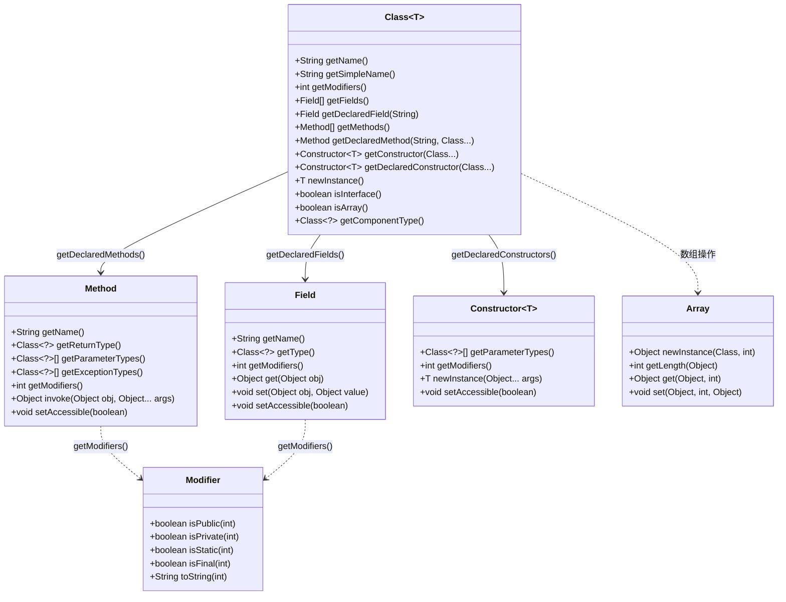
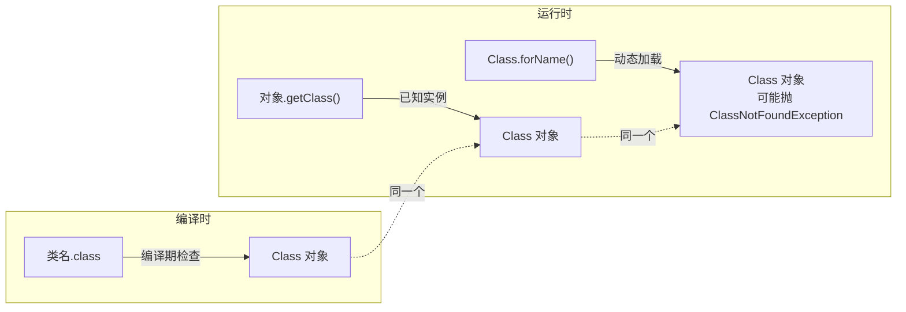
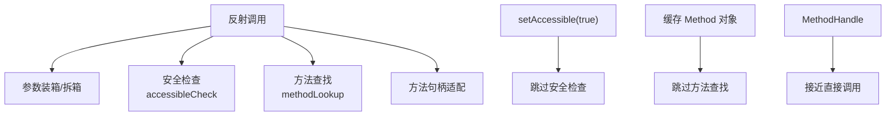
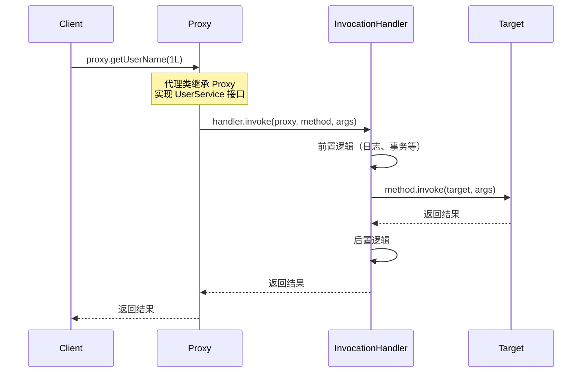
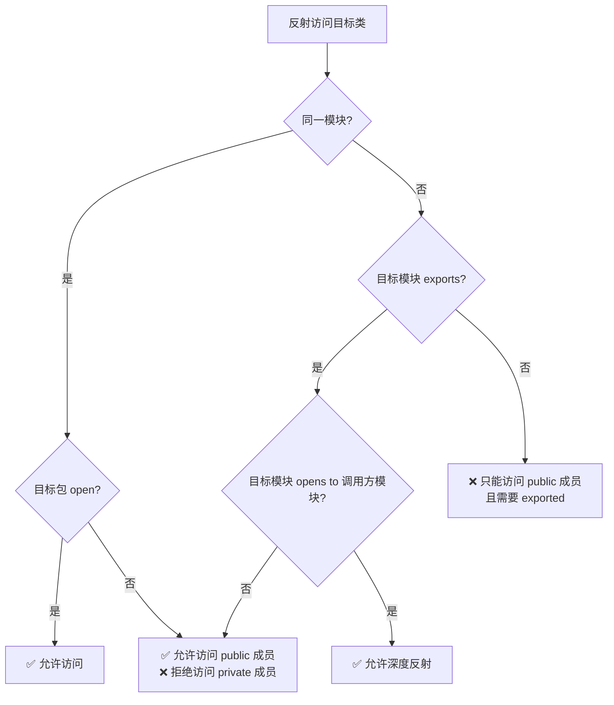
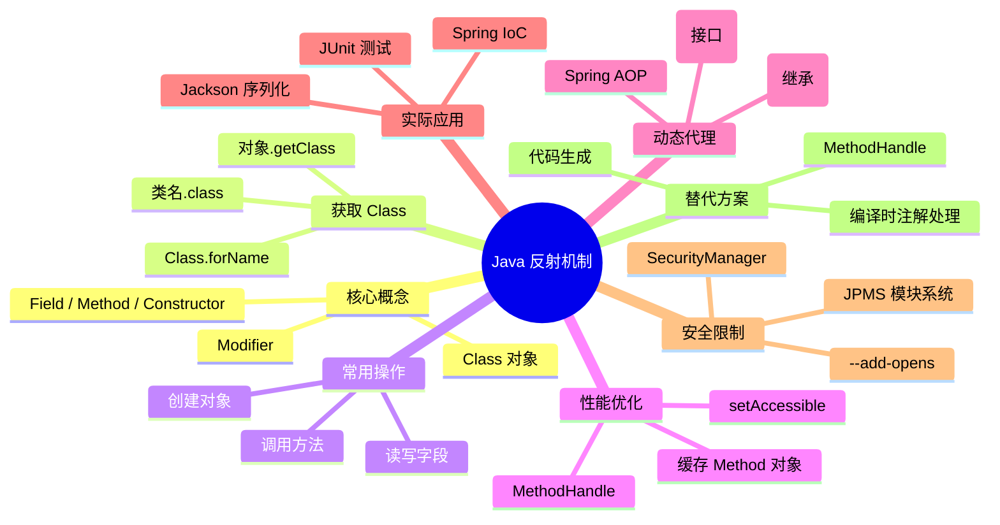

# Java 反射机制深入解析

反射（Reflection）是 Java 的"元编程"能力——在运行时检查和修改类、方法、字段的结构。它是 Spring、Hibernate、JUnit 等框架的基石，但也是性能和安全方面的双刃剑。本文将全面剖析反射的原理、用法和最佳实践。

## 反射核心 API 全景

Java 反射的核心 API 集中在 `java.lang.reflect` 包中，围绕 `Class` 对象展开。



### 核心类说明

| 类 | 作用 | 常用方法 |
|---|------|---------|
| `Class<T>` | 类的元信息入口 | `getName()`, `getDeclaredMethods()`, `newInstance()` |
| `Field` | 字段信息 | `get()`, `set()`, `setAccessible()` |
| `Method` | 方法信息 | `invoke()`, `getParameterTypes()`, `setAccessible()` |
| `Constructor<T>` | 构造器信息 | `newInstance()`, `getParameterTypes()` |
| `Modifier` | 修饰符工具 | `isPublic()`, `isStatic()`, `toString()` |
| `Array` | 数组操作 | `newInstance()`, `getLength()`, `set()` |

::: tip 公开 vs 声明
- `getFields()` / `getMethods()` — 获取**所有 public** 成员（包括继承的）
- `getDeclaredFields()` / `getDeclaredMethods()` — 获取**本类声明**的所有成员（包括 private，但不包括继承的）
:::

## Class 对象的获取方式

每个类在 JVM 中都有且只有一个 `Class` 对象，它是反射的起点。

```java
// 方式 1：类名.class（编译时确定，最安全）
Class<String> clazz1 = String.class;

// 方式 2：对象.getClass()（运行时确定）
String str = "hello";
Class<?> clazz2 = str.getClass();

// 方式 3：Class.forName()（运行时动态加载，最灵活）
Class<?> clazz3 = Class.forName("java.lang.String");

// 方式 4：包装类的 TYPE 字段
Class<Integer> clazz4 = Integer.TYPE;  // 等价于 int.class

// 验证：三种方式获取的是同一个 Class 对象
System.out.println(clazz1 == clazz2);  // true
System.out.println(clazz1 == clazz3);  // true
```

### 三种方式的对比



| 方式 | 编译时检查 | 适用场景 | 异常 |
|------|-----------|---------|------|
| `类名.class` | ✅ 有 | 已知类名，编译期可用 | 无 |
| `对象.getClass()` | ✅ 有 | 已有实例对象 | 无 |
| `Class.forName()` | ❌ 无 | 动态加载、配置驱动 | `ClassNotFoundException` |

::: important 类加载时机
- `.class` 和 `.class` 字面量不会触发类初始化（不会执行 `static` 块）
- `Class.forName("xxx")` 默认会触发类初始化
- `Class.forName("xxx", false, loader)` 不触发初始化
:::

## 反射创建对象

### 通过 Constructor 创建

```java
// 获取无参构造器
Constructor<String> constructor = String.class.getConstructor();
String str = constructor.newInstance();

// 获取带参构造器
Constructor<String> paramConstructor = String.class.getConstructor(byte[].class);
String fromBytes = paramConstructor.newInstance("hello".getBytes());

// 获取 private 构造器（如单例模式）
Constructor<Singleton> privateConstructor = Singleton.class.getDeclaredConstructor();
privateConstructor.setAccessible(true);  // 突破访问限制
Singleton instance = privateConstructor.newInstance();
```

### 通过 Class.newInstance()（已废弃）

```java
// Java 9 标记为 @Deprecated
// 原因：它会绕开编译时的异常检查
Object obj = clazz.newInstance();

// 替代方案：使用 Constructor.newInstance()
Object obj = clazz.getDeclaredConstructor().newInstance();
```

::: danger 为什么弃用？
`Class.newInstance()` 只能调用无参 public 构造器，且会**包装所有异常为 unchecked**。`Constructor.newInstance()` 支持任意参数、支持 private 构造器，且能正确抛出受检异常。
:::

### 完整示例：反射创建对象

```java
public class Person {
    private String name;
    private int age;

    public Person() {}

    public Person(String name, int age) {
        this.name = name;
        this.age = age;
    }

    @Override
    public String toString() {
        return "Person{name='" + name + "', age=" + age + "}";
    }
}

// 反射创建
public static Person createPerson() throws Exception {
    Class<Person> clazz = Person.class;
    Constructor<Person> constructor = clazz.getConstructor(String.class, int.class);
    return constructor.newInstance("张三", 25);
}
// 结果: Person{name='张三', age=25}
```

## 反射调用方法

```java
public class Calculator {
    public int add(int a, int b) {
        return a + b;
    }

    private double secretFormula(double x) {
        return Math.sqrt(x) * 3.14;
    }

    public static String getVersion() {
        return "2.0.0";
    }
}

// 反射调用方法
public static void invokeMethods() throws Exception {
    Class<Calculator> clazz = Calculator.class;
    Calculator calc = clazz.getDeclaredConstructor().newInstance();

    // 调用 public 方法
    Method addMethod = clazz.getMethod("add", int.class, int.class);
    int result = (int) addMethod.invoke(calc, 10, 20);
    System.out.println("10 + 20 = " + result);  // 30

    // 调用 private 方法
    Method secretMethod = clazz.getDeclaredMethod("secretFormula", double.class);
    secretMethod.setAccessible(true);
    double secret = (double) secretMethod.invoke(calc, 16.0);
    System.out.println("Secret: " + secret);  // 12.56

    // 调用 static 方法
    Method versionMethod = clazz.getMethod("getVersion");
    String version = (String) versionMethod.invoke(null);  // 静态方法传 null
    System.out.println("Version: " + version);  // 2.0.0
}
```

## 反射读写字段

```java
public class Config {
    private String host = "localhost";
    private int port = 8080;
    public static final String VERSION = "1.0";
}

// 反射读写字段
public static void accessFields() throws Exception {
    Class<Config> clazz = Config.class;
    Config config = clazz.getDeclaredConstructor().newInstance();

    // 读取 private 字段
    Field hostField = clazz.getDeclaredField("host");
    hostField.setAccessible(true);
    String host = (String) hostField.get(config);
    System.out.println("Host: " + host);  // localhost

    // 修改 private 字段
    hostField.set(config, "192.168.1.100");
    System.out.println("New Host: " + hostField.get(config));  // 192.168.1.100

    // 读取 static final 字段（需要额外处理）
    Field versionField = clazz.getDeclaredField("VERSION");
    versionField.setAccessible(true);
    // 对于 final 字段，需要通过 Field 对象的修饰符操作
    Field modifiersField = Field.class.getDeclaredField("modifiers");
    modifiersField.setAccessible(true);
    modifiersField.setInt(versionField, versionField.getModifiers() & ~Modifier.FINAL);
    versionField.set(null, "2.0");
    System.out.println("Version: " + versionField.get(null));  // 2.0
}
```

::: warning 关于修改 final 字段
从 Java 12 开始，`Field.modifiers` 字段不再可访问。修改 `final` 字段在更高版本中需要使用 `Unsafe` 或 `VarHandle`，且在某些情况下 JIT 可能会内联优化导致修改不生效。
:::

## 反射的性能开销

反射的性能损耗主要来自以下几个方面：



### 性能对比

```java
@BenchmarkMode(Mode.AverageTime)
@OutputTimeUnit(TimeUnit.NANOSECONDS)
public class ReflectionBenchmark {
    private static final Method ADD_METHOD;
    private static final Calculator CALC = new Calculator();

    static {
        ADD_METHOD = Calculator.class.getMethod("add", int.class, int.class);
    }

    // 直接调用：~2 ns
    @Benchmark
    public int directCall() {
        return CALC.add(10, 20);
    }

    // 反射调用（无缓存）：~100 ns
    @Benchmark
    public int reflectionNoCache() throws Exception {
        Method m = Calculator.class.getMethod("add", int.class, int.class);
        return (int) m.invoke(CALC, 10, 20);
    }

    // 反射调用（有缓存，无 setAccessible）：~30 ns
    @Benchmark
    public int reflectionWithCache() throws Exception {
        return (int) ADD_METHOD.invoke(CALC, 10, 20);
    }

    // 反射调用（缓存 + setAccessible）：~15 ns
    @Benchmark
    public int reflectionOptimized() throws Exception {
        return (int) ADD_METHOD.invoke(CALC, 10, 20);
    }

    // MethodHandle 调用：~5 ns
    @Benchmark
    public int methodHandleCall() throws Throwable {
        return (int) METHOD_HANDLE.invokeExact(CALC, 10, 20);
    }
}
```

| 方式 | 相对耗时 | 说明 |
|------|---------|------|
| 直接调用 | 1x | 基准线 |
| MethodHandle | ~2-3x | 接近直接调用 |
| 反射（缓存 + accessible） | ~7-15x | 实际项目中的常用方式 |
| 反射（有缓存） | ~15-30x | 安全检查开销 |
| 反射（无缓存） | ~50-100x | 每次查找方法的巨大开销 |

### setAccessible 的作用

```java
Method method = clazz.getDeclaredMethod("privateMethod");
// 默认 false：调用前会进行访问权限检查（public/private/protected）
// 设置 true：跳过访问权限检查，大幅提升性能
method.setAccessible(true);
```

::: tip 性能优化建议
1. **缓存 `Method` / `Field` / `Constructor` 对象**，避免重复查找（这是最大的开销来源）
2. **使用 `setAccessible(true)`** 跳过安全检查
3. 在极度性能敏感的场景，考虑使用 `MethodHandle` 甚至代码生成（如 ByteBuddy、ASM）
4. 反射调用频率不高时，不必过度优化——可读性更重要
:::

## 动态代理原理

动态代理是反射最重要的应用之一，是 AOP、RPC 框架的技术基础。

### JDK 动态代理

JDK 动态代理基于**接口**，在运行时生成代理类。

```java
// 定义接口
public interface UserService {
    String getUserName(Long id);
    void saveUser(String name);
}

// 实现类
public class UserServiceImpl implements UserService {
    @Override
    public String getUserName(Long id) {
        return "User-" + id;
    }

    @Override
    public void saveUser(String name) {
        System.out.println("保存用户: " + name);
    }
}

// 创建代理
public static UserService createProxy(UserService target) {
    return (UserService) Proxy.newProxyInstance(
        target.getClass().getClassLoader(),
        target.getClass().getInterfaces(),
        (proxy, method, args) -> {
            System.out.println("Before: " + method.getName());
            Object result = method.invoke(target, args);
            System.out.println("After: " + method.getName());
            return result;
        }
    );
}

// 使用
UserService proxy = createProxy(new UserServiceImpl());
proxy.getUserName(1L);
// 输出：
// Before: getUserName
// After: getUserName
```

### JDK 代理类的生成过程



生成的代理类大致结构：

```java
// 由 ProxyGenerator 动态生成（位于 com.sun.proxy 包下）
public final class $Proxy0 extends Proxy implements UserService {
    private static Method m0;  // equals
    private static Method m1;  // toString
    private static Method m2;  // hashCode
    private static Method m3;  // getUserName
    private static Method m4;  // saveUser

    static {
        m3 = Class.forName("UserService").getMethod("getUserName", Long.class);
        m4 = Class.forName("UserService").getMethod("saveUser", String.class);
    }

    public $Proxy0(InvocationHandler h) {
        super(h);
    }

    @Override
    public String getUserName(Long id) {
        try {
            return (String) h.invoke(this, m3, new Object[]{id});
        } catch (Throwable e) {
            throw new UndeclaredThrowableException(e);
        }
    }
}
```

### CGLIB 动态代理

CGLIB 基于字节码生成技术，可以代理**普通类**（不需要接口）。

```java
// 使用 CGLIB
public static UserService createCglibProxy() {
    Enhancer enhancer = new Enhancer();
    enhancer.setSuperclass(UserServiceImpl.class);
    enhancer.setCallback((MethodInterceptor) (obj, method, args, proxy) -> {
        System.out.println("CGLIB Before: " + method.getName());
        Object result = proxy.invokeSuper(obj, args);
        System.out.println("CGLIB After: " + method.getName());
        return result;
    });
    return (UserService) enhancer.create();
}
```

### JDK Proxy vs CGLIB

| 特性 | JDK Proxy | CGLIB |
|------|-----------|-------|
| 代理方式 | 基于接口 | 基于继承（生成子类） |
| 要求 | 目标类必须实现接口 | 目标类不能是 final |
| 性能 | JDK 8+ 已优化 | 略优（尤其在 JDK 8 之前） |
| 依赖 | JDK 内置 | 需要第三方库 |
| Spring 默认 | 有接口时使用 | 无接口时使用 |

::: tip Spring AOP 的选择策略
- 如果目标实现了接口 → 使用 JDK Proxy
- 如果目标没有实现接口 → 使用 CGLIB
- 可通过 `@EnableAspectJAutoProxy(proxyTargetClass = true)` 强制使用 CGLIB
:::

## 反射的实际应用

### Spring IoC 容器

Spring 通过反射实现依赖注入和 Bean 管理：

```java
// Spring 大致的工作流程
public class DefaultListableBeanFactory {
    public Object getBean(String beanName) {
        BeanDefinition bd = getBeanDefinition(beanName);
        Class<?> clazz = bd.getBeanClass();

        // 1. 反射创建实例
        Object instance = clazz.getDeclaredConstructor().newInstance();

        // 2. 反射注入依赖
        for (PropertyDescriptor pd : getPropertyDescriptors(clazz)) {
            if (pd.getWriteMethod() != null && containsBean(pd.getName())) {
                Object dependency = getBean(pd.getName());
                pd.getWriteMethod().invoke(instance, dependency);
            }
        }

        // 3. 处理 @PostConstruct
        for (Method method : clazz.getMethods()) {
            if (method.isAnnotationPresent(PostConstruct.class)) {
                method.invoke(instance);
            }
        }

        return instance;
    }
}
```

### Jackson 序列化

Jackson 使用反射读写对象的字段来实现 JSON 序列化/反序列化：

```java
// Jackson 大致的工作流程
public class ObjectMapper {
    public String writeValueAsString(Object value) {
        Class<?> clazz = value.getClass();
        StringBuilder json = new StringBuilder("{");

        for (Field field : clazz.getDeclaredFields()) {
            if (Modifier.isStatic(field.getModifiers())) continue;

            field.setAccessible(true);
            String fieldName = field.getName();
            Object fieldValue = field.get(value);

            json.append("\"").append(fieldName).append("\":");
            json.append(toJsonString(fieldValue)).append(",");
        }

        if (json.charAt(json.length() - 1) == ',') {
            json.setLength(json.length() - 1);
        }
        json.append("}");
        return json.toString();
    }
}
```

### JUnit 测试框架

JUnit 使用反射来发现和执行测试方法：

```java
// JUnit 大致的工作流程
public class JUnitRunner {
    public void run(Class<?> testClass) {
        Object instance = testClass.getDeclaredConstructor().newInstance();

        // 执行 @Before 方法
        for (Method method : testClass.getDeclaredMethods()) {
            if (method.isAnnotationPresent(Before.class)) {
                method.setAccessible(true);
                method.invoke(instance);
            }
        }

        // 执行 @Test 方法
        for (Method method : testClass.getDeclaredMethods()) {
            if (method.isAnnotationPresent(Test.class)) {
                method.setAccessible(true);
                try {
                    method.invoke(instance);
                    System.out.println("✅ " + method.getName() + " PASSED");
                } catch (InvocationTargetException e) {
                    System.out.println("❌ " + method.getName() + " FAILED: " + e.getCause());
                } catch (Exception e) {
                    System.out.println("⚠️ " + method.getName() + " ERROR: " + e);
                }
            }
        }

        // 执行 @After 方法
        for (Method method : testClass.getDeclaredMethods()) {
            if (method.isAnnotationPresent(After.class)) {
                method.setAccessible(true);
                method.invoke(instance);
            }
        }
    }
}
```

## 反射的安全风险和限制

### 安全风险

```java
// ⚠️ 反射可以突破访问控制
Constructor<Singleton> c = Singleton.class.getDeclaredConstructor();
c.setAccessible(true);
Singleton s = c.newInstance();  // 破坏单例！

// ⚠️ 反射可以修改 final 字段
Field f = String.class.getDeclaredField("value");
f.setAccessible(true);
f.set("hello", "world".toCharArray());  // 修改不可变字符串！

// ⚠️ 反射可以访问私有数据
Field passwordField = User.class.getDeclaredField("password");
passwordField.setAccessible(true);
String password = (String) passwordField.get(user);  // 泄露密码！
```

### Java 9+ 模块化系统的限制

Java 9 引入了模块系统（JPMS），对反射访问做了更严格的限制：

```java
// Java 8：可以直接反射访问内部类
Class<?> unsafeClass = Class.forName("sun.misc.Unsafe");

// Java 9+：需要通过 --add-opens 或 --add-exports 参数显式开放
// java.lang.IllegalAccessException:
//   class com.example.MyClass cannot access class sun.misc.Unsafe
//   (module java.base does not export sun.misc to module com.example)
```

**解决方案**：

```bash
# 命令行参数
java --add-opens java.base/sun.misc=com.example -jar myapp.jar

# 或在 module-info.java 中声明
module com.example {
    requires java.base;
    opens com.example to spring.core;
}
```

### 模块化下的反射访问规则



### SecurityManager 的限制

即使在 Java 8 中，启用 SecurityManager 也会限制反射：

```java
// 如果 SecurityManager 启用，setAccessible 可能抛出 SecurityException
try {
    field.setAccessible(true);
} catch (AccessControlException e) {
    // SecurityManager 拒绝了访问
    log.warn("反射访问被 SecurityManager 拒绝");
}
```

## 反射的替代方案

| 需求 | 反射方案 | 替代方案 | 说明 |
|------|---------|---------|------|
| 方法调用 | `Method.invoke()` | `MethodHandle` | 性能更优，类型安全 |
| 创建对象 | `Constructor.newInstance()` | 工厂模式 / 依赖注入 | 编译期检查 |
| 动态代理 | `Proxy` / CGLIB | `MethodHandleProxies` | JDK 7+ |
| 注解处理 | 运行时反射 | 编译时注解处理器（APT） | 零运行时开销 |
| 序列化 | 反射读写字段 | `Record` / `Serializable` | 更安全 |

### MethodHandle 示例

```java
import java.lang.invoke.MethodHandle;
import java.lang.invoke.MethodHandles;
import java.lang.invoke.MethodType;

public class MethodHandleDemo {
    public static void main(String[] throws Throwable {
        MethodHandles.Lookup lookup = MethodHandles.lookup();

        // 获取方法句柄
        MethodHandle mh = lookup.findVirtual(
            String.class,
            "substring",
            MethodType.methodType(String.class, int.class, int.class)
        );

        // 调用（性能接近直接调用）
        String result = (String) mh.invokeExact("Hello World", 0, 5);
        System.out.println(result);  // Hello
    }
}
```

## 总结



| 要点 | 结论 |
|------|------|
| 反射慢多少？ | 无缓存时 50-100x，有缓存 + accessible 后 7-15x |
| 何时使用反射？ | 框架开发、工具类、序列化、依赖注入 |
| 何时避免反射？ | 热路径代码、性能敏感场景 |
| 如何优化？ | 缓存 + setAccessible + MethodHandle |
| JDK Proxy vs CGLIB？ | 有接口用 JDK，无接口用 CGLIB |
| 模块化限制？ | 需要 `--add-opens` 或 `opens` 声明 |

反射是 Java 生态系统的基石技术。理解它的工作原理，不仅有助于编写高效的代码，更能帮助你深入理解 Spring、MyBatis、Hibernate 等框架的底层机制。
