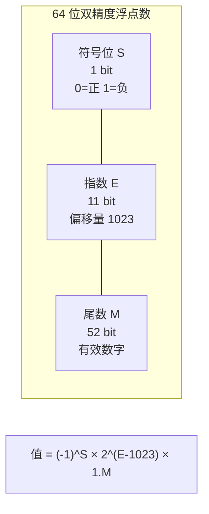
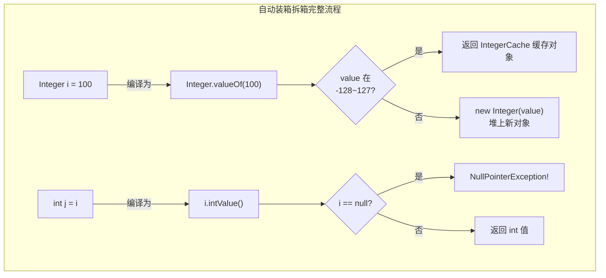
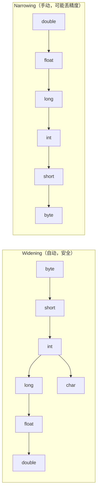
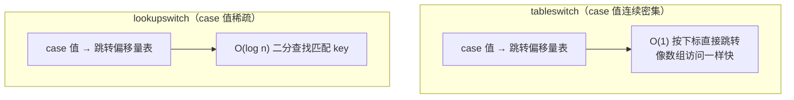
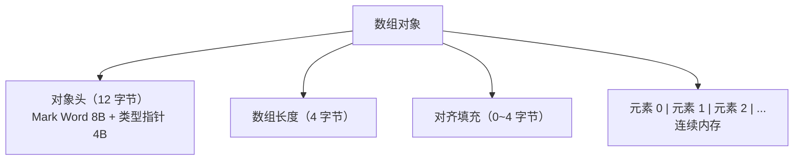
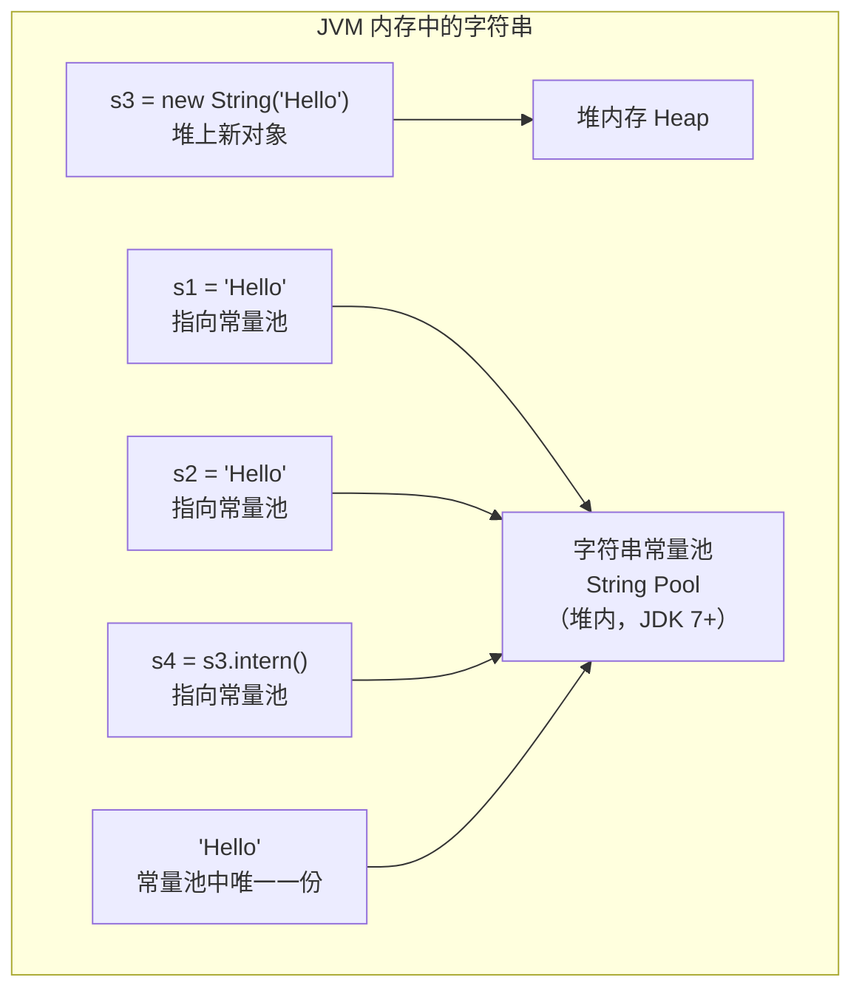
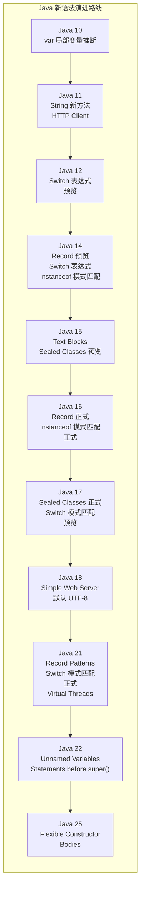

# Java 语法基础

> Java 语法看起来简单，但很多细节背后都有深层设计考量。理解这些细节，能帮你避开无数线上 bug。

## 为什么还要讲语法？

你可能会想：Java 语法这么基础，有什么好讲的？

但现实是，很多工作了几年的 Java 开发者仍然会在这些地方翻车：

- `0.1 + 0.2 != 0.3`，浮点数精度问题导致金额计算出错
- `Integer i1 = 127; Integer i2 = 127; i1 == i2` 返回 true，但换成 128 就返回 false
- `switch` 语句忘了 `break` 导致"幽灵"执行
- 字符串拼接在循环里用 `+`，性能暴跌

这些问题的根源都在语法层面。这篇文章把这些坑一次性讲清楚。

## 数据类型

Java 是强类型语言——每个变量在编译时就必须确定类型。这个看似"麻烦"的设计，其实是 Java 最大的安全网之一。

### 8 种基本类型

Java 的基本类型直接对应 CPU 能高效处理的二进制格式，不需要对象头、不需要 GC，是最轻量的数据载体：

| 类型 | 关键字 | 大小 | 取值范围 | 默认值 |
|------|--------|------|----------|--------|
| 字节型 | byte | 1 字节 | -128 ~ 127 | 0 |
| 短整型 | short | 2 字节 | -32768 ~ 32767 | 0 |
| 整型 | int | 4 字节 | -2³¹ ~ 2³¹-1 | 0 |
| 长整型 | long | 8 字节 | -2⁶³ ~ 2⁶³-1 | 0L |
| 单精度浮点 | float | 4 字节 | ±3.4×10³⁸ | 0.0f |
| 双精度浮点 | double | 8 字节 | ±1.7×10³⁰⁸ | 0.0d |
| 字符型 | char | 2 字节 | 0 ~ 65535 | '\u0000' |
| 布尔型 | boolean | ~ | true / false | false |

::: tip 为什么 byte 是 -128 ~ 127 而不是 0 ~ 255？
Java 的整数类型使用**补码（Two's Complement）**表示。1 字节 = 8 位，最高位是符号位（0 正 1 负），所以正数最大是 `0111 1111` = 127，负数最小是 `1000 0000` = -128。补码的好处是加减法不需要区分正负号，CPU 用同一套电路就能处理。
:::

### 浮点数的精度陷阱（IEEE 754）

这是最容易被忽视但最容易出事故的地方：

```java
System.out.println(0.1 + 0.2);          // 0.30000000000000004
System.out.println(1.0 - 0.9);          // 0.09999999999999998
System.out.println(0.1 * 0.1 == 0.01);  // false
```

**为什么会这样？** 浮点数在计算机中使用 IEEE 754 标准存储，本质上是用二进制小数来逼近十进制小数。就像十进制无法精确表示 1/3（0.333...）一样，二进制也无法精确表示 0.1（二进制是 0.0001100110011... 无限循环）。

IEEE 754 双精度浮点数的内存布局：



**怎么解决？**

```java
// 方案1：BigDecimal（金融场景必须用）
BigDecimal a = new BigDecimal("0.1");  // 注意用字符串构造，不要用 double
BigDecimal b = new BigDecimal("0.2");
System.out.println(a.add(b));  // 0.3

// 错误示范：用 double 构造，精度问题还在
// new BigDecimal(0.1) → 0.1000000000000000055511151231257827021181583404541015625

// 方案2：需要精度比较时，用误差范围
double a = 0.1 + 0.2;
double EPSILON = 1e-10;
System.out.println(Math.abs(a - 0.3) < EPSILON);  // true
```

::: danger 血的教训
2015 年，一个程序员在 GitHub 上悬赏 $10,000 求解 `0.1 + 0.2` 问题。在金融系统中，浮点精度错误可能导致几百万的账目偏差。永远不要用 double 存金额。
:::

### BigDecimal 深入使用

BigDecimal 是金融计算的标准方案，但使用中有不少坑：

```java
// 1. 构造方式的选择
BigDecimal a = new BigDecimal("0.1");        // ✅ 推荐：字符串构造，精确
BigDecimal b = BigDecimal.valueOf(0.1);      // ✅ 推荐：valueOf 内部转字符串
BigDecimal c = new BigDecimal(0.1);          // ❌ double 构造，引入精度误差
BigDecimal d = BigDecimal.valueOf(1, 1);     // ✅ 用 int 和 scale 构造，最精确

// 2. 比较必须用 compareTo，不要用 equals
BigDecimal x = new BigDecimal("1.0");
BigDecimal y = new BigDecimal("1.00");
System.out.println(x.equals(y));       // false！scale 不同
System.out.println(x.compareTo(y) == 0); // true！只比较数值

// 3. 除法必须指定精度和舍入模式
BigDecimal result = new BigDecimal("10").divide(
    new BigDecimal("3"),
    2,                                    // 保留 2 位小数
    RoundingMode.HALF_UP                  // 四舍五入
);
// System.out.println(new BigDecimal("10").divide(new BigDecimal("3")));
// 抛出 ArithmeticException: Non-terminating decimal expansion

// 4. 常用运算
BigDecimal price = new BigDecimal("19.99");
BigDecimal qty = new BigDecimal("3");
BigDecimal total = price.multiply(qty);                  // 59.97
BigDecimal discount = total.multiply(new BigDecimal("0.8")); // 47.976
BigDecimal final_ = discount.setScale(2, RoundingMode.HALF_UP); // 47.98
```

**BigDecimal 的 8 种舍入模式：**

| 舍入模式 | 说明 | 示例（1.5 → ?） | 示例（2.5 → ?） |
|----------|------|------------------|------------------|
| `UP` | 远离零方向 | 2 | 3 |
| `DOWN` | 靠近零方向 | 1 | 2 |
| `CEILING` | 正无穷方向 | 2 | 3 |
| `FLOOR` | 负无穷方向 | 1 | 2 |
| `HALF_UP` | 四舍五入（最常用） | 2 | 3 |
| `HALF_DOWN` | 五舍六入 | 1 | 2 |
| `HALF_EVEN` | 银行家舍入（消除累计偏差） | 2 | 2 |
| `UNNECESSARY` | 精确结果，否则抛异常 | 异常 | 异常 |

::: tip 银行家舍入法
`HALF_EVEN` 也叫"四舍六入五成双"——当刚好是 0.5 时，向最近的偶数舍入。这在统计上能消除累计偏差。例如 1.5 → 2（偶数）、2.5 → 2（偶数），而不是都向大方向舍入。金融系统中推荐使用。
:::

### 自动装箱与拆箱的坑

自动装箱（Autoboxing）和拆箱（Unboxing）是 Java 5 引入的语法糖，让基本类型和包装类型可以互相转换。但这个便利背后隐藏着性能陷阱和逻辑 bug：

```java
// 自动装箱：基本类型 → 包装类型
Integer a = 100;     // 编译为 Integer.valueOf(100)

// 自动拆箱：包装类型 → 基本类型
int b = a;           // 编译为 a.intValue()

// === 陷阱 1：缓存池导致的 == 不一致 ===
Integer i1 = 127;
Integer i2 = 127;
System.out.println(i1 == i2);   // true（缓存范围内）

Integer i3 = 128;
Integer i4 = 128;
System.out.println(i3 == i4);   // false（超出缓存范围，新对象）

// IntegerCache 缓存范围：-128 ~ 127（可通过 -XX:AutoBoxCacheMax 调整上限）

// === 陷阱 2：拆箱 NullPointerException ===
Integer x = null;
int y = x;  // 运行时 NullPointerException！自动拆箱 x.intValue() 空指针

// === 陷阱 3：循环中的隐式装箱（性能杀手） ===
// 反面教材
Integer sum = 0;
for (int i = 0; i < 1000000; i++) {
    sum += i;  // 每次循环：sum 拆箱 → 加法 → sum 装箱 → 新 Integer 对象
}
// 创建了约 100 万个 Integer 对象，GC 压力巨大

// 正确做法
int sum = 0;
for (int i = 0; i < 1000000; i++) {
    sum += i;
}

// === 陷阱 4：三元表达式中的类型提升 ===
Integer a = true ? 1 : new Integer(2);  // 返回 Integer 1（缓存对象）
Integer b = true ? new Integer(1) : new Integer(2);  // 返回 new Integer(1)
// true ? 1 : 返回值Integer，但编译器对基本类型和包装类型混合处理时行为不一致
```



### 类型转换：Widening vs Narrowing

Java 的类型转换分两种方向：



```java
// Widening — 小类型自动转大类型，不会丢数据
int i = 100;
long l = i;         // 自动转换
double d = l;       // 自动转换

// Narrowing — 大类型转小类型，必须显式强转，可能丢数据
double pi = 3.14159;
int intPi = (int) pi;  // intPi = 3，小数部分直接丢弃（不是四舍五入！）

// 经典陷阱：溢出
int big = Integer.MAX_VALUE;  // 2147483647
int overflow = big + 1;        // -2147483648，溢出成最小值！
// 正确做法：用更大的类型接收
long safe = (long) Integer.MAX_VALUE + 1;  // 2147483648
```

::: warning char 的特殊性
char 是无符号的 2 字节整数（0~65535），可以自动转为 int/long/double，但 byte/short 转 char 需要显式强转，因为 char 是无符号的而它们是有符号的。
:::

### var 类型推断（Java 10+）

```java
// Java 10 引入的局部变量类型推断
var name = "Hello";           // 推断为 String
var list = new ArrayList<String>();  // 推断为 ArrayList<String>
var stream = list.stream();   // 推断为 Stream<String>

// 限制1：只能用于局部变量
// var x;  // 编译错误，必须有初始化值
// var x = null;  // 编译错误，无法推断类型

// 限制2：不能用于方法参数、返回值、字段
// public var method() {}  // 编译错误

// 限制3：Lambda 表达式中不能直接用
// var f = s -> s.length();  // 编译错误
var f = (Function<String, Integer>) s -> s.length();  // 必须显式指定类型
```

::: tip 什么时候用 var？
var 是语法糖，字节码层面和显式声明完全一样。推荐在类型显而易见时使用（如 `new ArrayList<String>()`），类型不明显时还是写全（如 `Map<String, List<Integer>>` 不要用 var，可读性会变差）。
:::

### var 使用规范详解

```java
// ✅ 推荐使用 var 的场景（类型显而易见）

// 1. 构造器右侧已有完整类型信息
var list = new ArrayList<String>();
var map = new LinkedHashMap<String, Integer>();
var stream = list.stream();

// 2. try-with-resources
try (var reader = new BufferedReader(new FileReader("file.txt"))) {
    // reader 类型从 new 推断为 BufferedReader
}

// 3. for 循环
for (var entry : map.entrySet()) {
    System.out.println(entry.getKey() + ": " + entry.getValue());
}

// ❌ 不推荐使用 var 的场景（类型不明显，降低可读性）

// 1. 右侧返回类型不明确
var result = someService.process(userId);  // process 返回什么？要看方法签名
ProcessResult result = someService.process(userId);  // 清楚多了

// 2. 泛型链式调用
var list = new ArrayList<>();  // 推断为 ArrayList<Object>，丢失类型信息
// 应该写全：
List<String> list = new ArrayList<>();

// 3. 字面量赋值（尤其是数字）
var num = 10;        // int 还是 long？其实是 int
var price = 9.99;    // double，但看起来像 float
var count = 1_000L;  // 必须带 L 后缀，否则推断为 int
```

## 运算符

### 位运算的实际用途

位运算不只是面试题，在真实项目中有广泛应用：

```java
// 1. 权限系统（Linux 文件权限就是这么做的）
int READ = 1 << 0;    // 0001 = 1
int WRITE = 1 << 1;   // 0010 = 2
int EXECUTE = 1 << 2; // 0100 = 4

int userPermission = READ | WRITE;  // 0011 = 3
System.out.println((userPermission & READ) != 0);     // true，有读权限
System.out.println((userPermission & EXECUTE) != 0);  // false，没有执行权限

// 2. 高效的乘除法（某些场景比 * / 快）
int x = 10;
System.out.println(x << 3);  // 10 * 2³ = 80，左移 3 位等于乘 8
System.out.println(x >> 1);  // 10 / 2¹ = 5，右移 1 位等于除 2

// 3. 交换两个变量（不用临时变量）
int a = 10, b = 20;
a = a ^ b;  // a = 10 ^ 20
b = a ^ b;  // b = (10 ^ 20) ^ 20 = 10
a = a ^ b;  // a = (10 ^ 20) ^ 10 = 20

// 4. 判断奇偶（比 % 快）
System.out.println((x & 1) == 0);  // true，偶数
System.out.println((x & 1) == 1);  // false，奇数
```

### >> 和 >>> 的区别

```java
int negative = -1;  // 二进制：11111111 11111111 11111111 11111111

// >> 算术右移：高位补符号位（负数补 1）
System.out.println(negative >> 1);   // -1，还是全 1

// >>> 逻辑右移：高位永远补 0
System.out.println(negative >>> 1);  // 2147483647，变成最大正整数
```

::: tip 记忆口诀
`>>` 是带符号右移（负数还是负数），`>>>` 是无符号右移（强制变正）。实际开发中 `>>` 用得更多，`>>>` 主要在哈希计算中出现（如 HashMap）。
:::

## 流程控制

::: details switch vs if-else 的选择
- **case 值离散且可枚举** → switch（编译器优化为 tableswitch/lookupswitch）
- **条件是范围或复杂表达式** → if-else
- **Java 14+** 可以用 switch 表达式 + 箭头语法，更简洁
:::

### switch 的底层实现

switch 不只是一个语法糖，JVM 对它有两种不同的字节码实现：

```java
int day = 3;
switch (day) {
    case 1: System.out.println("Mon"); break;
    case 2: System.out.println("Tue"); break;
    case 3: System.out.println("Wed"); break;
    case 5: System.out.println("Fri"); break;
    case 100: System.out.println("100"); break;
    default: System.out.println("Other");
}
```

编译后的字节码会根据 case 值的分布选择策略：



**Java 12+ 的 switch 表达式**解决了忘记 break 的经典 bug：

```java
// 传统写法：忘了 break 就会穿透（fall-through），是 bug 高发区
String result;
switch (day) {
    case 1: result = "Mon"; break;
    case 2: result = "Tue"; break;
    default: result = "Other";
}

// Java 12+ switch 表达式：不会有 fall-through 问题
String result = switch (day) {
    case 1 -> "Mon";
    case 2 -> "Tue";
    case 3, 4 -> "Midweek";  // 多值匹配
    default -> "Other";
};

// 需要多行逻辑时用 yield
String result = switch (day) {
    case 1 -> {
        System.out.println("Monday");
        yield "Mon";  // yield 代替 return
    }
    default -> "Other";
};
```

### switch 模式匹配（Java 21）

Java 21 正式引入了 switch 的模式匹配（Pattern Matching for switch），可以在 switch 中直接匹配类型和条件：

```java
// 类型模式匹配
static String formatter(Object obj) {
    return switch (obj) {
        case Integer i -> String.format("int %d", i);
        case Long l    -> String.format("long %d", l);
        case Double d  -> String.format("double %f", d);
        case String s when s.length() > 5  // when 子句（守卫条件）
            -> String.format("String %s (long)", s);
        case String s  -> String.format("String %s", s);
        case int[] arr -> "Array of length " + arr.length;
        case null      -> "null";
        default        -> obj.toString();
    };
}

// Record 模式匹配（Java 21）——直接解构 record
record Point(int x, int y) {}
record ColoredPoint(Point p, String color) {}

static void printColor(Object obj) {
    switch (obj) {
        case ColoredPoint(Point(int x, int y), String c) 
            -> System.out.println("Color " + c + " at (" + x + "," + y + ")");
        case Point(int x, int y) 
            -> System.out.println("Point at (" + x + "," + y + ")");
        default -> System.out.println("Not a point");
    }
}

// Sealed 接口的穷举匹配
sealed interface Shape permits Circle, Rectangle {}
record Circle(double radius) implements Shape {}
record Rectangle(double width, double height) implements Shape {}

static double area(Shape s) {
    return switch (s) {
        case Circle c    -> Math.PI * c.radius() * c.radius();
        case Rectangle r -> r.width() * r.height();
        // 不需要 default，编译器知道只有这两种
    };
}
```

::: tip 模式匹配的顺序很重要
`case String s` 会匹配所有非 null 的 String，所以更具体的条件（如 `when s.length() > 5`）要写在前面。编译器会检查是否所有情况都被覆盖，并给出警告或错误。
:::

### for-each 的本质和限制

```java
int[] arr = {1, 2, 3};

// for-each 语法糖
for (int num : arr) {
    System.out.println(num);
}

// 编译后实际是（用迭代器或下标访问）：
for (int i = 0; i < arr.length; i++) {
    int num = arr[i];
    System.out.println(num);
}
```

::: danger for-each 的两个限制
1. **不能修改集合本身**：遍历时不能添加/删除元素（会抛 ConcurrentModificationException）
2. **不能获取当前索引**：需要索引时只能用传统 for 循环
:::

## 数组

### 数组在 JVM 中的真实结构

数组不是 Java 语法层面的"[]"这么简单，在 JVM 中数组是一个**对象**：



因为数组是对象，所以可以调用 Object 的方法：

```java
int[] arr = {1, 2, 3};
System.out.println(arr.getClass());          // class [I（I 表示 int）
System.out.println(arr.getClass().getComponentType());  // int
System.out.println(arr.hashCode());          // 对象的哈希值
```

### 数组拷贝方式对比

Java 中有多种数组拷贝方式，各有适用场景：

```java
int[] src = {1, 2, 3, 4, 5};

// 方式1：System.arraycopy —— 最快，底层 native 方法
int[] dest1 = new int[5];
System.arraycopy(src, 0, dest1, 0, src.length);
// 特点：不自动创建目标数组（需手动创建）、不检查越界（由 JVM 保证）、最快

// 方式2：Arrays.copyOf —— 便捷封装
int[] dest2 = Arrays.copyOf(src, 10);  // 第二个参数是新数组长度，可以扩容
// 特点：内部调用 System.arraycopy、自动创建新数组、支持扩容/缩容

// 方式3：Arrays.copyOfRange —— 拷贝指定范围
int[] dest3 = Arrays.copyOfRange(src, 1, 4);  // [2, 3, 4]

// 方式4：clone —— 浅拷贝
int[] dest4 = src.clone();
// 特点：一维数组中基本类型是深拷贝，引用类型是浅拷贝

// 方式5：手动 for 循环
int[] dest5 = new int[src.length];
for (int i = 0; i < src.length; i++) {
    dest5[i] = src[i];
}
```

**数组拷贝方式对比表：**

| 方式 | 速度 | 自动创建目标 | 扩容 | 引用类型拷贝 | 适用场景 |
|------|------|-------------|------|-------------|----------|
| `System.arraycopy` | ⚡ 最快 | ❌ | ❌ | 浅拷贝 | 高性能场景 |
| `Arrays.copyOf` | 快 | ✅ | ✅ | 浅拷贝 | 通用场景 |
| `Arrays.copyOfRange` | 快 | ✅ | ✅ | 浅拷贝 | 拷贝子数组 |
| `clone()` | 中 | ✅ | ❌ | 浅拷贝 | 简单拷贝 |
| `for` 循环 | 慢 | ❌ | ❌ | 可控 | 需要深拷贝时 |

::: warning 浅拷贝的陷阱
以上所有拷贝方式对于引用类型数组都是**浅拷贝**——拷贝的是引用地址，不是对象本身。修改新数组中的元素会影响原数组。需要深拷贝时，只能手动遍历或序列化/反序列化。
:::

### 多维数组

```java
// Java 的多维数组本质是"数组的数组"
int[][] matrix = new int[3][];  // 创建 3 个行的数组（每一行可以不同长度）

matrix[0] = new int[]{1, 2, 3};     // 第一行 3 列
matrix[1] = new int[]{4, 5};        // 第二行 2 列 —— 锯齿数组！
matrix[2] = new int[]{6, 7, 8, 9};  // 第三行 4 列

// 规则矩阵的简写
int[][] grid = {
    {1, 2, 3},
    {4, 5, 6},
    {7, 8, 9}
};

// 遍历
for (int i = 0; i < matrix.length; i++) {
    for (int j = 0; j < matrix[i].length; j++) {
        System.out.print(matrix[i][j] + " ");
    }
    System.out.println();
}

// for-each 遍历多维数组
for (int[] row : grid) {
    for (int val : row) {
        System.out.print(val + " ");
    }
    System.out.println();
}
```

### Arrays 工具类的实用方法

```java
int[] arr = {5, 2, 8, 1, 9};

// 排序 — Dual-Pivot Quicksort（双轴快排，比传统快排更快）
Arrays.sort(arr);

// 二分查找 — 前提是数组已排序，找到返回索引，找不到返回 -(insertion point) - 1
int index = Arrays.binarySearch(arr, 8);  // 返回 4

// 比较数组内容（不是比较引用）
int[] copy = Arrays.copyOf(arr, arr.length);
System.out.println(Arrays.equals(arr, copy));  // true

// 填充
Arrays.fill(arr, 0);  // 全部填为 0

// 转为 List（注意：这个 List 是固定大小的，不能 add/remove）
List<Integer> list = Arrays.asList(1, 2, 3);
// list.add(4);  // 抛出 UnsupportedOperationException！
```

::: warning Arrays.asList 的坑
`Arrays.asList()` 返回的是**数组的一个视图（view）**，不是真正的 ArrayList。它和原数组共享数据，修改一个另一个也变。而且它是固定大小的，调用 add/remove 会抛异常。要得到可修改的 List，需要 `new ArrayList<>(Arrays.asList(...))`。
:::

## 字符串

### String 的不可变性——不仅仅是"不能改"

String 被设计为不可变（immutable）是有深层原因的：

```java
// String 的核心字段
public final class String {
    private final char[] value;  // JDK 8
    private final byte[] value;  // JDK 9+（Compact Strings 优化）
    private final int hash;      // 缓存哈希值
}
```

**为什么 String 要设计成不可变的？**

1. **字符串常量池（String Pool）**：如果 String 可变，`"hello"` 被多个变量引用时，一个修改会影响所有引用，这是灾难性的
2. **安全性**：String 被广泛用作 HashMap 的 key、网络连接的参数、文件路径。如果可变，这些场景都不安全
3. **线程安全**：不可变对象天然线程安全，不需要同步
4. **hash 缓存**：String 缓存了 hashCode，因为不可变所以只需算一次

### String Pool（字符串常量池）深入

```java
// 字符串常量池
String s1 = "Hello";              // 放入常量池
String s2 = "Hello";              // 从常量池取，同一个对象
String s3 = new String("Hello");  // 堆上新对象，不进常量池
String s4 = s3.intern();          // 主动放入常量池

System.out.println(s1 == s2);  // true，同一个常量池对象
System.out.println(s1 == s3);  // false，s3 在堆上
System.out.println(s1 == s4);  // true，intern 返回常量池中的引用
```



**String Pool 的演变：**

| JDK 版本 | 字符串常量池位置 | 说明 |
|----------|-----------------|------|
| JDK 6 | 永久代（PermGen） | 常量池大小固定，容易 OOM |
| JDK 7 | 堆内存（Heap） | 常量池受 GC 管理，可自动回收 |
| JDK 8+ | 堆内存（Heap） | 元空间（Metaspace）取代 PermGen，常量池仍在堆上 |

**intern() 方法的使用场景：**

```java
// intern() 的典型应用：大文本去重
// 场景：从数据库读取 100 万条记录，其中大量重复的字符串
List<String> names = readFromDatabase();  // 假设 100 万条
Set<String> deduplicated = new HashSet<>();
for (String name : names) {
    deduplicated.add(name.intern());  // 重复字符串共享同一个引用
}
// 效果：100 万条记录可能只有 1 万个唯一字符串
// 内存从 ~60MB 降低到 ~600KB

// 注意：JDK 6 的 intern() 会把字符串复制到 PermGen
// JDK 7+ 的 intern() 如果常量池已有则直接返回引用，否则将堆中的引用放入常量池
```

::: warning intern() 慎用
intern() 适合字符串重复率极高的场景（如大量重复的城市名、状态码）。如果字符串很少重复，调用 intern() 反而会增加常量池的负担。而且常量池大小受 `-XX:StringTableSize` 控制，默认 60013，极端情况下可能需要调大。
:::

### 字符串编码

```java
// Java 内部使用 UTF-16 编码（JDK 9+ 使用 Compact Strings 优化）
// char 是 2 字节，能表示基本多语言平面（BMP）的所有字符

// 常见编码问题
String chinese = "中文";
System.out.println(chinese.getBytes("UTF-8").length);    // 6（每个中文 3 字节）
System.out.println(chinese.getBytes("GBK").length);      // 4（每个中文 2 字节）
System.out.println(chinese.getBytes("ISO-8859-1").length); // 2（不支持中文，变成 ?）

// 编码转换的正确姿势
String text = "你好，世界！";
byte[] utf8Bytes = text.getBytes(StandardCharsets.UTF_8);
String restored = new String(utf8Bytes, StandardCharsets.UTF_8);
System.out.println(restored);  // 你好，世界！

// ❌ 错误：编码和解码不一致
byte[] gbkBytes = text.getBytes("GBK");
String wrong = new String(gbkBytes, "UTF-8");  // 乱码！

// JDK 9+ Compact Strings 优化
// 如果字符串只包含 Latin-1 字符（0~255），使用 byte[] + LATIN1 编码，内存减半
// 如果包含其他字符，使用 byte[] + UTF-16 编码
// 这就是为什么 String 的 value 字段从 char[] 改成了 byte[]
```

### 字符串拼接的性能真相

```java
// 反面教材：循环中用 + 拼接
String result = "";
for (int i = 0; i < 10000; i++) {
    result += "a";  // 每次都创建新的 String 对象 + StringBuilder，O(n²) 复杂度
}
// 耗时约 200ms，产生 10000 个临时 String 对象

// 正确做法：用 StringBuilder
StringBuilder sb = new StringBuilder();
for (int i = 0; i < 10000; i++) {
    sb.append("a");  // 在同一个 buffer 上操作，O(n) 复杂度
}
String result = sb.toString();
// 耗时约 0.5ms

// Java 9+ 的优化
// 编译器对字符串 + 做了优化（用 invokeDynamic），但循环中的拼接还是推荐 StringBuilder
String s = "Hello" + " " + "World";  // 编译器直接优化为 "Hello World"
```

**编译器对字符串拼接的优化：**

```java
// JDK 8：编译器将 + 翻译为 StringBuilder.append().toString()
String s = a + b + c;
// 编译为：
String s = new StringBuilder().append(a).append(b).append(c).toString();

// JDK 9+：使用 invokedynamic + StringConcatFactory
// 编译为：
String s = invokedynamic makeConcatWithConstants(a, b, c);
// 优势：延迟创建 StringBuilder，只在运行时按需选择策略
// 如果拼接结果为常量（如 "a" + "b"），可以在运行时直接返回常量
```

### String、StringBuilder、StringBuffer 的选择

| 特性 | String | StringBuilder | StringBuffer |
|------|--------|---------------|--------------|
| 可变性 | 不可变 | 可变 | 可变 |
| 线程安全 | 安全（不可变） | 不安全 | 安全（synchronized） |
| 性能 | 拼接慢 | 最快 | 比 StringBuilder 慢 |
| 使用场景 | 少量拼接、常量 | 单线程拼接 | 多线程拼接（极少用） |

::: tip 实际开发中几乎不用 StringBuffer
StringBuffer 的线程安全是在每个方法上加 synchronized，性能开销大。多线程拼接字符串的场景非常罕见，真遇到了用 StringBuilder + 外部同步更合理。
:::

### String 常用方法速查

```java
String s = "  Hello, World!  ";

// 查找
s.indexOf("World")    // 8，返回起始索引
s.lastIndexOf("l")    // 10，从右向左查找
s.contains("Hello")   // true
s.startsWith("He")    // true
s.endsWith("!")       // true

// 提取
s.substring(2, 7)     // "Hello"
s.substring(8)        // "World!  "
s.charAt(6)           // ','

// 替换
s.replace("World", "Java")    // "  Hello, Java!  "
s.replaceAll("\\s+", " ")     // " Hello, World! "
s.replaceFirst("l", "L")      // "  HeLlo, World!  "

// 分割
"a,b,,c".split(",")          // ["a", "b", "", "c"]
"a,b,,c".split(",", -1)      // ["a", "b", "", "c", ""]  保留末尾空串
"a,b,,c".split(",", 3)       // ["a", "b", ",c"]         限制分组数

// 去空白
s.trim()               // "Hello, World!"  去除两端空白（ASCII）
s.strip()              // "Hello, World!"  JDK 11+，支持 Unicode 空白
s.stripLeading()       // "Hello, World!  "
s.stripTrailing()      // "  Hello, World!"

// 判空
s.isBlank()            // false，JDK 11+，全部是空白返回 true
s.isEmpty()            // false，长度为 0 返回 true

// 重复
"ab".repeat(3)         // "ababab"，JDK 11+

// 行操作（JDK 11+）
"line1\nline2\nline3".lines()       // Stream<String>
"line1\nline2".indent(4)            // "    line1\n    line2\n"
```

## Java 新语法特性（Java 14 ~ 25）

::: tip Java 版本选择建议
- **企业级项目**：Java 17 LTS（长期支持，Spring Boot 3 最低要求）
- **新项目/个人项目**：Java 21 LTS（Record、Pattern Matching、Virtual Threads）
- **学习探索**：Java 23/25（最新特性预览）
- **避免**：Java 8 新项目（已停止免费更新，缺少现代语言特性）
:::

如果你还在用 Java 8 的语法写代码，下面这些新特性能显著提升开发体验：

### Java 版本新语法速查



### Record（Java 14 预览，Java 16 正式）

```java
// 以前：写一个简单的数据类需要几十行
public class Point {
    private final int x;
    private final int y;

    public Point(int x, int y) {
        this.x = x;
        this.y = y;
    }

    public int x() { return x; }
    public int y() { return y; }

    @Override
    public boolean equals(Object o) { /* ... */ }

    @Override
    public int hashCode() { /* ... */ }

    @Override
    public String toString() { /* ... */ }
}

// 现在：一行搞定
public record Point(int x, int y) {}

// 自动生成：构造函数、访问器、equals、hashCode、toString
var p = new Point(1, 2);
System.out.println(p.x());       // 1（注意不是 getX()）
System.out.println(p);           // Point[x=1, y=2]
System.out.println(p.equals(new Point(1, 2)));  // true

// 可以自定义组件
public record User(String name, int age) {
    // 紧凑构造函数（compact constructor）— 用于校验
    public User {
        if (age < 0 || age > 150) {
            throw new IllegalArgumentException("年龄不合法: " + age);
        }
        name = name.trim();  // 可以修改参数（因为 record 的字段是 final，赋值只在这里）
    }
}
```

**Record 的底层实现：**

```java
// record Point(int x, int y) {} 编译后相当于：
public final class Point extends java.lang.Record {
    private final int x;
    private final int y;
    
    public Point(int x, int y) {
        this.x = x;
        this.y = y;
    }
    
    public int x() { return this.x; }    // 注意：不是 getX()
    public int y() { return this.y; }
    
    @Override
    public boolean equals(Object o) { /* 自动生成 */ }
    @Override
    public int hashCode() { /* 自动生成 */ }
    @Override
    public String toString() { /* 自动生成 */ }
}

// Record 的限制：
// 1. 不能继承其他类（隐式继承 java.lang.Record）
// 2. 字段都是 final
// 3. 不能声明实例字段（可以有静态字段和方法）
// 4. 可以实现接口
```

### Text Blocks（Java 13 预览，Java 15 正式）

```java
// 以前：JSON、SQL 等多行字符串需要大量转义
String json = "{\n" +
    "  \"name\": \"Alice\",\n" +
    "  \"age\": 30\n" +
    "}";

// 现在：三引号文本块
String json = """
        {
          "name": "Alice",
          "age": 30
        }
        """;

// Text Blocks 的缩进处理
// 编译器会将所有行的公共前导缩进去掉（以最后一行 """ 的位置为基准）
String sql = """
        SELECT id, name, age
        FROM users
        WHERE age > %d
        ORDER BY name
        """.formatted(18);  // Java 15+ 支持 formatted 方法
```

**Text Blocks 的高级用法：**

```java
// 1. 转义序列
String text = """
    Line 1\nLine 2       // \n 显式换行（和普通字符串一样）
    Line 3               // 物理换行
    Line 4\s             // \s 保留行末尾空格（否则会被去掉）
    Line 5\"\"\"         // \"\"\" 在文本块中表示三个引号
    """;

// 2. HTML 模板
String html = """
    <!DOCTYPE html>
    <html>
    <head><title>%s</title></head>
    <body>
        <h1>Hello, %s!</h1>
    </body>
    </html>
    """.formatted("My Page", "World");

// 3. SQL（可读性大幅提升）
String sql = """
    SELECT u.id, u.name, o.total_amount
    FROM users u
    INNER JOIN orders o ON u.id = o.user_id
    WHERE o.created_at > ?
      AND o.status = ?
    ORDER BY o.total_amount DESC
    LIMIT ?
    """;
```

### Sealed Classes（Java 15 预览，Java 17 正式）

```java
// 密封类：精确控制哪些类可以继承
public sealed interface Shape
    permits Circle, Rectangle, Triangle {
    double area();
}

public record Circle(double radius) implements Shape {
    @Override
    public double area() { return Math.PI * radius * radius; }
}

public record Rectangle(double width, double height) implements Shape {
    @Override
    public double area() { return width * height; }
}

public record Triangle(double base, double height) implements Shape {
    @Override
    public double area() { return 0.5 * base * height; }
}

// 好处：switch 可以穷举所有子类型，不需要 default
double area = switch (shape) {
    case Circle c -> c.area();
    case Rectangle r -> r.area();
    case Triangle t -> t.area();
    // 不需要 default，编译器知道只有这三种
};
```

**Sealed Classes 的三种形式：**

```java
// 1. sealed interface —— 只允许指定的类实现
public sealed interface Service permits MySqlService, PostgresService {}

// 2. sealed class —— 只允许指定的类继承
public sealed class Animal permits Dog, Cat {
    // ...
}

// 3. permits 的子类必须使用以下关键字之一：
// - final：不能再被继承
// - sealed：继续密封，指定自己的子类
// - non-sealed：开放继承，恢复普通类的行为

public final class Dog extends Animal {}                  // 终态，不能再继承
public sealed class Cat extends Animal permits Persian {} // 继续密封
public non-sealed class Persian extends Cat {}            // 开放继承
```

### Pattern Matching for instanceof（Java 14 预览，Java 16 正式）

```java
// 以前：先判断类型，再强转
if (obj instanceof String) {
    String s = (String) obj;
    System.out.println(s.length());
}

// 现在：模式匹配，一步搞定
if (obj instanceof String s) {  // s 自动绑定，无需强转
    System.out.println(s.length());
}

// 配合条件使用
if (obj instanceof String s && s.length() > 5) {
    System.out.println(s.toUpperCase());
}

// 在 switch 中使用（Java 17+ 预览，Java 21 正式）
String result = switch (obj) {
    case Integer i -> "整数: " + i;
    case String s  -> "字符串长度: " + s.length();
    case int[] arr -> "数组长度: " + arr.length;
    case null      -> "null";
    default        -> "未知类型";
};
```

### Record Patterns（Java 19 预览，Java 21 正式）

Record Patterns 允许在模式匹配中直接解构 record 组件：

```java
// 基本用法：解构 record
record Point(int x, int y) {}

static void printSum(Object obj) {
    if (obj instanceof Point(int x, int y)) {  // 直接解构
        System.out.println(x + y);
    }
}

// 在 switch 中使用
static String classify(Object obj) {
    return switch (obj) {
        case Point(int x, int y) when x == y -> "对角线上的点";
        case Point(int x, int y)              -> "普通点 (" + x + "," + y + ")";
        case String s                          -> "字符串: " + s;
        default                                -> "其他";
    };
}

// 嵌套解构
record ColoredPoint(Point p, String color) {}
record Rectangle(ColoredPoint upperLeft, ColoredPoint lowerRight) {}

static void printColor(Object obj) {
    if (obj instanceof Rectangle(
        ColoredPoint(Point(var x1, var y1), var c1),
        ColoredPoint(Point(var x2, var y2), var c2)
    )) {
        System.out.printf("矩形 (%d,%d)-(%d,%d), 颜色: %s/%s%n", x1, y1, x2, y2, c1, c2);
    }
}

// 配合 var 简化嵌套模式
if (obj instanceof ColoredPoint(var p, var color)) {
    // p 推断为 Point 类型
}
```

### Java 21+ 其他实用新特性

```java
// 1. 未命名变量和模式（Java 21 / Java 22 正式）
// 当你不关心某个变量时，用 _ 代替
try {
    int number = Integer.parseInt("abc");
} catch (NumberFormatException _) {  // 不关心异常对象
    System.out.println("不是数字");
}

// 未命名模式
if (obj instanceof ColoredPoint(Point _, String color)) {
    // 不关心 Point 的具体值
    System.out.println("颜色: " + color);
}

// Lambda 中忽略参数
var map = new HashMap<String, Integer>();
map.forEach((_, value) -> System.out.println(value));  // 不关心 key

// 2. instanceof 中的泛型模式（Java 21+）
if (obj instanceof List<?> list) {
    System.out.println("列表大小: " + list.size());
}

// 3. 字符串模板（String Templates，Java 21 预览）
// 注意：截至 Java 25 仍为预览特性，暂不建议生产使用
// String name = "Alice";
// String greeting = STR."Hello, \{name}!";  // STR 是模板处理器

// 4. 隐式类和匿名 main 方法（Java 21 预览，简化入门）
// 写一个 Hello World 不再需要 public class
// void main() {
//     System.out.println("Hello, World!");
// }
```

## 面试高频题

**Q1：`int` 和 `Integer` 有什么区别？什么时候用哪个？**

`int` 是基本类型，直接存值，没有方法，默认值 0。`Integer` 是包装类，是对象，可以为 null，有方法（如 `parseInt`）。集合框架只能用 `Integer`（泛型不支持基本类型）。性能敏感场景用 `int`，需要 null 表示"无值"的场景用 `Integer`。

**Q2：`Integer i = 127; Integer j = 127; i == j` 和 `Integer i = 128; Integer j = 128; i == j` 的结果分别是什么？**

第一个 true，第二个 false。因为 Integer 缓存了 -128 到 127 的对象（`IntegerCache`），在这个范围内自动装箱返回缓存对象，超出范围创建新对象。`==` 比较的是引用地址。

**Q3：`String s = new String("hello")` 创建了几个对象？**

两个。一个在字符串常量池（"hello"），一个在堆上（new 创建的对象）。但如果常量池中已有 "hello"，则只创建堆上的对象，共一个。

**Q4：`final` 关键字有哪些用法？**

修饰变量：值不可变（基本类型）或引用不可变（引用类型，对象内容仍可改）。修饰方法：不可被子类重写。修饰类：不可被继承（如 String、Integer）。

**Q5：`switch` 在 JDK 中的底层实现有几种？**

两种字节码指令：`tableswitch`（case 值连续密集时使用，O(1) 时间复杂度）和 `lookupswitch`（case 值稀疏时使用，O(log n) 二分查找）。编译器根据 case 值的分布自动选择。Java 12+ 引入 switch 表达式消除了 fall-through 问题。

**Q6：String、StringBuilder、StringBuffer 有什么区别？何时用哪个？**

String 不可变，适合常量和少量拼接。StringBuilder 可变、非线程安全、性能最好，适合单线程大量拼接。StringBuffer 可变、线程安全（方法级 synchronized），性能较差，几乎不用。编译器会自动将字符串 `+` 优化为 StringBuilder（JDK 8）或 invokedynamic（JDK 9+），但循环中仍应手动使用 StringBuilder。

## 延伸阅读

- 下一篇：[面向对象编程](oop.md) — 封装、继承、多态的深入理解
- [集合框架](collection.md) — ArrayList 扩容机制、HashMap 底层原理
- [并发编程](concurrency.md) — 线程安全、锁机制
