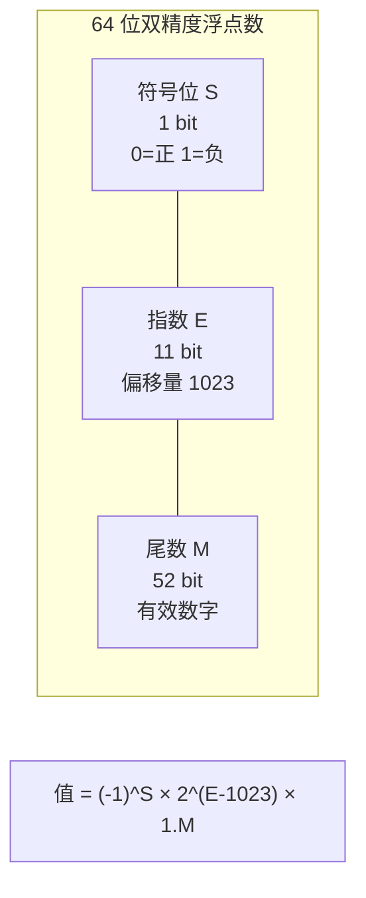
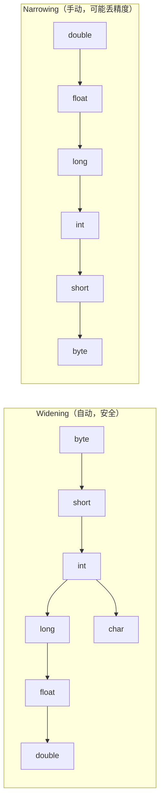
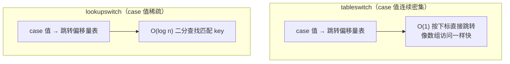
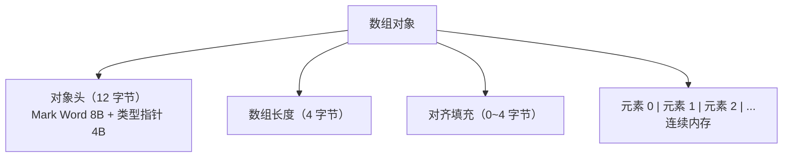

# Java 语法基础

> Java 语法看起来简单，但很多细节背后都有深层设计考量。理解这些细节，能帮你避开无数线上 bug。

## 为什么还要讲语法？

你可能会想：Java 语法这么基础，有什么好讲的？

但现实是，很多工作了几年的 Java 开发者仍然会在这些地方翻车：

- `0.1 + 0.2 != 0.3`，浮点数精度问题导致金额计算出错
- `Integer i1 = 127; Integer i2 = 127; i1 == i2` 返回 true，但换成 128 就返回 false
- `switch` 语句忘了 `break` 导致"幽灵"执行
- 字符串拼接在循环里用 `+`，性能暴跌

这些问题的根源都在语法层面。这篇文章把这些坑一次性讲清楚。

## 数据类型

Java 是强类型语言——每个变量在编译时就必须确定类型。这个看似"麻烦"的设计，其实是 Java 最大的安全网之一。

### 8 种基本类型

Java 的基本类型直接对应 CPU 能高效处理的二进制格式，不需要对象头、不需要 GC，是最轻量的数据载体：

| 类型 | 关键字 | 大小 | 取值范围 | 默认值 |
|------|--------|------|----------|--------|
| 字节型 | byte | 1 字节 | -128 ~ 127 | 0 |
| 短整型 | short | 2 字节 | -32768 ~ 32767 | 0 |
| 整型 | int | 4 字节 | -2³¹ ~ 2³¹-1 | 0 |
| 长整型 | long | 8 字节 | -2⁶³ ~ 2⁶³-1 | 0L |
| 单精度浮点 | float | 4 字节 | ±3.4×10³⁸ | 0.0f |
| 双精度浮点 | double | 8 字节 | ±1.7×10³⁰⁸ | 0.0d |
| 字符型 | char | 2 字节 | 0 ~ 65535 | '\u0000' |
| 布尔型 | boolean | ~ | true / false | false |

::: tip 为什么 byte 是 -128 ~ 127 而不是 0 ~ 255？
Java 的整数类型使用**补码（Two's Complement）**表示。1 字节 = 8 位，最高位是符号位（0 正 1 负），所以正数最大是 `0111 1111` = 127，负数最小是 `1000 0000` = -128。补码的好处是加减法不需要区分正负号，CPU 用同一套电路就能处理。
:::

### 浮点数的精度陷阱（IEEE 754）

这是最容易被忽视但最容易出事故的地方：

```java
System.out.println(0.1 + 0.2);          // 0.30000000000000004
System.out.println(1.0 - 0.9);          // 0.09999999999999998
System.out.println(0.1 * 0.1 == 0.01);  // false
```

**为什么会这样？** 浮点数在计算机中使用 IEEE 754 标准存储，本质上是用二进制小数来逼近十进制小数。就像十进制无法精确表示 1/3（0.333...）一样，二进制也无法精确表示 0.1（二进制是 0.0001100110011... 无限循环）。

IEEE 754 双精度浮点数的内存布局：



**怎么解决？**

```java
// 方案1：BigDecimal（金融场景必须用）
BigDecimal a = new BigDecimal("0.1");  // 注意用字符串构造，不要用 double
BigDecimal b = new BigDecimal("0.2");
System.out.println(a.add(b));  // 0.3

// 错误示范：用 double 构造，精度问题还在
// new BigDecimal(0.1) → 0.1000000000000000055511151231257827021181583404541015625

// 方案2：需要精度比较时，用误差范围
double a = 0.1 + 0.2;
double EPSILON = 1e-10;
System.out.println(Math.abs(a - 0.3) < EPSILON);  // true
```

::: danger 血的教训
2015 年，一个程序员在 GitHub 上悬赏 $10,000 求解 `0.1 + 0.2` 问题。在金融系统中，浮点精度错误可能导致几百万的账目偏差。永远不要用 double 存金额。
:::

### 类型转换：Widening vs Narrowing

Java 的类型转换分两种方向：



```java
// Widening — 小类型自动转大类型，不会丢数据
int i = 100;
long l = i;         // 自动转换
double d = l;       // 自动转换

// Narrowing — 大类型转小类型，必须显式强转，可能丢数据
double pi = 3.14159;
int intPi = (int) pi;  // intPi = 3，小数部分直接丢弃（不是四舍五入！）

// 经典陷阱：溢出
int big = Integer.MAX_VALUE;  // 2147483647
int overflow = big + 1;        // -2147483648，溢出成最小值！
// 正确做法：用更大的类型接收
long safe = (long) Integer.MAX_VALUE + 1;  // 2147483648
```

::: warning char 的特殊性
char 是无符号的 2 字节整数（0~65535），可以自动转为 int/long/double，但 byte/short 转 char 需要显式强转，因为 char 是无符号的而它们是有符号的。
:::

### var 类型推断（Java 10+）

```java
// Java 10 引入的局部变量类型推断
var name = "Hello";           // 推断为 String
var list = new ArrayList<String>();  // 推断为 ArrayList<String>
var stream = list.stream();   // 推断为 Stream<String>

// 限制1：只能用于局部变量
// var x;  // 编译错误，必须有初始化值
// var x = null;  // 编译错误，无法推断类型

// 限制2：不能用于方法参数、返回值、字段
// public var method() {}  // 编译错误

// 限制3：Lambda 表达式中不能直接用
// var f = s -> s.length();  // 编译错误
var f = (Function<String, Integer>) s -> s.length();  // 必须显式指定类型
```

::: tip 什么时候用 var？
var 是语法糖，字节码层面和显式声明完全一样。推荐在类型显而易见时使用（如 `new ArrayList<String>()`），类型不明显时还是写全（如 `Map<String, List<Integer>>` 不要用 var，可读性会变差）。
:::

## 运算符

### 位运算的实际用途

位运算不只是面试题，在真实项目中有广泛应用：

```java
// 1. 权限系统（Linux 文件权限就是这么做的）
int READ = 1 << 0;    // 0001 = 1
int WRITE = 1 << 1;   // 0010 = 2
int EXECUTE = 1 << 2; // 0100 = 4

int userPermission = READ | WRITE;  // 0011 = 3
System.out.println((userPermission & READ) != 0);     // true，有读权限
System.out.println((userPermission & EXECUTE) != 0);  // false，没有执行权限

// 2. 高效的乘除法（某些场景比 * / 快）
int x = 10;
System.out.println(x << 3);  // 10 * 2³ = 80，左移 3 位等于乘 8
System.out.println(x >> 1);  // 10 / 2¹ = 5，右移 1 位等于除 2

// 3. 交换两个变量（不用临时变量）
int a = 10, b = 20;
a = a ^ b;  // a = 10 ^ 20
b = a ^ b;  // b = (10 ^ 20) ^ 20 = 10
a = a ^ b;  // a = (10 ^ 20) ^ 10 = 20

// 4. 判断奇偶（比 % 快）
System.out.println((x & 1) == 0);  // true，偶数
System.out.println((x & 1) == 1);  // false，奇数
```

### >> 和 >>> 的区别

```java
int negative = -1;  // 二进制：11111111 11111111 11111111 11111111

// >> 算术右移：高位补符号位（负数补 1）
System.out.println(negative >> 1);   // -1，还是全 1

// >>> 逻辑右移：高位永远补 0
System.out.println(negative >>> 1);  // 2147483647，变成最大正整数
```

::: tip 记忆口诀
`>>` 是带符号右移（负数还是负数），`>>>` 是无符号右移（强制变正）。实际开发中 `>>` 用得更多，`>>>` 主要在哈希计算中出现（如 HashMap）。
:::

## 流程控制

### switch 的底层实现

switch 不只是一个语法糖，JVM 对它有两种不同的字节码实现：

```java
int day = 3;
switch (day) {
    case 1: System.out.println("Mon"); break;
    case 2: System.out.println("Tue"); break;
    case 3: System.out.println("Wed"); break;
    case 5: System.out.println("Fri"); break;
    case 100: System.out.println("100"); break;
    default: System.out.println("Other");
}
```

编译后的字节码会根据 case 值的分布选择策略：



**Java 12+ 的 switch 表达式**解决了忘记 break 的经典 bug：

```java
// 传统写法：忘了 break 就会穿透（fall-through），是 bug 高发区
String result;
switch (day) {
    case 1: result = "Mon"; break;
    case 2: result = "Tue"; break;
    default: result = "Other";
}

// Java 12+ switch 表达式：不会有 fall-through 问题
String result = switch (day) {
    case 1 -> "Mon";
    case 2 -> "Tue";
    case 3, 4 -> "Midweek";  // 多值匹配
    default -> "Other";
};

// 需要多行逻辑时用 yield
String result = switch (day) {
    case 1 -> {
        System.out.println("Monday");
        yield "Mon";  // yield 代替 return
    }
    default -> "Other";
};
```

### for-each 的本质和限制

```java
int[] arr = {1, 2, 3};

// for-each 语法糖
for (int num : arr) {
    System.out.println(num);
}

// 编译后实际是（用迭代器或下标访问）：
for (int i = 0; i < arr.length; i++) {
    int num = arr[i];
    System.out.println(num);
}
```

::: danger for-each 的两个限制
1. **不能修改集合本身**：遍历时不能添加/删除元素（会抛 ConcurrentModificationException）
2. **不能获取当前索引**：需要索引时只能用传统 for 循环
:::

## 数组

### 数组在 JVM 中的真实结构

数组不是 Java 语法层面的"[]"这么简单，在 JVM 中数组是一个**对象**：



因为数组是对象，所以可以调用 Object 的方法：

```java
int[] arr = {1, 2, 3};
System.out.println(arr.getClass());          // class [I（I 表示 int）
System.out.println(arr.getClass().getComponentType());  // int
System.out.println(arr.hashCode());          // 对象的哈希值
```

### Arrays 工具类的实用方法

```java
int[] arr = {5, 2, 8, 1, 9};

// 排序 — Dual-Pivot Quicksort（双轴快排，比传统快排更快）
Arrays.sort(arr);

// 二分查找 — 前提是数组已排序，找到返回索引，找不到返回 -(insertion point) - 1
int index = Arrays.binarySearch(arr, 8);  // 返回 4

// 比较数组内容（不是比较引用）
int[] copy = Arrays.copyOf(arr, arr.length);
System.out.println(Arrays.equals(arr, copy));  // true

// 填充
Arrays.fill(arr, 0);  // 全部填为 0

// 转为 List（注意：这个 List 是固定大小的，不能 add/remove）
List<Integer> list = Arrays.asList(1, 2, 3);
// list.add(4);  // 抛出 UnsupportedOperationException！
```

::: warning Arrays.asList 的坑
`Arrays.asList()` 返回的是**数组的一个视图（view）**，不是真正的 ArrayList。它和原数组共享数据，修改一个另一个也变。而且它是固定大小的，调用 add/remove 会抛异常。要得到可修改的 List，需要 `new ArrayList<>(Arrays.asList(...))`。
:::

## 字符串

### String 的不可变性——不仅仅是"不能改"

String 被设计为不可变（immutable）是有深层原因的：

```java
// String 的核心字段
public final class String {
    private final char[] value;  // JDK 8
    private final byte[] value;  // JDK 9+（Compact Strings 优化）
    private final int hash;      // 缓存哈希值
}
```

**为什么 String 要设计成不可变的？**

1. **字符串常量池（String Pool）**：如果 String 可变，`"hello"` 被多个变量引用时，一个修改会影响所有引用，这是灾难性的
2. **安全性**：String 被广泛用作 HashMap 的 key、网络连接的参数、文件路径。如果可变，这些场景都不安全
3. **线程安全**：不可变对象天然线程安全，不需要同步
4. **hash 缓存**：String 缓存了 hashCode，因为不可变所以只需算一次

```java
// 字符串常量池
String s1 = "Hello";              // 放入常量池
String s2 = "Hello";              // 从常量池取，同一个对象
String s3 = new String("Hello");  // 堆上新对象，不进常量池
String s4 = s3.intern();          // 主动放入常量池

System.out.println(s1 == s2);  // true，同一个常量池对象
System.out.println(s1 == s3);  // false，s3 在堆上
System.out.println(s1 == s4);  // true，intern 返回常量池中的引用
```

### 字符串拼接的性能真相

```java
// 反面教材：循环中用 + 拼接
String result = "";
for (int i = 0; i < 10000; i++) {
    result += "a";  // 每次都创建新的 String 对象 + StringBuilder，O(n²) 复杂度
}
// 耗时约 200ms，产生 10000 个临时 String 对象

// 正确做法：用 StringBuilder
StringBuilder sb = new StringBuilder();
for (int i = 0; i < 10000; i++) {
    sb.append("a");  // 在同一个 buffer 上操作，O(n) 复杂度
}
String result = sb.toString();
// 耗时约 0.5ms

// Java 9+ 的优化
// 编译器对字符串 + 做了优化（用 invokeDynamic），但循环中的拼接还是推荐 StringBuilder
String s = "Hello" + " " + "World";  // 编译器直接优化为 "Hello World"
```

### String、StringBuilder、StringBuffer 的选择

| 特性 | String | StringBuilder | StringBuffer |
|------|--------|---------------|--------------|
| 可变性 | 不可变 | 可变 | 可变 |
| 线程安全 | 安全（不可变） | 不安全 | 安全（synchronized） |
| 性能 | 拼接慢 | 最快 | 比 StringBuilder 慢 |
| 使用场景 | 少量拼接、常量 | 单线程拼接 | 多线程拼接（极少用） |

::: tip 实际开发中几乎不用 StringBuffer
StringBuffer 的线程安全是在每个方法上加 synchronized，性能开销大。多线程拼接字符串的场景非常罕见，真遇到了用 StringBuilder + 外部同步更合理。
:::

## Java 新语法特性（Java 14 ~ 21）

如果你还在用 Java 8 的语法写代码，下面这些新特性能显著提升开发体验：

### Record（Java 14 正式，Java 16）

```java
// 以前：写一个简单的数据类需要几十行
public class Point {
    private final int x;
    private final int y;

    public Point(int x, int y) {
        this.x = x;
        this.y = y;
    }

    public int x() { return x; }
    public int y() { return y; }

    @Override
    public boolean equals(Object o) { /* ... */ }

    @Override
    public int hashCode() { /* ... */ }

    @Override
    public String toString() { /* ... */ }
}

// 现在：一行搞定
public record Point(int x, int y) {}

// 自动生成：构造函数、访问器、equals、hashCode、toString
var p = new Point(1, 2);
System.out.println(p.x());       // 1（注意不是 getX()）
System.out.println(p);           // Point[x=1, y=2]
System.out.println(p.equals(new Point(1, 2)));  // true

// 可以自定义组件
public record User(String name, int age) {
    // 紧凑构造函数（compact constructor）— 用于校验
    public User {
        if (age < 0 || age > 150) {
            throw new IllegalArgumentException("年龄不合法: " + age);
        }
        name = name.trim();  // 可以修改参数（因为 record 的字段是 final，赋值只在这里）
    }
}
```

### Text Blocks（Java 13 预览，Java 15 正式）

```java
// 以前：JSON、SQL 等多行字符串需要大量转义
String json = "{\n" +
    "  \"name\": \"Alice\",\n" +
    "  \"age\": 30\n" +
    "}";

// 现在：三引号文本块
String json = """
        {
          "name": "Alice",
          "age": 30
        }
        """;

// Text Blocks 的缩进处理
// 编译器会将所有行的公共前导缩进去掉（以最后一行 """ 的位置为基准）
String sql = """
        SELECT id, name, age
        FROM users
        WHERE age > %d
        ORDER BY name
        """.formatted(18);  // Java 15+ 支持 formatted 方法
```

### Sealed Classes（Java 15 预览，Java 17 正式）

```java
// 密封类：精确控制哪些类可以继承
public sealed interface Shape
    permits Circle, Rectangle, Triangle {
    double area();
}

public record Circle(double radius) implements Shape {
    @Override
    public double area() { return Math.PI * radius * radius; }
}

public record Rectangle(double width, double height) implements Shape {
    @Override
    public double area() { return width * height; }
}

public record Triangle(double base, double height) implements Shape {
    @Override
    public double area() { return 0.5 * base * height; }
}

// 好处：switch 可以穷举所有子类型，不需要 default
double area = switch (shape) {
    case Circle c -> c.area();
    case Rectangle r -> r.area();
    case Triangle t -> t.area();
    // 不需要 default，编译器知道只有这三种
};
```

### Pattern Matching for instanceof（Java 14 预览，Java 16 正式）

```java
// 以前：先判断类型，再强转
if (obj instanceof String) {
    String s = (String) obj;
    System.out.println(s.length());
}

// 现在：模式匹配，一步搞定
if (obj instanceof String s) {  // s 自动绑定，无需强转
    System.out.println(s.length());
}

// 配合条件使用
if (obj instanceof String s && s.length() > 5) {
    System.out.println(s.toUpperCase());
}

// 在 switch 中使用（Java 17+ 预览，Java 21 正式）
String result = switch (obj) {
    case Integer i -> "整数: " + i;
    case String s  -> "字符串长度: " + s.length();
    case int[] arr -> "数组长度: " + arr.length;
    case null      -> "null";
    default        -> "未知类型";
};
```

## 面试高频题

**Q1：`int` 和 `Integer` 有什么区别？什么时候用哪个？**

`int` 是基本类型，直接存值，没有方法，默认值 0。`Integer` 是包装类，是对象，可以为 null，有方法（如 `parseInt`）。集合框架只能用 `Integer`（泛型不支持基本类型）。性能敏感场景用 `int`，需要 null 表示"无值"的场景用 `Integer`。

**Q2：`Integer i = 127; Integer j = 127; i == j` 和 `Integer i = 128; Integer j = 128; i == j` 的结果分别是什么？**

第一个 true，第二个 false。因为 Integer 缓存了 -128 到 127 的对象（`IntegerCache`），在这个范围内自动装箱返回缓存对象，超出范围创建新对象。`==` 比较的是引用地址。

**Q3：`String s = new String("hello")` 创建了几个对象？**

两个。一个在字符串常量池（"hello"），一个在堆上（new 创建的对象）。但如果常量池中已有 "hello"，则只创建堆上的对象，共一个。

**Q4：`final` 关键字有哪些用法？**

修饰变量：值不可变（基本类型）或引用不可变（引用类型，对象内容仍可改）。修饰方法：不可被子类重写。修饰类：不可被继承（如 String、Integer）。

## 延伸阅读

- 下一篇：[面向对象编程](oop.md) — 封装、继承、多态的深入理解
- [集合框架](collection.md) — ArrayList 扩容机制、HashMap 底层原理
- [并发编程](concurrency.md) — 线程安全、锁机制
