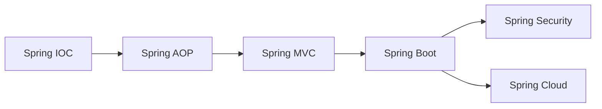

# Spring生态

Spring是Java企业级开发的首选框架，本模块涵盖Spring核心概念和生态组件。

## 模块概览

| 章节 | 描述 |
|------|------|
| [Spring IOC](./ioc.md) | 控制反转与依赖注入 |
| [Spring AOP](./aop.md) | 面向切面编程 |
| [Spring Boot](./boot.md) | 快速开发框架 |
| [Spring MVC](./mvc.md) | Web开发框架 |
| [Spring Cloud](./cloud.md) | 微服务架构 |
| [Spring Security](./security.md) | 安全框架 |

## Spring生态全景

```
┌─────────────────────────────────────────────────────────────┐
│                    Spring Ecosystem                         │
├─────────────────────────────────────────────────────────────┤
│  ┌─────────────┐  ┌─────────────┐  ┌─────────────────────┐  │
│  │ Spring Boot │  │Spring Cloud │  │ Spring Security     │  │
│  └─────────────┘  └─────────────┘  └─────────────────────┘  │
│  ┌─────────────┐  ┌─────────────┐  ┌─────────────────────┐  │
│  │ Spring MVC  │  │ Spring Data │  │ Spring Batch        │  │
│  └─────────────┘  └─────────────┘  └─────────────────────┘  │
│  ┌─────────────────────────────────────────────────────┐    │
│  │              Spring Framework Core                   │    │
│  │  IOC Container | AOP | Events | Resources | Testing │    │
│  └─────────────────────────────────────────────────────┘    │
└─────────────────────────────────────────────────────────────┘
```

## 核心特性

### 1. IOC（控制反转）

- Bean的生命周期管理
- 依赖注入（DI）
- 自动装配

### 2. AOP（面向切面编程）

- 声明式事务
- 日志记录
- 权限控制

### 3. 约定优于配置

- 自动配置
- Starter依赖
- 外部化配置

## 学习路径


