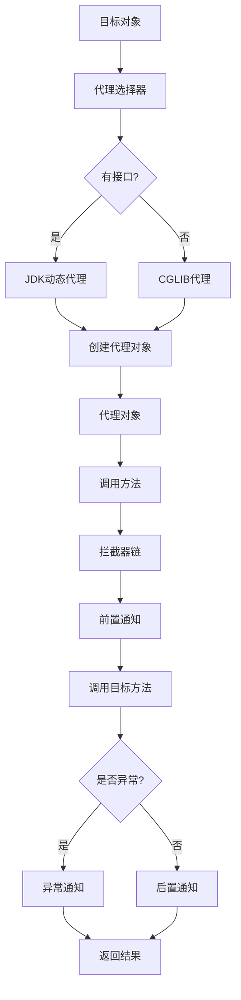

# AOP 深入原理

> AOP（Aspect-Oriented Programming，面向切面编程）是 Spring 框架的核心特性之一，它通过代理机制实现了横切关注点的分离。本文深入探讨 AOP 的底层原理、实现机制和最佳实践。

## 基础入门：AOP 概念

### 什么是 AOP
AOP（Aspect-Oriented Programming，面向切面编程）是一种编程范式，它将横切关注点（cross-cutting concerns）从业务逻辑中分离出来。横切关注点是指那些在多个模块中重复出现的功能，如日志记录、事务管理、安全检查、性能监控等。

### AOP 核心概念
```java
// 1. 切面（Aspect）
@Component
@Aspect
public class LoggingAspect {
    
    // 2. 连接点（Join Point）
    @Before("execution(* com.example.service.*.*(..))")
    public void logMethodCall(JoinPoint joinPoint) {
        // 方法调用前的日志记录
    }
    
    // 3. 切点（Pointcut）
    @Pointcut("execution(* com.example.service.UserService.*(..))")
    public void userServiceMethods() {}
    
    // 4. 通知（Advice）
    @Before("userServiceMethods()")
    public void beforeUserServiceMethod(JoinPoint joinPoint) {
        // 前置通知
    }
    
    // 5. 引入（Introduction）
    @DeclareParents(value = "com.example.service.*", 
                   defaultImpl = TimeStampedImpl.class)
    public TimeStamped timeStamped;
}

// 6. 目标对象（Target Object）
@Service
public class UserService {
    public void createUser(User user) {
        // 业务逻辑
    }
}

// 7. 代理对象（Proxy Object）
// Spring AOP 创建的代理对象
```

## AOP 底层实现原理

### 动态代理机制
Spring AOP 主要使用动态代理来实现，包括：

1. **JDK 动态代理**：基于接口的代理
2. **CGLIB 代理**：基于类的代理

### JDK 动态代理原理
```java
// JDK 动态代理实现原理
public class JdkDynamicProxy implements InvocationHandler {
    private final Object target;
    
    public JdkDynamicProxy(Object target) {
        this.target = target;
    }
    
    public static Object createProxy(Object target) {
        return Proxy.newProxyInstance(
            target.getClass().getClassLoader(),
            target.getClass().getInterfaces(),
            new JdkDynamicProxy(target)
        );
    }
    
    @Override
    public Object invoke(Object proxy, Method method, Object[] args) throws Throwable {
        // 前置通知
        System.out.println("Before method: " + method.getName());
        
        try {
            // 调用目标方法
            Object result = method.invoke(target, args);
            
            // 后置通知
            System.out.println("After method: " + method.getName());
            
            return result;
        } catch (Exception e) {
            // 异常通知
            System.out.println("Exception in method: " + method.getName());
            throw e;
        }
    }
}

// 使用示例
UserService userService = new UserServiceImpl();
UserService proxy = (UserService) JdkDynamicProxy.createProxy(userService);
proxy.createUser(new User("Alice"));
```

### CGLIB 代理原理
```java
// CGLIB 代理实现原理
public class CglibProxy implements MethodInterceptor {
    private final Object target;
    
    public CglibProxy(Object target) {
        this.target = target;
    }
    
    public static Object createProxy(Object target) {
        Enhancer enhancer = new Enhancer();
        enhancer.setSuperclass(target.getClass());
        enhancer.setCallback(new CglibProxy(target));
        return enhancer.create();
    }
    
    @Override
    public Object intercept(Object obj, Method method, Object[] args, MethodProxy proxy) throws Throwable {
        // 前置通知
        System.out.println("Before CGLIB method: " + method.getName());
        
        try {
            // 调用目标方法
            Object result = proxy.invokeSuper(obj, args);
            
            // 后置通知
            System.out.println("After CGLIB method: " + method.getName());
            
            return result;
        } catch (Exception e) {
            // 异常通知
            System.out.println("Exception in CGLIB method: " + method.getName());
            throw e;
        }
    }
}

// 使用示例
UserService userService = new UserServiceImpl();
UserService proxy = (UserService) CglibProxy.createProxy(userService);
proxy.createUser(new User("Bob"));
```

### 代理选择策略
```java
// Spring AOP 的代理选择策略
public class AopProxySelector {
    
    public AopProxy createProxy(Object target, Class<?>[] interfaces) {
        // 检查是否实现了接口
        if (target.getClass().getInterfaces().length > 0) {
            // 使用 JDK 动态代理
            return new JdkDynamicProxy(target, interfaces);
        } else {
            // 使用 CGLIB 代理
            return new CglibProxy(target);
        }
    }
    
    public class JdkDynamicProxy implements AopProxy {
        private final Object target;
        private final Class<?>[] interfaces;
        
        public JopProxy(Object target, Class<?>[] interfaces) {
            this.target = target;
            this.interfaces = interfaces;
        }
        
        @Override
        public Object getProxy() {
            return Proxy.newProxyInstance(
                target.getClass().getClassLoader(),
                interfaces,
                new AopInvocationHandler(target)
            );
        }
    }
    
    public class CglibProxy implements AopProxy {
        private final Object target;
        
        public CglibProxy(Object target) {
            this.target = target;
        }
        
        @Override
        public Object getProxy() {
            Enhancer enhancer = new Enhancer();
            enhancer.setSuperclass(target.getClass());
            enhancer.setCallback(new AopMethodInterceptor(target));
            return enhancer.create();
        }
    }
}
```



## @Around 原理详解

### @Around 通知的工作机制
```java
@Aspect
@Component
public class AroundAspect {
    
    @Around("execution(* com.example.service.*.*(..))")
    public Object aroundAdvice(ProceedingJoinPoint joinPoint) throws Throwable {
        // 1. 前置处理
        System.out.println("Around - Before method: " + joinPoint.getSignature().getName());
        long startTime = System.currentTimeMillis();
        
        try {
            // 2. 执行目标方法
            Object result = joinPoint.proceed();
            
            // 3. 后置处理
            long endTime = System.currentTimeMillis();
            System.out.println("Around - After method: " + joinPoint.getSignature().getName());
            System.out.println("Method execution time: " + (endTime - startTime) + "ms");
            
            return result;
        } catch (Throwable throwable) {
            // 4. 异常处理
            System.out.println("Around - Exception in method: " + joinPoint.getSignature().getName());
            throw throwable;
        }
    }
}
```

### ProceedingJoinPoint 深度解析
```java
public class ProceedingJoinPointExample {
    
    @Around("execution(* com.example.service.UserService.*(..))")
    public Object handleServiceMethod(ProceedingJoinPoint joinPoint) throws Throwable {
        
        // 1. 获取方法信息
        String methodName = joinPoint.getSignature().getName();
        Class<?> targetClass = joinPoint.getTarget().getClass();
        Method method = getMethod(targetClass, methodName);
        
        // 2. 获取方法参数
        Object[] args = joinPoint.getArgs();
        Object target = joinPoint.getTarget();
        Object proxy = joinPoint.getThis();
        
        // 3. 获取方法参数注解
        Annotation[][] parameterAnnotations = method.getParameterAnnotations();
        
        // 4. 获取方法参数名（需要编译时参数信息）
        String[] parameterNames = getParameterNames(method);
        
        // 5. 执行目标方法
        Object result = joinPoint.proceed(args);
        
        // 6. 处理返回值
        if (result != null) {
            System.out.println("Method returned: " + result);
        }
        
        return result;
    }
    
    private Method getMethod(Class<?> targetClass, String methodName) throws NoSuchMethodException {
        Class<?>[] parameterTypes = getParameterTypes(targetClass, methodName);
        return targetClass.getMethod(methodName, parameterTypes);
    }
}
```

### @Around 与其他通知的对比
```java
@Aspect
@Component
public class AllAspectAdviceExample {
    
    // @Before 通知 - 方法执行前
    @Before("execution(* com.example.service.*.*(..))")
    public void beforeAdvice(JoinPoint joinPoint) {
        System.out.println("@Before - 方法执行前");
    }
    
    // @After 通知 - 方法执行后（无论是否异常）
    @After("execution(* com.example.service.*.*(..))")
    public void afterAdvice(JoinPoint joinPoint) {
        System.out.println("@After - 方法执行后");
    }
    
    // @AfterReturning 通知 - 方法正常返回后
    @AfterReturning(pointcut = "execution(* com.example.service.*.*(..))", returning = "result")
    public void afterReturningAdvice(JoinPoint joinPoint, Object result) {
        System.out.println("@AfterReturning - 方法正常返回: " + result);
    }
    
    // @AfterThrowing 通知 - 方法抛出异常后
    @AfterThrowing(pointcut = "execution(* com.example.service.*.*(..))", throwing = "exception")
    public void afterThrowingAdvice(JoinPoint joinPoint, Exception exception) {
        System.out.println("@AfterThrowing - 方法抛出异常: " + exception.getMessage());
    }
    
    // @Around 通知 - 方法执行前后
    @Around("execution(* com.example.service.*.*(..))")
    public Object aroundAdvice(ProceedingJoinPoint joinPoint) throws Throwable {
        System.out.println("@Around - 方法执行前");
        
        try {
            Object result = joinPoint.proceed();
            System.out.println("@Around - 方法执行后，返回值: " + result);
            return result;
        } catch (Throwable throwable) {
            System.out.println("@Around - 方法抛出异常: " + throwable.getMessage());
            throw throwable;
        }
    }
}
```

```mermaid
graph TD
    A[方法调用] --> B[代理拦截]
    B --> C{通知类型}
    C -->|@Before| D[前置通知]
    C -->|@After| E[后置通知]
    C -->|@AfterReturning| F[返回后通知]
    C -->|@AfterThrowing| G[异常通知]
    C -->|@Around| H[环绕通知]
    
    D --> I[执行目标方法]
    E --> I
    F --> I
    G --> I
    H --> J{是否执行proceed?}
    J -->|是| K[执行目标方法]
    J -->|否| L[直接返回]
    
    K --> M{是否异常?}
    M -->|是| N[抛出异常]
    M -->|否| O[正常返回]
    
    N --> P[通知完成]
    O --> P
    L --> P
    I --> P
```

## 切点表达式语法详解

### 基本语法
```java
@Aspect
@Component
public class PointcutExamples {
    
    // execution() - 最常用的切点指示器
    @Before("execution(* com.example.service.*.*(..))")
    public void serviceMethods() {}
    
    // within() - 限制在特定包内
    @Before("within(com.example.service.*)")
    public void servicePackage() {}
    
    @Before("within(com.example.service..*)")
    public void serviceAndSubpackages() {}
    
    // target() - 目标对象类型
    @Before("target(com.example.service.UserService)")
    public void userServiceTarget() {}
    
    // args() - 方法参数类型
    @Before("args(String, Integer)")
    public void stringAndIntegerArgs() {}
    
    @Before("args(name)")
    public void stringArgs(String name) {}
    
    // @annotation() - 注解存在
    @Before("@annotation(com.example.annotation.Loggable)")
    public void loggableMethods() {}
    
    // @within() - 类级别的注解
    @Before("@within(com.example.annotation.Service)")
    public void serviceClassMethods() {}
    
    // @target() - 目标对象有指定注解
    @Before("@target(com.example.annotation.Component)")
    public void componentTargetMethods() {}
    
    // @args() - 参数有指定注解
    @Before("@args(com.example.annotation.Valid)")
    public void validArgsMethods() {}
    
    // bean() - Spring Bean 名称
    @Before("bean(userService)")
    public void userServiceBean() {}
    
    // this() - 代理对象类型
    @Before("this(com.example.service.UserService)")
    public void userServiceProxy() {}
}
```

### 组合切点表达式
```java
@Aspect
@Component
public class CompoundPointcutExamples {
    
    // && 与运算
    @Before("execution(* com.example.service.*.*(..)) && args(String)")
    public void serviceMethodsWithStringArgs() {}
    
    // || 或运算
    @Before("execution(* com.example.service.*.*(..)) || execution(* com.example.dao.*.*(..))")
    public void serviceOrDaoMethods() {}
    
    // ! 非运算
    @Before("execution(* com.example.service.*.*(..)) && !execution(* com.example.service.UserService.*(..))")
    public void serviceMethodsExceptUserService() {}
    
    // 定义切点
    @Pointcut("execution(* com.example.service.*.*(..))")
    public void serviceMethods() {}
    
    @Pointcut("args(String)")
    public void stringArgs() {}
    
    // 使用定义的切点
    @Before("serviceMethods() && stringArgs()")
    public void serviceMethodsWithStringArgs() {}
    
    // 切点组合
    @Pointcut("serviceMethods() && !@annotation(com.example.annotation.IgnoreLogging)")
    public void serviceMethodsExceptIgnoreLogging() {}
}
```

### 高级切点表达式
```java
@Aspect
@Component
public class AdvancedPointcutExamples {
    
    // 方法名匹配
    @Before("execution(* create*(..))")
    public void createMethods() {}
    
    @Before("execution(* update*(..))")
    public void updateMethods() {}
    
    @Before("execution(* delete*(..))")
    public void deleteMethods() {}
    
    // 参数数量匹配
    @Before("execution(* *(..)) && args()")
    public void noArgMethods() {}
    
    @Before("execution(* *(..)) && args(..)")
    public void allMethods() {}
    
    @Before("execution(* (*,..)) && args(String, ..)")
    public void methodsWithFirstStringArg() {}
    
    // 返回类型匹配
    @AfterReturning("execution(* com.example.service.UserService.*(..))")
    public void userServiceReturnMethods() {}
    
    @AfterReturning("execution(* com.example.service.*.get*(..))")
    public void getterMethods() {}
    
    // 异常类型匹配
    @AfterThrowing("execution(* com.example.service.*.*(..)) && " +
                  "throwing(com.example.BusinessException)")
    public void businessExceptionMethods() {}
    
    // 复杂表达式
    @Before("within(com.example.service..*) && " +
             "execution(* create*(..)) && " +
             "@annotation(com.example.annotation.Transactional)")
    public void transactionalCreateMethods() {}
}
```

### 自定义切点指示器
```java
// 自定义注解
@Target(ElementType.METHOD)
@Retention(RetentionPolicy.RUNTIME)
public @interface Loggable {
    LogLevel value() default LogLevel.INFO;
    String message() default "";
}

public enum LogLevel {
    DEBUG, INFO, WARN, ERROR
}

// 自定义切点指示器
@Aspect
@Component
public class CustomPointcutExample {
    
    // 使用注解作为切点指示器
    @Before("@annotation(loggable)")
    public void loggableMethods(JoinPoint joinPoint, Loggable loggable) {
        LogLevel level = loggable.value();
        String message = loggable.message();
        
        String logMessage = String.format("%s - %s.%s: %s",
            level,
            joinPoint.getTarget().getClass().getSimpleName(),
            joinPoint.getSignature().getName(),
            message.isEmpty() ? "Method called" : message
        );
        
        switch (level) {
            case DEBUG:
                System.out.println("[DEBUG] " + logMessage);
                break;
            case INFO:
                System.out.println("[INFO] " + logMessage);
                break;
            case WARN:
                System.out.println("[WARN] " + logMessage);
                break;
            case ERROR:
                System.err.println("[ERROR] " + logMessage);
                break;
        }
    }
}

// 使用自定义注解
@Service
public class OrderService {
    
    @Loggable(level = LogLevel.INFO, message = "Creating new order")
    public Order createOrder(OrderRequest request) {
        // 创建订单逻辑
        return new Order();
    }
    
    @Loggable(level = LogLevel.DEBUG)
    public Order getOrder(Long orderId) {
        // 获取订单逻辑
        return new Order();
    }
}
```

## AOP 失效场景和解决方案

### 常见失效场景

#### 1. 内部方法调用失效
```java
@Service
public class UserService {
    
    public void createUser(User user) {
        // 内部方法调用，不会触发 AOP
        this.validateUser(user);
        this.saveUser(user);
    }
    
    @Transactional
    @Loggable
    public void validateUser(User user) {
        // 验证逻辑
    }
    
    @Transactional
    @Loggable
    public void saveUser(User user) {
        // 保存逻辑
    }
}
```

**解决方案：**
```java
@Service
public class UserService {
    
    @Autowired
    private UserValidator userValidator;
    @Autowired
    private UserRepository userRepository;
    
    public void createUser(User user) {
        // 通过注入的 bean 调用方法
        userValidator.validateUser(user);
        userRepository.saveUser(user);
    }
}

@Component
public class UserValidator {
    
    @Loggable
    public void validateUser(User user) {
        // 验证逻辑
    }
}

@Component
public class UserRepository {
    
    @Transactional
    @Loggable
    public void saveUser(User user) {
        // 保存逻辑
    }
}
```

#### 2. final 方法失效
```java
@Service
public class UserService {
    
    // final 方法不能被代理
    public final void doSomething() {
        // 方法逻辑
    }
}
```

**解决方案：**
- 避免在需要 AOP 的类上使用 final 修饰符
- 如果必须使用 final，考虑使用 CGLIB 代理（CGLIB 可以代理 final 方法，但不能覆盖 final 方法）

#### 3. 非公有方法失效
```java
@Service
public class UserService {
    
    // private 方法不能被代理
    private void internalMethod() {
        // 方法逻辑
    }
}
```

**解决方案：**
- 将需要代理的方法改为 public 或 protected
- 对于私有方法，考虑将其重构为公共方法

#### 4. 非 Spring 管理的 Bean
```java
@Service
public class UserService {
    
    @Loggable
    public void createUser(User user) {
        // 逻辑
    }
}

// 非 Spring 管理的类
public class ExternalService {
    
    @Autowired
    private UserService userService; // 可能注入的是原始对象，不是代理
    
    public void process() {
        userService.createUser(new User()); // 可能不会触发 AOP
    }
}
```

**解决方案：**
- 确保所有需要 AOP 的 Bean 都由 Spring 管理
- 使用 `@EnableAspectJAutoProxy` 注解启用 AOP
- 在 Spring 配置中确保代理设置正确

### AOP 配置优化
```java
@Configuration
@EnableAspectJAutoProxy(proxyTargetClass = true, exposeProxy = true)
public class AopConfig {
    
    @Bean
    public LogAspect logAspect() {
        return new LogAspect();
    }
    
    @Bean
    public TransactionAspect transactionAspect() {
        return new TransactionAspect();
    }
    
    // 设置代理行为
    @Bean
    public DefaultAdvisorAutoProxyCreator advisorAutoProxyCreator() {
        DefaultAdvisorAutoProxyCreator proxyCreator = new DefaultAdvisorAutoProxyCreator();
        proxyCreator.setProxyTargetClass(true);
        proxyCreator.setOptimize(true);
        return proxyCreator;
    }
}

// 在配置中设置代理行为
@Configuration
@EnableAspectJAutoProxy
public class AopConfiguration {
    
    @Value("${aop.proxy.target-class:true}")
    private boolean proxyTargetClass;
    
    @Value("${aop.proxy.expose-proxy:true}")
    private boolean exposeProxy;
    
    @Bean
    public AspectJAutoProxyFactory aspectJAutoProxyFactory() {
        AspectJAutoProxyFactory factory = new AspectJAutoProxyFactory();
        factory.setProxyTargetClass(proxyTargetClass);
        factory.setExposeProxy(exposeProxy);
        return factory;
    }
}
```

### 性能优化
```java
@Aspect
@Component
public class OptimizedAspect {
    
    // 使用缓存优化切点匹配
    private final Map<String, Method> methodCache = new ConcurrentHashMap<>();
    
    @Around("execution(* com.example.service.*.*(..))")
    public Object optimizedAdvice(ProceedingJoinPoint joinPoint) throws Throwable {
        // 1. 快速路径检查
        if (!shouldIntercept(joinPoint)) {
            return joinPoint.proceed();
        }
        
        // 2. 缓存方法信息
        Method method = getCachedMethod(joinPoint);
        
        // 3. 执行拦截逻辑
        return interceptMethod(method, joinPoint);
    }
    
    private boolean shouldIntercept(JoinPoint joinPoint) {
        // 快速检查逻辑
        String className = joinPoint.getTarget().getClass().getName();
        String methodName = joinPoint.getSignature().getName();
        
        // 只拦截特定类的方法
        return className.startsWith("com.example.service");
    }
    
    private Method getCachedMethod(JoinPoint joinPoint) {
        String key = joinPoint.getTarget().getClass().getName() + "." + 
                     joinPoint.getSignature().getName();
        
        return methodCache.computeIfAbsent(key, k -> {
            try {
                Class<?>[] parameterTypes = getParameterTypes(joinPoint);
                return joinPoint.getTarget().getClass().getMethod(
                    joinPoint.getSignature().getName(), parameterTypes);
            } catch (NoSuchMethodException e) {
                throw new RuntimeException("Method not found", e);
            }
        });
    }
    
    private Object interceptMethod(Method method, ProceedingJoinPoint joinPoint) throws Throwable {
        long startTime = System.nanoTime();
        
        try {
            // 前置处理
            beforeMethod(method, joinPoint);
            
            // 执行目标方法
            Object result = joinPoint.proceed();
            
            // 后置处理
            afterMethod(method, joinPoint, result);
            
            return result;
        } catch (Throwable throwable) {
            // 异常处理
            afterThrowingMethod(method, joinPoint, throwable);
            throw throwable;
        } finally {
            long endTime = System.nanoTime();
            System.out.println("Method execution time: " + (endTime - startTime) + "ns");
        }
    }
}
```

## Spring AOP 与 AspectJ 对比

### Spring AOP 特点
```java
// Spring AOP 基于 Spring IoC 容器
@Configuration
@EnableAspectJAutoProxy
public class SpringAopConfig {
    
    @Bean
    public LoggingAspect loggingAspect() {
        return new LoggingAspect();
    }
}

// Spring AOP 只能代理 Spring 管理的 Bean
@Service
public class UserService {
    
    @Loggable
    public void createUser(User user) {
        // 逻辑
    }
}

// Spring AOP 使用动态代理
@Service
public class UserServiceImpl implements UserService {
    
    @Override
    @Loggable
    public void createUser(User user) {
        // 逻辑
    }
}
```

### AspectJ 特点
```java
// AspectJ 可以代理任何类，不依赖 Spring
public class AspectJExample {
    
    // AspectJ 编译时织入或加载时织入
    @Aspect
    public class LoggingAspect {
        
        @Before("execution(* com.example.*.*.*(..))")
        public void logMethodCall(JoinPoint joinPoint) {
            System.out.println("Method called: " + joinPoint.getSignature());
        }
    }
    
    // 可以代理非 Spring 管理的类
    public class NonSpringService {
        
        @Loggable
        public void doSomething() {
            // 逻辑
        }
    }
}
```

### 选择建议
```java
public class AopStrategySelector {
    
    public enum Strategy {
        SPRING_AOP, ASPECTJ
    }
    
    public Strategy selectStrategy(ProjectContext context) {
        if (context.isSpringProject() && 
            context.getSpringVersion() >= 5.0 &&
            context.getProxyTargetClass()) {
            return Strategy.SPRING_AOP;
        } else {
            return Strategy.ASPECTJ;
        }
    }
    
    // Spring AOP 适用场景
    public void whenToUseSpringAop() {
        // 1. 已经在使用 Spring 框架
        // 2. 只需要代理 Spring 管理的 Bean
        // 3. 性能要求不高
        // 4. 希望简化配置
    }
    
    // AspectJ 适用场景
    public void whenToUseAspectJ() {
        // 1. 需要代理非 Spring 管理的类
        // 2. 需要编译时织入
        // 3. 需要更强大的切点表达式
        // 4. 需要代理 final 类或方法
        // 5. 性能要求高
    }
}
```

## 实际应用案例

### 案例1：性能监控
```java
@Aspect
@Component
public class PerformanceMonitorAspect {
    
    private final Map<String, MethodStats> methodStats = new ConcurrentHashMap<>();
    
    @Around("execution(* com.example.service.*.*(..))")
    public Object monitorPerformance(ProceedingJoinPoint joinPoint) throws Throwable {
        String methodName = joinPoint.getSignature().toShortString();
        MethodStats stats = methodStats.computeIfAbsent(methodName, k -> new MethodStats());
        
        long startTime = System.currentTimeMillis();
        try {
            Object result = joinPoint.proceed();
            stats.incrementSuccess();
            return result;
        } catch (Throwable throwable) {
            stats.incrementFailure();
            throw throwable;
        } finally {
            long duration = System.currentTimeMillis() - startTime;
            stats.updateDuration(duration);
        }
    }
    
    @Scheduled(fixedRate = 60000) // 每分钟输出一次统计
    public void printPerformanceStats() {
        methodStats.forEach((method, stats) -> {
            System.out.printf("%s: calls=%d, success=%d, failures=%d, avgTime=%dms%n",
                method, stats.getTotalCalls(), stats.getSuccessCount(), 
                stats.getFailureCount(), stats.getAverageDuration());
        });
    }
    
    private static class MethodStats {
        private long totalCalls = 0;
        private long successCount = 0;
        private long failureCount = 0;
        private long totalTime = 0;
        
        public synchronized void incrementSuccess() {
            totalCalls++;
            successCount++;
        }
        
        public synchronized void incrementFailure() {
            totalCalls++;
            failureCount++;
        }
        
        public synchronized void updateDuration(long duration) {
            totalTime += duration;
        }
        
        public synchronized double getAverageDuration() {
            return totalCalls == 0 ? 0 : (double) totalTime / totalCalls;
        }
        
        // getters...
    }
}
```

### 案例2：分布式事务管理
```java
@Aspect
@Component
public class DistributedTransactionAspect {
    
    @Autowired
    private TransactionManager transactionManager;
    
    @Around("@annotation(distributedTransaction)")
    public Object handleDistributedTransaction(ProceedingJoinPoint joinPoint, 
                                            DistributedTransaction distributedTransaction) throws Throwable {
        String transactionId = UUID.randomUUID().toString();
        TransactionDefinition definition = new DefaultTransactionDefinition();
        definition.setName(transactionId);
        
        try {
            // 开始事务
            TransactionStatus status = transactionManager.getTransaction(definition);
            
            // 执行目标方法
            Object result = joinPoint.proceed();
            
            // 提交事务
            transactionManager.commit(status);
            return result;
        } catch (Throwable throwable) {
            // 回滚事务
            try {
                transactionManager.rollback(status);
            } catch (TransactionSystemException e) {
                System.err.println("Transaction rollback failed: " + e.getMessage());
            }
            
            // 记录事务失败
            System.err.println("Transaction failed: " + transactionId + ", error: " + throwable.getMessage());
            
            throw throwable;
        }
    }
}

// 使用分布式事务注解
@Service
public class OrderService {
    
    @DistributedTransaction
    public Order createOrder(OrderRequest request) {
        // 创建订单逻辑
        return orderRepository.save(new Order());
    }
}
```

### 案例3：缓存管理
```java
@Aspect
@Component
public class CacheAspect {
    
    private final CacheManager cacheManager;
    
    @Autowired
    public CacheAspect(CacheManager cacheManager) {
        this.cacheManager = cacheManager;
    }
    
    @Around("@annotation(cacheable)")
    public Object cacheableMethod(ProceedingJoinPoint joinPoint, Cacheable cacheable) throws Throwable {
        String cacheName = cacheable.cacheName();
        String key = generateCacheKey(joinPoint, cacheable.key());
        
        // 尝试从缓存获取
        Cache cache = cacheManager.getCache(cacheName);
        if (cache != null) {
            Cache.ValueWrapper valueWrapper = cache.get(key);
            if (valueWrapper != null) {
                return valueWrapper.get();
            }
        }
        
        // 缓存未命中，执行方法
        Object result = joinPoint.proceed();
        
        // 存入缓存
        if (cache != null && result != null) {
            cache.put(key, result);
        }
        
        return result;
    }
    
    @Around("@annotation(cacheEvict)")
    public Object cacheEvictMethod(ProceedingJoinPoint joinPoint, CacheEvict cacheEvict) throws Throwable {
        // 执行方法
        Object result = joinPoint.proceed();
        
        // 清除缓存
        if (cacheEvict.allEntries()) {
            cacheManager.getCache(cacheEvict.cacheName()).clear();
        } else {
            String key = generateCacheKey(joinPoint, cacheEvict.key());
            cacheManager.getCache(cacheEvict.cacheName()).evict(key);
        }
        
        return result;
    }
    
    private String generateCacheKey(JoinPoint joinPoint, String keyExpression) {
        // 简化的缓存键生成逻辑
        if (keyExpression == null || keyExpression.isEmpty()) {
            return joinPoint.getSignature().toShortString();
        }
        
        // 可以使用 SpEL 表达式解析器
        return keyExpression + "_" + joinPoint.getArgs()[0];
    }
}
```

## 最佳实践

### 1. AOP 设计原则
```java
public class AopBestPractices {
    
    // 单一职责原则
    @Aspect
    @Component
    public class LoggingAspect {
        
        @Around("execution(* com.example.service.*.*(..))")
        public Object logMethodCall(ProceedingJoinPoint joinPoint) throws Throwable {
            // 只负责日志记录
            System.out.println("Method called: " + joinPoint.getSignature());
            return joinPoint.proceed();
        }
    }
    
    // 开闭原则
    @Aspect
    @Component
    public class MonitoringAspect {
        
        @Around("execution(* com.example.service.*.*(..))")
        public Object monitorMethod(ProceedingJoinPoint joinPoint) throws Throwable {
            // 只监控性能，不修改业务逻辑
            long startTime = System.currentTimeMillis();
            Object result = joinPoint.proceed();
            long duration = System.currentTimeMillis() - startTime;
            System.out.println("Method took: " + duration + "ms");
            return result;
        }
    }
}
```

### 2. 避免过度使用 AOP
```java
// 不好的例子 - 过度使用 AOP
@Aspect
@Component
public class OverusedAspect {
    
    @Around("execution(* com.example.service.*.*(..))")
    public Object everything(ProceedingJoinPoint joinPoint) throws Throwable {
        // 在每个方法中都添加了太多逻辑
        System.out.println("Before: " + joinPoint.getSignature());
        
        // 权限检查
        checkPermissions(joinPoint);
        
        // 日志记录
        logMethodCall(joinPoint);
        
        // 性能监控
        long startTime = System.currentTimeMillis();
        
        // 缓存检查
        Object result = checkCache(joinPoint);
        if (result != null) {
            return result;
        }
        
        // 执行方法
        result = joinPoint.proceed();
        
        // 缓存更新
        updateCache(joinPoint, result);
        
        // 性能统计
        long duration = System.currentTimeMillis() - startTime;
        updatePerformanceMetrics(joinPoint, duration);
        
        System.out.println("After: " + joinPoint.getSignature());
        return result;
    }
    
    // 好的例子 - 分离关注点
    @Aspect
    @Component
    public class LoggingAspect {
        @Around("execution(* com.example.service.*.*(..))")
        public Object logMethodCall(ProceedingJoinPoint joinPoint) throws Throwable {
            System.out.println("Method called: " + joinPoint.getSignature());
            return joinPoint.proceed();
        }
    }
    
    @Aspect
    @Component
    public class PerformanceAspect {
        @Around("execution(* com.example.service.*.*(..))")
        public Object monitorPerformance(ProceedingJoinPoint joinPoint) throws Throwable {
            long startTime = System.currentTimeMillis();
            Object result = joinPoint.proceed();
            long duration = System.currentTimeMillis() - startTime;
            System.out.println("Method took: " + duration + "ms");
            return result;
        }
    }
}
```

### 3. 合理的切点设计
```java
public class GoodPointcutDesign {
    
    // 定义有意义的切点
    @Pointcut("within(com.example.service..*) && " +
              "@annotation(com.example.annotation.ServiceMethod)")
    public void serviceMethods() {}
    
    @Pointcut("within(com.example.controller..*) && " +
              "@annotation(com.example.annotation.RestControllerMethod)")
    public void controllerMethods() {}
    
    @Pointcut("within(com.example.dao..*) && " +
              "@annotation(com.example.annotation.DaoMethod)")
    public void daoMethods() {}
    
    // 使用切点组合
    @Pointcut("serviceMethods() && @annotation(com.example.annotation.Transactional)")
    public void transactionalServiceMethods() {}
    
    @Pointcut("controllerMethods() && @annotation(com.example.annotation.Loggable)")
    public void loggableControllerMethods() {}
    
    @Aspect
    @Component
    public class ServiceAspect {
        
        @Before("serviceMethods()")
        public void beforeServiceMethod(JoinPoint joinPoint) {
            System.out.println("Service method called: " + joinPoint.getSignature());
        }
    }
}
```

### 4. 异常处理
```java
@Aspect
@Component
public class ExceptionHandlingAspect {
    
    @AfterThrowing(pointcut = "execution(* com.example.service.*.*(..))", 
                   throwing = "exception")
    public void handleServiceExceptions(JoinPoint joinPoint, Exception exception) {
        // 记录异常日志
        System.err.println("Exception in service method: " + joinPoint.getSignature());
        System.err.println("Exception type: " + exception.getClass().getSimpleName());
        System.err.println("Exception message: " + exception.getMessage());
        
        // 发送异常通知
        sendExceptionNotification(joinPoint, exception);
    }
    
    @Around("execution(* com.example.service.*.*(..))")
    public Object handleBusinessExceptions(ProceedingJoinPoint joinPoint) throws Throwable {
        try {
            return joinPoint.proceed();
        } catch (BusinessException e) {
            // 处理业务异常
            handleBusinessException(joinPoint, e);
            throw e;
        } catch (SystemException e) {
            // 处理系统异常
            handleSystemException(joinPoint, e);
            throw e;
        }
    }
    
    private void handleBusinessException(JoinPoint joinPoint, BusinessException e) {
        // 业务异常处理逻辑
        System.out.println("BusinessException in " + joinPoint.getSignature());
        System.out.println("Error code: " + e.getErrorCode());
        System.out.println("Error message: " + e.getMessage());
    }
    
    private void handleSystemException(JoinPoint joinPoint, SystemException e) {
        // 系统异常处理逻辑
        System.err.println("SystemException in " + joinPoint.getSignature());
        System.err.println("Error code: " + e.getErrorCode());
        System.err.println("Error message: " + e.getMessage());
        
        // 记录错误日志
        logError(joinPoint, e);
    }
}
```

## 面试高频题

**Q1：Spring AOP 的底层实现原理是什么？**
A：
- Spring AOP 主要使用动态代理机制实现
- 对于实现了接口的类，使用 JDK 动态代理
- 对于未实现接口的类，使用 CGLIB 代理
- JDK 动态代理基于 `java.lang.reflect.Proxy`，只能代理接口
- CGLIB 基于字节码生成，可以代理类，但不能代理 final 类和方法
- 代理对象拦截方法调用，执行切面逻辑，然后调用目标方法

**Q2：@Around 通知和其他通知类型的区别？**
A：
- @Around 是最强大的通知类型，可以控制方法的执行流程
- @Before 在方法执行前执行，无法阻止方法执行
- @After 在方法执行后执行，无论是否异常
- @AfterReturning 在方法正常返回后执行
- @AfterThrowing 在方法抛出异常后执行
- @Around 可以选择是否执行目标方法，可以修改返回值，可以处理异常

**Q3：AOP 失效的常见原因和解决方案？**
A：
- 内部方法调用：通过注入的 bean 调用而非 this 调用
- final 方法：避免使用 final 修饰符，或使用 CGLIB 代理
- 非公有方法：将方法改为 public 或 protected
- 非 Spring 管理的 Bean：确保所有需要 AOP 的 Bean 都由 Spring 管理
- 缺少 @EnableAspectJAutoProxy：在配置类上添加该注解

**Q4：Spring AOP 和 AspectJ 的区别？**
A：
- Spring AOP 基于 Spring IoC 容器，只能代理 Spring 管理的 Bean
- AspectJ 可以代理任何类，不依赖 Spring 容器
- Spring AOP 使用运行时动态代理，AspectJ 可以使用编译时织入
- Spring AOP 功能相对有限，AspectJ 功能更强大
- Spring AOP 配置简单，AspectJ 配置复杂
- Spring AOP 性能较差，AspectJ 性能更好

**Q5：如何优化 AOP 的性能？**
A：
- 合理设计切点，避免过于宽泛的切点表达式
- 使用缓存缓存切点匹配和方法信息
- 避免在通知中使用复杂的逻辑
- 合理选择代理类型（JDK 动态代理 vs CGLIB）
- 对于不需要 AOP 的方法，避免不必要的代理创建
- 使用 @Order 注解控制通知的执行顺序，避免不必要的通知执行

## 延伸阅读

- 上一篇：[IOC 容器](./ioc.md)
- 下一篇：[Spring MVC](./mvc.md)