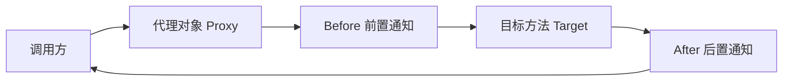

# Spring AOP

> 如果说 IOC 解决了"对象之间怎么协作"的问题，AOP 解决的就是"和业务无关的逻辑怎么处理"的问题。日志、事务、权限校验、性能监控——这些代码横切（cross-cut）所有业务模块，写在每个方法里就是灾难。AOP 把它们抽出来，集中管理。

## 基础入门：AOP 是什么？

### 为什么需要 AOP？

AOP（面向切面编程）解决的问题是：**和业务无关但又必须做的逻辑，怎么不污染业务代码？**

```java
// 没有 AOP：日志、事务、权限校验散布在每个方法里
public class UserService {
    public User getUser(Long id) {
        log.info("getUser start, id={}", id);   // 日志
        long start = System.currentTimeMillis();   // 性能监控
        checkPermission("user:read");             // 权限
        User user = userDao.findById(id);         // 真正的业务逻辑（只有这一行！）
        log.info("getUser end, cost={}ms", System.currentTimeMillis() - start);
        return user;
    }
    // 每个方法都重复这些非业务代码 → 维护噩梦
}
```

### AOP 的核心概念（大白话）

| 概念 | 大白话 | 代码对应 |
|------|--------|----------|
| 切面（Aspect） | 要横切的逻辑模块 | `@Aspect` 类 |
| 切点（Pointcut） | 哪些方法需要被拦截 | `@Pointcut("execution(* com.example..*(..))")` |
| 通知（Advice） | 拦截后做什么 | `@Before`、`@After`、`@Around` |
| 连接点（JoinPoint） | 被拦截的具体方法 | 方法执行时的某个点 |
| 织入（Weaving） | 把切面逻辑"织入"到目标方法 | Spring 运行时通过代理实现 |

### 第一个 AOP 示例

```java
// 1. 定义切面
@Aspect
@Component
public class LogAspect {

    // 前置通知：方法执行前
    @Before("execution(* com.example.service.*.*(..))")
    public void beforeLog(JoinPoint jp) {
        log.info("调用方法: {}", jp.getSignature().getName());
    }

    // 环绕通知：最强大，可以控制方法是否执行
    @Around("execution(* com.example.service.*.*(..))")
    public Object aroundLog(ProceedingJoinPoint pjp) throws Throwable {
        long start = System.currentTimeMillis();
        Object result = pjp.proceed();  // 执行目标方法
        long cost = System.currentTimeMillis() - start;
        log.info("{} 耗时 {}ms", pjp.getSignature().getName(), cost);
        return result;
    }
}
```

---

## 为什么需要 AOP？

```java
// 没有 AOP：每个方法里都散布着非业务代码
public class OrderService {
    public void createOrder(Order order) {
        log.info("创建订单开始");              // 日志
        long start = System.currentTimeMillis(); // 性能监控
        checkPermission();                     // 权限校验
        transaction.begin();                   // 事务管理

        // 真正的业务逻辑只有这一行
        orderDao.insert(order);

        transaction.commit();
        log.info("创建订单完成, 耗时: {}ms", System.currentTimeMillis() - start);
    }

    public void cancelOrder(Long orderId) {
        log.info("取消订单开始");
        long start = System.currentTimeMillis();
        checkPermission();
        transaction.begin();

        orderDao.updateStatus(orderId, "CANCELLED");

        transaction.commit();
        log.info("取消订单完成, 耗时: {}ms", System.currentTimeMillis() - start);
    }
}

// 有 AOP：业务方法只关心业务
@Service
public class OrderService {
    @Transactional
    @LogExecution
    @RequireRole("ADMIN")
    public void createOrder(Order order) {
        orderDao.insert(order);  // 只有业务逻辑
    }
}
// 日志、事务、权限 → 全部由切面处理，业务代码干干净净
```

## 核心概念——用大白话解释



| 术语 | 大白话 | 例子 |
|------|--------|------|
| Aspect（切面） | 一个包含横切逻辑的模块 | 日志切面、事务切面 |
| JoinPoint（连接点） | 程序执行中的某个点 | 方法调用、异常抛出 |
| Pointcut（切点） | 你想拦截哪些连接点 | 所有 Service 层的方法 |
| Advice（通知） | 拦截后你要做什么 | 打日志、开事务、记录耗时 |
| Target（目标） | 被拦截的对象 | OrderService |
| Weaving（织入） | 把切面逻辑"织"到目标对象中 | Spring 在运行时通过代理实现 |

## AOP 的底层——动态代理

Spring AOP 只支持**方法级别**的连接点（不像 AspectJ 支持字段、构造函数等），底层是**动态代理**：

### JDK 动态代理 vs CGLIB

```
JDK 动态代理：
  - 基于接口
  - 目标类必须实现接口
  - Proxy.newProxyInstance() 创建代理对象
  - 代理对象实现了和目标相同的接口

CGLIB：
  - 基于继承（生成目标类的子类）
  - 目标类不需要实现接口
  - 通过字节码技术生成子类
  - 不能代理 final 类和 final 方法
```

```java
// Spring Boot 2.x 默认用 CGLIB（proxyTargetClass=true）
// 如果目标实现了接口，Spring AOP 默认用 JDK 代理
// 可以强制使用 CGLIB：
@EnableAspectJAutoProxy(proxyTargetClass = true)

// Spring Boot 2.x 之后默认就是 CGLIB 了
```

::: warning 同类方法调用不触发切面
```java
@Service
public class UserService {
    public void methodA() {
        methodB();  // ❌ 不会触发 methodB 的切面！
    }

    @Transactional
    public void methodB() {
        // 这里的 @Transactional 不会生效
    }
}
// 原因：methodA() 中的 this 是目标对象本身，不是代理对象
// 切面逻辑在代理对象上，绕过了代理就不会触发
// 解决：注入自己（@Lazy），或用 AopContext.currentProxy()
```

## 五种通知类型

```java
@Aspect
@Component
public class LoggingAspect {

    // 1. 前置通知：方法执行前
    @Before("execution(* com.example.service.*.*(..))")
    public void before(JoinPoint jp) {
        log.info("调用: {}", jp.getSignature().getName());
    }

    // 2. 后置通知：方法执行后（无论成功还是异常）
    @After("execution(* com.example.service.*.*(..))")
    public void after(JoinPoint jp) {
        log.info("完成: {}", jp.getSignature().getName());
    }

    // 3. 返回通知：方法成功返回后
    @AfterReturning(
        pointcut = "execution(* com.example.service.*.*(..))",
        returning = "result"
    )
    public void afterReturning(JoinPoint jp, Object result) {
        log.info("返回: {} = {}", jp.getSignature().getName(), result);
    }

    // 4. 异常通知：方法抛出异常后
    @AfterThrowing(
        pointcut = "execution(* com.example.service.*.*(..))",
        throwing = "ex"
    )
    public void afterThrowing(JoinPoint jp, Exception ex) {
        log.error("异常: {} → {}", jp.getSignature().getName(), ex.getMessage());
    }

    // 5. 环绕通知：包围方法执行（最强大，可以控制是否执行、修改参数和返回值）
    @Around("execution(* com.example.service.*.*(..))")
    public Object around(ProceedingJoinPoint pjp) throws Throwable {
        String method = pjp.getSignature().getName();
        log.info(">>> 开始: {}", method);

        long start = System.currentTimeMillis();
        try {
            Object result = pjp.proceed();  // 执行目标方法
            long cost = System.currentTimeMillis() - start;
            log.info("<<< 完成: {}, 耗时: {}ms", method, cost);
            return result;
        } catch (Throwable e) {
            log.error("<<< 异常: {}", method, e.getMessage());
            throw e;  // 重新抛出
        }
    }
}
```

::: tip 环绕通知 vs 其他通知
环绕通知是唯一能控制目标方法是否执行、修改参数和返回值的通知。其他四种通知做不到。但环绕通知也要承担更多责任（必须调用 `pjp.proceed()`，必须处理异常）。能用简单通知解决的场景，不要用环绕通知。
:::

## 切点表达式——最常用的几种

```java
// 1. execution：匹配方法执行（最常用）
// 格式：execution(修饰符? 返回类型 包名.类名.方法名(参数类型) 异常?)

// 匹配 Service 层所有 public 方法
@Pointcut("execution(public * com.example.service..*.*(..))")

// 匹配所有 get 开头的方法
@Pointcut("execution(* com.example..*.get*(..))")

// 匹配所有带特定注解的方法
@Pointcut("@annotation(com.example.annotation.Loggable)")

// 匹配特定包下所有类
@Pointcut("within(com.example.service..*)")

// 组合切点
@Pointcut("execution(* com.example.service.*.*(..)) && " +
          "!execution(* com.example.service.internal.*.*(..))")
// 拦截 service 包下的方法，但排除 internal 子包
```

## 实战：自定义注解 + AOP

这是实际开发中最常见的用法——用注解标记需要特殊处理的方法：

```java
// 1. 定义注解
@Target(ElementType.METHOD)
@Retention(RetentionPolicy.RUNTIME)
public @interface RateLimit {
    int value() default 10;        // 每秒最多请求次数
    int timeout() default 1000;    // 等待超时（毫秒）
}

// 2. 切面处理
@Aspect
@Component
public class RateLimitAspect {
    private final Map<String, RateLimiter> limiters = new ConcurrentHashMap<>();

    @Around("@annotation(rateLimit)")
    public Object rateLimit(ProceedingJoinPoint pjp, RateLimit rateLimit) throws Throwable {
        String key = pjp.getSignature().toShortString();
        RateLimiter limiter = limiters.computeIfAbsent(key,
            k -> RateLimiter.create(rateLimit.value()));

        if (!limiter.tryAcquire(rateLimit.timeout(), TimeUnit.MILLISECONDS)) {
            throw new RuntimeException("请求过于频繁，请稍后再试");
        }
        return pjp.proceed();
    }
}

// 3. 使用——业务代码零侵入
@GetMapping("/api/data")
@RateLimit(value = 100, timeout = 500)
public Data getData() {
    return dataService.query();
}
```

## 面试高频题

**Q1：Spring AOP 和 AspectJ 的区别？**

Spring AOP 是运行时织入（通过动态代理），只支持方法级别的连接点，功能有限但简单。AspectJ 是编译时/类加载时织入（通过字节码修改），支持字段、构造函数、静态方法等所有连接点，功能强大但需要特殊的编译器和类加载器。Spring AOP 能满足 90% 的场景。

**Q2：@Transactional 失效的常见原因？**

1. 同类方法调用（this.methodB() 不走代理）；2. 方法不是 public；3. 异常被 catch 吞掉没有重新抛出；4. 抛出了非 RuntimeException（默认只回滚 RuntimeException 和 Error）；5. 数据库引擎不支持事务（如 MyISAM）。

## 延伸阅读

- 上一篇：[Spring IOC](ioc.md) — Bean 生命周期、循环依赖
- 下一篇：[Spring Boot](boot.md) — 自动配置、Starter 原理
- [并发编程](../java-basic/concurrency.md) — 线程安全、锁机制
