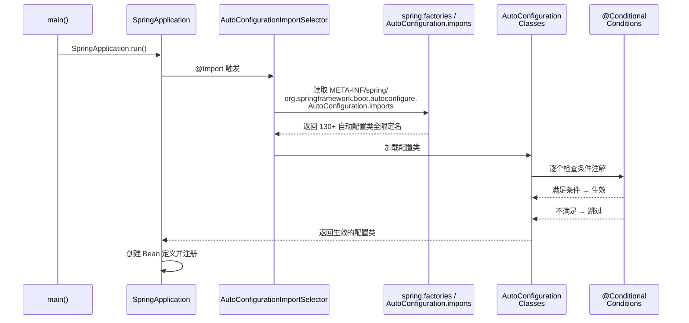
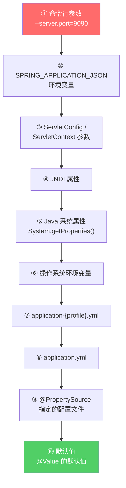
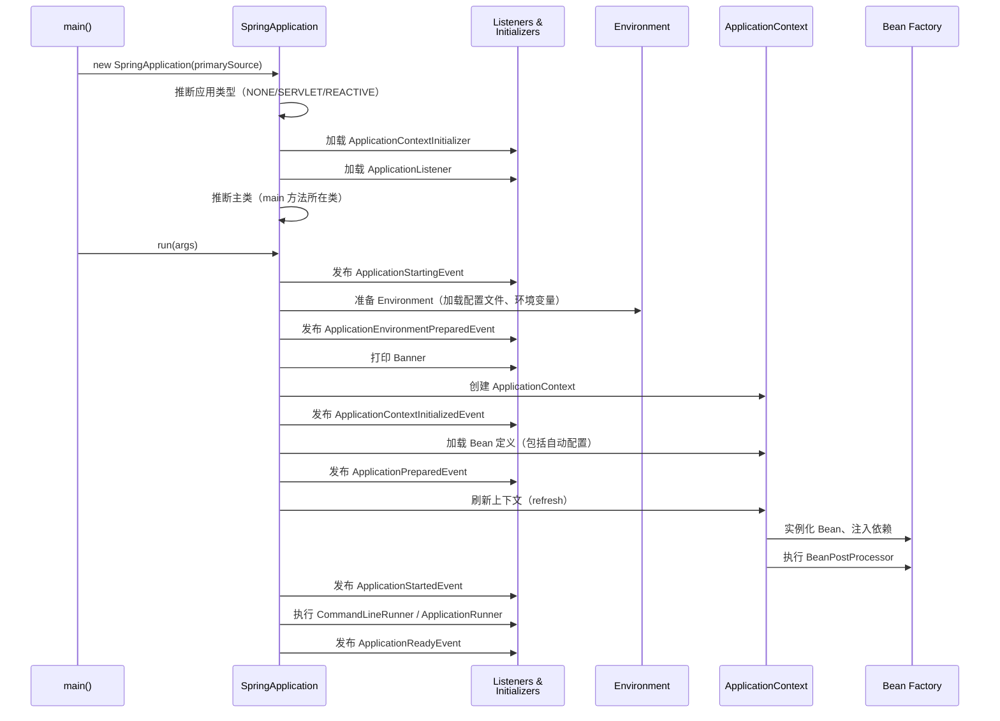

# Spring Boot

> Spring Boot 的本质不是什么新技术，而是一套"约定优于配置"的规范 + 自动配置机制 + Starter 依赖管理。它解决了传统 Spring 开发中最烦人的问题：写大量 XML 配置、依赖版本冲突、部署复杂。本文从基础入门到底层原理，全面解析 Spring Boot 的核心机制。

## 基础入门：Spring Boot 是什么？

### 为什么需要 Spring Boot？

```
传统 Spring 开发的痛点：
1. 大量 XML 配置（数据源、事务、MVC、AOP...）
2. 依赖版本冲突（Spring 4 + Hibernate 5 + Jackson 2.x 兼容性...）
3. 部署复杂（War 包 + Tomcat 配置 + JVM 参数...）
4. 每个项目都要重复配置一样的东西

Spring Boot 的解决方案：
1. 自动配置（Auto Configuration）：根据 classpath 自动配置 Bean
2. Starter 依赖：一个依赖搞定一组相关依赖（版本兼容性已处理好）
3. 内嵌容器：不需要外部 Tomcat，java -jar 直接运行
4. 配置简化：application.yml 替代 XML
```

### 核心特性一览

| 特性 | 传统 Spring | Spring Boot |
|------|-------------|-------------|
| 配置方式 | XML / Java Config | 自动配置 + application.yml |
| 依赖管理 | 手动指定版本 | Starter + Parent POM |
| Web 容器 | 外部部署 War | 内嵌 Tomcat/Jetty/Undertow |
| 应用启动 | 部署到服务器 | `java -jar` 直接运行 |
| 监控 | 自行集成 | Actuator 开箱即用 |
| 测试 | 手动配置上下文 | `@SpringBootTest` 一键搞定 |

### 第一个 Spring Boot 应用

```java
// 启动类（一个就够了）
@SpringBootApplication  // 自动配置 + 组件扫描
public class Application {
    public static void main(String[] args) {
        SpringApplication.run(Application.class, args);
    }
}

// application.yml（核心配置）
server:
  port: 8080

spring:
  datasource:
    url: jdbc:mysql://localhost:3306/mydb
    username: root
    password: root
  redis:
    host: localhost
    port: 6379

# 日志配置
logging:
  level:
    com.example: debug
```

### 常用 Starter

| Starter | 作用 |
|---------|------|
| `spring-boot-starter-web` | Spring MVC + 内嵌 Tomcat |
| `spring-boot-starter-data-jpa` | JPA + Hibernate |
| `spring-boot-starter-data-redis` | Redis 客户端 |
| `spring-boot-starter-security` | Spring Security |
| `spring-boot-starter-validation` | 参数校验（JSR 380） |
| `spring-boot-starter-test` | JUnit + Mockito + MockMvc |
| `spring-boot-starter-aop` | Spring AOP + AspectJ |
| `spring-boot-starter-actuator` | 生产级监控端点 |
| `spring-boot-starter-quartz` | Quartz 定时任务 |
| `spring-boot-starter-websocket` | WebSocket 支持 |

### 自定义启动 Banner

```text
// 在 src/main/resources/banner.txt 中自定义启动 Banner
// 也可以通过 spring.banner.location 指定路径

  ____            _              ____              _
 / ___| _ __  _ __(_)_ __   __ _ | __ )  ___   ___ | |_
| |  _ | '_ \| '__| | '_ \ / _` ||  _ \ / _ \ / _ \| __|
| |_| || |_) | |  | | | | | (_| || |_) | (_) | (_) | |_
 \____|| .__/|_|  |_|_| |_|\__, ||____/ \___/ \___/ \__|
       |_|                  |___/
  :: Spring Boot ::       (v3.2.0)
```

---

## 自动配置原理——Spring Boot 的核心

### `@SpringBootApplication` 做了什么？

```java
@SpringBootApplication 等价于三个注解的组合：

@SpringBootConfiguration     // 标记为配置类（@Configuration 的别名）
@EnableAutoConfiguration     // 启用自动配置 ← 核心
@ComponentScan               // 扫描当前包及子包下的组件
```

:::tip 为什么一个注解就够了？
`@SpringBootApplication` 是一个复合注解，把启动类需要的三个核心能力（配置、自动配置、组件扫描）整合在一起。你可以不用它，分别写 `@Configuration` + `@EnableAutoConfiguration` + `@ComponentScan`，效果完全一样。
:::

### 自动配置加载流程



### `@EnableAutoConfiguration` 的底层实现

```java
// @EnableAutoConfiguration 通过 @Import 导入了 AutoConfigurationImportSelector
@Import(AutoConfigurationImportSelector.class)
public @interface EnableAutoConfiguration {
    String[] excludeName() default {};
}

// AutoConfigurationImportSelector 的核心逻辑：
// 1. 调用 SpringFactoriesLoader（Spring Boot 2.x）
//    或 扫描 AutoConfiguration.imports 文件（Spring Boot 3.x）
// 2. 加载所有候选自动配置类
// 3. 通过 @ConditionalOnXxx 过滤
// 4. 返回最终生效的配置类列表
```

### Spring Boot 2.x vs 3.x 的自动配置注册方式

```
Spring Boot 2.x：
  META-INF/spring.factories 文件中配置：
  org.springframework.boot.autoconfigure.EnableAutoConfiguration=\
    com.example.MyAutoConfiguration,\
    com.example.AnotherAutoConfiguration

Spring Boot 3.x（推荐）：
  META-INF/spring/org.springframework.boot.autoconfigure.AutoConfiguration.imports 文件：
  com.example.MyAutoConfiguration
  com.example.AnotherAutoConfiguration

  :::: 为什么改了？
  Spring Boot 3.x 移除了 spring.factories 中的自动配置注册，
  改用专门的 .imports 文件，启动速度更快（不需要解析整个 spring.factories）
```

### 自动配置生效的条件

```java
// 以 RedisAutoConfiguration 为例：
@Configuration
@ConditionalOnClass(Redis.class)              // classpath 有 Redis 的类
@EnableConfigurationProperties(RedisProperties.class)
public class RedisAutoConfiguration {

    @Bean
    @ConditionalOnMissingBean(name = "redisTemplate")  // 容器中没有自定义的 redisTemplate
    public RedisTemplate<String, Object> redisTemplate(RedisConnectionFactory factory) {
        // 自动配置 RedisTemplate
    }
}
```

::: tip 自动配置的"让步"原则
Spring Boot 的自动配置永远"让步"于你的自定义配置。如果你定义了自己的 `redisTemplate` Bean（`@ConditionalOnMissingBean` 不满足），Spring Boot 就不会创建默认的。这就是"约定优于配置"——约定好的默认行为，你随时可以覆盖。
:::

### 排除不需要的自动配置

```java
// 方式1：注解排除
@SpringBootApplication(exclude = {DataSourceAutoConfiguration.class})

// 方式2：配置文件排除
spring.autoconfigure.exclude=\
  org.springframework.boot.autoconfigure.jdbc.DataSourceAutoConfiguration

// 方式3：属性排除（Spring Boot 3.x）
spring.autoconfigure.exclude[0]=org.springframework.boot.autoconfigure.jdbc.DataSourceAutoConfiguration

// 排查自动配置是否生效：启动时加 --debug
// 会在日志中打印每个自动配置类的匹配/未匹配原因
// Positive matches: 生效的配置
// Negative matches: 未生效的配置（及原因）
```

---

## 条件注解——@ConditionalOnXxx 家族

Spring Boot 提供了一系列 `@Conditional` 条件注解，是自动配置的核心驱动力。

### 常用条件注解

| 注解 | 作用 | 典型场景 |
|------|------|----------|
| `@ConditionalOnClass` | classpath 中存在指定类 | 检测 Redis 驱动是否存在 |
| `@ConditionalOnMissingClass` | classpath 中不存在指定类 | 排除冲突的库 |
| `@ConditionalOnBean` | 容器中存在指定 Bean | 检测用户是否自定义了 Bean |
| `@ConditionalOnMissingBean` | 容器中不存在指定 Bean | 自动配置的"让步" |
| `@ConditionalOnProperty` | 配置属性满足条件 | `spring.redis.enabled=true` |
| `@ConditionalOnWebApplication` | 当前是 Web 应用 | Web 相关配置 |
| `@ConditionalOnNotWebApplication` | 当前不是 Web 应用 | 非Web 场景配置 |
| `@ConditionalOnExpression` | SpEL 表达式为 true | 复杂条件判断 |

### 条件注解实战

```java
@Configuration
public class CacheAutoConfiguration {

    // 当 classpath 有 Redis 且配置了 spring.cache.type=redis 时生效
    @Bean
    @ConditionalOnClass(Redis.class)
    @ConditionalOnProperty(name = "spring.cache.type", havingValue = "redis")
    public CacheManager redisCacheManager(RedisConnectionFactory factory) {
        RedisCacheConfiguration config = RedisCacheConfiguration.defaultCacheConfig()
            .entryTtl(Duration.ofMinutes(30))
            .serializeValuesWith(RedisSerializationContext.SerializationPair
                .fromSerializer(new GenericJackson2JsonRedisSerializer()));
        return RedisCacheManager.builder(factory).cacheDefaults(config).build();
    }

    // 当容器中没有自定义 CacheManager 时，使用 Caffeine 本地缓存
    @Bean
    @ConditionalOnMissingBean(CacheManager.class)
    @ConditionalOnProperty(name = "spring.cache.type", havingValue = "caffeine", matchIfMissing = true)
    public CacheManager caffeineCacheManager() {
        CaffeineCacheManager manager = new CaffeineCacheManager();
        manager.setCaffeine(Caffeine.newBuilder()
            .expireAfterWrite(10, TimeUnit.MINUTES)
            .maximumSize(1000));
        return manager;
    }
}
```

:::warning 条件注解的执行顺序
条件注解的判断发生在配置类处理阶段，早于 Bean 的实例化。如果两个条件注解互相依赖，可能会导致鸡生蛋的问题。通常的解决方案是使用 `@AutoConfigureBefore` 和 `@AutoConfigureAfter` 控制配置类的加载顺序。
:::

---

## Starter 机制——依赖管理的艺术

### Starter 的本质

```
一个 Starter = 一组依赖 + 自动配置

例如 spring-boot-starter-web 包含：
├── spring-boot-starter（核心 Starter）
│   ├── spring-boot（核心库）
│   ├── spring-boot-autoconfigure（自动配置）
│   └── spring-boot-starter-logging（日志 Starter）
├── spring-webmvc（Spring MVC）
├── spring-web（Spring Web）
├── tomcat-embed-core（内嵌 Tomcat）
├── jackson-databind（JSON 序列化）
└── 其他相关依赖
```

### 自定义 Starter 开发实战

:::tip Starter 命名规范
- 官方 Starter：`spring-boot-starter-xxx`
- 第三方 Starter：`xxx-spring-boot-starter`

Spring Boot 官方建议第三方 Starter 以自己的项目名为前缀，避免和官方 Starter 冲突。
:::

**Step 1：创建自动配置模块**

```java
// 1. 配置属性类
@ConfigurationProperties(prefix = "sms.aliyun")
public class SmsProperties {
    private String accessKeyId;
    private String accessKeySecret;
    private String signName;
    private String templateCode;
    private boolean enabled = true;
    // getter/setter ...
}

// 2. 服务类
public class SmsService {
    private final SmsProperties properties;

    public SmsService(SmsProperties properties) {
        this.properties = properties;
    }

    public void sendSms(String phone, String code) {
        if (!properties.isEnabled()) {
            return;
        }
        // 调用阿里云短信 API
        System.out.println("Sending SMS to " + phone + " with sign: " + properties.getSignName());
    }
}

// 3. 自动配置类
@ConditionalOnClass(SmsService.class)
@ConditionalOnProperty(prefix = "sms.aliyun", name = "enabled", havingValue = "true", matchIfMissing = true)
@EnableConfigurationProperties(SmsProperties.class)
public class SmsAutoConfiguration {

    @Bean
    @ConditionalOnMissingBean
    public SmsService smsService(SmsProperties properties) {
        return new SmsService(properties);
    }
}
```

**Step 2：注册自动配置**

```
# Spring Boot 3.x
# 文件：META-INF/spring/org.springframework.boot.autoconfigure.AutoConfiguration.imports
com.example.sms.autoconfigure.SmsAutoConfiguration

# Spring Boot 2.x
# 文件：META-INF/spring.factories
# org.springframework.boot.autoconfigure.EnableAutoConfiguration=\
#   com.example.sms.autoconfigure.SmsAutoConfiguration
```

**Step 3：创建 Starter 模块（只做依赖管理）**

```xml
<!-- sms-aliyun-spring-boot-starter/pom.xml -->
<project>
    <groupId>com.example</groupId>
    <artifactId>sms-aliyun-spring-boot-starter</artifactId>
    <version>1.0.0</version>

    <dependencies>
        <!-- 引入自动配置模块 -->
        <dependency>
            <groupId>com.example</groupId>
            <artifactId>sms-aliyun-spring-boot-autoconfigure</artifactId>
            <version>1.0.0</version>
        </dependency>
        <!-- 阿里云 SMS SDK -->
        <dependency>
            <groupId>com.aliyun</groupId>
            <artifactId>dysmsapi20170525</artifactId>
            <version>2.0.24</version>
        </dependency>
    </dependencies>
</project>
```

**Step 4：使用 Starter**

```xml
<!-- 业务项目只需要引入 Starter -->
<dependency>
    <groupId>com.example</groupId>
    <artifactId>sms-aliyun-spring-boot-starter</artifactId>
    <version>1.0.0</version>
</dependency>
```

```yaml
# application.yml
sms:
  aliyun:
    access-key-id: your-key-id
    access-key-secret: your-key-secret
    sign-name: 你的签名
    template-code: SMS_123456
    enabled: true
```

```java
// 直接注入使用，零配置
@Service
public class UserService {
    @Autowired
    private SmsService smsService;

    public void register(String phone) {
        // ... 注册逻辑
        smsService.sendSms(phone, "123456");
    }
}
```

---

## 配置管理——从加载到绑定

### 配置加载顺序（从高到低）



::: warning 配置陷阱
`application-dev.yml` 中的配置会覆盖 `application.yml` 中的同名配置，不是合并。如果某个配置在 `application.yml` 中设置了但没有在 `application-dev.yml` 中设置，则使用 `application.yml` 的值。这个行为很直观，但很容易忘记哪个 profile 里配了什么。
:::

### Profile 与多环境配置

```yaml
# application.yml（公共配置）
server:
  port: 8080

spring:
  profiles:
    active: dev  # 激活 dev 环境

---
# application-dev.yml（开发环境）
spring:
  datasource:
    url: jdbc:mysql://localhost:3306/mydb_dev
    username: root
    password: root
  redis:
    host: localhost

---
# application-prod.yml（生产环境）
spring:
  datasource:
    url: jdbc:mysql://prod-db.internal:3306/mydb_prod
    username: ${DB_USERNAME}  # 从环境变量读取
    password: ${DB_PASSWORD}
  redis:
    host: redis-cluster.internal
```

```java
// 方式1：注解激活
@Profile("prod")
@Configuration
public class ProdDataSourceConfig {
    @Bean
    public DataSource dataSource() {
        // 生产环境数据源
    }
}

// 方式2：命令行激活
// java -jar app.jar --spring.profiles.active=prod

// 方式3：环境变量激活
// export SPRING_PROFILES_ACTIVE=prod

// 方式4：@Profile 支持复杂表达式
@Profile("!dev & (prod | staging)")  // 非dev 且 (prod或staging)
@Configuration
public class ProductionConfig {
}
```

### 配置绑定

```java
// 方式1：@Value（适合少量配置）
@Value("${app.name:default-name}")
private String appName;

@Value("${app.max-connections:${JAVA_MAX_CONN:10}}")  // 支持嵌套默认值
private int maxConnections;

// 方式2：@ConfigurationProperties（适合批量配置，推荐）
@ConfigurationProperties(prefix = "app.mail")
@Component
@Data
public class MailProperties {
    private String host;
    private int port = 587;
    private String username;
    private String password;
    private boolean sslEnabled = true;
    private Duration timeout = Duration.ofSeconds(30);  // 支持 Duration 类型
    private List<String> recipients;  // 支持 List
    private Map<String, String> headers;  // 支持 Map
}

// yml 中：
// app:
//   mail:
//     host: smtp.gmail.com
//     username: xxx@gmail.com
//     timeout: 60s
//     recipients:
//       - user1@example.com
//       - user2@example.com
//     headers:
//       X-Custom-Header: value
```

:::tip @ConfigurationProperties vs @Value
- `@ConfigurationProperties`：支持松绑定（`max-connections`、`maxConnections`、`MAX_CONNECTIONS` 都能匹配）、JSR-303 校验（`@Validated`）、批量绑定。**推荐用于配置类**。
- `@Value`：适合单个属性注入、SpEL 表达式。**适合少量、零散的配置**。
:::

### 配置校验

```java
@ConfigurationProperties(prefix = "app.mail")
@Validated
@Data
public class MailProperties {
    @NotBlank(message = "邮件服务器地址不能为空")
    private String host;

    @Min(value = 1, message = "端口最小为 1")
    @Max(value = 65535, message = "端口最大为 65535")
    private int port = 587;

    @Email(message = "邮箱格式不正确")
    private String username;

    @Pattern(regexp = "^(true|false)$", message = "sslEnabled 必须是 true 或 false")
    private String sslEnabled;
}
```

### bootstrap.yml 与 application.yml

```
bootstrap.yml：由 Spring Cloud 使用，在 application.yml 之前加载
  - 用于配置配置中心（Nacos、Apollo、Consul）
  - 用于配置应用名称（spring.application.name）
  - 在引导阶段（Bootstrap Phase）加载，优先级高于 application.yml

application.yml：应用配置，在应用阶段（Application Phase）加载
  - 普通的业务配置
  - 数据源、Redis、线程池等

注意：Spring Boot 2.4+ 引入了 spring.config.import，
如果只用 Spring Boot（不使用 Spring Cloud），不需要 bootstrap.yml。
```

---

## Actuator——生产级监控

### 端点概览

| 端点 | 作用 | 默认是否暴露 |
|------|------|-------------|
| `/actuator/health` | 健康检查 | ✅ |
| `/actuator/info` | 应用信息 | ✅ |
| `/actuator/metrics` | 指标数据 | ❌ |
| `/actuator/env` | 环境变量 | ❌ |
| `/actuator/beans` | 所有 Bean 定义 | ❌ |
| `/actuator/loggers` | 日志级别管理 | ❌ |
| `/actuator/threaddump` | 线程转储 | ❌ |
| `/actuator/heapdump` | 堆转储文件下载 | ❌ |
| `/actuator/mappings` | 所有请求映射 | ❌ |
| `/actuator/scheduledtasks` | 定时任务列表 | ❌ |
| `/actuator/configprops` | 配置属性 | ❌ |

### 配置 Actuator

```yaml
management:
  endpoints:
    web:
      exposure:
        include: health,info,metrics,env  # 暴露哪些端点
        # include: "*"  # 暴露所有（生产环境不要这样做！）
      base-path: /actuator  # 端点基路径
  endpoint:
    health:
      show-details: always  # 显示详细健康信息
      show-components: always  # 显示组件级别信息
    info:
      enabled: true
  info:
    env:
      enabled: true  # 暴露 info 中的环境信息
  health:
    db:
      enabled: true  # 检查数据库连接
    redis:
      enabled: true  # 检查 Redis 连接
    diskspace:
      enabled: true
      threshold: 10MB  # 磁盘空间阈值
```

### 自定义 Health Indicator

```java
@Component
public class ExternalApiHealthIndicator implements HealthIndicator {

    @Autowired
    private ExternalApiClient apiClient;

    @Override
    public Health health() {
        try {
            apiClient.ping();
            return Health.up()
                .withDetail("responseTime", "50ms")
                .withDetail("version", "2.1.0")
                .build();
        } catch (Exception e) {
            return Health.down()
                .withException(e)
                .withDetail("error", e.getMessage())
                .build();
        }
    }
}

// 访问 /actuator/health 返回：
// {
//   "status": "UP",
//   "components": {
//     "externalApi": {
//       "status": "UP",
//       "details": {
//         "responseTime": "50ms",
//         "version": "2.1.0"
//       }
//     }
//   }
// }
```

### 自定义 Metrics

```java
@Component
public class OrderService {

    private final Counter orderCounter;
    private final Timer orderTimer;
    private final AtomicLong orderAmount;

    public OrderService(MeterRegistry registry) {
        this.orderCounter = Counter.builder("orders.created")
            .description("Number of orders created")
            .tag("service", "order")
            .register(registry);

        this.orderTimer = Timer.builder("orders.processing.time")
            .description("Order processing time")
            .publishPercentiles(0.5, 0.95, 0.99)  // P50, P95, P99
            .register(registry);

        this.orderAmount = registry.gauge("orders.amount.current", new AtomicLong(0));
    }

    public void createOrder(Order order) {
        orderTimer.record(() -> {
            // 处理订单
            orderCounter.increment();
            orderAmount.set(order.getAmount());
        });
    }
}
```

::: danger 生产环境不要暴露所有端点
`/actuator/env` 会暴露所有环境变量（包括数据库密码等敏感信息）。生产环境只暴露必要的端点，敏感端点需要认证。`/actuator/beans` 暴露所有 Bean 定义，也可能存在安全风险。`/actuator/heapdump` 会下载整个堆转储文件，可能被用来获取内存中的敏感数据。
:::

---

## Spring Boot 启动流程

### 启动流程详解



### SpringApplicationRunListener 事件

| 事件 | 触发时机 | 典型用途 |
|------|----------|----------|
| `ApplicationStartingEvent` | run 方法开始 | 初始化日志系统 |
| `ApplicationEnvironmentPreparedEvent` | Environment 准备完成 | 修改配置源 |
| `ApplicationContextInitializedEvent` | Context 创建完成，Bean 未加载 | 注册额外 Bean 定义 |
| `ApplicationPreparedEvent` | Bean 定义加载完成 | 修改 Bean 定义 |
| `ApplicationStartedEvent` | Context 刷新完成 | 启动后检查 |
| `ApplicationReadyEvent` | 所有初始化完成 | 启动通知 |
| `ApplicationFailedEvent` | 启动失败 | 错误报告 |

### CommandLineRunner 与 ApplicationRunner

```java
// 方式1：CommandLineRunner
@Component
@Order(1)  // 执行顺序
public class StartupRunner implements CommandLineRunner {
    @Override
    public void run(String... args) throws Exception {
        System.out.println("Application started with args: " + Arrays.toString(args));
        // 初始化缓存、预热数据等
    }
}

// 方式2：ApplicationRunner（参数更结构化）
@Component
@Order(2)
public class StartupApplicationRunner implements ApplicationRunner {
    @Override
    public void run(ApplicationArguments args) throws Exception {
        // args.getOptionNames() -- 获取选项名
        // args.getOptionValues("name") -- 获取选项值
        // args.getNonOptionArgs() -- 获取非选项参数
        if (args.containsOption("init-data")) {
            // 执行数据初始化
        }
    }
}
```

---

## 打包与部署

### Fat JAR 原理

```
spring-boot-maven-plugin 打包后的 JAR 结构：

app.jar
├── BOOT-INF/
│   ├── classes/          # 你的代码（编译后的 class 文件）
│   └── lib/              # 所有依赖 JAR
├── META-INF/
│   └── MANIFEST.MF
│       Main-Class: org.springframework.boot.loader.launch.JarLauncher
│       Start-Class: com.example.Application
└── org/springframework/boot/loader/  # Spring Boot Loader
```

```xml
<!-- pom.xml 中的打包插件 -->
<build>
    <plugins>
        <plugin>
            <groupId>org.springframework.boot</groupId>
            <artifactId>spring-boot-maven-plugin</artifactId>
            <configuration>
                <excludes>
                    <exclude>
                        <groupId>org.projectlombok</groupId>
                        <artifactId>lombok</artifactId>
                    </exclude>
                </excludes>
            </configuration>
        </plugin>
    </plugins>
</build>
```

### 多环境部署

```bash
# 开发环境
java -jar app.jar --spring.profiles.active=dev

# 测试环境
java -jar app.jar \
  --spring.profiles.active=staging \
  --server.port=8081 \
  -Xms512m -Xmx512m

# 生产环境（推荐外部化配置）
java -jar app.jar \
  --spring.config.location=/etc/app/application.yml \
  --spring.profiles.active=prod \
  -Xms2g -Xmx2g \
  -XX:+UseG1GC \
  -XX:+HeapDumpOnOutOfMemoryError
```

---

## Spring Boot 3.x 新特性

### Java 17 基线

```
Spring Boot 3.0 最低要求 Java 17
  - Java 17 是 LTS 版本，长期支持
  - 支持 Records、Sealed Classes、Pattern Matching、Switch 表达式等新特性

迁移注意：
  - javax.* → jakarta.*（命名空间变更，因为 Jakarta EE 9+）
  - Spring Security 配置方式变化
  - 部分第三方库需要升级到兼容版本
```

### GraalVM Native Image

```xml
<!-- 引入 Native 支持 -->
<plugin>
    <groupId>org.springframework.boot</groupId>
    <artifactId>spring-boot-maven-plugin</artifactId>
    <configuration>
        <image>
            <builder>paketobuildpacks/builder-jammy-base:latest</builder>
            <name>docker.io/example/myapp</name>
        </image>
    </configuration>
</plugin>
```

```bash
# 构建 Native Image
mvn spring-boot:build-image -Pnative

# 或者使用 GraalVM 直接构建
mvn -Pnative native:compile

# 运行（启动时间从秒级降到毫秒级）
./myapp
```

:::tip Native Image 的优势与代价
- **优势**：启动时间从 2-5 秒降到 50-100 毫秒，内存占用从 200MB+ 降到 30-50MB，适合 Serverless
- **代价**：构建时间长（几分钟），不支持所有 Java 特性（反射需要配置 hint），不能动态加载类
:::

### Observability（可观测性）

```java
// Spring Boot 3.x 内置 Micrometer Observation API
// 统一了指标（Metrics）、链路追踪（Tracing）、日志（Logging）

@Component
public class OrderService {

    private final ObservationRegistry observationRegistry;

    public OrderService(ObservationRegistry observationRegistry) {
        this.observationRegistry = observationRegistry;
    }

    public Order createOrder(CreateOrderRequest request) {
        return Observation.createNotStarted("order.create", observationRegistry)
            .lowCardinalityKeyValue("channel", request.getChannel())
            .highCardinalityKeyValue("orderId", request.getOrderId())
            .observe(() -> {
                // 业务逻辑
                return processOrder(request);
            });
    }
}
```

```yaml
# management:
#   tracing:
#     sampling:
#       probability: 1.0  # 采样率
#   endpoints:
#     web:
//       exposure:
//         include: health,info,metrics,prometheus
```

### 虚拟线程（Virtual Threads）

```java
// Spring Boot 3.2+ 支持虚拟线程（Project Loom）
// 开启虚拟线程（只需一行配置！）

// application.yml
// spring:
//   threads:
//     virtual:
//       enabled: true

// 效果：
// - 每个 HTTP 请求使用一个虚拟线程（不再是平台线程）
// - 虚拟线程非常轻量（内存占用约 1KB vs 平台线程 1MB）
// - 可以轻松支撑 10 万+ 并发请求
// - 阻塞操作不再浪费平台线程资源
// - 代码无需任何修改，对业务完全透明
```

:::warning 虚拟线程的注意事项
虚拟线程不适合持有锁的长时间计算任务（`synchronized` 会导致 carrier thread 被钉住）。推荐使用 `ReentrantLock` 替代 `synchronized`。JDK 21+ 才支持虚拟线程。
:::

---

## 常见问题与最佳实践

### 循环依赖

```java
// Spring Boot 默认禁止循环依赖（Spring Boot 2.6+）
// 如果遇到循环依赖错误：

// 方案1：重构设计（推荐）
// 提取公共逻辑到第三个类

// 方案2：延迟注入
@Service
public class ServiceA {
    @Lazy
    @Autowired
    private ServiceB serviceB;
}

// 方案3：允许循环依赖（不推荐）
// spring.main.allow-circular-references=true
```

### 热部署

```xml
<!-- devtools：开发时热部署 -->
<dependency>
    <groupId>org.springframework.boot</groupId>
    <artifactId>spring-boot-devtools</artifactId>
    <scope>runtime</scope>
    <optional>true</optional>
</dependency>
```

```yaml
# devtools 配置
spring:
  devtools:
    restart:
      enabled: true
      additional-paths: src/main/java
      exclude: static/**,public/**
    livereload:
      enabled: true  # 浏览器自动刷新
```

:::warning devtools 仅用于开发环境
`spring-boot-devtools` 会自动在生产环境中禁用（通过 JAR 打包时会被排除）。不要试图在生产环境中使用热部署。
:::

### 测试最佳实践

```java
// 单元测试
@SpringBootTest
@AutoConfigureMockMvc
class UserControllerTest {

    @Autowired
    private MockMvc mockMvc;

    @Autowired
    private ObjectMapper objectMapper;

    @MockBean
    private UserService userService;

    @Test
    void getUser_shouldReturnUser() throws Exception {
        when(userService.findById(1L)).thenReturn(new User(1L, "Alice"));

        mockMvc.perform(get("/api/users/1"))
            .andExpect(status().isOk())
            .andExpect(jsonPath("$.name").value("Alice"));
    }

    @Test
    @WithMockUser(roles = "ADMIN")
    void deleteUser_asAdmin_shouldReturnNoContent() throws Exception {
        mockMvc.perform(delete("/api/users/1"))
            .andExpect(status().isNoContent());
    }
}

// 切片测试（只加载部分上下文，更快）
@WebMvcTest(UserController.class)
class UserControllerSliceTest {

    @Autowired
    private MockMvc mockMvc;

    @MockBean
    private UserService userService;

    @Test
    void listUsers_shouldReturnList() throws Exception {
        mockMvc.perform(get("/api/users"))
            .andExpect(status().isOk());
    }
}
```

---

## 面试高频题

**Q1：Spring Boot 的启动流程？**

1. 创建 `SpringApplication` 对象（推断应用类型、加载初始化器和监听器）；2. 执行 `run()` 方法：准备 Environment → 打印 Banner → 创建 ApplicationContext → 加载 Bean 定义（包括自动配置）→ 刷新上下文（实例化 Bean、注入依赖、执行 BeanPostProcessor）→ 发布启动完成事件。

**Q2：Spring Boot 打包为什么能直接运行？**

`spring-boot-maven-plugin` 把所有依赖打包到一个 FAT JAR 中，同时在 `META-INF/MANIFEST.MF` 中指定了 `Main-Class` 和 `Start-Class`。`JarLauncher` 从内嵌的 `BOOT-INF/lib/` 中加载依赖，然后调用你的主类的 `main` 方法。

**Q3：自动配置的原理？**

`@EnableAutoConfiguration` 通过 `@Import(AutoConfigurationImportSelector.class)` 导入自动配置选择器。选择器从 `META-INF/spring/org.springframework.boot.autoconfigure.AutoConfiguration.imports`（Spring Boot 3.x）或 `spring.factories`（Spring Boot 2.x）中加载所有候选配置类，然后通过 `@ConditionalOnXxx` 条件注解过滤，最终只注册满足条件的配置类。

**Q4：如何自定义 Starter？**

1. 创建 autoconfigure 模块：定义 `@ConfigurationProperties` 属性类 + 核心服务类 + `@AutoConfiguration` 配置类；2. 在 `META-INF/spring/org.springframework.boot.autoconfigure.AutoConfiguration.imports` 中注册；3. 创建 starter 模块：引入 autoconfigure 模块 + 相关依赖；4. 业务项目引入 starter 即可使用。

**Q5：Spring Boot 3.x 有哪些重要变化？**

- 最低 Java 17，支持 Records、Sealed Classes 等新特性
- `javax.*` → `jakarta.*` 命名空间变更
- 原生支持 GraalVM Native Image
- 内置 Micrometer Observation API（统一可观测性）
- Spring Boot 3.2+ 支持虚拟线程
- AOT（Ahead-Of-Time）编译优化

## 延伸阅读

- 上一篇：[Spring AOP](aop.md) — 切面编程、代理机制
- 下一篇：[Spring MVC](mvc.md) — RESTful API、参数校验
- [Spring Cloud](cloud.md) — 微服务架构、服务治理
