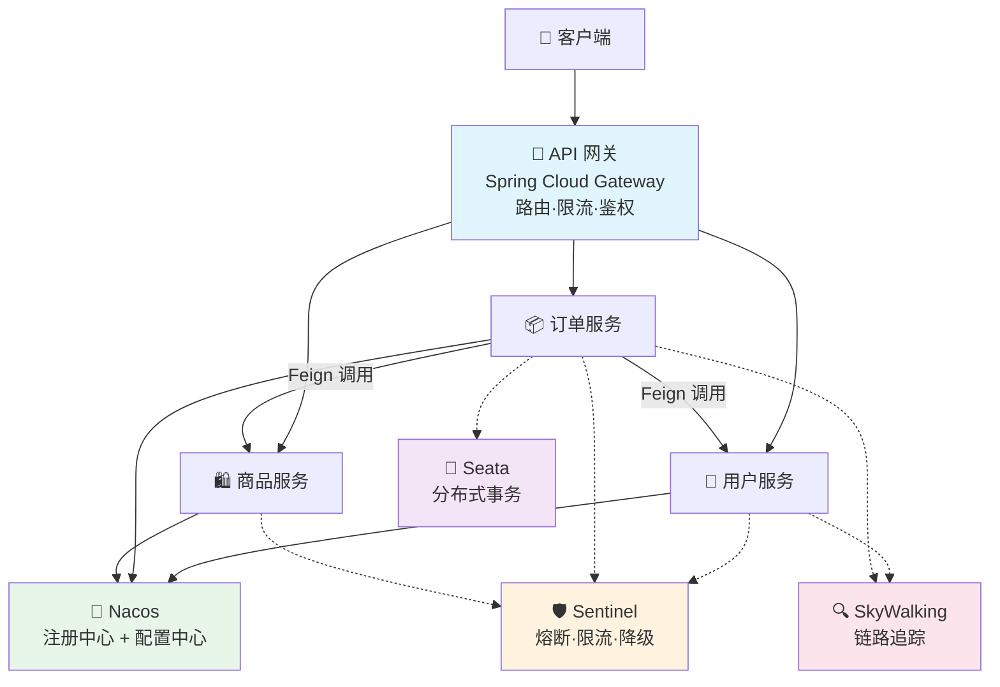
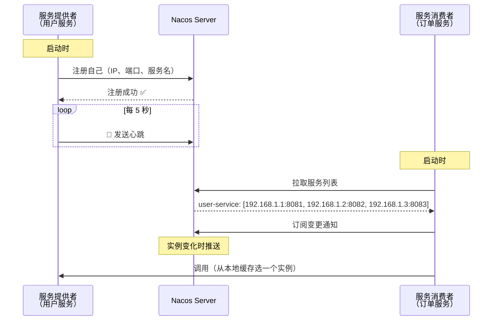
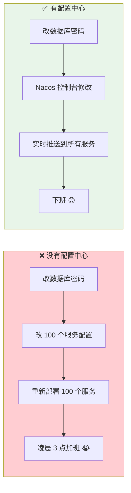
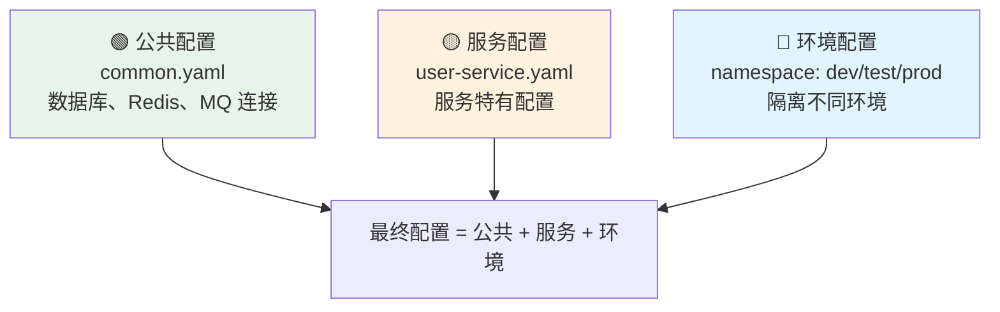
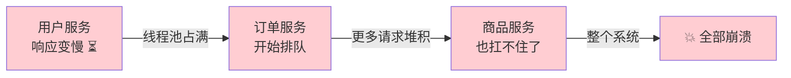
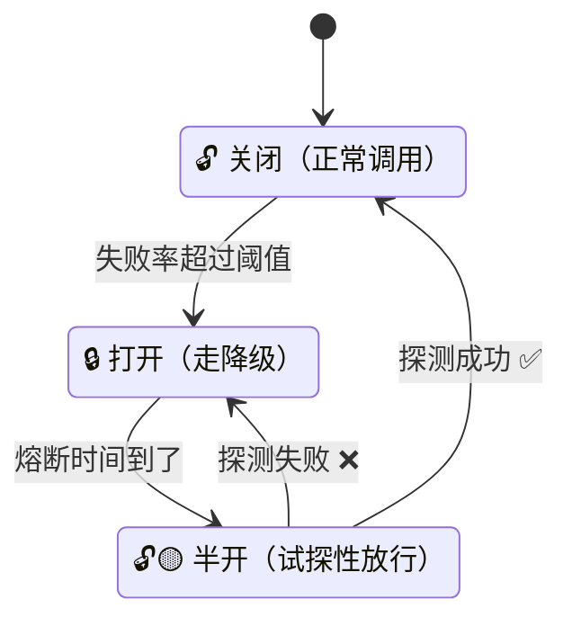
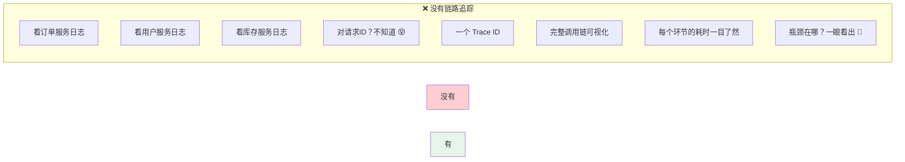

# Spring Cloud

> 微服务不是银弹——拆分后分布式问题的复杂度远超单体。服务怎么发现？配置怎么统一？调用链路怎么追踪？一个服务挂了会不会拖垮整个系统？Spring Cloud 提供了一套完整的解决方案，但更重要的是理解每个组件解决什么问题、什么时候该用。

## 基础入门：微服务为什么需要 Spring Cloud？

### 单体 vs 微服务——拆还是不拆？

| 维度 | 🏢 单体应用 | 🧩 微服务 |
|------|-----------|----------|
| 开发 | 简单，一个项目搞定 | 需要协调多个团队 |
| 部署 | 改一行代码就要全量发布 | 独立部署，互不影响 |
| 扩展 | 只能整体扩展 | 按需扩缩单个服务 |
| 技术栈 | 统一 | 每个服务可以选不同的 |
| 运维 | 简单 | **分布式复杂性爆炸** 💥 |

微服务拆分后，原来一个进程内的方法调用变成了跨网络的远程调用。这带来了一个全新的问题集：**服务怎么找到彼此？配置怎么统一管理？一个服务挂了会不会引发连锁反应？**

### Spring Cloud 核心组件全家福



---

## 服务注册与发现——Nacos

### 为什么需要注册中心？

```java
// 单体时代：地址写死
String userUrl = "http://localhost:8081/api/users";

// 微服务时代：用户服务有 3 个实例（8081、8082、8083）
// 谁挂了？新加的在哪？手动维护？不可能的
// → 注册中心自动管理：启动时注册，消费者自动发现
```

### Nacos 工作原理



::: tip Nacos 的两种实例模式
- **临时实例**（默认）：心跳机制，超过 15 秒没心跳标记为不健康，30 秒踢出。适合普通微服务。
- **永久实例**：不踢出，Nacos 主动探测健康状态。适合数据库、Redis 等基础设施。
:::

### OpenFeign——像调本地方法一样调远程服务

```java
// 声明式 HTTP 客户端——定义一个接口就够了
@FeignClient(
    name = "user-service",
    path = "/api/users",
    fallbackFactory = UserClientFallbackFactory.class  // 降级工厂
)
public interface UserClient {
    @GetMapping("/{id}")
    Result<User> getById(@PathVariable("id") Long id);

    @PostMapping
    Result<User> create(@RequestBody User user);
}

// 使用——像调本地方法一样
@Service
public class OrderService {
    @Autowired
    private UserClient userClient;  // 注入 Feign 客户端

    public OrderDTO getOrder(Long orderId) {
        Order order = orderMapper.selectById(orderId);
        User user = userClient.getById(order.getUserId()).getData();  // 远程调用
        return OrderDTO.builder().order(order).user(user).build();
    }
}
```

### Feign 超时与降级

```yaml
# 超时配置
feign:
  client:
    config:
      default:
        connectTimeout: 5000     # 连接超时 5 秒
        readTimeout: 10000       # 读取超时 10 秒
      user-service:              # 单个服务单独配置
        readTimeout: 5000
```

```java
// 降级工厂——远程调用失败时走兜底逻辑
@Component
public class UserClientFallbackFactory implements FallbackFactory<UserClient> {
    @Override
    public UserClient create(Throwable cause) {
        return new UserClient() {
            @Override
            public Result<User> getById(Long id) {
                log.warn("用户服务不可用，降级处理: {}", cause.getMessage());
                return Result.fail("用户服务暂不可用，请稍后重试");
            }
            // ... 其他方法
        };
    }
}
```

::: warning Feign 重试的陷阱
Feign 默认会重试，但**非幂等的写操作（POST/PUT）重试可能导致重复创建/更新**。建议写操作关闭重试，或确保接口幂等。
:::

---

## 配置中心——Nacos Config

### 痛点：100 个服务的配置谁来管？



### 配置分层管理



::: danger 敏感信息不要明文！
密码、密钥等敏感信息不要写在配置中心。用 Nacos 配置加密、KMS 密钥管理服务，或通过环境变量注入（`${DB_PASSWORD}`）。
:::

---

## API 网关——Spring Cloud Gateway

网关是所有请求的**统一入口**，就像一栋大楼的前台——先登记、安检，再引导你去对应的办公室。

### 网关的核心职责

| 职责 | 说明 | 价值 |
|------|------|------|
| 🛣️ 路由 | 根据路径转发到对应服务 | 统一入口 |
| ⚖️ 负载均衡 | 多实例间分配流量 | 高可用 |
| 🚦 限流 | 防止下游被压垮 | 保护系统 |
| 🔐 鉴权 | 统一 Token 校验 | 业务服务不用重复做 |
| 🧪 灰度发布 | 部分流量到新版本 | 安全上线 |
| 📝 日志 | 统一记录请求日志 | 排查问题 |

### 路由配置

```yaml
spring:
  cloud:
    gateway:
      routes:
        - id: user-service
          uri: lb://user-service          # lb:// = 负载均衡
          predicates:
            - Path=/api/users/**
          filters:
            - StripPrefix=1              # 去掉 /api 前缀

        - id: order-service
          uri: lb://order-service
          predicates:
            - Path=/api/orders/**
            - Method=GET,POST
          filters:
            - StripPrefix=1
            - AddRequestHeader=X-Source, gateway

        # 🧪 灰度发布：带特定 Header 的请求走 v2
        - id: order-service-v2
          uri: lb://order-service
          predicates:
            - Path=/api/orders/**
            - Header=Gray-Version, v2
```

### 全局鉴权过滤器

```java
@Component
public class AuthGlobalFilter implements GlobalFilter, Ordered {

    @Override
    public Mono<Void> filter(ServerWebExchange exchange, GatewayFilterChain chain) {
        String path = exchange.getRequest().getPath().value();

        // 白名单（登录、注册等不需要鉴权的路径）
        if (isWhitelisted(path)) {
            return chain.filter(exchange);
        }

        // 校验 Token
        String token = exchange.getRequest().getHeaders().getFirst("Authorization");
        if (token == null || !token.startsWith("Bearer ")) {
            exchange.getResponse().setStatusCode(HttpStatus.UNAUTHORIZED);
            return exchange.getResponse().setComplete();
        }

        // 解析 Token，将用户信息传递给下游服务
        Claims claims = Jwts.parser().setSigningKey(secret).parseClaimsJws(token.substring(7)).getBody();
        ServerHttpRequest request = exchange.getRequest().mutate()
            .header("X-User-Id", claims.getSubject())
            .build();
        return chain.filter(exchange.mutate().request(request).build());
    }

    @Override
    public int getOrder() { return -1; }  // 最高优先级
}
```

---

## 熔断降级——Sentinel

### 服务雪崩：多米诺骨牌效应



::: danger 雪崩的可怕之处
一个服务的慢响应，像多米诺骨牌一样传播到所有依赖它的服务，最终导致整个系统不可用。Sentinel 就是那块**挡在雪崩前面的盾牌**。
:::

### 熔断器三种状态



### Sentinel 使用

```java
@SentinelResource(
    value = "getUser",
    blockHandler = "handleBlock",    // 限流/熔断时执行
    fallback = "handleFallback"       // 异常时执行
)
public User getUser(Long id) {
    return userClient.getUser(id);
}

// 限流/熔断时的降级方法
public User handleBlock(Long id, BlockException ex) {
    log.warn("触发限流或熔断: {}", ex.getRule());
    return new User(id, "降级用户", "默认");
}
```

### 限流规则配置

| 规则类型 | 说明 | 典型场景 |
|---------|------|---------|
| 流控规则 | 限制 QPS / 并发线程数 | 接口限流、热点参数限流 |
| 熔断规则 | 慢调用比例 / 异常比例 / 异常数 | 下游故障时快速失败 |
| 热点规则 | 对特定参数值限流 | 热点商品 ID 限流 |
| 系统规则 | 全局 QPS / CPU / RT 保护 | 系统级保护兜底 |

::: tip Sentinel vs Hystrix
Hystrix 已停止维护（Netflix 放弃了）。Sentinel 是阿里开源的替代方案，功能更强（实时监控面板、热点参数限流、系统保护），推荐新项目使用 Sentinel。
:::

---

## 链路追踪——SkyWalking

### 为什么需要链路追踪？

用户反馈"下单很慢"，你打开日志——100 个服务、1000 台机器，日志分散在各处，从哪里开始排查？



::: tip 链路追踪核心概念
- **Trace**：一次完整的请求链路（一个 Trace ID 贯穿始终）
- **Span**：链路中的一个环节（一次 RPC 调用、一次 DB 查询）
- 请求入口生成 Trace ID，通过 HTTP Header 传递到下游，每个服务往里追加 Span
:::

---

## 面试高频题

**Q1：微服务怎么保证事务一致性？**

常见方案：1) **Seata AT**（自动补偿，侵入小，推荐）；2) **本地消息表 + 定时任务**（最终一致，最可靠）；3) **TCC**（Try-Confirm-Cancel，侵入大但灵活，适合金融）；4) **Saga**（长事务编排）。大多数场景推荐 Seata AT。

**Q2：服务雪崩怎么防止？**

三级防线：1) **限流**（Sentinel，控制入口流量）；2) **熔断**（下游故障时快速失败，不拖垮上游）；3) **降级**（熔断后返回兜底数据）。加上合理的超时设置、重试机制（注意幂等性）和线程池隔离。

**Q3：Nacos 和 Eureka 的区别？**

Nacos 支持 AP + CP 切换（临时实例 AP、永久实例 CP），Eureka 只有 AP。Nacos 支持配置中心（二合一），Eureka 需要配合 Config。Eureka 已停止维护，新项目推荐 Nacos。

**Q4：网关和直接调用有什么区别？**

网关是统一入口，提供路由、限流、鉴权、日志等横切关注点。没有网关，每个服务都要自己处理这些逻辑。网关还能做灰度发布、协议转换和请求聚合。

## 延伸阅读

- 上一篇：[Spring MVC](mvc.md) — RESTful API、参数校验
- 下一篇：[Spring Security](security.md) — JWT 认证、权限控制
- [高并发架构](../architecture/high-concurrency.md) — 缓存、限流、降级
- [分布式事务](../distributed/transaction.md) — Seata、TCC、Saga
