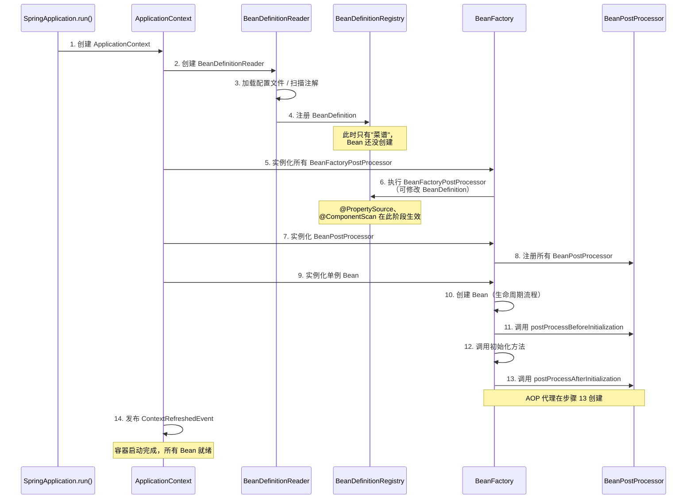
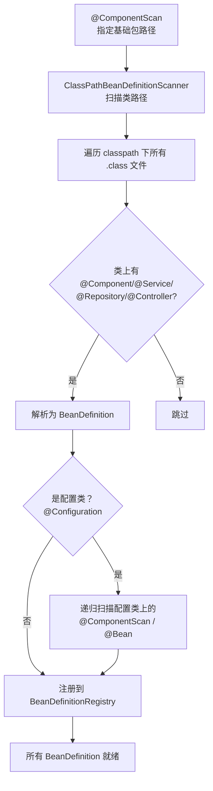
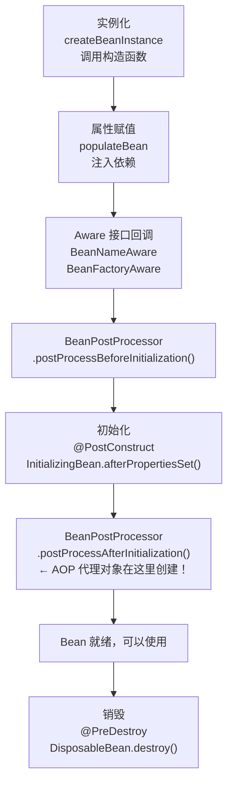
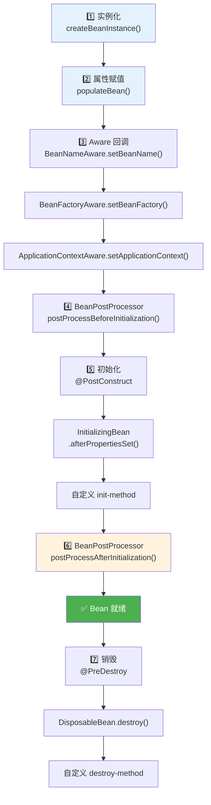
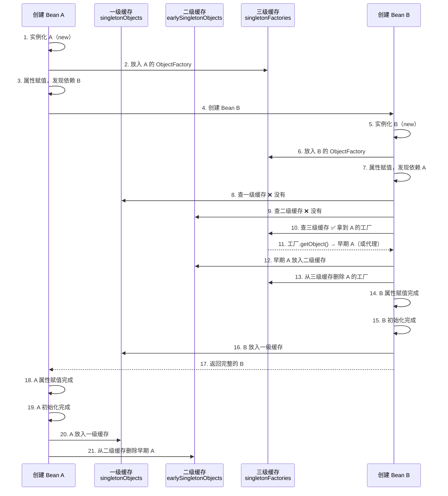

# Spring IOC

> 很多人觉得 IOC 就是 `@Autowired` 注入，循环依赖就是面试八股文。但如果你不理解 Bean 生命周期中 BeanPostProcessor 的执行时机，就搞不懂 Spring AOP 是怎么生效的；不理解三级缓存的设计，就不知道循环依赖到底是怎么解决的。IOC 是 Spring 的一切的基础。

## 基础入门：Spring 是什么？

### 为什么需要 Spring？

```java
// 没有 Spring：对象自己创建和管理依赖
public class OrderService {
    private OrderDao orderDao = new MySQLOrderDao();  // 硬编码
    private EmailService emailService = new SmtpEmailService();  // 紧耦合
}

// 有 Spring：容器帮你管理
@Service
public class OrderService {
    private final OrderDao orderDao;
    private final EmailService emailService;

    // Spring 自动注入依赖，你不需要 new
    public OrderService(OrderDao orderDao, EmailService emailService) {
        this.orderDao = orderDao;
        this.emailService = emailService;
    }
}
```

### 第一个 Spring Boot 应用

```java
// 1. 启动类
@SpringBootApplication  // 组合注解：@Configuration + @ComponentScan + @EnableAutoConfiguration
public class Application {
    public static void main(String[] args) {
        SpringApplication.run(Application.class, args);
    }
}

// 2. 定义组件
@Service
public class UserService {
    public User getUser(Long id) { return new User(id, "张三"); }
}

// 3. 使用组件
@RestController
@RequestMapping("/api/users")
public class UserController {
    private final UserService userService;

    public UserController(UserService userService) {
        this.userService = userService;  // Spring 自动注入
    }

    @GetMapping("/{id}")
    public User getUser(@PathVariable Long id) {
        return userService.getUser(id);
    }
}
```

### 常用注解速查

| 注解 | 作用 | 用在哪 |
|------|------|--------|
| `@Component` | 注册为 Spring Bean | 通用组件 |
| `@Service` | 注册 Bean（语义：业务层） | Service 类 |
| `@Repository` | 注册 Bean（语义：持久层） | DAO 类 |
| `@Controller` | 注册 Bean（语义：控制层） | Controller 类 |
| `@RestController` | `@Controller` + `@ResponseBody` | REST API |
| `@Autowired` | 注入依赖 | 字段/构造器/方法 |
| `@Configuration` | 标记配置类 | 配置类 |
| `@Bean` | 在配置类中注册 Bean | `@Configuration` 类的方法 |
| `@Value` | 注入配置值 | 字段 |
| `@ComponentScan` | 扫描指定包下的组件 | 配置类 |

---

## IOC 到底解决了什么问题？

```java
// 没有 IOC：对象自己管理自己的依赖（主动创建）
public class OrderService {
    // 硬编码依赖——要换实现？改代码、重新编译
    private OrderDao orderDao = new MySQLOrderDao();
    private PaymentService paymentService = new AlipayService();
    private EmailService emailService = new SmtpEmailService();
}

// 有 IOC：容器管理依赖（被动接收）
@Service
public class OrderService {
    private final OrderDao orderDao;
    private final PaymentService paymentService;

    // 由容器注入——要换实现？改配置就行
    public OrderService(OrderDao orderDao, PaymentService paymentService) {
        this.orderDao = orderDao;
        this.paymentService = paymentService;
    }
}
```

**IOC（控制反转）**：对象的创建和依赖管理从"你自己负责"反转为"容器负责"。
**DI（依赖注入）**：IOC 的实现方式，容器把依赖"注入"到对象中。

::: tip IOC 不是什么新技术
IOC 是一种设计思想，不是技术。DI 是 IOC 最常见的实现方式。Spring 的 ApplicationContext 就是一个 IOC 容器——它负责创建 Bean、管理 Bean 的生命周期、注入依赖。
:::

## 依赖注入的四种方式——为什么推荐构造器注入？

```java
// 方式1：字段注入（不推荐）
@Service
public class OrderService {
    @Autowired
    private OrderDao orderDao;  // 看起来简洁，问题很多
}

// 方式2：Setter 注入（可选依赖时用）
@Service
public class OrderService {
    private OrderDao orderDao;

    @Autowired
    public void setOrderDao(OrderDao orderDao) {
        this.orderDao = orderDao;
    }
}

// 方式3：构造器注入（推荐）
@Service
public class OrderService {
    private final OrderDao orderDao;  // final，不可变

    // Spring 4.3+：单构造器可省略 @Autowired
    public OrderService(OrderDao orderDao) {
        this.orderDao = orderDao;
    }
}
```

**为什么构造器注入是最佳实践？**

| 维度 | 字段注入 | 构造器注入 |
|------|----------|------------|
| 不可变性 | ❌ 字段不能是 final | ✅ 字段可以是 final |
| 循环依赖 | ❌ 运行时才报错 | ✅ 启动时就报错（Fail Fast） |
| 可测试性 | ❌ 不通过 Spring 无法注入 mock | ✅ 直接 new 对象传入 mock |
| 必要性 | ❌ 无法区分必要/可选依赖 | ✅ 构造器参数都是必要的 |
| IDE 支持 | ❌ 不容易发现缺少依赖 | ✅ 构造器参数明确 |

::: danger 字段注入的最大问题
字段注入让类看起来不依赖任何东西（没有构造器参数），但实际上依赖了一大堆 Bean。这种"假独立"让代码很难理解和测试。而且字段不能是 final，意味着依赖可以被随时替换——线程不安全。
:::

## 依赖注入三种方式深度对比

### 构造器注入 vs Setter 注入 vs 字段注入

```java
// ========== 1. 构造器注入（推荐 ✅）==========
@Service
public class OrderService {
    private final OrderDao orderDao;
    private final PaymentService paymentService;
    private EmailService emailService; // 可选依赖

    // 必要依赖放构造器，可选依赖放 Setter
    public OrderService(OrderDao orderDao, PaymentService paymentService) {
        this.orderDao = orderDao;
        this.paymentService = paymentService;
    }

    @Autowired(required = false)
    public void setEmailService(EmailService emailService) {
        this.emailService = emailService;
    }
}

// ========== 2. Setter 注入 ==========
@Service
public class OrderService {
    private OrderDao orderDao;

    @Autowired
    public void setOrderDao(OrderDao orderDao) {
        this.orderDao = orderDao;
    }
}

// ========== 3. 字段注入（不推荐 ❌）==========
@Service
public class OrderService {
    @Autowired
    private OrderDao orderDao;
}
```

### 完整对比表

| 对比维度 | 构造器注入 | Setter 注入 | 字段注入 |
|---------|-----------|------------|---------|
| **不可变性** | ✅ 支持 `final` | ❌ 不支持 | ❌ 不支持 |
| **完整性保证** | ✅ 构造完成即可用 | ❌ 可能部分未注入 | ❌ 同左 |
| **循环依赖检测** | ✅ 启动时 Fail Fast | ❌ 运行时才报错 | ❌ 运行时才报错 |
| **可选依赖** | ⚠️ 需配合 `@Autowired(required=false)` | ✅ 天然支持 | ✅ `required=false` |
| **可测试性** | ✅ 直接 `new` 传入 mock | ✅ 可调用 setter | ❌ 必须用反射注入 |
| **代码简洁性** | ⚠️ 参数多时较长 | ⚠️ 方法较多 | ✅ 最简洁 |
| **Spring 官方推荐** | ✅ **推荐** | ⚠️ 可选依赖时使用 | ❌ **不推荐** |
| **依赖数量过多时** | ✅ 明确暴露，提醒重构 | ⚠️ 不够明显 | ❌ 隐藏问题 |

### Spring 注入解析顺序

Spring 解析依赖注入的优先级：**构造器参数 > 显式 `@Autowired` 的 setter/方法 > `@Autowired` 字段**。当容器中存在多个同类型 Bean 时，解析规则如下：

```java
// 多个实现时，用 @Qualifier 指定
@Service
public class OrderService {
    private final PaymentService paymentService;

    public OrderService(@Qualifier("alipayService") PaymentService paymentService) {
        this.paymentService = paymentService;
    }
}

// 或者用 @Primary 标记默认实现
@Service
@Primary
public class AlipayService implements PaymentService { }

@Service
public class WechatPayService implements PaymentService { }

// 注入时不需要 @Qualifier，Spring 自动选 @Primary 的
@Service
public class OrderService {
    private final PaymentService paymentService; // 注入 AlipayService
}
```

## @Autowired vs @Resource vs @Inject 区别

这三个注解都能完成依赖注入，但来源和特性完全不同：

```java
@Service
public class OrderService {

    // @Autowired —— Spring 提供，按类型注入（byType）
    @Autowired
    private OrderDao orderDao;

    // 多个同类型 Bean 时配合 @Qualifier
    @Autowired
    @Qualifier("mysqlOrderDao")
    private OrderDao orderDao;

    // @Resource —— JSR-250 规范（Java 标准），按名称注入（byName）
    @Resource(name = "mysqlOrderDao")
    private OrderDao orderDao;

    // @Inject —— JSR-330 规范（Java 标准），按类型注入
    @Inject
    private OrderDao orderDao;
}
```

### 完整对比表

| 对比维度 | `@Autowired` | `@Resource` | `@Inject` |
|---------|-------------|------------|----------|
| **来源** | Spring 框架 | JSR-250（Java 标准） | JSR-330（Java 标准） |
| **匹配方式** | 先 byType，再 byName | 先 byName，再 byType | byType |
| **required 属性** | ✅ `required=false` | ❌ 没有（必须存在） | ❌ 没有（必须存在） |
| **配合指定** | `@Qualifier` | `name` 属性 | `@Named` |
| **适用位置** | 构造器/方法/字段/参数 | 方法/字段 | 构造器/方法/字段 |
| **需要额外依赖** | ❌ Spring 自带 | ❌ JDK 自带（Java 6+） | ⚠️ 需要 `javax.inject` 包 |
| **`@Primary` 支持** | ✅ | ❌ | ✅ |

### 实际开发选型建议

```java
// 推荐：Spring 项目统一用 @Autowired（最常用，生态最好）
@Autowired
private OrderDao orderDao;

// 如果项目要求与框架解耦，用 @Resource（纯 Java 标准，不依赖 Spring）
@Resource
private OrderDao orderDao;

// @Inject 适合需要跨 DI 框架迁移的场景（如 Spring → Guice）
// 实际开发中很少用
```

::: tip 面试回答技巧
面试官问这三个的区别，核心答两点：① 来源不同（Spring vs Java 标准）；② 匹配策略不同（byType vs byName）。然后展开说 @Autowired 先按类型再按名称，@Resource 先按名称再按类型，@Inject 纯按类型。
:::

## IoC 容器启动流程

Spring 容器的启动是一个精密编排的过程，理解它有助于排查启动失败问题。



### 关键节点说明

```java
// ====== 1. BeanDefinition 阶段（菜谱阶段）======
// Spring 先把所有 Bean 的"定义"读进来，此时还没有创建任何对象
// BeanDefinition 包含：类名、作用域、依赖关系、初始化方法等

// ====== 2. BeanFactoryPostProcessor 阶段 ======
// 可以修改 BeanDefinition，典型应用：PropertySourcesPlaceholderConfigurer
// 将 ${spring.datasource.url} 替换为实际值
@Component
public class MyBeanFactoryPostProcessor implements BeanFactoryPostProcessor {
    @Override
    public void postProcessBeanFactory(ConfigurableListableBeanFactory factory) {
        // 在这里可以修改任何 BeanDefinition
        BeanDefinition bd = factory.getBeanDefinition("orderService");
        bd.setScope(ConfigurableBeanFactory.SCOPE_PROTOTYPE);
    }
}

// ====== 3. BeanPostProcessor 注册阶段 ======
// 所有 BeanPostProcessor 在普通 Bean 之前被实例化和注册
// 这保证了 BeanPostProcessor 能处理后续创建的所有 Bean

// ====== 4. 单例 Bean 创建阶段 ======
// 按照 BeanDefinition 的信息，逐个创建单例 Bean
// 包括：实例化 → 属性赋值 → 初始化 → 后置处理
```

::: tip 容器启动失败排查思路
1. **BeanDefinition 阶段失败**：检查 `@ComponentScan` 路径、配置文件语法
2. **BeanFactoryPostProcessor 阶段失败**：检查配置占位符是否正确（`${}` 拼写）
3. **BeanPostProcessor 阶段失败**：检查自定义 BeanPostProcessor 是否有异常
4. **Bean 创建阶段失败**：检查循环依赖、构造器参数、`@Autowired` 注入点
:::

## @Component 注解扫描原理

当你写下 `@ComponentScan("com.example")` 时，Spring 是如何找到所有 Bean 的？

### ClassPathBeanDefinitionScanner 工作流程



### 扫描过滤机制

```java
// 自定义扫描过滤器：只扫描带 @MyComponent 的类
@Retention(RetentionPolicy.RUNTIME)
@Target(ElementType.TYPE)
public @interface MyComponent {
}

// 配置扫描器
@Configuration
@ComponentScan(
    basePackages = "com.example",
    includeFilters = @ComponentScan.Filter(type = FilterType.ANNOTATION, classes = MyComponent.class),
    excludeFilters = @ComponentScan.Filter(type = FilterType.ASSIGNABLE_TYPE, classes = ExcludeClass.class),
    useDefaultFilters = false  // 关闭默认过滤器，只扫描自定义注解
)
public class ScanConfig {
}

// Spring 内置的 FilterType：
// ANNOTATION  —— 注解过滤（默认）
// ASSIGNABLE_TYPE —— 指定类型
// ASPECTJ —— AspectJ 表达式
// REGEX —— 正则表达式
// CUSTOM —— 自定义 TypeFilter 实现
```

### 自定义 TypeFilter

```java
// 自定义过滤器：只扫描名字以 "Service" 结尾的类
public class ServiceNameFilter implements TypeFilter {
    @Override
    public boolean match(MetadataReader metadataReader,
                        MetadataReaderFactory metadataReaderFactory) {
        String className = metadataReader.getClassMetadata().getClassName();
        return className.endsWith("Service");
    }
}

@Configuration
@ComponentScan(
    basePackages = "com.example",
    includeFilters = @ComponentScan.Filter(type = FilterType.CUSTOM, classes = ServiceNameFilter.class),
    useDefaultFilters = false
)
public class CustomScanConfig {
}
```

## Bean 生命周期——不只是面试题

这是 Spring IOC 中最重要的知识点之一：



::: tip BeanPostProcessor 是 Spring 的灵魂
`@Autowired` 的注入、`@Async` 的异步代理、`@Transactional` 的事务代理、`@Cacheable` 的缓存代理——全部通过 BeanPostProcessor 在 `postProcessAfterInitialization` 阶段创建代理对象来实现。理解了这个，就理解了 Spring 的大部分魔法。
:::

### Bean 生命周期完整版详解



### 每个阶段的代码示例

```java
@Component
public class MyBean implements BeanNameAware, BeanFactoryAware,
        ApplicationContextAware, InitializingBean, DisposableBean {

    private String beanName;

    // ====== 1. 实例化：调用构造方法 ======
    public MyBean() {
        System.out.println("1. 实例化：MyBean()");
    }

    // ====== 2. 属性赋值：@Autowired / @Value 注入 ======
    @Autowired
    public void setDependency(SomeService service) {
        System.out.println("2. 属性赋值：注入 SomeService");
    }

    // ====== 3. Aware 接口回调 ======
    @Override
    public void setBeanName(String name) {
        this.beanName = name;
        System.out.println("3. Aware：BeanNameAware.setBeanName(" + name + ")");
    }

    @Override
    public void setBeanFactory(BeanFactory beanFactory) {
        System.out.println("3. Aware：BeanFactoryAware.setBeanFactory()");
    }

    @Override
    public void setApplicationContext(ApplicationContext ctx) {
        System.out.println("3. Aware：ApplicationContextAware.setApplicationContext()");
    }

    // ====== 4. BeanPostProcessor 前置处理 ======
    // 由容器调用所有已注册的 BeanPostProcessor.postProcessBeforeInitialization()
    // 例：@PostConstruct 注解的 CommonAnnotationBeanPostProcessor

    // ====== 5. 初始化 ======
    @PostConstruct
    public void postConstruct() {
        System.out.println("5. 初始化：@PostConstruct");
    }

    @Override
    public void afterPropertiesSet() {
        System.out.println("5. 初始化：InitializingBean.afterPropertiesSet()");
    }

    // @Bean(initMethod = "customInit")
    public void customInit() {
        System.out.println("5. 初始化：customInit-method");
    }

    // ====== 6. BeanPostProcessor 后置处理 ======
    // 由容器调用所有已注册的 BeanPostProcessor.postProcessAfterInitialization()
    // 例：AOP 代理对象在此创建（AbstractAutoProxyCreator）

    // ====== 7. 销毁（容器关闭时） ======
    @PreDestroy
    public void preDestroy() {
        System.out.println("7. 销毁：@PreDestroy");
    }

    @Override
    public void destroy() {
        System.out.println("7. 销毁：DisposableBean.destroy()");
    }

    // @Bean(destroyMethod = "customDestroy")
    public void customDestroy() {
        System.out.println("7. 销毁：customDestroy-method");
    }
}
```

### 初始化方法执行顺序

```java
// 执行顺序（严格按此顺序）：
// 1. @PostConstruct（JSR-250 标准）
// 2. InitializingBean.afterPropertiesSet()（Spring 接口）
// 3. 自定义 init-method（@Bean 注解或 XML 配置）
// 
// 销毁顺序（严格按此顺序）：
// 1. @PreDestroy（JSR-250 标准）
// 2. DisposableBean.destroy()（Spring 接口）
// 3. 自定义 destroy-method（@Bean 注解或 XML 配置）

// 推荐用法：日常开发用 @PostConstruct + @PreDestroy
// 框架开发用 InitializingBean + DisposableBean
```

## 循环依赖——三级缓存的真相

### 什么是循环依赖？

```java
@Service
public class A {
    @Autowired
    private B;  // A 依赖 B
}

@Service
public class B {
    @Autowired
    private A;  // B 依赖 A —— 循环了！
}
```

### Spring 怎么解决？

Spring 用**三级缓存**解决**单例、设值注入**的循环依赖：

```
一级缓存（singletonObjects）：存放完全初始化好的 Bean
二级缓存（earlySingletonObjects）：存放提前暴露的早期 Bean（已实例化，未初始化）
三级缓存（singletonFactories）：存放 Bean 工厂（可以生成早期 Bean 或代理对象）

创建 A 的流程：
1. 实例化 A → 把 A 的工厂放入三级缓存
2. 属性赋值 → 发现需要 B
3. 创建 B → 实例化 B → 把 B 的工厂放入三级缓存
4. B 属性赋值 → 发现需要 A
5. 从三级缓存获取 A 的工厂 → 生成早期 A → 放入二级缓存 → 注入给 B
6. B 初始化完成 → 放入一级缓存
7. A 继续属性赋值 → 从一级缓存获取 B → 注入给 A
8. A 初始化完成 → 放入一级缓存
```

### 三级缓存工作流程图



### 三级缓存为什么需要第三级？

```java
// 如果只有二级缓存，能解决普通循环依赖
// 但如果 A 被AOP 代理了呢？

// 假设 A 有 @Transactional，需要创建代理对象
// 代理对象应该在 BeanPostProcessor.postProcessAfterInitialization 中创建
// 但循环依赖时，A 还没走到那一步就需要被 B 引用了

// 三级缓存存的是 ObjectFactory（工厂），而不是直接存早期对象
// 当 B 需要 A 时，调用工厂的 getObject()
// 工厂内部会检查 A 是否需要代理：
//   - 不需要代理 → 返回原始 A
//   - 需要代理 → 返回 A 的代理对象

// 这样保证了 B 拿到的 A 和最终一级缓存中的 A 是同一个对象（都是代理对象）
```

### 三级缓存源码核心逻辑

```java
// DefaultSingletonBeanRegistry.java 核心属性
public class DefaultSingletonBeanRegistry {
    // 一级缓存：完整 Bean
    private final Map<String, Object> singletonObjects = new ConcurrentHashMap<>(256);
    // 二级缓存：早期 Bean（已实例化，未初始化）
    private final Map<String, Object> earlySingletonObjects = new ConcurrentHashMap<>(16);
    // 三级缓存：Bean 工厂
    private final Map<String, ObjectFactory<?>> singletonFactories = new HashMap<>(16);

    // 获取单例 Bean（核心方法）
    protected Object getSingleton(String beanName, boolean allowEarlyReference) {
        // 1. 先查一级缓存
        Object singletonObject = this.singletonObjects.get(beanName);
        if (singletonObject == null && isSingletonCurrentlyInCreation(beanName)) {
            // 2. 一级没有，查二级缓存
            singletonObject = this.earlySingletonObjects.get(beanName);
            if (singletonObject == null && allowEarlyReference) {
                // 3. 二级没有，查三级缓存
                ObjectFactory<?> singletonFactory = this.singletonFactories.get(beanName);
                if (singletonFactory != null) {
                    // 调用工厂方法，生成早期 Bean（可能是代理对象）
                    singletonObject = singletonFactory.getObject();
                    // 放入二级缓存
                    this.earlySingletonObjects.put(beanName, singletonObject);
                    // 从三级缓存删除
                    this.singletonFactories.remove(beanName);
                }
            }
        }
        return singletonObject;
    }
}
```

### 循环依赖能解决与不能解决的场景

| 场景 | 能否解决 | 原因 |
|------|---------|------|
| 单例 + Setter 注入 | ✅ 能 | 三级缓存专门处理 |
| 单例 + 字段注入（`@Autowired`） | ✅ 能 | 本质也是 Setter 注入 |
| 单例 + 构造器注入 | ❌ 不能 | 实例化阶段就需要依赖，无法提前暴露 |
| prototype 作用域 | ❌ 不能 | Spring 不缓存 prototype Bean |
| 依赖链 A→B→C→A | ✅ 能（同上条件） | 三级缓存递归处理 |

```java
// 构造器循环依赖的解决方案 1：@Lazy
@Service
public class A {
    private final B b;
    public A(@Lazy B b) {  // 注入代理对象，真正使用时才创建 B
        this.b = b;
    }
}

@Service
public class B {
    private final A a;
    public B(A a) {
        this.a = a;
    }
}

// 构造器循环依赖的解决方案 2：重构设计（推荐）
// 提取公共逻辑到第三个 Bean，消除循环
@Service
public class A {
    private final CommonService commonService;
    public A(CommonService commonService) {
        this.commonService = commonService;
    }
}

@Service
public class B {
    private final CommonService commonService;
    public B(CommonService commonService) {
        this.commonService = commonService;
    }
}
```

::: danger 构造器注入的循环依赖无法解决
如果 A 的构造器需要 B，B 的构造器需要 A——Spring 直接报错。因为实例化阶段就需要依赖，还没到"提前暴露"的时机。解决方案：重构设计（真正消除循环依赖）、用 `@Lazy` 延迟注入。
:::

## Bean 作用域详解

### 五种作用域

```java
// ========== 1. singleton（默认）==========
// 整个 IoC 容器中只有一个实例
@Component  // 默认就是 singleton
@Scope("singleton")
public class OrderService {
}

// ========== 2. prototype ==========
// 每次请求都创建新实例
@Component
@Scope("prototype")
public class ShoppingCart {
    // 每个用户应该有自己的购物车
}

// ========== 3. request ==========
// 每个 HTTP 请求一个实例（仅 Web 应用）
@Component
@RequestScope  // 等同于 @Scope(value = WebApplicationContext.SCOPE_REQUEST, proxyMode = ScopedProxyMode.TARGET_CLASS)
public class RequestInfo {
    private String requestId;
    private String userId;
}

// ========== 4. session ==========
// 每个 HTTP Session 一个实例（仅 Web 应用）
@Component
@SessionScope
public class UserPreferences {
    private String theme;
    private String language;
}

// ========== 5. application ==========
// 整个 ServletContext 一个实例（仅 Web 应用）
@Component
@ApplicationScope
public class AppStats {
    private AtomicLong visitCount = new AtomicLong(0);
}
```

### 作用域对比表

| 作用域 | 实例数量 | 适用场景 | 生命周期 |
|--------|---------|---------|---------|
| `singleton` | 1 个 | 无状态 Service、DAO、工具类 | 容器启动 → 容器关闭 |
| `prototype` | 每次请求 1 个 | 有状态对象（购物车、临时任务） | 获取时创建，不负责销毁 |
| `request` | 每 HTTP 请求 1 个 | 请求上下文信息 | 请求开始 → 请求结束 |
| `session` | 每 Session 1 个 | 用户会话信息 | Session 创建 → Session 销毁 |
| `application` | 每 ServletContext 1 个 | 全局共享资源 | 应用启动 → 应用关闭 |

### Singleton Bean 注入 Prototype Bean 的问题

```java
// ❌ 错误：singleton 的 OrderService 只在初始化时注入一次 ShoppingCart
@Service
public class OrderService {
    @Autowired
    private ShoppingCart cart;  // 永远是同一个实例！
}

// ✅ 方案 1：@Lookup 方法注入（推荐）
@Service
public abstract class OrderService {
    @Lookup
    public abstract ShoppingCart getCart();  // 每次调用都返回新实例

    public void processOrder() {
        ShoppingCart cart = getCart(); // 每次都是新的
        cart.addItem(item);
    }
}

// ✅ 方案 2：ObjectFactory（Spring 提供）
@Service
public class OrderService {
    @Autowired
    private ObjectFactory<ShoppingCart> cartFactory;

    public void processOrder() {
        ShoppingCart cart = cartFactory.getObject(); // 每次都是新的
    }
}

// ✅ 方案 3：ObjectProvider（Spring 5+ 推荐）
@Service
public class OrderService {
    private final ObjectProvider<ShoppingCart> cartProvider;

    public OrderService(ObjectProvider<ShoppingCart> cartProvider) {
        this.cartProvider = cartProvider;
    }

    public void processOrder() {
        ShoppingCart cart = cartProvider.getIfAvailable(() -> new ShoppingCart());
    }
}

// ✅ 方案 4：@Scope 配合代理模式
@Component
@Scope(value = ConfigurableBeanFactory.SCOPE_PROTOTYPE, proxyMode = ScopedProxyMode.TARGET_CLASS)
public class ShoppingCart {
}
```

## 条件装配——Spring Boot 自动配置的基础

```java
// 核心条件注解
@ConditionalOnClass(DataSource.class)         // classpath 有这个类才生效
@ConditionalOnMissingBean(DataSource.class)    // 容器没有这个 Bean 才生效
@ConditionalOnProperty("spring.datasource.url") // 配置了属性才生效
@ConditionalOnWebApplication                   // 是 Web 应用才生效
```

这就是 Spring Boot 自动配置的原理：

```
spring-boot-starter-web 引入了 Tomcat 依赖
→ @ConditionalOnClass(Tomcat.class) 匹配成功
→ 自动配置 EmbeddedTomcat Bean
→ 你不需要写任何配置

如果你同时引入了 Jetty 依赖
→ 你可以通过配置 spring.main.web-application-type=reactive 或排除 Tomcat 自动配置
→ Spring Boot 的条件装配会选择合适的实现
```

### @Conditional 家族完整解析

```java
// ====== Spring 原生条件注解 ======
@Conditional(MyCondition.class)              // 自定义条件
@ConditionalOnExpression("${feature.enabled}") // SpEL 表达式

// ====== Spring Boot 条件注解 ======
// 类条件
@ConditionalOnClass(DataSource.class)        // classpath 存在该类
@ConditionalOnMissingClass("com.mysql.Driver") // classpath 不存在该类

// Bean 条件
@ConditionalOnBean(DataSource.class)          // 容器中存在该 Bean
@ConditionalOnMissingBean(DataSource.class)   // 容器中不存在该 Bean

// 属性条件
@ConditionalOnProperty(                       // 配置属性匹配
    prefix = "spring.datasource",
    name = "url",
    havingValue = "jdbc:mysql://",           // 属性值匹配
    matchIfMissing = true                     // 属性不存在时是否匹配
)

// Web 条件
@ConditionalOnWebApplication                  // 当前是 Web 应用
@ConditionalOnNotWebApplication               // 当前不是 Web 应用

// 其他
@ConditionalOnJava(JavaVersion.EIGHT)         // Java 版本
@ConditionalOnResource("classpath:config.xml") // 资源文件存在
```

### 自定义 @Conditional

```java
// 1. 实现条件判断逻辑
public class LinuxCondition implements Condition {
    @Override
    public boolean matches(ConditionContext context, AnnotatedTypeMetadata metadata) {
        return context.getEnvironment().getProperty("os.name").contains("Linux");
    }
}

public class WindowsCondition implements Condition {
    @Override
    public boolean matches(ConditionContext context, AnnotatedTypeMetadata metadata) {
        return context.getEnvironment().getProperty("os.name").contains("Windows");
    }
}

// 2. 在配置类中使用
@Configuration
public class OsConfig {

    @Bean
    @Conditional(LinuxCondition.class)
    public CommandRunner linuxCommandRunner() {
        return new LinuxCommandRunner();
    }

    @Bean
    @Conditional(WindowsCondition.class)
    public CommandRunner windowsCommandRunner() {
        return new WindowsCommandRunner();
    }
}
```

### Spring Boot 自动配置原理

```java
// Spring Boot 自动配置的核心入口
// @SpringBootApplication 包含 @EnableAutoConfiguration

// @EnableAutoConfiguration 通过 @Import(AutoConfigurationImportSelector.class)
// AutoConfigurationImportSelector 会：
// 1. 从 spring.factories（Spring Boot 2.x）或
//    org.springframework.boot.autoconfigure.AutoConfiguration.imports（Spring Boot 3.x）
//    加载所有自动配置类
// 2. 根据条件注解过滤，只加载匹配的配置类

// spring-boot-autoconfigure 包中的典型自动配置：
@AutoConfiguration
@ConditionalOnClass(DataSource.class)
@EnableConfigurationProperties(DataSourceProperties.class)
public class DataSourceAutoConfiguration {

    @Bean
    @ConditionalOnMissingBean
    public DataSource dataSource(DataSourceProperties properties) {
        return properties.initializeDataSourceBuilder().build();
    }

    // 内嵌 HikariCP 配置
    @ConditionalOnMissingBean(HikariDataSource.class)
    @ConditionalOnClass(HikariDataSource.class)
    static class HikariConfiguration {
        @Bean
        @ConditionalOnMissingBean
        HikariDataSource dataSource(DataSourceProperties properties) {
            return properties.initializeDataSourceBuilder()
                .type(HikariDataSource.class).build();
        }
    }
}

// 查看已加载的自动配置：
// 启动时加 --debug，查看 "Positive matches" 和 "Negative matches"
// 或访问 /actuator/conditions 端点
```

```mermaid
flowchart TD
    A["@SpringBootApplication"] --> B["@EnableAutoConfiguration"]
    B --> C["AutoConfigurationImportSelector"]
    C --> D["加载候选自动配置类<br/>（174+ 个配置类）"]
    D --> E{"条件过滤"}
    E --> F["@ConditionalOnClass<br/>classpath 有依赖？"}
    E --> G["@ConditionalOnMissingBean<br/>用户已定义？"]
    E --> H["@ConditionalOnProperty<br/>配置项匹配？"]
    F -- 是 --> I["加载配置"]
    F -- 否 --> J["跳过"]
    G -- 未定义 --> I
    G -- 已定义 --> J
    H -- 匹配 --> I
    H -- 不匹配 --> J
    I --> K["注册 Bean 到容器"]
    J --> L["Negative match<br/>不加载"]
```

## Profile——多环境配置

```java
// 不同环境使用不同的 Bean 实现
@Configuration
public class DataSourceConfig {

    @Bean
    @Profile("dev")
    public DataSource devDataSource() {
        return new EmbeddedDatabaseBuilder().setType(EmbeddedDatabaseType.H2).build();
    }

    @Bean
    @Profile("prod")
    public DataSource prodDataSource() {
        HikariDataSource ds = new HikariDataSource();
        ds.setJdbcUrl("jdbc:mysql://prod-db:3306/mydb");
        return ds;
    }
}

// 激活方式
// 1. 配置文件：spring.profiles.active=prod
// 2. 环境变量：SPRING_PROFILES_ACTIVE=prod
// 3. 命令行：java -jar app.jar --spring.profiles.active=prod
```

### Profile 进阶用法

```java
// ====== @Profile 支持表达式 ======
@Bean
@Profile("!prod")  // 非 prod 环境都生效
public DataSource devDataSource() { ... }

@Bean
@Profile("dev | test")  // dev 或 test 环境生效
public DataSource testDataSource() { ... }

// ====== @Profile 等同于 @Conditional ======
// @Profile("dev") 底层就是：
// @Conditional(ProfileCondition.class)
// ProfileCondition 会检查当前激活的 profile 是否匹配

// ====== Profile 与 @Configuration 组合 ======
@Configuration
@Profile("dev")
public class DevDataSourceConfig {
    @Bean
    public DataSource dataSource() {
        return new EmbeddedDatabaseBuilder()
            .setType(EmbeddedDatabaseType.H2).build();
    }

    @Bean
    public CommandLineRunner dataInitializer(DataSource ds) {
        return args -> {
            // 初始化测试数据
        };
    }
}

@Configuration
@Profile("prod")
public class ProdDataSourceConfig {
    @Bean
    @ConfigurationProperties(prefix = "spring.datasource.hikari")
    public DataSource dataSource() {
        return DataSourceBuilder.create().build();
    }
}

// ====== 配置文件 Profile ======
// application.yml
/*
spring:
  profiles:
    active: dev
---
spring:
  config:
    activate:
      on-profile: dev
server:
  port: 8080
---
spring:
  config:
    activate:
      on-profile: prod
server:
  port: 8443
*/
```

## 事件机制——松耦合的利器

```java
// 发布事件
@Service
public class UserService {
    @Autowired
    private ApplicationEventPublisher eventPublisher;

    public void createUser(User user) {
        userRepository.save(user);
        eventPublisher.publishEvent(new UserCreatedEvent(this, user));
    }
}

// 监听事件——不同模块各自处理，互不影响
@Component
public class EmailListener {
    @EventListener
    public void onUserCreated(UserCreatedEvent event) {
        emailService.sendWelcome(event.getUser());
    }
}

@Component
public class AuditListener {
    @EventListener
    public void onUserCreated(UserCreatedEvent event) {
        auditService.log("USER_CREATED", event.getUser().getId());
    }
}
```

::: tip 事件驱动 vs 直接调用
直接调用：`userService.createUser()` 里直接调 `emailService.send()`——UserService 和 EmailService 耦合了。事件驱动：UserService 只管发事件，不关心谁来处理——完全解耦。新增一种处理逻辑（如短信通知），只需要新增一个 Listener，不用改 UserService。
:::

### 事件机制进阶

```java
// ====== 1. 自定义事件 ======
public class OrderCreatedEvent extends ApplicationEvent {
    private final Order order;
    private final String operator;

    public OrderCreatedEvent(Object source, Order order, String operator) {
        super(source);
        this.order = order;
        this.operator = operator;
    }
    // getters...
}

// ====== 2. 条件监听 ======
@Component
public class OrderEventListener {

    // 只监听金额大于 1000 的订单
    @EventListener(condition = "#event.order.amount > 1000")
    public void onLargeOrder(OrderCreatedEvent event) {
        // 发送大额订单审批通知
    }

    // 异步监听（需要 @EnableAsync）
    @Async
    @EventListener
    public void sendNotificationAsync(OrderCreatedEvent event) {
        // 异步发送通知，不阻塞主流程
    }

    // 事务提交后执行（需要 @TransactionalEventListener）
    @TransactionalEventListener(phase = TransactionPhase.AFTER_COMMIT)
    public void afterCommit(OrderCreatedEvent event) {
        // 确保事务成功后才发送通知
        // 避免：事务回滚了但通知已经发出
    }
}

// TransactionPhase 四个阶段：
// BEFORE_COMMIT  —— 事务提交前
// AFTER_COMMIT   —— 事务提交后（最常用）
// AFTER_ROLLBACK —— 事务回滚后
// AFTER_COMPLETION —— 事务完成后（无论成功失败）
```

## 面试高频题

**Q1：Spring Bean 的作用域有哪些？**

singleton（默认，整个容器一个实例）、prototype（每次获取创建新实例）、request（每个 HTTP 请求一个）、session（每个 HTTP Session 一个）、application（整个 ServletContext 一个）。 singleton 的 Bean 注入到 prototype 的 Bean 中，prototype 不会每次都创建新实例——需要用 `@Lookup` 方法注入或 `ObjectFactory`。

**Q2：BeanFactory 和 ApplicationContext 的区别？**

BeanFactory 是 Spring 的基础容器，Bean 按需加载（lazy loading）。ApplicationContext 是 BeanFactory 的超集，启动时预加载所有 singleton Bean，支持事件机制、AOP、国际化、资源加载等企业级特性。开发中几乎都用 ApplicationContext。

**Q3：@Component、@Service、@Repository、@Controller 有什么区别？**

功能上完全一样，都是注册 Bean。区别是语义：@Component 通用组件、@Service 业务层、@Repository 持久层（会自动转换数据库异常）、@Controller 控制层。Spring 处理时没有区别，只是给人看的时候更清晰。

**Q4：Spring 如何解决循环依赖？**

通过三级缓存：singletonObjects（完整 Bean）、earlySingletonObjects（早期 Bean）、singletonFactories（Bean 工厂）。创建 A 时先实例化，将工厂放入三级缓存；A 注入 B 时发现需要 A，从三级缓存拿到早期 A 放入二级缓存；B 创建完成后，A 继续初始化。三级缓存的核心目的是处理 AOP 代理场景。但构造器注入的循环依赖无法解决。

**Q5：BeanPostProcessor 和 BeanFactoryPostProcessor 的区别？**

BeanFactoryPostProcessor 在 Bean 定义加载后、Bean 实例化前执行，可以修改 BeanDefinition（如替换属性占位符）。BeanPostProcessor 在每个 Bean 创建过程中执行，分为 `beforeInitialization` 和 `afterInitialization` 两个阶段，可以对 Bean 进行包装（如创建 AOP 代理）。

**Q6：@Autowired 和 @Resource 的区别？**

@Autowired 是 Spring 提供，先按类型匹配（byType），多个同类型时配合 @Qualifier 按名称。@Resource 是 JSR-250 标准，先按名称匹配（byName），找不到再按类型。@Autowired 可用于构造器，@Resource 只能用于字段和方法。

## 延伸阅读

- 下一篇：[Spring AOP](aop.md) — 切面编程、代理机制
- [Spring Boot](boot.md) — 自动配置、Starter 原理
- [并发编程](../java-basic/concurrency.md) — 线程安全、锁机制
