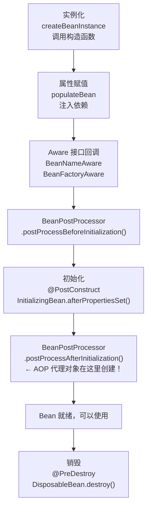

# Spring IOC

> 很多人觉得 IOC 就是 `@Autowired` 注入，循环依赖就是面试八股文。但如果你不理解 Bean 生命周期中 BeanPostProcessor 的执行时机，就搞不懂 Spring AOP 是怎么生效的；不理解三级缓存的设计，就不知道循环依赖到底是怎么解决的。IOC 是 Spring 的一切的基础。

## 基础入门：Spring 是什么？

### 为什么需要 Spring？

```java
// 没有 Spring：对象自己创建和管理依赖
public class OrderService {
    private OrderDao orderDao = new MySQLOrderDao();  // 硬编码
    private EmailService emailService = new SmtpEmailService();  // 紧耦合
}

// 有 Spring：容器帮你管理
@Service
public class OrderService {
    private final OrderDao orderDao;
    private final EmailService emailService;

    // Spring 自动注入依赖，你不需要 new
    public OrderService(OrderDao orderDao, EmailService emailService) {
        this.orderDao = orderDao;
        this.emailService = emailService;
    }
}
```

### 第一个 Spring Boot 应用

```java
// 1. 启动类
@SpringBootApplication  // 组合注解：@Configuration + @ComponentScan + @EnableAutoConfiguration
public class Application {
    public static void main(String[] args) {
        SpringApplication.run(Application.class, args);
    }
}

// 2. 定义组件
@Service
public class UserService {
    public User getUser(Long id) { return new User(id, "张三"); }
}

// 3. 使用组件
@RestController
@RequestMapping("/api/users")
public class UserController {
    private final UserService userService;

    public UserController(UserService userService) {
        this.userService = userService;  // Spring 自动注入
    }

    @GetMapping("/{id}")
    public User getUser(@PathVariable Long id) {
        return userService.getUser(id);
    }
}
```

### 常用注解速查

| 注解 | 作用 | 用在哪 |
|------|------|--------|
| `@Component` | 注册为 Spring Bean | 通用组件 |
| `@Service` | 注册 Bean（语义：业务层） | Service 类 |
| `@Repository` | 注册 Bean（语义：持久层） | DAO 类 |
| `@Controller` | 注册 Bean（语义：控制层） | Controller 类 |
| `@RestController` | `@Controller` + `@ResponseBody` | REST API |
| `@Autowired` | 注入依赖 | 字段/构造器/方法 |
| `@Configuration` | 标记配置类 | 配置类 |
| `@Bean` | 在配置类中注册 Bean | `@Configuration` 类的方法 |
| `@Value` | 注入配置值 | 字段 |
| `@ComponentScan` | 扫描指定包下的组件 | 配置类 |

---

## IOC 到底解决了什么问题？

```java
// 没有 IOC：对象自己管理自己的依赖（主动创建）
public class OrderService {
    // 硬编码依赖——要换实现？改代码、重新编译
    private OrderDao orderDao = new MySQLOrderDao();
    private PaymentService paymentService = new AlipayService();
    private EmailService emailService = new SmtpEmailService();
}

// 有 IOC：容器管理依赖（被动接收）
@Service
public class OrderService {
    private final OrderDao orderDao;
    private final PaymentService paymentService;

    // 由容器注入——要换实现？改配置就行
    public OrderService(OrderDao orderDao, PaymentService paymentService) {
        this.orderDao = orderDao;
        this.paymentService = paymentService;
    }
}
```

**IOC（控制反转）**：对象的创建和依赖管理从"你自己负责"反转为"容器负责"。
**DI（依赖注入）**：IOC 的实现方式，容器把依赖"注入"到对象中。

::: tip IOC 不是什么新技术
IOC 是一种设计思想，不是技术。DI 是 IOC 最常见的实现方式。Spring 的 ApplicationContext 就是一个 IOC 容器——它负责创建 Bean、管理 Bean 的生命周期、注入依赖。
:::

## 依赖注入的四种方式——为什么推荐构造器注入？

```java
// 方式1：字段注入（不推荐）
@Service
public class OrderService {
    @Autowired
    private OrderDao orderDao;  // 看起来简洁，问题很多
}

// 方式2：Setter 注入（可选依赖时用）
@Service
public class OrderService {
    private OrderDao orderDao;

    @Autowired
    public void setOrderDao(OrderDao orderDao) {
        this.orderDao = orderDao;
    }
}

// 方式3：构造器注入（推荐）
@Service
public class OrderService {
    private final OrderDao orderDao;  // final，不可变

    // Spring 4.3+：单构造器可省略 @Autowired
    public OrderService(OrderDao orderDao) {
        this.orderDao = orderDao;
    }
}
```

**为什么构造器注入是最佳实践？**

| 维度 | 字段注入 | 构造器注入 |
|------|----------|------------|
| 不可变性 | ❌ 字段不能是 final | ✅ 字段可以是 final |
| 循环依赖 | ❌ 运行时才报错 | ✅ 启动时就报错（Fail Fast） |
| 可测试性 | ❌ 不通过 Spring 无法注入 mock | ✅ 直接 new 对象传入 mock |
| 必要性 | ❌ 无法区分必要/可选依赖 | ✅ 构造器参数都是必要的 |
| IDE 支持 | ❌ 不容易发现缺少依赖 | ✅ 构造器参数明确 |

::: danger 字段注入的最大问题
字段注入让类看起来不依赖任何东西（没有构造器参数），但实际上依赖了一大堆 Bean。这种"假独立"让代码很难理解和测试。而且字段不能是 final，意味着依赖可以被随时替换——线程不安全。
:::

## Bean 生命周期——不只是面试题

这是 Spring IOC 中最重要的知识点之一：



::: tip BeanPostProcessor 是 Spring 的灵魂
`@Autowired` 的注入、`@Async` 的异步代理、`@Transactional` 的事务代理、`@Cacheable` 的缓存代理——全部通过 BeanPostProcessor 在 `postProcessAfterInitialization` 阶段创建代理对象来实现。理解了这个，就理解了 Spring 的大部分魔法。
:::

## 循环依赖——三级缓存的真相

### 什么是循环依赖？

```java
@Service
public class A {
    @Autowired
    private B;  // A 依赖 B
}

@Service
public class B {
    @Autowired
    private A;  // B 依赖 A —— 循环了！
}
```

### Spring 怎么解决？

Spring 用**三级缓存**解决**单例、设值注入**的循环依赖：

```
一级缓存（singletonObjects）：存放完全初始化好的 Bean
二级缓存（earlySingletonObjects）：存放提前暴露的早期 Bean（已实例化，未初始化）
三级缓存（singletonFactories）：存放 Bean 工厂（可以生成早期 Bean 或代理对象）

创建 A 的流程：
1. 实例化 A → 把 A 的工厂放入三级缓存
2. 属性赋值 → 发现需要 B
3. 创建 B → 实例化 B → 把 B 的工厂放入三级缓存
4. B 属性赋值 → 发现需要 A
5. 从三级缓存获取 A 的工厂 → 生成早期 A → 放入二级缓存 → 注入给 B
6. B 初始化完成 → 放入一级缓存
7. A 继续属性赋值 → 从一级缓存获取 B → 注入给 A
8. A 初始化完成 → 放入一级缓存
```

### 三级缓存为什么需要第三级？

```java
// 如果只有二级缓存，能解决普通循环依赖
// 但如果 A 被AOP 代理了呢？

// 假设 A 有 @Transactional，需要创建代理对象
// 代理对象应该在 BeanPostProcessor.postProcessAfterInitialization 中创建
// 但循环依赖时，A 还没走到那一步就需要被 B 引用了

// 三级缓存存的是 ObjectFactory（工厂），而不是直接存早期对象
// 当 B 需要 A 时，调用工厂的 getObject()
// 工厂内部会检查 A 是否需要代理：
//   - 不需要代理 → 返回原始 A
//   - 需要代理 → 返回 A 的代理对象

// 这样保证了 B 拿到的 A 和最终一级缓存中的 A 是同一个对象（都是代理对象）
```

::: danger 构造器注入的循环依赖无法解决
如果 A 的构造器需要 B，B 的构造器需要 A——Spring 直接报错。因为实例化阶段就需要依赖，还没到"提前暴露"的时机。解决方案：重构设计（真正消除循环依赖）、用 `@Lazy` 延迟注入。
:::

## 条件装配——Spring Boot 自动配置的基础

```java
// 核心条件注解
@ConditionalOnClass(DataSource.class)         // classpath 有这个类才生效
@ConditionalOnMissingBean(DataSource.class)    // 容器没有这个 Bean 才生效
@ConditionalOnProperty("spring.datasource.url") // 配置了属性才生效
@ConditionalOnWebApplication                   // 是 Web 应用才生效
```

这就是 Spring Boot 自动配置的原理：

```
spring-boot-starter-web 引入了 Tomcat 依赖
→ @ConditionalOnClass(Tomcat.class) 匹配成功
→ 自动配置 EmbeddedTomcat Bean
→ 你不需要写任何配置

如果你同时引入了 Jetty 依赖
→ 你可以通过配置 spring.main.web-application-type=reactive 或排除 Tomcat 自动配置
→ Spring Boot 的条件装配会选择合适的实现
```

## Profile——多环境配置

```java
// 不同环境使用不同的 Bean 实现
@Configuration
public class DataSourceConfig {

    @Bean
    @Profile("dev")
    public DataSource devDataSource() {
        return new EmbeddedDatabaseBuilder().setType(EmbeddedDatabaseType.H2).build();
    }

    @Bean
    @Profile("prod")
    public DataSource prodDataSource() {
        HikariDataSource ds = new HikariDataSource();
        ds.setJdbcUrl("jdbc:mysql://prod-db:3306/mydb");
        return ds;
    }
}

// 激活方式
// 1. 配置文件：spring.profiles.active=prod
// 2. 环境变量：SPRING_PROFILES_ACTIVE=prod
// 3. 命令行：java -jar app.jar --spring.profiles.active=prod
```

## 事件机制——松耦合的利器

```java
// 发布事件
@Service
public class UserService {
    @Autowired
    private ApplicationEventPublisher eventPublisher;

    public void createUser(User user) {
        userRepository.save(user);
        eventPublisher.publishEvent(new UserCreatedEvent(this, user));
    }
}

// 监听事件——不同模块各自处理，互不影响
@Component
public class EmailListener {
    @EventListener
    public void onUserCreated(UserCreatedEvent event) {
        emailService.sendWelcome(event.getUser());
    }
}

@Component
public class AuditListener {
    @EventListener
    public void onUserCreated(UserCreatedEvent event) {
        auditService.log("USER_CREATED", event.getUser().getId());
    }
}
```

::: tip 事件驱动 vs 直接调用
直接调用：`userService.createUser()` 里直接调 `emailService.send()`——UserService 和 EmailService 耦合了。事件驱动：UserService 只管发事件，不关心谁来处理——完全解耦。新增一种处理逻辑（如短信通知），只需要新增一个 Listener，不用改 UserService。
:::

## 面试高频题

**Q1：Spring Bean 的作用域有哪些？**

singleton（默认，整个容器一个实例）、prototype（每次获取创建新实例）、request（每个 HTTP 请求一个）、session（每个 HTTP Session 一个）、application（整个 ServletContext 一个）。 singleton 的 Bean 注入到 prototype 的 Bean 中，prototype 不会每次都创建新实例——需要用 `@Lookup` 方法注入或 `ObjectFactory`。

**Q2：BeanFactory 和 ApplicationContext 的区别？**

BeanFactory 是 Spring 的基础容器，Bean 按需加载（lazy loading）。ApplicationContext 是 BeanFactory 的超集，启动时预加载所有 singleton Bean，支持事件机制、AOP、国际化、资源加载等企业级特性。开发中几乎都用 ApplicationContext。

**Q3：@Component、@Service、@Repository、@Controller 有什么区别？**

功能上完全一样，都是注册 Bean。区别是语义：@Component 通用组件、@Service 业务层、@Repository 持久层（会自动转换数据库异常）、@Controller 控制层。Spring 处理时没有区别，只是给人看的时候更清晰。

## 延伸阅读

- 下一篇：[Spring AOP](aop.md) — 切面编程、代理机制
- [Spring Boot](boot.md) — 自动配置、Starter 原理
- [并发编程](../java-basic/concurrency.md) — 线程安全、锁机制
