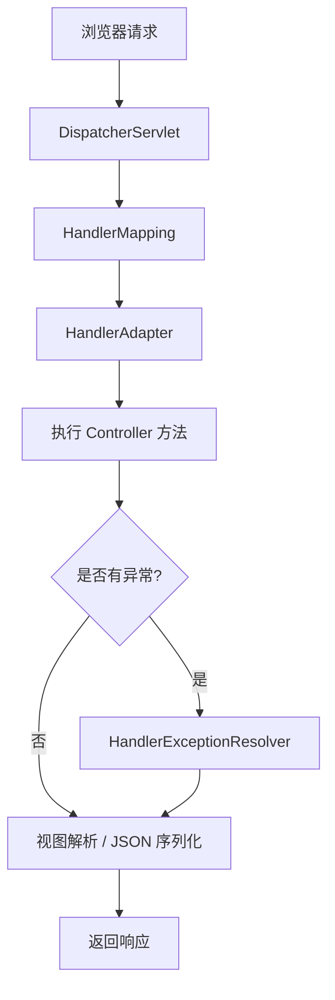
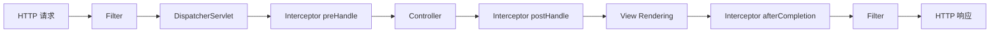

# Spring MVC

> Spring MVC 是 Java Web 开发的事实标准。但很多人只停留在 `@GetMapping` + `@PostMapping` 的层面——参数校验怎么做全局处理？统一响应格式怎么包装？拦截器和过滤器的区别是什么？这些才是实际开发中每天要面对的问题。

## 基础入门：Spring MVC 是什么？

### 一个 RESTful API 的完整流程

```java
// Controller：接收请求、返回响应
@RestController
@RequestMapping("/api/users")
public class UserController {

    @Autowired
    private UserService userService;

    // GET /api/users/1
    @GetMapping("/{id}")
    public User getUser(@PathVariable Long id) {
        return userService.findById(id);
    }

    // POST /api/users
    @PostMapping
    public User create(@RequestBody @Valid CreateUserRequest request) {
        return userService.create(request);
    }

    // PUT /api/users/1
    @PutMapping("/{id}")
    public User update(@PathVariable Long id, @RequestBody UpdateUserRequest request) {
        return userService.update(id, request);
    }

    // DELETE /api/users/1
    @DeleteMapping("/{id}")
    public void delete(@PathVariable Long id) {
        userService.delete(id);
    }
}
```

### 常用注解

| 注解 | 作用 | 示例 |
|------|------|------|
| `@RestController` | `@Controller` + `@ResponseBody` | 返回 JSON |
| `@GetMapping` | 处理 GET 请求 | `@GetMapping("/users")` |
| `@PostMapping` | 处理 POST 请求 | `@PostMapping("/users")` |
| `@PathVariable` | URL 路径参数 | `/users/{id}` |
| `@RequestParam` | 查询参数 | `?name=张三` |
| `@RequestBody` | 请求体 JSON → 对象 | POST 的 JSON body |
| `@Valid` | 触发参数校验 | 配合 JSR 380 注解 |
| `@RequestHeader` | 请求头参数 | `@RequestHeader("Authorization")` |
| `@CookieValue` | Cookie 值 | `@CookieValue("sessionId")` |

---

## 请求处理全流程



```
浏览器请求
    │
    ▼
DispatcherServlet（前端控制器，所有请求的入口）
    │
    ├→ HandlerMapping（找到对应的 Controller 方法）
    │
    ├→ HandlerAdapter（执行 Controller 方法）
    │      │
    │      ├→ 拦截器 preHandle()
    │      ├→ 参数绑定 + 类型转换
    │      ├→ 数据校验（@Valid）
    │      ├→ 执行 Controller 方法
    │      ├→ 拦截器 postHandle()
    │      └→ 视图解析 / JSON 序列化
    │
    └→ 返回响应
```

### DispatcherServlet 核心组件

```java
// DispatcherServlet 的九大组件
public class DispatcherServlet extends FrameworkServlet {

    // 1. HandlerMapping：根据请求找到对应的 Handler
    private List<HandlerMapping> handlerMappings;
    
    // 2. HandlerAdapter：执行 Handler
    private List<HandlerAdapter> handlerAdapters;
    
    // 3. HandlerExceptionResolver：异常处理
    private List<HandlerExceptionResolver> handlerExceptionResolvers;
    
    // 4. ViewResolver：视图解析
    private List<ViewResolver> viewResolvers;
    
    // 5. LocaleResolver：国际化
    private LocaleResolver localeResolver;
    
    // 6. ThemeResolver：主题
    private ThemeResolver themeResolver;
    
    // 7. MultipartResolver：文件上传
    private MultipartResolver multipartResolver;
    
    // 8. FlashMapManager：Flash 属性
    private FlashMapManager flashMapManager;
    
    // 9. RequestToViewNameTranslator：视图名称翻译
    private RequestToViewNameTranslator viewNameTranslator;
}
```

### 请求处理源码跟踪

```java
// DispatcherServlet.doDispatch() 核心流程
protected void doDispatch(HttpServletRequest request, HttpServletResponse response) {
    // 1. 获取 HandlerExecutionChain（Handler + 拦截器链）
    HandlerExecutionChain mappedHandler = getHandler(request);
    
    // 2. 获取 HandlerAdapter
    HandlerAdapter ha = getHandlerAdapter(mappedHandler.getHandler());
    
    // 3. 执行拦截器 preHandle
    if (!mappedHandler.applyPreHandle(request, response)) {
        return;
    }
    
    // 4. 执行 Handler（Controller 方法）
    ModelAndView mv = ha.handle(request, response, mappedHandler.getHandler());
    
    // 5. 执行拦截器 postHandle
    mappedHandler.applyPostHandle(request, response, mv);
    
    // 6. 处理结果（视图渲染或 JSON 序列化）
    processDispatchResult(request, response, mappedHandler, mv, dispatchException);
}
```

---

## 参数绑定与类型转换

### 常见参数绑定方式

```java
@RestController
@RequestMapping("/api/users")
public class UserController {

    // @PathVariable - URL 路径参数
    @GetMapping("/{id}")
    public User getUser(@PathVariable Long id) {
        return userService.findById(id);
    }

    // @RequestParam - 查询参数
    @GetMapping("/search")
    public List<User> search(
        @RequestParam(required = false, defaultValue = "") String name,
        @RequestParam(required = false) Integer minAge,
        @RequestParam(required = false) Integer maxAge,
        @RequestParam(defaultValue = "1") int page,
        @RequestParam(defaultValue = "20") int size
    ) {
        return userService.search(name, minAge, maxAge, page, size);
    }

    // @RequestBody - 请求体 JSON
    @PostMapping
    public User create(@RequestBody @Valid CreateUserRequest request) {
        return userService.create(request);
    }

    // @RequestHeader - 请求头
    @GetMapping("/me")
    public User getCurrentUser(
        @RequestHeader("Authorization") String token,
        @RequestHeader(value = "X-Request-Id", required = false) String requestId
    ) {
        return userService.getCurrentUser(token);
    }

    // POJO 绑定 - 自动绑定查询参数到对象
    @GetMapping("/list")
    public PageResult<User> list(UserQuery query) {
        return userService.list(query);
    }

    // @MatrixVariable - 矩阵变量
    // GET /api/users/42;role=admin;active=true
    @GetMapping("/{id}")
    public User getUserWithMatrix(
        @PathVariable Long id,
        @MatrixVariable String role,
        @MatrixVariable boolean active
    ) {
        return userService.findById(id, role, active);
    }
}
```

### 自定义类型转换器

```java
// 自定义日期格式转换器
@Component
public class StringToDateConverter implements Converter<String, Date> {

    private static final String[] DATE_FORMATS = {
        "yyyy-MM-dd", "yyyy-MM-dd HH:mm:ss", "yyyy/MM/dd"
    };

    @Override
    public Date convert(String source) {
        if (source == null || source.isEmpty()) {
            return null;
        }
        for (String format : DATE_FORMATS) {
            try {
                return new SimpleDateFormat(format).parse(source);
            } catch (ParseException e) {
                // 尝试下一个格式
            }
        }
        throw new IllegalArgumentException("无法解析日期: " + source);
    }
}

// 注册转换器
@Configuration
public class WebConfig implements WebMvcConfigurer {

    @Autowired
    private StringToDateConverter dateConverter;

    @Override
    public void addFormatters(FormatterRegistry registry) {
        registry.addConverter(dateConverter);
    }
}
```

### 参数校验

```java
// DTO 校验注解
public class CreateUserRequest {

    @NotBlank(message = "用户名不能为空")
    @Size(min = 2, max = 20, message = "用户名长度必须在2-20之间")
    private String username;

    @NotBlank(message = "密码不能为空")
    @Size(min = 6, max = 32, message = "密码长度必须在6-32之间")
    @Pattern(regexp = "^(?=.*[a-z])(?=.*[A-Z])(?=.*\\d).+$", 
             message = "密码必须包含大小写字母和数字")
    private String password;

    @NotBlank(message = "邮箱不能为空")
    @Email(message = "邮箱格式不正确")
    private String email;

    @NotNull(message = "年龄不能为空")
    @Min(value = 1, message = "年龄不能小于1")
    @Max(value = 150, message = "年龄不能大于150")
    private Integer age;

    @Pattern(regexp = "^1[3-9]\\d{9}$", message = "手机号格式不正确")
    private String phone;

    // 自定义校验
    @UniqueUsername
    private String username;
}

// 自定义校验注解
@Target({ElementType.FIELD})
@Retention(RetentionPolicy.RUNTIME)
@Constraint(validatedBy = UniqueUsernameValidator.class)
public @interface UniqueUsername {
    String message() default "用户名已存在";
    Class<?>[] groups() default {};
    Class<? extends Payload>[] payload() default {};
}

// 自定义校验器
@Component
public class UniqueUsernameValidator implements ConstraintValidator<UniqueUsername, String> {

    @Autowired
    private UserRepository userRepository;

    @Override
    public boolean isValid(String username, ConstraintValidatorContext context) {
        if (username == null || username.isEmpty()) {
            return true;
        }
        return !userRepository.existsByUsername(username);
    }
}
```

---

## 统一响应格式

### 统一响应包装

```java
// 统一响应体
@Data
@Builder
public class ApiResponse<T> {
    private int code;
    private String message;
    private T data;
    private long timestamp;

    public static <T> ApiResponse<T> success(T data) {
        return ApiResponse.<T>builder()
            .code(200)
            .message("success")
            .data(data)
            .timestamp(System.currentTimeMillis())
            .build();
    }

    public static <T> ApiResponse<T> error(int code, String message) {
        return ApiResponse.<T>builder()
            .code(code)
            .message(message)
            .timestamp(System.currentTimeMillis())
            .build();
    }
}

// 使用 ResponseEntity 增强控制
@RestController
@RequestMapping("/api/users")
public class UserController {

    @GetMapping("/{id}")
    public ResponseEntity<ApiResponse<User>> getUser(@PathVariable Long id) {
        User user = userService.findById(id);
        if (user == null) {
            return ResponseEntity
                .status(HttpStatus.NOT_FOUND)
                .body(ApiResponse.error(404, "用户不存在"));
        }
        return ResponseEntity.ok(ApiResponse.success(user));
    }
}
```

### 全局异常处理

```java
@RestControllerAdvice
public class GlobalExceptionHandler {

    // 处理参数校验异常
    @ExceptionHandler(MethodArgumentNotValidException.class)
    @ResponseStatus(HttpStatus.BAD_REQUEST)
    public ApiResponse<Map<String, String>> handleValidationException(
            MethodArgumentNotValidException ex) {
        
        Map<String, String> errors = new HashMap<>();
        ex.getBindingResult().getFieldErrors()
            .forEach(error -> errors.put(error.getField(), error.getDefaultMessage()));
        
        return ApiResponse.error(400, "参数校验失败").builder()
            .data(errors)
            .build();
    }

    // 处理业务异常
    @ExceptionHandler(BusinessException.class)
    @ResponseStatus(HttpStatus.OK)
    public ApiResponse<Void> handleBusinessException(BusinessException ex) {
        return ApiResponse.error(ex.getCode(), ex.getMessage());
    }

    // 处理资源未找到
    @ExceptionHandler(NoHandlerFoundException.class)
    @ResponseStatus(HttpStatus.NOT_FOUND)
    public ApiResponse<Void> handleNotFoundException(NoHandlerFoundException ex) {
        return ApiResponse.error(404, "资源不存在: " + ex.getRequestURL());
    }

    // 处理方法参数类型不匹配
    @ExceptionHandler(MethodArgumentTypeMismatchException.class)
    @ResponseStatus(HttpStatus.BAD_REQUEST)
    public ApiResponse<Void> handleTypeMismatch(MethodArgumentTypeMismatchException ex) {
        String message = String.format("参数 '%s' 类型错误，期望类型: %s",
            ex.getName(),
            ex.getRequiredType() != null ? ex.getRequiredType().getSimpleName() : "unknown");
        return ApiResponse.error(400, message);
    }

    // 处理 HTTP 请求方法不支持
    @ExceptionHandler(HttpRequestMethodNotSupportedException.class)
    @ResponseStatus(HttpStatus.METHOD_NOT_ALLOWED)
    public ApiResponse<Void> handleMethodNotSupported(
            HttpRequestMethodNotSupportedException ex) {
        return ApiResponse.error(405, "请求方法不支持: " + ex.getMethod());
    }

    // 兜底异常处理
    @ExceptionHandler(Exception.class)
    @ResponseStatus(HttpStatus.INTERNAL_SERVER_ERROR)
    public ApiResponse<Void> handleException(Exception ex) {
        log.error("系统异常", ex);
        return ApiResponse.error(500, "系统内部错误");
    }
}
```

### 业务异常体系

```java
// 业务异常基类
public class BusinessException extends RuntimeException {
    private final int code;

    public BusinessException(int code, String message) {
        super(message);
        this.code = code;
    }

    public int getCode() {
        return code;
    }
}

// 具体业务异常
public class UserNotFoundException extends BusinessException {
    public UserNotFoundException(Long id) {
        super(1001, "用户不存在: " + id);
    }
}

public class DuplicateUserException extends BusinessException {
    public DuplicateUserException(String username) {
        super(1002, "用户名已存在: " + username);
    }
}

public class AuthenticationException extends BusinessException {
    public AuthenticationException() {
        super(1003, "认证失败");
    }
}

// 使用业务异常
@Service
public class UserService {

    public User getUser(Long id) {
        return userRepository.findById(id)
            .orElseThrow(() -> new UserNotFoundException(id));
    }

    public User createUser(CreateUserRequest request) {
        if (userRepository.existsByUsername(request.getUsername())) {
            throw new DuplicateUserException(request.getUsername());
        }
        return userRepository.save(convertToEntity(request));
    }
}
```

---

## 拦截器与过滤器

### 拦截器（Interceptor）

```java
// 认证拦截器
@Component
public class AuthInterceptor implements HandlerInterceptor {

    @Autowired
    private JwtTokenProvider tokenProvider;

    @Override
    public boolean preHandle(HttpServletRequest request, 
                            HttpServletResponse response, 
                            Object handler) {
        // OPTIONS 请求直接放行
        if ("OPTIONS".equalsIgnoreCase(request.getMethod())) {
            return true;
        }
        
        String token = request.getHeader("Authorization");
        if (token == null || !token.startsWith("Bearer ")) {
            sendError(response, 401, "未提供认证令牌");
            return false;
        }
        
        token = token.substring(7);
        try {
            Claims claims = tokenProvider.parseToken(token);
            // 将用户信息放入请求属性
            request.setAttribute("userId", claims.getSubject());
            request.setAttribute("roles", claims.get("roles", List.class));
            return true;
        } catch (ExpiredJwtException e) {
            sendError(response, 401, "令牌已过期");
            return false;
        } catch (JwtException e) {
            sendError(response, 401, "令牌无效");
            return false;
        }
    }

    @Override
    public void postHandle(HttpServletRequest request,
                          HttpServletResponse response,
                          Object handler,
                          ModelAndView modelAndView) {
        // 在视图渲染前执行
    }

    @Override
    public void afterCompletion(HttpServletRequest request,
                               HttpServletResponse response,
                               Object handler,
                               Exception ex) {
        // 在请求完成后执行（用于清理资源）
    }

    private void sendError(HttpServletResponse response, int status, String message) {
        response.setStatus(status);
        response.setContentType("application/json;charset=UTF-8");
        try {
            response.getWriter().write(
                "{\"code\":" + status + ",\"message\":\"" + message + "\"}"
            );
        } catch (IOException e) {
            log.error("写入错误响应失败", e);
        }
    }
}

// 注册拦截器
@Configuration
public class WebMvcConfig implements WebMvcConfigurer {

    @Autowired
    private AuthInterceptor authInterceptor;

    @Override
    public void addInterceptors(InterceptorRegistry registry) {
        registry.addInterceptor(authInterceptor)
            .addPathPatterns("/api/**")           // 拦截路径
            .excludePathPatterns(                 // 排除路径
                "/api/auth/login",
                "/api/auth/register",
                "/api/public/**",
                "/api/docs/**"
            )
            .order(1); // 拦截器顺序
    }
}
```

### 过滤器（Filter）

```java
// 请求日志过滤器
@Component
public class RequestLoggingFilter extends OncePerRequestFilter {

    @Override
    protected void doFilterInternal(HttpServletRequest request,
                                   HttpServletResponse response,
                                   FilterChain filterChain) throws ServletException, IOException {
        
        String requestId = UUID.randomUUID().toString().substring(0, 8);
        long startTime = System.currentTimeMillis();
        
        // 记录请求信息
        log.info("[{}] {} {} from {}", 
            requestId,
            request.getMethod(),
            request.getRequestURI(),
            request.getRemoteAddr());
        
        // 记录请求头
        logRequestHeaders(requestId, request);
        
        try {
            // 包装响应，记录响应体
            ContentCachingResponseWrapper wrappedResponse = 
                new ContentCachingResponseWrapper(response);
            
            filterChain.doFilter(request, wrappedResponse);
            
            // 记录响应信息
            long duration = System.currentTimeMillis() - startTime;
            log.info("[{}] Response: {} ({}ms)", 
                requestId, 
                response.getStatus(), 
                duration);
            
            // 必须调用此方法，将缓存的响应内容写入实际响应
            wrappedResponse.copyBodyToResponse();
            
        } catch (Exception e) {
            long duration = System.currentTimeMillis() - startTime;
            log.error("[{}] Error after {}ms: {}", requestId, duration, e.getMessage());
            throw e;
        }
    }
    
    private void logRequestHeaders(String requestId, HttpServletRequest request) {
        Enumeration<String> headerNames = request.getHeaderNames();
        while (headerNames.hasMoreElements()) {
            String name = headerNames.nextElement();
            String value = request.getHeader(name);
            log.debug("[{}] Header: {} = {}", requestId, name, value);
        }
    }
}

// CORS 过滤器
@Component
@Order(Ordered.HIGHEST_PRECEDENCE)
public class CorsFilter extends OncePerRequestFilter {

    @Override
    protected void doFilterInternal(HttpServletRequest request,
                                   HttpServletResponse response,
                                   FilterChain filterChain) throws ServletException, IOException {
        
        String origin = request.getHeader("Origin");
        if (origin != null && isAllowedOrigin(origin)) {
            response.setHeader("Access-Control-Allow-Origin", origin);
            response.setHeader("Access-Control-Allow-Methods", "GET, POST, PUT, DELETE, OPTIONS");
            response.setHeader("Access-Control-Allow-Headers", 
                "Authorization, Content-Type, X-Request-Id");
            response.setHeader("Access-Control-Allow-Credentials", "true");
            response.setHeader("Access-Control-Max-Age", "3600");
        }
        
        if ("OPTIONS".equalsIgnoreCase(request.getMethod())) {
            response.setStatus(HttpStatus.OK.value());
            return;
        }
        
        filterChain.doFilter(request, response);
    }
    
    private boolean isAllowedOrigin(String origin) {
        return origin.endsWith(".example.com") || 
               origin.equals("http://localhost:3000");
    }
}
```

### 拦截器 vs 过滤器对比



| 特性 | Filter（过滤器） | Interceptor（拦截器） |
|------|------------------|----------------------|
| 所属 | Servlet 规范 | Spring MVC |
| 作用范围 | 所有请求 | Controller 方法 |
| 执行时机 | DispatcherServlet 之前 | Controller 前后 |
| 可访问 | HttpServletRequest/Response | Handler、ModelAndView |
| 异常处理 | 自己处理 | 可交给 ExceptionResolver |
| 注入 Bean | 需要额外配置 | 直接 @Autowired |
| 使用场景 | 编码、CORS、日志、安全 | 认证、权限、性能监控 |

---

## 文件上传下载

### 文件上传

```java
@RestController
@RequestMapping("/api/files")
public class FileUploadController {

    @Value("${file.upload.path:/tmp/uploads}")
    private String uploadPath;

    @Value("${file.upload.max-size:10MB}")
    private String maxFileSize;

    // 单文件上传
    @PostMapping("/upload")
    public ApiResponse<FileUploadResult> upload(
            @RequestParam("file") MultipartFile file) {
        
        // 校验文件
        if (file.isEmpty()) {
            throw new BusinessException(400, "文件不能为空");
        }
        
        // 校验文件大小
        if (file.getSize() > 10 * 1024 * 1024) {
            throw new BusinessException(400, "文件大小不能超过10MB");
        }
        
        // 校验文件类型
        String contentType = file.getContentType();
        List<String> allowedTypes = Arrays.asList(
            "image/jpeg", "image/png", "image/gif",
            "application/pdf", "text/plain"
        );
        if (!allowedTypes.contains(contentType)) {
            throw new BusinessException(400, "不支持的文件类型: " + contentType);
        }
        
        // 生成文件名
        String originalFilename = file.getOriginalFilename();
        String extension = originalFilename.substring(originalFilename.lastIndexOf("."));
        String filename = UUID.randomUUID() + extension;
        
        // 保存文件
        Path uploadDir = Paths.get(uploadPath);
        if (!Files.exists(uploadDir)) {
            Files.createDirectories(uploadDir);
        }
        Path filePath = uploadDir.resolve(filename);
        file.transferTo(filePath.toFile());
        
        return ApiResponse.success(new FileUploadResult(filename, filePath.toString()));
    }

    // 多文件上传
    @PostMapping("/batch-upload")
    public ApiResponse<List<FileUploadResult>> batchUpload(
            @RequestParam("files") MultipartFile[] files) {
        
        List<FileUploadResult> results = Arrays.stream(files)
            .filter(file -> !file.isEmpty())
            .map(this::uploadSingleFile)
            .collect(Collectors.toList());
        
        return ApiResponse.success(results);
    }
    
    private FileUploadResult uploadSingleFile(MultipartFile file) {
        String filename = UUID.randomUUID() + 
            file.getOriginalFilename().substring(file.getOriginalFilename().lastIndexOf("."));
        Path filePath = Paths.get(uploadPath).resolve(filename);
        try {
            file.transferTo(filePath.toFile());
        } catch (IOException e) {
            throw new BusinessException(500, "文件上传失败: " + e.getMessage());
        }
        return new FileUploadResult(filename, filePath.toString());
    }
}

// 上传配置
@Configuration
public class FileUploadConfig {

    @Bean
    public MultipartConfigElement multipartConfigElement() {
        MultipartConfigFactory factory = new MultipartConfigFactory();
        factory.setMaxFileSize(DataSize.ofMegabytes(10));   // 单文件最大 10MB
        factory.setMaxRequestSize(DataSize.ofMegabytes(50));  // 请求最大 50MB
        return factory.createMultipartConfig();
    }
}
```

### 文件下载

```java
@RestController
@RequestMapping("/api/files")
public class FileDownloadController {

    @Value("${file.upload.path:/tmp/uploads}")
    private String uploadPath;

    @GetMapping("/download/{filename}")
    public ResponseEntity<Resource> download(@PathVariable String filename) {
        Path filePath = Paths.get(uploadPath).resolve(filename);
        
        if (!Files.exists(filePath)) {
            throw new BusinessException(404, "文件不存在");
        }
        
        Resource resource = new FileSystemResource(filePath);
        String contentType = "application/octet-stream";
        
        return ResponseEntity.ok()
            .contentType(MediaType.parseMediaType(contentType))
            .header(HttpHeaders.CONTENT_DISPOSITION, 
                "attachment; filename=\"" + filename + "\"")
            .body(resource);
    }

    // 大文件流式下载
    @GetMapping("/stream/{filename}")
    public void streamDownload(@PathVariable String filename,
                              HttpServletResponse response) throws IOException {
        Path filePath = Paths.get(uploadPath).resolve(filename);
        
        if (!Files.exists(filePath)) {
            response.sendError(404, "文件不存在");
            return;
        }
        
        response.setContentType("application/octet-stream");
        response.setHeader(HttpHeaders.CONTENT_DISPOSITION,
            "attachment; filename=\"" + filename + "\"");
        response.setContentLengthLong(Files.size(filePath));
        
        try (InputStream is = Files.newInputStream(filePath);
             OutputStream os = response.getOutputStream()) {
            byte[] buffer = new byte[8192];
            int bytesRead;
            while ((bytesRead = is.read(buffer)) != -1) {
                os.write(buffer, 0, bytesRead);
            }
            os.flush();
        }
    }
}
```

---

## 异步处理

### 异步请求

```java
@RestController
@RequestMapping("/api/async")
public class AsyncController {

    @Autowired
    private AsyncTaskService asyncTaskService;

    // 返回 CompletableFuture
    @GetMapping("/users")
    public CompletableFuture<ApiResponse<List<User>>> getUsersAsync() {
        return asyncTaskService.getUsersAsync()
            .thenApply(ApiResponse::success);
    }

    // 使用 DeferredResult（长轮询）
    @GetMapping("/poll")
    public DeferredResult<ApiResponse<String>> poll() {
        DeferredResult<ApiResponse<String>> result = new DeferredResult<>(30000L); // 30秒超时
        result.onTimeout(() -> result.setResult(ApiResponse.error(408, "请求超时")));
        asyncTaskService.registerPoll(result);
        return result;
    }

    // 使用 SseEmitter（Server-Sent Events）
    @GetMapping("/events")
    public SseEmitter events() {
        SseEmitter emitter = new SseEmitter(60000L); // 60秒超时
        asyncTaskService.registerEmitter(emitter);
        emitter.onCompletion(() -> asyncTaskService.removeEmitter(emitter));
        emitter.onTimeout(() -> asyncTaskService.removeEmitter(emitter));
        return emitter;
    }
}

// 异步服务
@Service
public class AsyncTaskService {

    public CompletableFuture<List<User>> getUsersAsync() {
        return CompletableFuture.supplyAsync(() -> {
            // 模拟耗时操作
            try { Thread.sleep(1000); } catch (InterruptedException e) {}
            return userRepository.findAll();
        });
    }
}
```

### 异步配置

```java
@Configuration
@EnableAsync
public class AsyncConfig implements AsyncConfigurer {

    @Override
    public Executor getAsyncExecutor() {
        ThreadPoolTaskExecutor executor = new ThreadPoolTaskExecutor();
        executor.setCorePoolSize(5);
        executor.setMaxPoolSize(20);
        executor.setQueueCapacity(100);
        executor.setThreadNamePrefix("async-");
        executor.setRejectedExecutionHandler(new ThreadPoolExecutor.CallerRunsPolicy());
        executor.initialize();
        return executor;
    }

    @Override
    public AsyncUncaughtExceptionHandler getAsyncUncaughtExceptionHandler() {
        return (ex, method, params) -> 
            log.error("异步任务执行异常 - 方法: {}", method.getName(), ex);
    }
}
```

---

## 高级配置

### WebMvcConfigurer 全配置

```java
@Configuration
public class AdvancedWebMvcConfig implements WebMvcConfigurer {

    // 视图控制器 - 简化无逻辑的页面跳转
    @Override
    public void addViewControllers(ViewControllerRegistry registry) {
        registry.addViewController("/").setViewName("index");
        registry.addViewController("/login").setViewName("login");
        registry.addStatusController("/health", HttpStatus.OK);
    }

    // 静态资源处理
    @Override
    public void addResourceHandlers(ResourceHandlerRegistry registry) {
        registry.addResourceHandler("/static/**")
            .addResourceLocations("classpath:/static/");
        registry.addResourceHandler("/uploads/**")
            .addResourceLocations("file:/tmp/uploads/");
    }

    // 消息转换器
    @Override
    public void configureMessageConverters(List<HttpMessageConverter<?>> converters) {
        // 配置 Jackson
        ObjectMapper objectMapper = new ObjectMapper();
        objectMapper.configure(DeserializationFeature.FAIL_ON_UNKNOWN_PROPERTIES, false);
        objectMapper.setSerializationInclusion(JsonInclude.Include.NON_NULL);
        objectMapper.registerModule(new JavaTimeModule());
        
        MappingJackson2HttpMessageConverter converter = 
            new MappingJackson2HttpMessageConverter(objectMapper);
        converters.add(0, converter); // 添加到最前面
    }

    // 跨域配置
    @Override
    public void addCorsMappings(CorsRegistry registry) {
        registry.addMapping("/api/**")
            .allowedOrigins("http://localhost:3000", "https://example.com")
            .allowedMethods("GET", "POST", "PUT", "DELETE", "OPTIONS")
            .allowedHeaders("*")
            .allowCredentials(true)
            .maxAge(3600);
    }

    // 拦截器
    @Override
    public void addInterceptors(InterceptorRegistry registry) {
        registry.addInterceptor(authInterceptor)
            .addPathPatterns("/api/**")
            .excludePathPatterns("/api/auth/**", "/api/public/**");
    }

    // 默认 Servlet 处理
    @Override
    public void configureDefaultServletHandling(DefaultServletHandlerConfigurer configurer) {
        configurer.enable();
    }
}
```

### 路径匹配规则

```java
@Configuration
public class PathMatchConfig implements WebMvcConfigurer {

    @Override
    public void configurePathMatch(PathMatchConfigurer configurer) {
        // Spring Boot 2.x 默认后缀模式匹配开启
        // Spring Boot 3.x 默认关闭，需要手动开启
        configurer.setUseTrailingSlashMatch(true);
    }
}

// 路径匹配示例
@RestController
@RequestMapping("/api")
public class PathMatchController {

    // 精确匹配
    @GetMapping("/users")
    public List<User> listUsers() { return users; }

    // 路径变量
    @GetMapping("/users/{id:[0-9]+}")  // 正则约束
    public User getUser(@PathVariable Long id) { return user; }

    // 通配符
    @GetMapping("/files/**")
    public Resource getFile(@PathVariable String path) { return file; }

    // 多路径变量
    @GetMapping("/orders/{orderId}/items/{itemId}")
    public OrderItem getItem(
        @PathVariable Long orderId,
        @PathVariable Long itemId
    ) { return item; }

    // 矩阵变量
    @GetMapping("/users/{userId}")
    public User getUserDetails(
        @PathVariable Long userId,
        @MatrixVariable(required = false) String role,
        @MatrixVariable(required = false) String dept
    ) { return user; }
}
```

---

## 最佳实践

### 1. 分层设计
```java
// Controller 只做参数接收和响应包装，不包含业务逻辑
@RestController
@RequestMapping("/api/orders")
@RequiredArgsConstructor
public class OrderController {

    private final OrderService orderService;

    @GetMapping("/{id}")
    public ApiResponse<OrderVO> getOrder(@PathVariable Long id) {
        return ApiResponse.success(orderService.getOrderById(id));
    }

    @PostMapping
    @ResponseStatus(HttpStatus.CREATED)
    public ApiResponse<OrderVO> createOrder(@RequestBody @Valid CreateOrderRequest request) {
        return ApiResponse.success(orderService.createOrder(request));
    }
}

// Service 包含业务逻辑
@Service
@RequiredArgsConstructor
public class OrderService {

    private final OrderRepository orderRepository;
    private final ProductService productService;

    @Transactional
    public OrderVO createOrder(CreateOrderRequest request) {
        // 业务逻辑在 Service 层
        Order order = new Order();
        // ...
        return OrderVO.fromEntity(orderRepository.save(order));
    }
}
```

### 2. 接口版本控制
```java
// URI 版本控制
@RestController
@RequestMapping("/api/v1/users")
public class UserV1Controller { }

@RestController
@RequestMapping("/api/v2/users")
public class UserV2Controller { }

// Header 版本控制
@RestController
@RequestMapping("/api/users")
public class UserController {

    @GetMapping(produces = "application/vnd.example.v1+json")
    public UserV1 getUserV1(@PathVariable Long id) { }

    @GetMapping(produces = "application/vnd.example.v2+json")
    public UserV2 getUserV2(@PathVariable Long id) { }
}

// 自定义注解版本控制
@Target({ElementType.METHOD, ElementType.TYPE})
@Retention(RetentionPolicy.RUNTIME)
@Conditional(ApiVersionCondition.class)
public @interface ApiVersion {
    int value();
}
```

### 3. API 文档集成
```java
// Swagger/OpenAPI 配置
@Configuration
public class OpenApiConfig {

    @Bean
    public OpenAPI customOpenAPI() {
        return new OpenAPI()
            .info(new Info()
                .title("用户管理 API")
                .version("1.0")
                .description("用户管理系统的 RESTful API 文档")
                .contact(new Contact()
                    .name("开发团队")
                    .email("dev@example.com")))
            .externalDocs(new ExternalDocumentation()
                .description("项目 Wiki")
                .url("https://wiki.example.com"));
    }
}

// Controller 文档注解
@RestController
@RequestMapping("/api/users")
@Tag(name = "用户管理", description = "用户 CRUD 操作")
public class UserController {

    @Operation(summary = "获取用户详情", description = "根据用户ID获取用户信息")
    @ApiResponses({
        @ApiResponse(responseCode = "200", description = "成功"),
        @ApiResponse(responseCode = "404", description = "用户不存在")
    })
    @GetMapping("/{id}")
    public ApiResponse<User> getUser(
        @Parameter(description = "用户ID", example = "1") @PathVariable Long id
    ) {
        return ApiResponse.success(userService.findById(id));
    }
}
```

## 面试高频题

**Q1：Spring MVC 的请求处理流程？**
A：请求 → DispatcherServlet → HandlerMapping 查找 Handler → HandlerAdapter 执行 → 拦截器 preHandle → 执行 Controller → 拦截器 postHandle → 视图解析/JSON 序列化 → 拦截器 afterCompletion → 返回响应。

**Q2：@RestController 和 @Controller 的区别？**
A：@RestController = @Controller + @ResponseBody，所有方法默认返回 JSON/XML。@Controller 用于返回视图名称，需要配合视图解析器。

**Q3：拦截器和过滤器的区别？**
A：Filter 属于 Servlet 规范，在 DispatcherServlet 之前执行；Interceptor 属于 Spring MVC，在 Controller 前后执行。Filter 无法注入 Spring Bean，Interceptor 可以。Filter 适合编码转换、CORS 等通用处理，Interceptor 适合认证、权限等业务相关处理。

**Q4：如何实现全局异常处理？**
A：使用 @RestControllerAdvice + @ExceptionHandler 组合。可以针对不同异常类型定义不同的处理方法，返回统一的错误响应格式。注意异常处理的优先级：最具体的异常类型优先匹配。

**Q5：Spring MVC 如何处理文件上传？**
A：通过 MultipartFile 接口接收文件，需要配置 MultipartResolver。Spring Boot 自动配置了 StandardServletMultipartResolver。需要注意文件大小限制、文件类型校验、文件名安全处理等。

## 延伸阅读

- 上一篇：[AOP 深入原理](./aop.md)
- 下一篇：[Spring Boot](./boot.md)