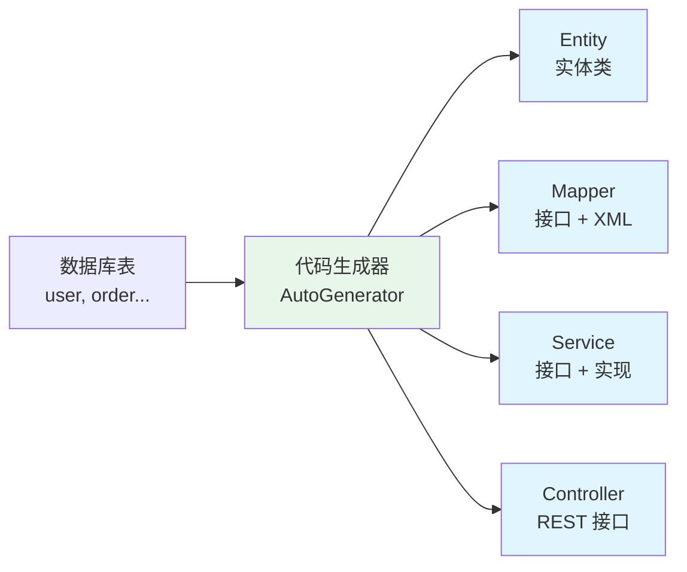
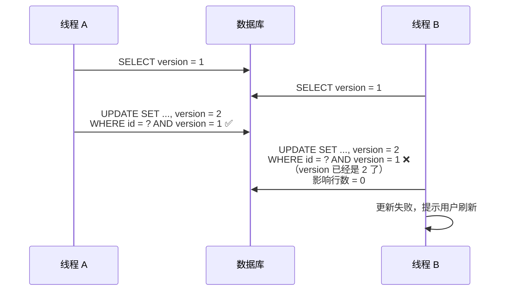

# MyBatis-Plus 实战

> MyBatis-Plus（简称 MP）是一个 MyBatis 的增强工具，在 MyBatis 的基础上**只做增强不做改变**。它提供了通用 CRUD、条件构造器、分页插件、代码生成器、乐观锁、逻辑删除等开箱即用的功能，让你的 DAO 层开发效率提升 80% 以上。核心原则：**通用操作不写 SQL，复杂操作写 SQL**。

## MyBatis-Plus vs 原生 MyBatis

| 维度 | 原生 MyBatis | MyBatis-Plus |
|------|-------------|--------------|
| 单表 CRUD | 每个方法都要写 XML | **零 SQL，继承 BaseMapper 即可** |
| 条件查询 | 手写动态 SQL | **Wrapper 链式调用** |
| 分页 | 手写 LIMIT 或用 PageHelper | **内置分页插件** |
| 代码生成 | 无 | **内置代码生成器** |
| 乐观锁 | 手写拦截器 | **内置插件** |
| 逻辑删除 | 手写条件 | **配置注解即可** |
| 自动填充 | 无 | **创建时间/更新时间自动填充** |

::: tip MP 的设计哲学
MP 不会替代 MyBatis，它只是帮你处理 80% 的通用 CRUD。遇到复杂查询（多表 JOIN、复杂聚合），仍然用原生 MyBatis 的 XML 方式。**简单的事情简单做，复杂的事情能做**。
:::

---

## 快速开始

### 引入依赖

```xml
<dependency>
    <groupId>com.baomidou</groupId>
    <artifactId>mybatis-plus-spring-boot3-starter</artifactId>
    <version>3.5.5</version>
</dependency>
```

### 三个步骤上手


```java
// 1. 实体类
@TableName("user")
public class User {
    @TableId(type = IdType.ASSIGN_ID)  // 雪花算法生成 ID
    private Long id;

    private String username;
    private String email;
    private Integer age;

    @TableField(fill = FieldFill.INSERT)  // 自动填充
    private LocalDateTime createTime;

    @TableField(fill = FieldFill.INSERT_UPDATE)
    private LocalDateTime updateTime;

    @TableLogic  // 逻辑删除
    private Integer deleted;
}

// 2. Mapper 接口
@Mapper
public interface UserMapper extends BaseMapper<User> {
    // 继承 BaseMapper 就拥有了 17 个通用方法！
    // 不需要写任何 XML
}

// 3. 使用
@Service
public class UserService {
    @Autowired
    private UserMapper userMapper;

    public User getById(Long id) {
        return userMapper.selectById(id);
    }
}
```

### BaseMapper 内置的 17 个方法

| 方法 | 说明 | SQL |
|------|------|-----|
| `selectById(id)` | 根据 ID 查询 | `SELECT * FROM user WHERE id = ?` |
| `selectBatchIds(ids)` | 根据 ID 批量查询 | `SELECT * FROM user WHERE id IN (...)` |
| `selectByMap(map)` | 根据 Map 条件查询 | `SELECT * FROM user WHERE name = ? AND age = ?` |
| `selectOne(wrapper)` | 根据条件查询单条 | 动态拼接 WHERE |
| `selectList(wrapper)` | 根据条件查询列表 | 动态拼接 WHERE |
| `selectPage(page, wrapper)` | 分页查询 | `SELECT * FROM user WHERE ... LIMIT ?, ?` |
| `selectCount(wrapper)` | 条件计数 | `SELECT COUNT(*) FROM user WHERE ...` |
| `insert(entity)` | 插入一条 | `INSERT INTO user (...) VALUES (...)` |
| `insertBatch(entityList)` | 批量插入 | `INSERT INTO user VALUES (...), (...)` |
| `updateById(entity)` | 根据 ID 更新 | `UPDATE user SET ... WHERE id = ?` |
| `update(entity, wrapper)` | 根据条件更新 | `UPDATE user SET ... WHERE ...` |
| `deleteById(id)` | 根据 ID 删除 | `DELETE FROM user WHERE id = ?` |
| `deleteBatchIds(ids)` | 根据 ID 批量删除 | `DELETE FROM user WHERE id IN (...)` |
| `deleteByMap(map)` | 根据 Map 条件删除 | `DELETE FROM user WHERE ...` |
| `delete(wrapper)` | 根据条件删除 | `DELETE FROM user WHERE ...` |

---

## 条件构造器——Wrapper

Wrapper 是 MyBatis-Plus 最强大的特性之一，用链式调用替代动态 SQL。

### 三种 Wrapper

| Wrapper | 说明 | 适用场景 |
|---------|------|---------|
| **QueryWrapper** | 查询条件 | SELECT 操作 |
| **UpdateWrapper** | 更新条件 | UPDATE 操作 |
| **LambdaQueryWrapper** | Lambda 版查询 | **推荐！编译期检查列名** |

::: tip 为什么推荐 LambdaQueryWrapper？
`QueryWrapper` 用字符串指定列名（如 `.eq("username", "张三")`），列名写错了编译不报错，运行才出错。`LambdaQueryWrapper` 用方法引用（如 `.eq(User::getUsername, "张三")`），**编译期就能发现列名错误**，重构时也更安全。
:::

### LambdaQueryWrapper 用法大全

```java
// 基础查询
LambdaQueryWrapper<User> wrapper = new LambdaQueryWrapper<>();
wrapper.eq(User::getUsername, "张三")           // username = '张三'
       .ne(User::getAge, 0)                    // AND age != 0
       .gt(User::getAge, 18)                   // AND age > 18
       .ge(User::getAge, 18)                   // AND age >= 18
       .lt(User::getAge, 60)                   // AND age < 60
       .le(User::getAge, 60)                   // AND age <= 60
       .between(User::getAge, 18, 60)          // AND age BETWEEN 18 AND 60
       .like(User::getUsername, "张")           // AND username LIKE '%张%'
       .likeLeft(User::getUsername, "三")       // AND username LIKE '%三'
       .likeRight(User::getUsername, "张")      // AND username LIKE '张%'
       .isNull(User::getDeleteTime)             // AND delete_time IS NULL
       .isNotNull(User::getEmail)               // AND email IS NOT NULL
       .in(User::getStatus, 1, 2, 3)           // AND status IN (1, 2, 3)
       .notIn(User::getStatus, 0)               // AND status NOT IN (0)
       .orderByDesc(User::getCreateTime)        // ORDER BY create_time DESC
       .last("LIMIT 10");                       // 拼接原生 SQL（慎用）

List<User> users = userMapper.selectList(wrapper);
```

### 条件组合

```java
LambdaQueryWrapper<User> wrapper = new LambdaQueryWrapper<>();

// AND（默认）
wrapper.eq(User::getStatus, 1)
       .eq(User::getAge, 18);

// OR
wrapper.eq(User::getStatus, 1)
       .or()
       .eq(User::getStatus, 2);

// 嵌套 OR：(status = 1 AND age > 18) OR (status = 2)
wrapper.and(w -> w.eq(User::getStatus, 1).gt(User::getAge, 18))
       .or(w -> w.eq(User::getStatus, 2));

// IN 子查询：age IN (SELECT age FROM vip_user)
wrapper.inSql(User::getAge, "SELECT age FROM vip_user");

// EXISTS 子查询
wrapper.exists("SELECT 1 FROM order WHERE order.user_id = user.id");

// SELECT 指定列（避免 SELECT *）
wrapper.select(User::getId, User::getUsername, User::getEmail);
```

::: warning wrapper.last() 的安全风险
`wrapper.last("LIMIT 10")` 直接拼接原生 SQL，可能有 SQL 注入风险。尽量用 MP 提供的分页方法 `selectPage()` 替代。
:::

---

## 分页查询

### 配置分页插件

```java
@Configuration
public class MyBatisPlusConfig {

    @Bean
    public MybatisPlusInterceptor mybatisPlusInterceptor() {
        MybatisPlusInterceptor interceptor = new MybatisPlusInterceptor();
        // 分页插件（MySQL 用 MySQL 语法）
        interceptor.addInnerInterceptor(new PaginationInnerInterceptor(DbType.MYSQL));
        return interceptor;
    }
}
```

### 使用分页

```java
// 分页查询
Page<User> page = new Page<>(1, 10);  // 第 1 页，每页 10 条
LambdaQueryWrapper<User> wrapper = new LambdaQueryWrapper<>();
wrapper.eq(User::getStatus, 1)
       .orderByDesc(User::getCreateTime);

Page<User> result = userMapper.selectPage(page, wrapper);

// 获取结果
List<User> records = result.getRecords();   // 当前页数据
long total = result.getTotal();              // 总记录数
long pages = result.getPages();              // 总页数
long current = result.getCurrent();          // 当前页
long size = result.getSize();                // 每页大小

// 分页信息返回给前端
return PageResult.of(records, total, current, size);
```

::: tip 分页查询的性能注意
- `COUNT(*)` 和数据查询是**两条 SQL**，大数据量时 COUNT 可能很慢
- MP 支持配置 `optimizeCountSql = true` 自动优化 COUNT SQL
- 如果不需要总数，可以用 `Page<User> page = new Page<>(1, 10, false)` 跳过 COUNT
:::

---

## 高级特性

### 代码生成器

MP 的代码生成器可以根据数据库表自动生成 Entity、Mapper、Service、Controller，减少重复劳动。



```java
// 代码生成器配置
FastAutoGenerator.create("jdbc:mysql://localhost:3306/mydb", "root", "password")
    .globalConfig(builder -> builder.author("coolzhul").outputDir("src/main/java"))
    .packageConfig(builder -> builder.parent("com.example"))
    .strategyConfig(builder -> builder
        .addInclude("user", "order", "product")  // 要生成的表
        .entityBuilder()
            .enableLombok()                        // 启用 Lombok
            .enableFileOverride()                   // 覆盖已生成文件
            .logicDeleteColumnName("deleted")       // 逻辑删除字段
        .controllerBuilder()
            .enableRestStyle()                      // REST 风格
    )
    .execute();
```

### 自动填充

创建时间和更新时间不需要每次手动设置，MP 可以自动填充：

```java
@Component
public class MyMetaObjectHandler implements MetaObjectHandler {

    @Override
    public void insertFill(MetaObject metaObject) {
        this.strictInsertFill(metaObject, "createTime", LocalDateTime.class, LocalDateTime.now());
        this.strictInsertFill(metaObject, "updateTime", LocalDateTime.class, LocalDateTime.now());
        this.strictInsertFill(metaObject, "createBy", String.class, getCurrentUsername());
    }

    @Override
    public void updateFill(MetaObject metaObject) {
        this.strictUpdateFill(metaObject, "updateTime", LocalDateTime.class, LocalDateTime.now());
        this.strictUpdateFill(metaObject, "updateBy", String.class, getCurrentUsername());
    }
}
```

### 逻辑删除

删除操作不真正删除数据，而是将 `deleted` 字段设为 1。查询时自动过滤已删除的数据。

```java
@TableName("user")
public class User {
    @TableLogic
    private Integer deleted;  // 0 = 正常，1 = 已删除
}
```

```yaml
# application.yml
mybatis-plus:
  global-config:
    db-config:
      logic-delete-field: deleted     # 逻辑删除字段
      logic-delete-value: 1           # 删除后的值
      logic-not-delete-value: 0       # 未删除的值
```

::: warning 逻辑删除的注意事项
1. 逻辑删除后 `deleteById()` 变成了 `UPDATE SET deleted = 1`
2. `selectById()` 自动加 `WHERE deleted = 0`
3. 全表更新/删除仍然会操作所有数据（包括逻辑删除的），要小心
4. 逻辑删除的数据在唯一索引上可能冲突（如 username 唯一，删除后重建同名用户会报错）
:::

### 乐观锁



```java
@Version
private Integer version;  // 乐观锁版本号字段
```

```java
@Configuration
public class MyBatisPlusConfig {
    @Bean
    public MybatisPlusInterceptor mybatisPlusInterceptor() {
        MybatisPlusInterceptor interceptor = new MybatisPlusInterceptor();
        // 乐观锁插件（必须放在分页插件前面）
        interceptor.addInnerInterceptor(new OptimisticLockerInnerInterceptor());
        // 分页插件
        interceptor.addInnerInterceptor(new PaginationInnerInterceptor(DbType.MYSQL));
        return interceptor;
    }
}
```

::: tip 乐观锁 vs 悲观锁
| 维度 | 乐观锁 | 悲观锁 |
|------|--------|--------|
| 实现方式 | version 字段 + CAS | `SELECT ... FOR UPDATE` |
| 性能 | 高（无锁） | 低（阻塞） |
| 冲突处理 | 更新失败，重试或提示 | 排队等待 |
| 适用场景 | 读多写少、冲突概率低 | 写多、冲突概率高 |

MP 的乐观锁适合大多数场景，如果业务要求"必须成功"（如秒杀扣库存），可以用悲观锁或 Redis 原子操作。
:::

---

## Service 层——IService

MP 不仅增强了 Mapper，还提供了 `IService` 接口，封装了更丰富的业务级方法：

```java
// Service 接口
public interface UserService extends IService<User> {
}

// Service 实现
@Service
public class UserServiceImpl extends ServiceImpl<UserMapper, User> implements UserService {
}

// 使用
@Service
public class OrderService {

    @Autowired
    private UserService userService;

    public void batchCreate() {
        // 批量保存
        userService.saveBatch(userList, 500);  // 每批 500 条

        // 批量保存或更新
        userService.saveOrUpdateBatch(userList);

        // 保存或更新单条
        User user = new User();
        user.setId(1L);
        user.setUsername("新名字");
        userService.saveOrUpdate(user);  // 有 ID 就更新，没有就插入

        // 判断是否存在
        boolean exists = userService.lambdaQuery()
            .eq(User::getUsername, "张三")
            .exists();

        // 链式查询
        User one = userService.lambdaQuery()
            .eq(User::getUsername, "张三")
            .one();
    }
}
```

::: tip Lambda 链式查询的便捷性
`IService` 提供了 `lambdaQuery()` 和 `lambdaUpdate()` 方法，可以直接在 Service 层链式调用，**不需要创建 Wrapper 对象**，代码更简洁。这是 MP 最受欢迎的特性之一。
:::

---

## 性能优化建议

| 优化点 | 说明 |
|--------|------|
| **避免 SELECT *** | 用 `wrapper.select()` 指定需要的列 |
| **批量操作** | 用 `saveBatch()` / `insertBatchSomeColumn()`，每批 500-1000 条 |
| **分页查询 COUNT 优化** | 大数据量时 `new Page(1, 10, false)` 跳过 COUNT |
| **索引配合** | Wrapper 条件查询的字段必须有索引 |
| **慎用 wrapper.last()** | 直接拼接 SQL 有注入风险 |
| **逻辑删除注意唯一索引** | 已删除数据在唯一索引上可能冲突 |

---

## 面试高频题

**Q1：MyBatis-Plus 和 MyBatis 是什么关系？**

MyBatis-Plus 是 MyBatis 的增强工具，不是替代品。它在 MyBatis 基础上提供了通用 CRUD、条件构造器、分页插件、代码生成器等功能，**不改变 MyBatis 的任何行为**。复杂查询仍然用原生 MyBatis 的 XML 方式。

**Q2：MyBatis-Plus 的逻辑删除是怎么实现的？**

配置 `@TableLogic` 注解后，`deleteById()` 变成了 `UPDATE SET deleted = 1`，`selectById()` 自动加 `WHERE deleted = 0`。本质是通过拦截 SQL 并改写来实现的。注意：逻辑删除的数据在唯一索引上可能冲突。

**Q3：MyBatis-Plus 的乐观锁原理？**

实体类中加 `@Version` 注解的 version 字段。查询时获取 version，更新时 `WHERE id = ? AND version = ?`，同时 `SET version = version + 1`。如果 version 不匹配（被其他线程修改过），更新影响行数为 0，表示更新失败。

**Q4：Wrapper 和 XML 混用需要注意什么？**

可以混用。简单条件用 Wrapper，复杂查询（多表 JOIN、子查询）用 XML。注意：如果在 XML 中自定义了和 BaseMapper 同名的方法（如 `selectById`），会**覆盖** BaseMapper 的方法。

## 延伸阅读

- [MyBatis 核心原理](mybatis.md) — 原生 MyBatis 架构、动态 SQL、缓存
- [MySQL](../database/mysql.md) — 索引优化、SQL 调优
- [Spring Boot](../spring/boot.md) — 自动配置原理
