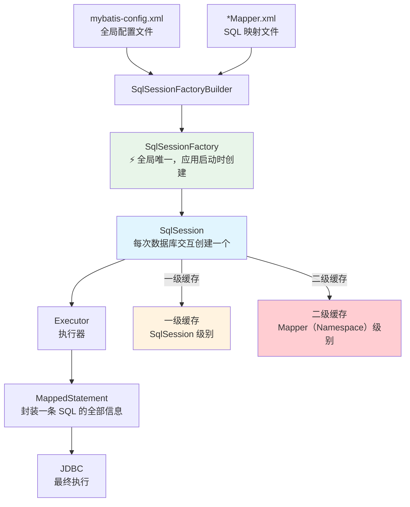
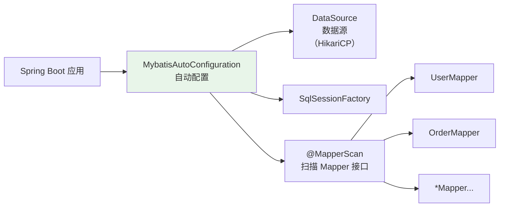
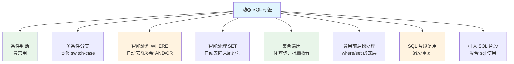
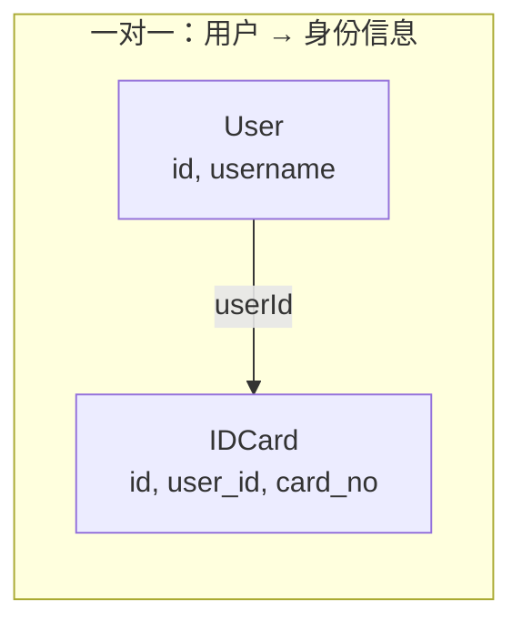
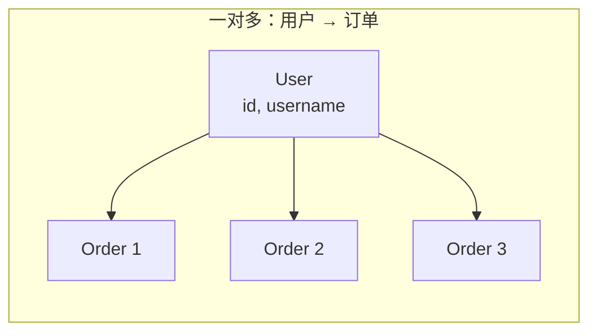
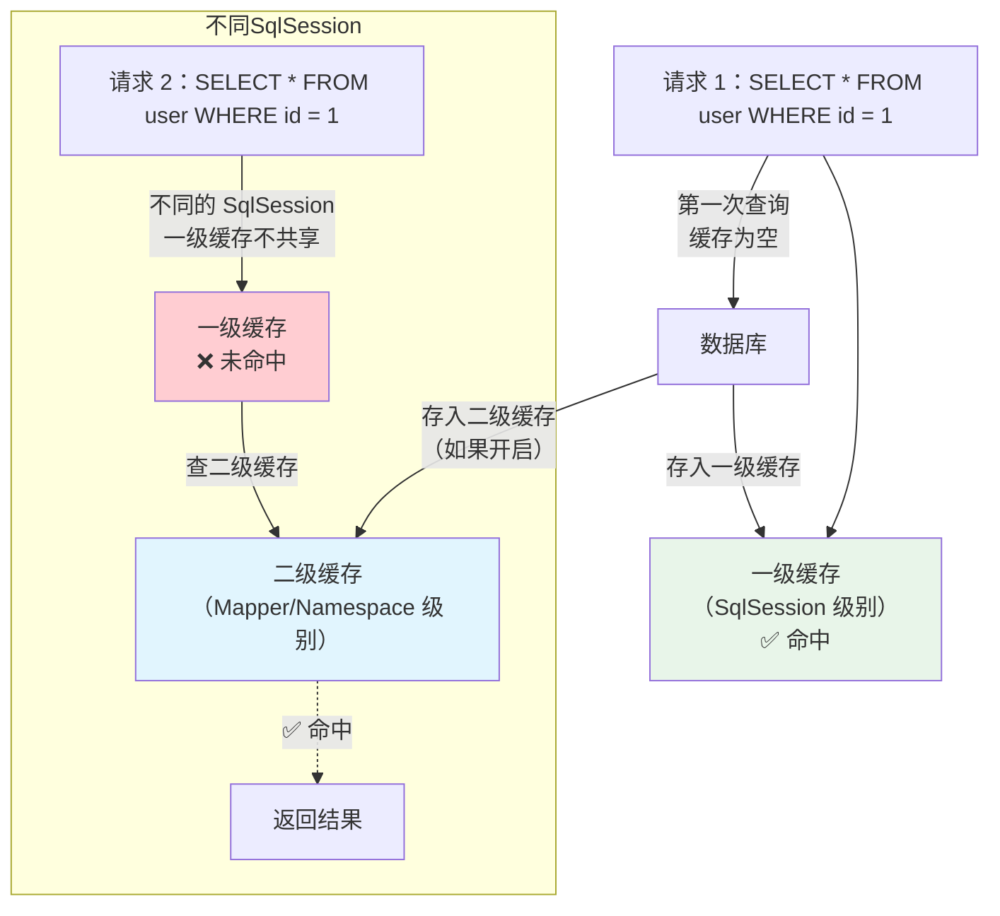

# MyBatis 核心原理

> MyBatis 是一款优秀的半自动 ORM 框架——它不会自动生成 SQL（不像 Hibernate/JPA），而是让开发者自己控制 SQL，同时提供了对象关系映射、动态 SQL、缓存等强大功能。这种"SQL 在我手"的灵活性，是 MyBatis 在国内 Java 圈大受欢迎的核心原因。

## MyBatis vs Hibernate vs JPA

::: tip 先搞清楚 ORM 的定位
ORM 框架的选择没有绝对的好坏，取决于团队和场景。理解三者的区别，才能做出正确的技术选型。
:::

| 维度 | MyBatis | Hibernate | Spring Data JPA |
|------|---------|-----------|----------------|
| SQL 控制 | **开发者手写** | 框架自动生成 | 框架自动生成（方法名推导） |
| 学习曲线 | 低（会 SQL 就行） | 高（要学 HQL、Session、懒加载） | 中（方法名命名规则） |
| 性能优化 | **完全可控** | 复杂场景难以优化 | 复杂场景需要手写 JPQL |
| 动态 SQL | **原生支持，非常强大** | Criteria API（啰嗦） | Specification（较复杂） |
| 数据库移植 | 差（SQL 绑定数据库） | 好（Dialect 自动适配） | 好（Dialect 自动适配） |
| 国内使用率 | ⭐⭐⭐⭐⭐ | ⭐⭐ | ⭐⭐⭐ |

::: info 选型建议
- **国内互联网公司**：MyBatis-Plus 是主流（阿里、美团、字节都在用）
- **对数据库无关性要求高**：Hibernate / JPA
- **快速开发简单 CRUD**：Spring Data JPA
- **复杂查询 + 性能要求高**：MyBatis
:::

---

## 核心架构

### MyBatis 的"心脏"——SqlSessionFactory



**核心组件说明：**

| 组件 | 作用 | 生命周期 |
|------|------|---------|
| **SqlSessionFactoryBuilder** | 解析配置文件，创建 SqlSessionFactory | 用完即弃（方法局部变量） |
| **SqlSessionFactory** | 创建 SqlSession，全局唯一 | **应用级**（和应用同生共死） |
| **SqlSession** | 执行 SQL、获取 Mapper、管理事务 | **请求级**（不能共享，用完关闭） |
| **Executor** | 真正执行 SQL 的组件 | SqlSession 级别 |
| **MappedStatement** | 封装一条 SQL 的所有信息（id、SQL、参数映射、结果映射） | 全局级别 |

::: warning SqlSession 不是线程安全的
SqlSession 每次请求都应该创建新的，用完必须关闭。在 Spring 中，SqlSession 由 `SqlSessionTemplate` 管理（线程安全），开发者通常不需要手动操作。
:::

### Spring Boot 整合 MyBatis

Spring Boot 整合 MyBatis 非常简单，核心依赖就一个：

```xml
<!-- MyBatis Spring Boot Starter -->
<dependency>
    <groupId>org.mybatis.spring.boot</groupId>
    <artifactId>mybatis-spring-boot-starter</artifactId>
    <version>3.0.3</version>
</dependency>
```



**核心配置项：**

| 配置项 | 说明 | 推荐值 |
|--------|------|--------|
| `mybatis.mapper-locations` | Mapper XML 路径 | `classpath:mapper/*.xml` |
| `mybatis.type-aliases-package` | 实体类别名包 | `com.example.entity` |
| `mybatis.configuration.map-underscore-to-camel-case` | 下划线转驼峰 | `true` |
| `mybatis.configuration.log-impl` | SQL 日志 | `org.apache.ibatis.logging.stdout.StdOutImpl`（开发环境） |

---

## Mapper 接口与 XML 映射

### 基本映射

```java
// Mapper 接口
@Mapper
public interface UserMapper {
    User findById(Long id);
    List<User> findByCondition(@Param("name") String name, @Param("age") Integer age);
    int insert(User user);
    int updateById(User user);
    int deleteById(Long id);
}
```

```xml
<!-- Mapper XML -->
<?xml version="1.0" encoding="UTF-8"?>
<!DOCTYPE mapper PUBLIC "-//mybatis.org//DTD Mapper 3.0//EN"
  "http://mybatis.org/dtd/mybatis-3-mapper.dtd">
<mapper namespace="com.example.mapper.UserMapper">

    <select id="findById" resultType="User">
        SELECT id, username, email, age, create_time
        FROM user
        WHERE id = #{id}
    </select>

    <insert id="insert" useGeneratedKeys="true" keyProperty="id">
        INSERT INTO user (username, email, age)
        VALUES (#{username}, #{email}, #{age})
    </insert>

</mapper>
```

### #{} vs ${} 的区别——面试必问

| 维度 | `#{}` | `${}` |
|------|-------|-------|
| 处理方式 | **预编译参数占位符**（PreparedStatement） | **字符串拼接**（Statement） |
| SQL 注入 | ✅ 安全，自动转义 | ❌ 不安全，直接拼接 |
| 类型 | 任意类型（自动处理） | 只能传字符串 |
| 适用场景 | **95% 的场景都用这个** | 动态表名、动态列名、ORDER BY |

```xml
<!-- ✅ 安全：预编译 -->
<select id="findById" resultType="User">
    SELECT * FROM user WHERE id = #{id}
    -- 实际执行：SELECT * FROM user WHERE id = ?
</select>

<!-- ❌ 危险：SQL 注入风险 -->
<select id="findById" resultType="User">
    SELECT * FROM user WHERE id = ${id}
    -- 实际执行：SELECT * FROM user WHERE id = 1; DROP TABLE user; --
</select>

<!-- ✅ 合理使用 ${}：动态表名 -->
<select id="queryByTable" resultType="java.util.Map">
    SELECT * FROM ${tableName} WHERE id = #{id}
</select>

<!-- ✅ 合理使用 ${}：动态排序 -->
<select id="findUsers" resultType="User">
    SELECT * FROM user ORDER BY ${orderColumn} ${orderDir}
</select>
```

::: danger 记住：永远不要用 ${} 接收用户输入
`${}` 只能用在开发者可控的值上（如枚举值映射到列名）。用户输入永远用 `#{}`。如果面试官问"MyBatis 怎么防止 SQL 注入"，答案就是 **`#{}` 预编译**。
:::

---

## 动态 SQL——MyBatis 的杀手锏

动态 SQL 是 MyBatis 最强大的特性，可以根据条件动态拼接 SQL，彻底告别 Java 代码中的 `if-else` 字符串拼接。

### 核心标签一览



### `<if>` — 条件判断

```xml
<select id="findUsers" resultType="User">
    SELECT * FROM user
    WHERE 1 = 1
    <if test="name != null and name != ''">
        AND username LIKE CONCAT('%', #{name}, '%')
    </if>
    <if test="age != null">
        AND age = #{age}
    </if>
    <if test="email != null and email != ''">
        AND email = #{email}
    </if>
</select>
```

::: warning 为什么写 WHERE 1 = 1？
如果第一个 `<if>` 不满足，SQL 就会变成 `SELECT * FROM user WHERE AND age = 18`——语法错误！`WHERE 1 = 1` 保证了后面所有的 `<if>` 都能以 `AND` 开头。但更好的做法是用 `<where>` 标签（见下文）。
:::

### `<where>` — 智能处理 WHERE 子句

```xml
<select id="findUsers" resultType="User">
    SELECT * FROM user
    <where>
        <if test="name != null and name != ''">
            AND username LIKE CONCAT('%', #{name}, '%')
        </if>
        <if test="age != null">
            AND age = #{age}
        </if>
    </where>
</select>
```

`<where>` 会自动处理两个问题：
1. 如果所有 `<if>` 都不满足，**不生成 WHERE 关键字**
2. 如果第一个条件前面的 `AND/OR` 是多余的，**自动去除**

### `<foreach>` — 集合遍历

```xml
<!-- IN 查询 -->
<select id="findByIds" resultType="User">
    SELECT * FROM user
    WHERE id IN
    <foreach collection="ids" item="id" open="(" separator="," close=")">
        #{id}
    </foreach>
</select>

<!-- 批量插入 -->
<insert id="batchInsert">
    INSERT INTO user (username, email, age) VALUES
    <foreach collection="users" item="user" separator=",">
        (#{user.username}, #{user.email}, #{user.age})
    </foreach>
</insert>
```

::: tip foreach 的批量插入性能
MyBatis 的 `foreach` 批量插入实际上生成的是一条 SQL：`INSERT INTO user VALUES (...), (...), (...)`。MySQL 对单条 SQL 的大小有限制（默认 `max_allowed_packet = 4MB`），批量插入超过 1000 条时建议分批执行，每批 500-1000 条。
:::

### `<choose>` — 多条件分支

```xml
<select id="findUsers" resultType="User">
    SELECT * FROM user
    <where>
        <choose>
            <when test="id != null">
                AND id = #{id}
            </when>
            <when test="name != null and name != ''">
                AND username = #{name}
            </when>
            <otherwise>
                AND status = 1
            </otherwise>
        </choose>
    </where>
</select>
```

### `<sql>` + `<include>` — SQL 片段复用

```xml
<!-- 定义可复用的 SQL 片段 -->
<sql id="userColumns">
    id, username, email, age, status, create_time, update_time
</sql>

<!-- 使用 -->
<select id="findById" resultType="User">
    SELECT <include refid="userColumns"/>
    FROM user WHERE id = #{id}
</select>

<select id="findAll" resultType="User">
    SELECT <include refid="userColumns"/>
    FROM user WHERE status = 1
</select>
```

---

## 结果映射——ResultMap

### 简单映射

当数据库字段名和 Java 属性名一致时（或开启了驼峰转换），不需要 ResultMap：

```xml
<!-- 开启驼峰转换后：create_time → createTime -->
<resultMap id="userResultMap" type="User">
    <id property="id" column="id"/>
    <result property="username" column="username"/>
    <result property="createTime" column="create_time"/>
</resultMap>
```

### 一对一关联



```xml
<!-- 方式 1：嵌套查询（N+1 问题！） -->
<resultMap id="userWithIdCard" type="User">
    <id property="id" column="id"/>
    <result property="username" column="username"/>
    <association property="idCard" javaType="IDCard"
                 column="id" select="findIdCardByUserId"/>
</resultMap>

<!-- 方式 2：嵌套结果（推荐 ✅） -->
<resultMap id="userWithIdCard2" type="User">
    <id property="id" column="id"/>
    <result property="username" column="username"/>
    <association property="idCard" javaType="IDCard">
        <id property="id" column="card_id"/>
        <result property="cardNo" column="card_no"/>
    </association>
</resultMap>

<select id="findUserWithIdCard" resultMap="userWithIdCard2">
    SELECT u.id, u.username, c.id as card_id, c.card_no
    FROM user u
    LEFT JOIN id_card c ON u.id = c.user_id
    WHERE u.id = #{id}
</select>
```

::: danger 嵌套查询的 N+1 问题
方式 1（嵌套查询）会为每个用户额外执行一次 `findIdCardByUserId`，查 100 个用户 = 101 次 SQL。**生产环境严禁使用嵌套查询**，必须用方式 2（嵌套结果 + JOIN）。
:::

### 一对多关联



```xml
<resultMap id="userWithOrders" type="User">
    <id property="id" column="id"/>
    <result property="username" column="username"/>
    <collection property="orders" ofType="Order">
        <id property="id" column="order_id"/>
        <result property="orderNo" column="order_no"/>
        <result property="amount" column="amount"/>
    </collection>
</resultMap>

<select id="findUserWithOrders" resultMap="userWithOrders">
    SELECT u.id, u.username, o.id as order_id, o.order_no, o.amount
    FROM user u
    LEFT JOIN orders o ON u.id = o.user_id
    WHERE u.id = #{id}
</select>
```

---

## 缓存机制

### 一级缓存 vs 二级缓存



| 特性 | 一级缓存 | 二级缓存 |
|------|---------|---------|
| 作用范围 | **SqlSession**（同一次会话） | **Mapper/Namespace**（跨 SqlSession） |
| 默认开启 | ✅ 是 | ❌ 否（需要手动开启） |
| 存储位置 | 内存（HashMap） | 可自定义（内存/Redis/Ehcache） |
| 失效时机 | SqlSession 关闭 / 执行增删改 | 执行增删改（该 namespace 下全部清空） |
| 跨 Session 共享 | ❌ | ✅ |
| 实际使用 | **不用管，默认就有** | **生产环境一般不用** |

::: warning 二级缓存的坑
1. **多表查询会脏读**：关联查询涉及多个 namespace，只清空了当前 namespace 的缓存
2. **序列化问题**：实体类必须实现 `Serializable`
3. **数据一致性**：增删改操作会清空整个 namespace 的缓存，粒度太粗

**生产环境建议**：不要用 MyBatis 二级缓存，直接用 Redis 做分布式缓存。一级缓存也不需要关注，Spring 环境下每次请求都是新的 SqlSession。
:::

---

## 插件机制

MyBatis 的插件（Interceptor）机制允许你在 SQL 执行的四个关键节点进行拦截：

```mermaid
graph LR
    Executor["Executor"] -->|"拦截点 1"| Plugin1["插件<br/>（如：分页插件）"]
    Plugin1 --> StatementHandler["StatementHandler"]
    StatementHandler -->|"拦截点 2"| Plugin2["插件<br/>（如：SQL 日志）"]
    Plugin2 --> ParameterHandler["ParameterHandler"]
    ParameterHandler -->|"拦截点 3"| Plugin3["插件<br/>（如：参数加密）"]
    Plugin3 --> ResultSetHandler["ResultSetHandler"]
    ResultSetHandler -->|"拦截点 4"| Plugin4["插件<br/>（如：结果脱敏）"]

    style Plugin1 fill:#e8f5e9
    style Plugin2 fill:#fff3e0
    style Plugin3 fill:#e1f5fe
    style Plugin4 fill:#fce4ec
```



::: tip PageHelper 分页插件
PageHelper 是 MyBatis 最常用的分页插件，使用非常简单：

```java
// 在查询前调用 startPage，自动拦截 SQL 加上 LIMIT
PageHelper.startPage(pageNum, pageSize);
List<User> users = userMapper.findAll();
// 获取分页信息
PageInfo<User> pageInfo = new PageInfo<>(users);
```

原理：PageHelper 通过拦截 `Executor` 的 `query` 方法，在 SQL 后面拼接 `LIMIT offset, size`。ThreadLocal 保存分页参数，执行完后清除。
:::

---

## 面试高频题

**Q1：#{} 和 ${} 的区别？**

`#{}` 是预编译参数占位符，通过 PreparedStatement 设置参数，能防止 SQL 注入。`${}` 是字符串拼接，直接拼到 SQL 中，有 SQL 注入风险。绝大多数场景用 `#{}`，只有动态表名、动态列名、ORDER BY 等场景才用 `${}`。

**Q2：MyBatis 的一级缓存和二级缓存有什么区别？**

一级缓存是 SqlSession 级别的，默认开启，同一个 SqlSession 中相同的查询会走缓存，增删改会清空缓存。二级缓存是 Mapper（Namespace）级别的，需要手动开启，可以跨 SqlSession 共享，但有多表脏读和数据一致性问题，生产环境一般不用。

**Q3：MyBatis 如何防止 SQL 注入？**

`#{}` 底层使用 PreparedStatement 的参数占位符，对参数进行预编译和转义处理。`${}` 是直接拼接字符串，不安全。所以用户输入永远用 `#{}`，`${}` 只用于开发者可控的值（如列名、表名）。

**Q4：MyBatis 的延迟加载是怎么实现的？**

通过动态代理。当配置了 `lazyLoadingEnabled=true` 时，关联对象不会在查询时立即加载，而是返回一个代理对象。当第一次访问代理对象的属性时，触发真正的 SQL 查询。MyBatis 3.4+ 默认按需加载（aggressiveLazyLoading=false），即访问哪个属性就加载哪个。

**Q5：MyBatis 插件原理？**

MyBatis 使用 JDK 动态代理，对 Executor、StatementHandler、ParameterHandler、ResultSetHandler 四个对象创建代理。插件通过实现 `Interceptor` 接口的 `intercept()` 方法，在目标方法执行前后插入自定义逻辑。多个插件的执行顺序由 `@Intercepts` 注解的 `@Signature` 决定。

## 延伸阅读

- [MyBatis-Plus 实战](mybatis-plus.md) — 通用 CRUD、条件构造器、代码生成器
- [MySQL](../database/mysql.md) — 索引优化、SQL 调优
- [Spring Boot](../spring/boot.md) — 自动配置原理
