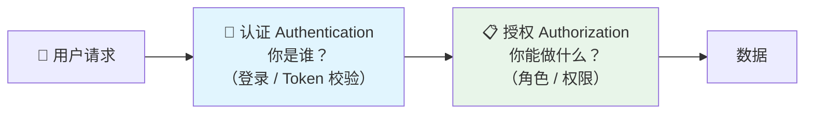
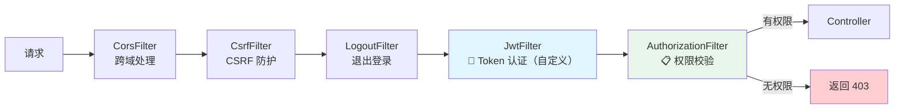
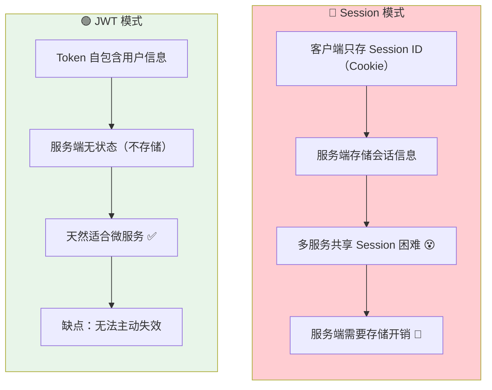
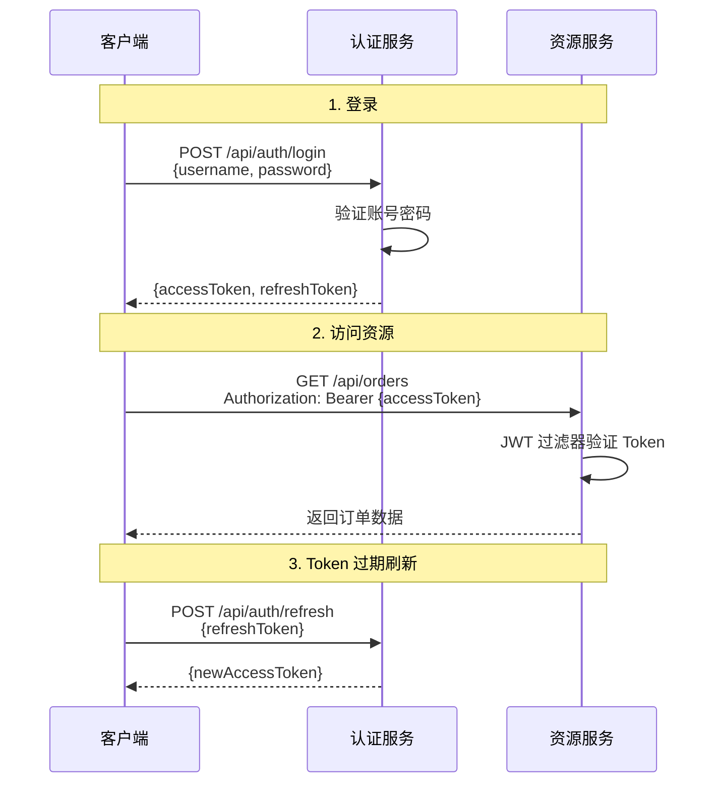
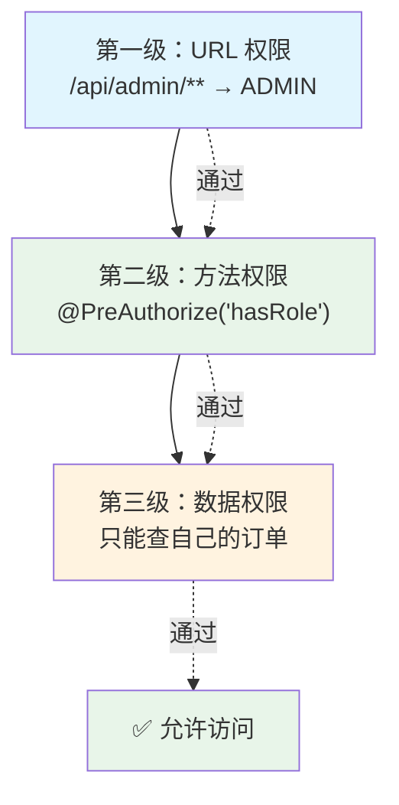
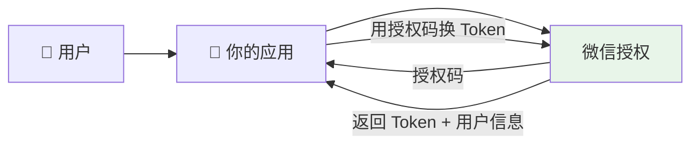

# Spring Security

> 安全不是"加个登录页"这么简单。认证（你是谁）、授权（你能做什么）、会话管理（登录状态怎么维护）、CSRF 防护（跨站请求伪造）——每一个环节都有坑。Spring Security 提供了一套完整的安全框架，但学习曲线确实陡峭。这篇文章从核心原理到实战方案，帮你系统掌握。

## 基础入门：安全到底在保护什么？

### 认证 vs 授权——先搞清这两个概念



::: tip 一句话区分
**认证** = 验证身份（你是张三吗？）→ **授权** = 验证权限（张三能删除订单吗？）
:::

### 最简配置——5 分钟上手

```java
@Configuration
@EnableWebSecurity
public class SecurityConfig {

    @Bean
    public SecurityFilterChain filterChain(HttpSecurity http) throws Exception {
        http
            .authorizeHttpRequests(auth -> auth
                .requestMatchers("/api/public/**").permitAll()  // 公开接口
                .requestMatchers("/api/admin/**").hasRole("ADMIN")  // 管理员
                .anyRequest().authenticated()  // 其他需要登录
            )
            .csrf(csrf -> csrf.disable())  // REST API 通常关闭 CSRF
            .sessionManagement(session -> session
                .sessionCreationPolicy(SessionCreationPolicy.STATELESS));  // 无状态
        return http.build();
    }
}
```

---

## 核心架构——过滤器链

Spring Security 的本质是一条**过滤器链**：每个请求进来，依次经过一系列 Filter，每个 Filter 负责一个安全关注点。



**核心对象**：

| 对象 | 说明 | 类比 |
|------|------|------|
| `Authentication` | 认证信息（用户 + 密码 + 权限） | 🪪 身份证 |
| `SecurityContext` | 持有当前请求的 Authentication | 👜 钱包（装身份证的地方） |
| `UserDetails` | 用户详细信息 | 📄 用户档案 |
| `UserDetailsService` | 加载用户信息的服务 | 🗄️ 档案柜 |

---

## JWT 认证——前后端分离的首选

### 为什么选 JWT 而不是 Session？



::: tip 最佳实践：双 Token 方案
- **Access Token**：短有效期（15-30 分钟），用于接口认证
- **Refresh Token**：长有效期（7 天），用于刷新 Access Token
- Access Token 过期 → 用 Refresh Token 换新的 → Refresh Token 过期 → 重新登录
:::

### JWT 认证流程



### JWT 工具类

```java
@Component
public class JwtUtils {

    @Value("${jwt.secret}")
    private String secret;

    @Value("${jwt.access-token-expiration:1800000}")  // 30 分钟
    private long accessTokenExpiration;

    // 生成 Access Token
    public String generateAccessToken(UserDetails userDetails) {
        Map<String, Object> claims = new HashMap<>();
        claims.put("roles", userDetails.getAuthorities().stream()
            .map(GrantedAuthority::getAuthority).toList());
        return Jwts.builder()
            .setClaims(claims)
            .setSubject(userDetails.getUsername())
            .setIssuedAt(new Date())
            .setExpiration(new Date(System.currentTimeMillis() + accessTokenExpiration))
            .signWith(SignatureAlgorithm.HS512, secret)
            .compact();
    }

    // 验证 Token
    public boolean validateToken(String token) {
        try {
            Jwts.parser().setSigningKey(secret).parseClaimsJws(token);
            return true;
        } catch (ExpiredJwtException e) {
            log.warn("Token 过期");
        } catch (SignatureException e) {
            log.warn("Token 签名错误（被篡改）");
        }
        return false;
    }
}
```

### JWT 过滤器——Token 认证的核心

```java
@Component
public class JwtAuthenticationFilter extends OncePerRequestFilter {

    @Autowired
    private JwtUtils jwtUtils;
    @Autowired
    private UserDetailsService userDetailsService;

    @Override
    protected void doFilterInternal(HttpServletRequest request,
            HttpServletResponse response, FilterChain chain)
            throws ServletException, IOException {

        // 1. 从 Header 中提取 Token
        String token = extractToken(request);

        // 2. 验证 Token 并设置认证信息
        if (token != null && jwtUtils.validateToken(token)) {
            String username = jwtUtils.getUsername(token);
            UserDetails userDetails = userDetailsService.loadUserByUsername(username);

            // 创建认证对象，放入 SecurityContext
            UsernamePasswordAuthenticationToken auth =
                new UsernamePasswordAuthenticationToken(
                    userDetails, null, userDetails.getAuthorities());
            SecurityContextHolder.getContext().setAuthentication(auth);
        }
        chain.doFilter(request, response);
    }

    private String extractToken(HttpServletRequest request) {
        String header = request.getHeader("Authorization");
        if (header != null && header.startsWith("Bearer ")) {
            return header.substring(7);
        }
        return null;
    }
}
```

::: danger JWT 安全注意事项
1. **密钥泄露 = 所有 Token 可伪造** → 密钥用配置中心或环境变量，不要硬编码
2. **不要在 Payload 中放敏感数据** → Base64 不是加密，Base64 解码就能看到内容
3. **必须使用 HTTPS** → 否则 Token 在网络传输中可被截获
4. **Token 过期时间要短** → Access Token 15-30 分钟
5. **退出登录** → 将 Token 加入 Redis 黑名单
:::

---

## 权限控制——三级防线

### 第一级：URL 模式权限

```java
.authorizeHttpRequests(auth -> auth
    .requestMatchers("/api/auth/**").permitAll()                        // 公开
    .requestMatchers("/api/admin/**").hasRole("ADMIN")                  // ADMIN 角色
    .requestMatchers("/api/user/**").hasAnyRole("USER", "ADMIN")        // USER 或 ADMIN
    .requestMatchers(HttpMethod.POST, "/api/orders/**").hasAuthority("order:create")  // 特定权限
)
```

### 第二级：方法级权限

```java
@EnableMethodSecurity(prePostEnabled = true)  // 在配置类上开启

// 角色检查
@PreAuthorize("hasRole('ADMIN')")

// 权限检查
@PreAuthorize("hasAuthority('user:write')")

// 只能操作自己的数据
@PreAuthorize("#id == authentication.principal.id")

// 自定义权限检查
@PreAuthorize("@permissionChecker.canAccessOrder(#orderId)")
```

### 第三级：数据权限

```java
@Component("permissionChecker")
public class PermissionChecker {

    public boolean canAccessOrder(Long orderId) {
        String currentUser = SecurityContextHolder.getContext()
            .getAuthentication().getName();
        Order order = orderMapper.selectById(orderId);
        return order != null && order.getUsername().equals(currentUser);
    }
}

// 使用
@PreAuthorize("@permissionChecker.canAccessOrder(#orderId)")
public Order getOrder(@PathVariable Long orderId) {
    return orderMapper.selectById(orderId);
}
```



---

## 密码加密——BCrypt

::: tip 为什么不用 MD5？
MD5 是哈希算法，不是加密算法。它**没有加盐**（相同密码哈希结果相同），而且**计算速度太快**（容易被暴力破解）。BCrypt 自带随机盐 + 慢哈希，是目前密码存储的最佳选择。
:::

```java
@Bean
public PasswordEncoder passwordEncoder() {
    return BCryptPasswordEncoder.getInstance();
}

// 注册时加密
String encoded = passwordEncoder.encode("123456");
// $2a$10$N.zmdr9k7uOCQb376NoUnuTJ8iAt6Z5EHsM8lE9lBOsl7iKTVKIUi

// 登录时验证
boolean matches = passwordEncoder.matches("123456", encoded);  // true
```

::: details BCrypt 的两个杀手锏
1. **自动加盐**：每次加密同一密码，结果都不同（`$2a$10$` 后面就是盐）
2. **可调成本因子**：`$2a$10$` 中的 `10` 表示 2^10 = 1024 轮哈希——计算很慢，暴力破解代价极高
:::

---

## OAuth2 简介——第三方登录



| 模式 | 流程 | 适用场景 |
|------|------|---------|
| **授权码模式** | 用户授权 → 获取授权码 → 换 Token | ⭐ Web 应用（最安全） |
| PKCE | 授权码 + 验证码 | SPA 单页应用 |
| 客户端模式 | client_id + client_secret → Token | 服务间调用（M2M） |
| 密码模式 | 用户名密码直接换 Token | 仅限高度信任的第一方应用 |

::: warning 隐式模式已被废弃
以前的隐式模式（Implicit）直接在 URL 中返回 Token，安全性差。现在统一使用授权码 + PKCE 替代。
:::

---

## 常见安全漏洞与防护

| 漏洞 | 危害 | 防护方案 |
|------|------|---------|
| 🔴 SQL 注入 | 窃取/篡改数据库 | 参数化查询（MyBatis `#{}`） |
| 🔴 XSS | 注入恶意脚本 | 输入过滤 + 输出转义 + CSP 头 |
| 🟡 CSRF | 冒充用户提交请求 | CSRF Token / JWT 无状态 |
| 🟡 越权访问 | A 用户访问 B 用户数据 | 三级权限控制 + 数据权限 |
| 🟡 暴力破解 | 穷举密码 | 登录次数限制 + 验证码 + IP 限流 |
| 🔵 接口安全 | 参数篡改/重放攻击 | 请求签名 + 时间戳校验 |

---

## 面试高频题

**Q1：Spring Security 的过滤器链是什么？**

一系列 Filter 按顺序处理请求，每个 Filter 负责一个安全关注点。`JwtAuthenticationFilter`（自定义）负责 Token 认证，`AuthorizationFilter` 负责权限校验。认证通过后设置 `Authentication` 到 `SecurityContext`，后续 Filter 和 Controller 都能获取当前用户信息。

**Q2：JWT 和 Session 的区别？**

JWT 无状态，Token 自包含用户信息，服务端不存储，适合微服务。Session 有状态，服务端存储会话，多服务共享困难。JWT 无法主动失效（需黑名单），Session 可随时销毁。推荐双 Token 方案（Access Token + Refresh Token）。

**Q3：如何防止密码被暴力破解？**

1) 限制登录次数（连续失败 N 次锁定）；2) 验证码（失败多次出现）；3) 密码复杂度要求；4) IP 限流；5) 异常登录告警（异地、设备变化）。

## 延伸阅读

- 上一篇：[Spring Cloud](cloud.md) — 微服务架构、服务治理
- [高并发架构](../architecture/high-concurrency.md) — 缓存、限流、降级
- [数据库优化](../database/mysql.md) — 索引、事务、分库分表
