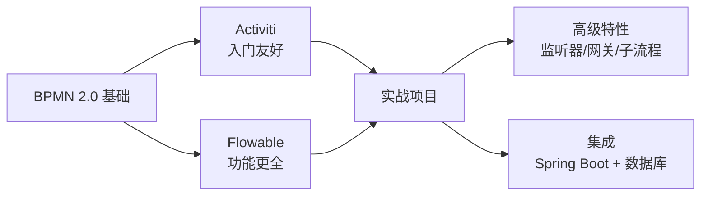

# 工作流引擎

工作流引擎用于管理和执行业务流程，将复杂的业务逻辑通过可视化流程图进行编排，实现业务流程的自动化。

## 为什么需要工作流引擎

::: tip 核心价值

- **流程可视化**：通过 BPMN 2.0 标准图形化描述业务流程
- **流程可变**：修改流程不需要改代码，只需更新流程定义
- **可追溯**：完整的流程执行历史，方便审计和问题排查
- **解耦业务**：业务逻辑与流程控制分离，降低系统复杂度

:::

## 引擎对比

| 特性 | Flowable | Activiti | Camunda |
|------|----------|----------|---------|
| 维护状态 | 活跃 | 活跃 | 活跃 |
| 性能 | 优秀 | 良好 | 优秀 |
| BPMN 支持 | 完整 | 完整 | 完整 |
| CMMN 支持 | ✅ | ❌ | ✅ |
| DMN 支持 | ✅ | ✅ | ✅ |
| Spring Boot 集成 | 原生 | 原生 | 原生 |
| 社区活跃度 | 高 | 中 | 高 |
| 流程设计器 | 内置 | 内置 | 内置 |

## 适用场景

- **审批流程**：请假、报销、采购等 OA 审批
- **订单流程**：电商订单状态流转
- **工单系统**：IT 运维工单流转
- **合规流程**：金融风控、合同审核
- **生产流程**：制造业生产工序编排

## 学习路径

## 模块内容

| 章节 | 描述 |
|------|------|
| [Flowable](./flowable.md) | 功能全面的现代工作流引擎 |
| [Activiti](./activiti.md) | 轻量级工作流引擎 |
