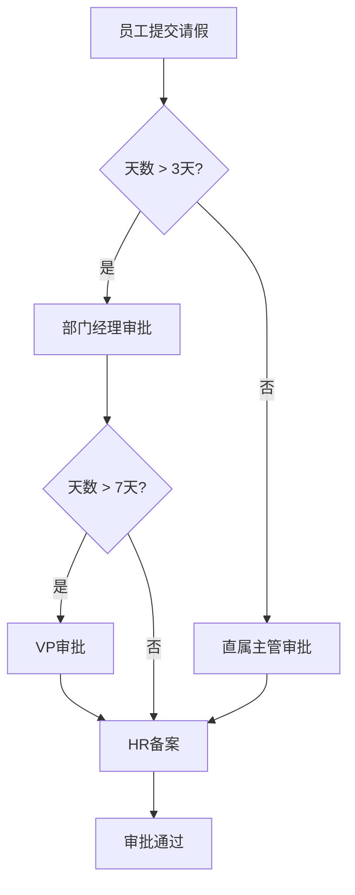
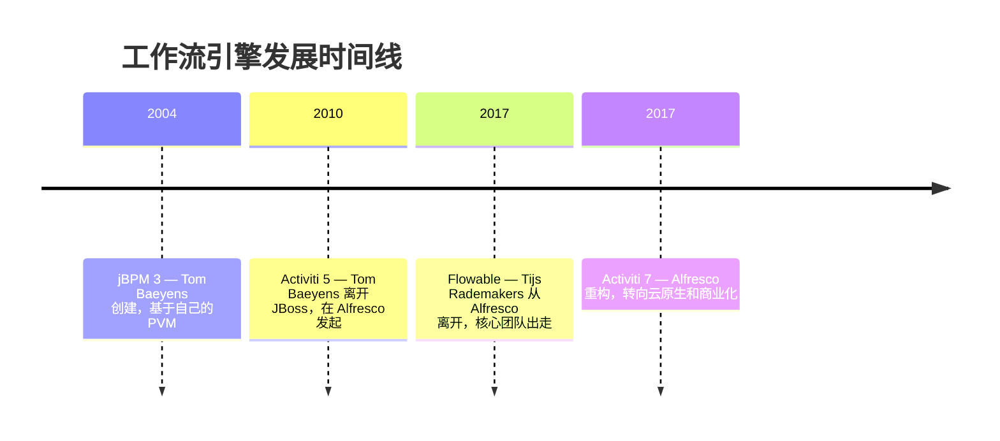
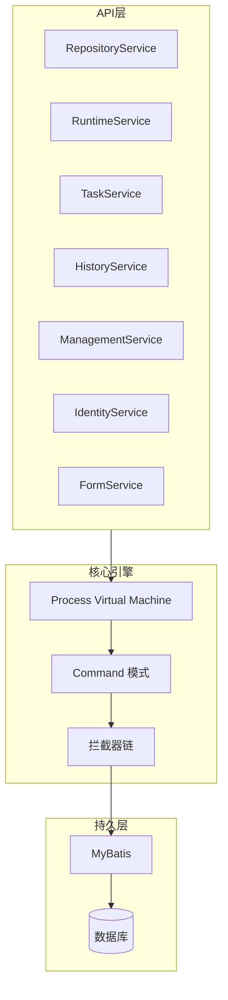
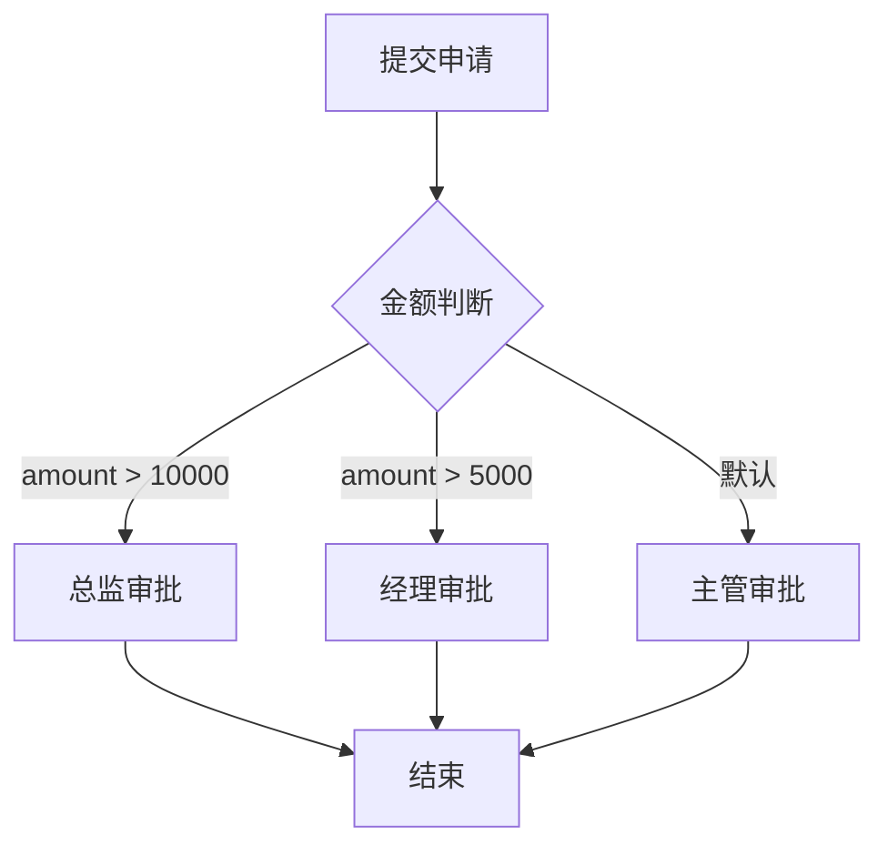
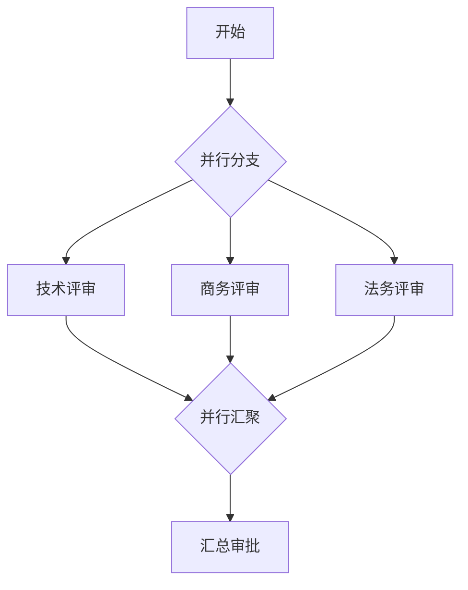
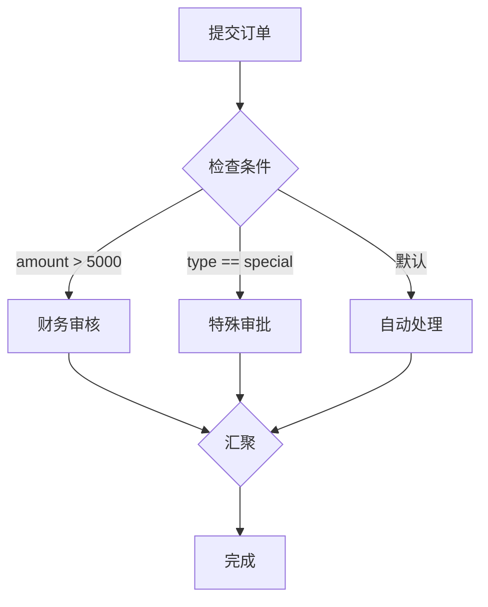
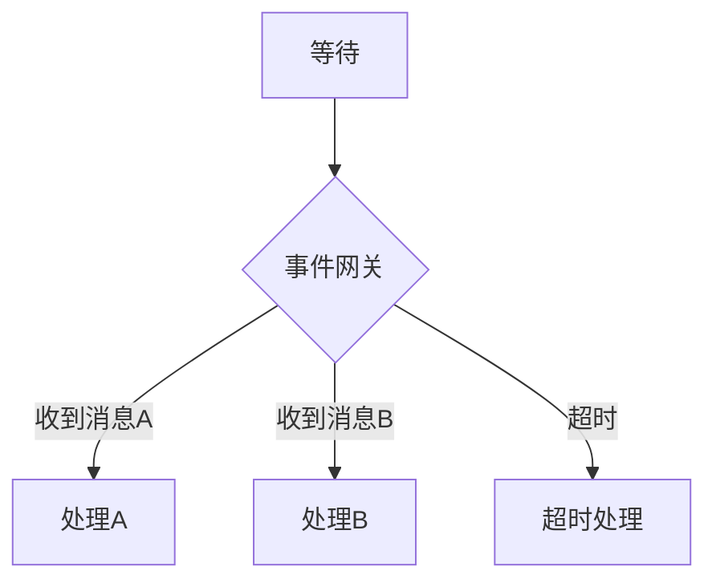
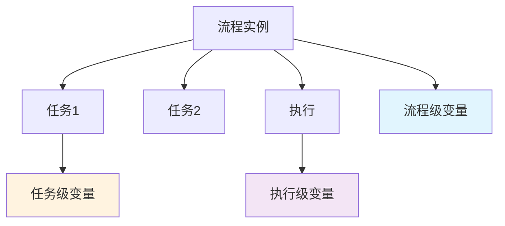
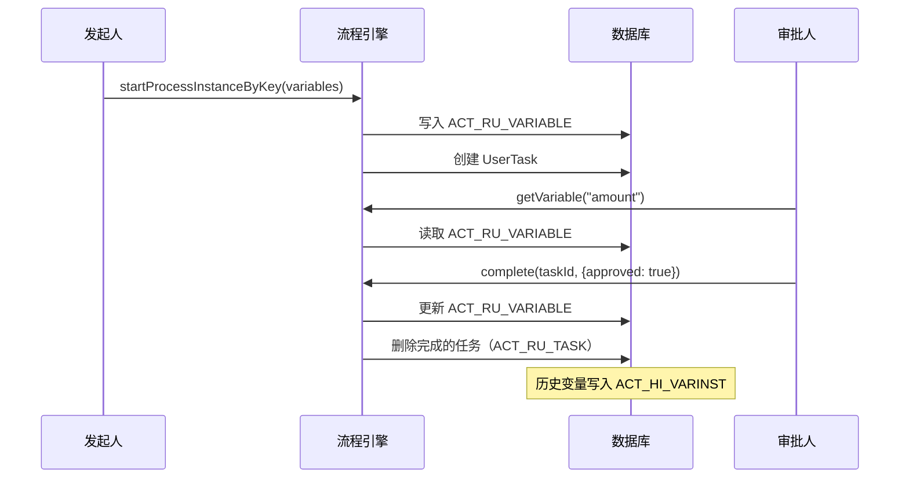
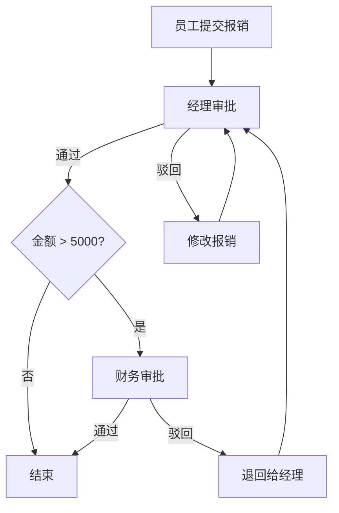

# Activiti 工作流引擎

> Activiti 是一个轻量级的工作流和业务流程管理（BPM）平台，基于 BPMN 2.0 标准。它从 jBPM 演化而来，后来又衍生出了 Flowable。这篇文章会把 Activiti 从入门到实战再到高级特性全部讲透。

## 一、基础入门

### 1.1 什么是工作流引擎

::: tip 一句话理解
工作流引擎就是帮你**管理业务流程流转**的系统。请假审批、报销审批、订单处理……凡是"按步骤走"的业务场景，都可以用工作流引擎来驱动，而不是在代码里写一堆 if-else。
:::

举个最直观的例子——请假审批：



如果没有工作流引擎，你得在代码里维护状态机、处理各种分支跳转、记录审批日志……想想就头大。有了工作流引擎，你只需要画一个流程图（BPMN），引擎自动帮你驱动流转。

### 1.2 工作流引擎的发展历史



整个故事挺狗血的：

1. **jBPM 3/4**（JBoss 时代）：Tom Baeyens 是 jBPM 的创始人，基于自研的 PVM
2. **Activiti 5**（2010）：Tom Baeyens 对 JBoss 不满，跳槽到 Alfresco，fork 出了 Activiti
3. **Flowable**（2017）：Tijs Rademakers 又对 Alfresco 不满，再次 fork，带走了大部分活跃贡献者
4. **Activiti 7**（2017）：Alfresco 留下的团队重构了 Activiti，主要转向商业化

::: warning 所以现在的情况是
- **Activiti 7**：Alfresco 商业化产品，开源版功能有限，社区活跃度下降
- **Flowable**：继承了 Activiti 的核心团队，社区活跃，功能更强
- 新项目建议优先考虑 Flowable（后面会详细对比）
:::

### 1.3 BPMN 2.0 标准概述

BPMN（Business Process Model and Notation）2.0 是 OMG 组织制定的业务流程建模标准。

**核心元素分类：**

| 分类 | 说明 | 常见元素 |
|------|------|----------|
| 事件（Event） | 流程中发生的事情 | 开始事件、结束事件、中间事件 |
| 活动（Activity） | 需要做的工作 | 用户任务、服务任务、脚本任务 |
| 网关（Gateway） | 控制流向 | 排他网关、并行网关、包容网关 |
| 序列流（Sequence Flow） | 连接元素的有向线 | 条件表达式、默认流 |
| 子流程（Sub-Process） | 嵌套的流程 | 嵌入子流程、调用活动 |

### 1.4 Activiti 架构设计

Activiti 的核心是 **PVM（Process Virtual Machine）**，负责解释和执行 BPMN 流程定义。



### 1.5 Activiti 版本演进

| 版本 | 时间 | 主要变化 |
|------|------|----------|
| **5.x** | 2010-2016 | 基础功能完善，Spring 集成成熟，社区黄金期 |
| **6.x** | 2017 | 统一历史数据模型，新增历史级别控制 |
| **7.x** | 2018+ | 完全重构，强制 Spring Security，面向云原生 |

::: danger 6.x → 7.x 的 Breaking Changes
- 移除了 `IdentityService` 的内置用户管理
- `FormService` 被弱化
- 很多 6.x 能直接用的功能在 7.x 被移除
- 需要 JDK 11+
:::

::: tip 版本选择建议
- **学习/中小项目**：Activiti 6.x（资料最多，最稳定）
- **新项目**：建议直接看 Flowable 6.x/7.x
:::

## 二、Spring Boot 集成

### 2.1 Maven 依赖

**Activiti 6（推荐学习用）：**

```xml
<dependency>
    <groupId>org.activiti</groupId>
    <artifactId>activiti-spring-boot-starter-basic</artifactId>
    <version>6.0.0</version>
</dependency>
<dependency>
    <groupId>com.mysql</groupId>
    <artifactId>mysql-connector-j</artifactId>
    <scope>runtime</scope>
</dependency>
```

**Activiti 7：**

```xml
<dependency>
    <groupId>org.activiti</groupId>
    <artifactId>activiti-spring-boot-starter</artifactId>
    <version>7.1.0.M6</version>
</dependency>
```

::: warning Activiti 6 vs 7 依赖区别
- 6.x 的 Starter 是 `activiti-spring-boot-starter-basic`，还有 `rest`、`spring-boot-starter` 等模块化 Starter
- 7.x 合并为单一的 `activiti-spring-boot-starter`，默认依赖 Spring Security
- 7.x 需要 JDK 11+，6.x 支持 JDK 8
:::

### 2.2 配置项详解

```yaml
spring:
  datasource:
    url: jdbc:mysql://localhost:3306/activiti_demo?useSSL=false&characterEncoding=utf8
    username: root
    password: root

activiti:
  check-process-definitions: true
  process-definition-location-prefix: classpath*:/processes/
  process-definition-location-suffixes:
    - "**.bpmn20.xml"
    - "**.bpmn"
  database-schema-update: true
  history-level: full
  async-executor-activate: true
  async-executor-core-pool-size: 8
  async-executor-max-pool-size: 32
  async-executor-queue-capacity: 100
  activity-font-name: 宋体
  label-font-name: 宋体
  annotation-font-name: 宋体
```

::: details history-level 历史级别详解
| 级别 | 说明 | 数据量 |
|------|------|--------|
| `none` | 不记录任何历史 | 最小 |
| `activity` | 记录流程实例和活动实例 | 较小 |
| `audit` | 流程+活动+任务+表单属性 | 中等（默认） |
| `full` | audit + 变量变更详情 | 最大 |
:::

### 2.3 自动配置原理

```java
// 简化的自动配置逻辑（理解原理用）
@Configuration
@EnableConfigurationProperties(ActivitiProperties.class)
public class ActivitiAutoConfiguration {

    @Bean
    public ProcessEngineConfiguration processEngineConfiguration(
            DataSource dataSource, PlatformTransactionManager txManager) {
        SpringProcessEngineConfiguration config = new SpringProcessEngineConfiguration();
        config.setDataSource(dataSource);
        config.setTransactionManager(txManager);
        config.setDatabaseSchemaUpdate("true");
        config.setHistoryLevel(HistoryLevel.FULL);
        return config;
    }

    @Bean
    public ProcessEngine processEngine(ProcessEngineConfiguration config) {
        return config.buildProcessEngine();
    }

    @Bean
    public RuntimeService runtimeService(ProcessEngine engine) {
        return engine.getRuntimeService();
    }
    // ... TaskService, HistoryService 等
}
```

::: tip 启动时自动做了什么
1. 根据 `database-schema-update` 配置创建/更新数据库表
2. 扫描流程文件路径
3. 自动部署流程定义（如果 check-process-definitions=true）
4. 初始化异步执行器
:::

### 2.4 数据库表结构

Activiti 启动后自动创建约 28 张表，按前缀分为 5 类：

| 前缀 | 表名 | 用途 |
|------|------|------|
| **ACT_RE_** | `RE_DEPLOYMENT` | 部署记录 |
| | `RE_PROCDEF` | 流程定义（ID、Key、版本、XML） |
| | `RE_MODEL` | 模型（在线设计器创建） |
| **ACT_RU_** | `RU_EXECUTION` | 运行时执行实例 |
| | `RU_TASK` | 运行时任务（当前待办） |
| | `RU_VARIABLE` | 运行时变量 |
| | `RU_IDENTITYLINK` | 运行时参与人关联 |
| | `RU_JOB` | 异步任务（Timer、Async） |
| | `RU_EVENT_SUBSCR` | 事件订阅 |
| **ACT_HI_** | `HI_PROCINST` | 历史流程实例 |
| | `HI_ACTINST` | 历史活动实例 |
| | `HI_TASKINST` | 历史任务实例 |
| | `HI_VARINST` | 历史变量 |
| | `HI_IDENTITYLINK` | 历史参与人 |
| | `HI_COMMENT` | 审批意见 |
| | `HI_ATTACHMENT` | 附件 |
| | `HI_DETAIL` | 变量变更详情 |
| **ACT_GE_** | `GE_BYTEARRAY` | 二进制资源（XML、图片） |
| | `GE_PROPERTY` | 引擎属性 |
| **ACT_ID_** | `ID_USER` | 用户 |
| | `ID_GROUP` | 用户组 |
| | `ID_MEMBERSHIP` | 用户-组关系 |
| | `ID_INFO` | 用户额外信息 |

::: warning ACT_RU_ 表是运行时数据
流程结束后 `ACT_RU_` 表数据会被删除，只保留在 `ACT_HI_` 中。查"当前待办"用 `RU_`，查"历史记录"用 `HI_`。
:::

### 2.5 核心 Service API 详解

```java
@Service
public class WorkflowDemoService {

    @Autowired private RepositoryService repositoryService;
    @Autowired private RuntimeService runtimeService;
    @Autowired private TaskService taskService;
    @Autowired private HistoryService historyService;
    @Autowired private ManagementService managementService;
    @Autowired private IdentityService identityService;
    @Autowired private FormService formService;

    // ====== RepositoryService ======
    public Deployment deployProcess() {
        return repositoryService.createDeployment()
            .name("报销审批流程")
            .addClasspathResource("processes/expense.bpmn20.xml")
            .deploy();
    }

    public List<ProcessDefinition> queryProcessDefinitions() {
        return repositoryService.createProcessDefinitionQuery()
            .processDefinitionKey("expenseProcess")
            .latestVersion()
            .orderByProcessDefinitionVersion().desc()
            .list();
    }

    // ====== RuntimeService ======
    public ProcessInstance startProcess(String businessKey,
                                         Map<String, Object> variables) {
        return runtimeService.startProcessInstanceByKey(
            "expenseProcess", businessKey, variables);
    }

    // ====== TaskService ======
    public List<Task> getMyTasks(String userId) {
        return taskService.createTaskQuery()
            .taskAssignee(userId)
            .orderByTaskCreateTime().desc()
            .list();
    }

    public List<Task> getGroupTasks(String userId) {
        return taskService.createTaskQuery()
            .taskCandidateUser(userId)
            .list();
    }

    public void claimTask(String taskId, String userId) {
        taskService.claim(taskId, userId);
    }

    public void completeTask(String taskId, Map<String, Object> variables) {
        taskService.complete(taskId, variables);
    }

    public void addComment(String taskId, String processInstanceId, String message) {
        taskService.addComment(taskId, processInstanceId, message);
    }

    public void transferTask(String taskId, String targetUserId) {
        taskService.setAssignee(taskId, targetUserId);
    }

    public void delegateTask(String taskId, String targetUserId) {
        taskService.delegateTask(taskId, targetUserId);
    }

    // ====== HistoryService ======
    public List<HistoricActivityInstance> getHistoricActivities(String processInstanceId) {
        return historyService.createHistoricActivityInstanceQuery()
            .processInstanceId(processInstanceId)
            .orderByHistoricActivityInstanceStartTime().asc()
            .list();
    }

    // ====== IdentityService（仅 6.x）======
    public void createUser(String userId, String firstName, String lastName) {
        User user = identityService.newUser(userId);
        user.setFirstName(firstName);
        user.setLastName(lastName);
        identityService.saveUser(user);
    }
}
```

::: tip Service 职责速记
- **RepositoryService**：管"定义"——部署、查询、删除流程定义
- **RuntimeService**：管"运行"——启动流程、操作变量、触发事件
- **TaskService**：管"任务"——查询待办、认领、完成、转办
- **HistoryService**：管"历史"——查审批记录、活动轨迹
- **ManagementService**：管"引擎"——自定义 SQL、Job 管理
- **IdentityService**：管"人"——用户和组（6.x 有效，7.x 废弃）
- **FormService**：管"表单"——动态表单数据
:::

## 三、BPMN 2.0 核心元素详解

### 3.1 事件（Event）

#### 3.1.1 开始事件

```xml
<!-- 空开始事件 -->
<startEvent id="start" name="开始" />

<!-- 定时器开始事件 -->
<startEvent id="timerStart" name="定时启动">
    <timerEventDefinition>
        <timeDate>2024-01-01T08:00:00</timeDate>
        <!-- <timeCycle>R3/PT10M</timeCycle> 每10分钟执行一次，共3次 -->
        <!-- <timeCycle>0 0 8 * * ?</timeCycle> 每天早上8点 -->
    </timerEventDefinition>
</startEvent>

<!-- 消息开始事件 -->
<startEvent id="msgStart" name="消息启动">
    <messageEventDefinition messageRef="orderCreatedMsg" />
</startEvent>
<message id="orderCreatedMsg" name="orderCreated" />

<!-- 信号开始事件 -->
<startEvent id="signalStart" name="信号启动">
    <signalEventDefinition signalRef="alertSignal" />
</startEvent>
<signal id="alertSignal" name="systemAlert" />

<!-- 错误开始事件（仅用于事件子流程）-->
<startEvent id="errorStart" isInterrupting="true">
    <errorEventDefinition errorRef="businessError" />
</startEvent>
<error id="businessError" errorCode="BIZ-001" />
```

#### 3.1.2 结束事件

```xml
<endEvent id="end" name="结束" />

<!-- 终止结束事件：立即终止整个流程 -->
<endEvent id="terminateEnd" name="终止">
    <terminateEventDefinition />
</endEvent>

<!-- 取消结束事件：用于取消事务子流程 -->
<endEvent id="cancelEnd" name="取消">
    <cancelEventDefinition />
</endEvent>

<!-- 错误结束事件：抛出错误 -->
<endEvent id="errorEnd" name="抛错">
    <errorEventDefinition errorRef="paymentError" />
</endEvent>
```

#### 3.1.3 中间事件

```xml
<!-- 定时器中间捕获事件 -->
<intermediateCatchEvent id="timerCatch" name="等待24小时">
    <timerEventDefinition>
        <timeDuration>PT24H</timeDuration>
    </timerEventDefinition>
</intermediateCatchEvent>

<!-- 信号中间抛出事件 -->
<intermediateThrowEvent id="signalThrow" name="发送信号">
    <signalEventDefinition signalRef="approveSignal" />
</intermediateThrowEvent>

<!-- 消息中间捕获事件 -->
<intermediateCatchEvent id="msgCatch" name="等待消息">
    <messageEventDefinition messageRef="reviewMsg" />
</intermediateCatchEvent>

<!-- 补偿中间抛出事件 -->
<intermediateThrowEvent id="compensationThrow" name="补偿">
    <compensateEventDefinition />
</intermediateThrowEvent>
```

::: tip ISO 8601 时间格式速查
| 格式 | 含义 | 示例 |
|------|------|------|
| `timeDate` | 绝对时间点 | `2024-01-01T08:00:00` |
| `timeDuration` | 持续时间 | `PT30M`（30分钟）、`P1D`（1天） |
| `timeCycle` | 周期 | `R3/PT10M`（3次/10分钟）、`R/P1D`（每天） |
:::

### 3.2 任务（Task）

#### 3.2.1 用户任务（UserTask）

```xml
<!-- 直接指定处理人 -->
<userTask id="managerApprove" name="经理审批"
          activiti:assignee="${manager}" />

<!-- 候选用户 -->
<userTask id="deptApprove" name="部门审批"
          activiti:candidateUsers="user1,user2,user3" />

<!-- 候选组 -->
<userTask id="financeApprove" name="财务审批"
          activiti:candidateGroups="finance,audit" />

<!-- 混合使用 + 任务监听器 -->
<userTask id="bossApprove" name="总监审批"
          activiti:assignee="${boss}"
          activiti:candidateUsers="${backupUsers}"
          activiti:candidateGroups="directors">
    <extensionElements>
        <activiti:taskListener event="create"
            delegateExpression="${notifyListener}" />
    </extensionElements>
</userTask>
```

```java
// 动态分配处理人
@Component("assigneeListener")
public class AssigneeListener implements TaskListener {
    @Autowired
    private UserService userService;

    @Override
    public void notify(DelegateTask delegateTask) {
        String dept = (String) delegateTask.getVariable("department");
        String manager = userService.getDeptManager(dept);
        delegateTask.setAssignee(manager);
    }
}
```

#### 3.2.2 服务任务（ServiceTask）

```xml
<!-- 指定 Java 类 -->
<serviceTask id="sendEmail" name="发送邮件"
             activiti:class="com.example.service.SendEmailDelegate" />

<!-- Spring Bean（推荐）-->
<serviceTask id="calcBonus" name="计算奖金"
             activiti:delegateExpression="${bonusCalculator}" />

<!-- 表达式 -->
<serviceTask id="updateStatus" name="更新状态"
             activiti:expression="#{expenseService.updateStatus(execution)}" />
```

```java
// 实现 JavaDelegate（推荐用 delegateExpression 方式）
@Component("bonusCalculator")
public class BonusCalculator implements JavaDelegate {
    @Autowired
    private BonusService bonusService;

    @Override
    public void execute(DelegateExecution execution) {
        Double baseSalary = (Double) execution.getVariable("baseSalary");
        Double bonus = bonusService.calculate(baseSalary);
        execution.setVariable("bonus", bonus);
    }
}
```

::: warning delegateExpression vs class
- `activiti:class`：每次 new 一个新实例，**无法使用 Spring 依赖注入**
- `activiti:delegateExpression`：从 Spring 容器获取 Bean，**推荐使用**
:::

#### 3.2.3 脚本任务（ScriptTask）

```xml
<scriptTask id="calcDiscount" name="计算折扣"
            activiti:scriptFormat="javascript">
    <![CDATA[
        var amount = execution.getVariable("amount");
        var discount = amount > 10000 ? 0.9 : 1.0;
        execution.setVariable("finalAmount", amount * discount);
    ]]>
</scriptTask>
```

::: danger 脚本任务慎用
- 每次执行都要解析脚本，性能不如 JavaDelegate
- 有安全风险，不要用来自用户的动态脚本
- 复杂逻辑用 ServiceTask
:::

#### 3.2.4 其他任务类型

```xml
<!-- 业务规则任务（集成 Drools）-->
<businessRuleTask id="checkRisk" name="风险检查"
                  activiti:ruleVariablesInput="amount,type"
                  activiti:rules="riskRule1,riskRule2"
                  activiti:resultVariable="riskLevel" />

<!-- 接收任务：等待外部信号 -->
<receiveTask id="waitForPayment" name="等待支付" />

<!-- 手工任务：无系统交互，仅表示需要人工操作 -->
<manualTask id="printDoc" name="打印文档" />
```

### 3.3 网关（Gateway）

网关是流程中的"决策点"，控制流程走向。

#### 3.3.1 排他网关（Exclusive Gateway）

排他网关：**只走一条分支**，按条件选择，如果有默认流则走默认流。



```xml
<exclusiveGateway id="amountGateway" name="金额判断" />

<sequenceFlow sourceRef="amountGateway" targetRef="directorApprove">
    <conditionExpression xsi:type="tFormalExpression">
        ${amount > 10000}
    </conditionExpression>
</sequenceFlow>

<sequenceFlow sourceRef="amountGateway" targetRef="managerApprove">
    <conditionExpression xsi:type="tFormalExpression">
        ${amount > 5000}
    </conditionExpression>
</sequenceFlow>

<!-- 默认流（没有条件满足时走这条）-->
<sequenceFlow sourceRef="amountGateway" targetRef="supervisorApprove" />
```

::: tip 排他网关注意
- 条件从上到下（XML 中从上到下）评估，**第一个为 true 的分支**会被执行
- 建议总是设置默认流，避免没有条件满足时流程卡死
- 条件表达式使用 UEL（Unified Expression Language）
:::

#### 3.3.2 并行网关（Parallel Gateway）

并行网关：**所有分支同时走**，需要所有分支都到达汇聚网关后才继续。



```xml
<!-- 并行分支 -->
<parallelGateway id="fork" name="并行分支" />

<sequenceFlow sourceRef="fork" targetRef="techReview" />
<sequenceFlow sourceRef="fork" targetRef="businessReview" />
<sequenceFlow sourceRef="fork" targetRef="legalReview" />

<!-- 并行汇聚 -->
<parallelGateway id="join" name="并行汇聚" />

<sequenceFlow sourceRef="techReview" targetRef="join" />
<sequenceFlow sourceRef="businessReview" targetRef="join" />
<sequenceFlow sourceRef="legalReview" targetRef="join" />
```

::: warning 并行网关的坑
- 分支和汇聚必须**成对使用**
- 如果汇聚网关等待的分支数和分支网关产生的分支数不匹配，流程会**卡死**
- 并行分支中的异常需要特别处理，否则一个分支出错会导致汇聚永远等不到
:::

#### 3.3.3 包容网关（Inclusive Gateway）

包容网关：**条件为 true 的分支都走**，汇聚时需要所有走过的分支都到达。



```xml
<inclusiveGateway id="checkGateway" name="检查条件" />

<sequenceFlow sourceRef="checkGateway" targetRef="financeReview">
    <conditionExpression>${amount > 5000}</conditionExpression>
</sequenceFlow>

<sequenceFlow sourceRef="checkGateway" targetRef="specialApprove">
    <conditionExpression>${type == 'special'}</conditionExpression>
</sequenceFlow>

<sequenceFlow sourceRef="checkGateway" targetRef="autoProcess" />

<!-- 包容网关汇聚 -->
<inclusiveGateway id="mergeGateway" name="汇聚" />
```

::: tip 排他 vs 并行 vs 包容 对比
| 网关 | 分支行为 | 汇聚行为 | 典型场景 |
|------|----------|----------|----------|
| 排他 | 只走一条 | 无需成对 | 金额判断、条件路由 |
| 并行 | 全部走 | 需要成对 | 多部门会签 |
| 包容 | 条件为 true 的都走 | 需要成对 | 可选的审批环节 |
:::

#### 3.3.4 事件网关（Event-Based Gateway）

事件网关：根据**最先发生的事件**选择分支（不是条件判断）。



```xml
<eventBasedGateway id="eventGateway" />

<!-- 消息事件分支 -->
<intermediateCatchEvent id="msgA" name="收到消息A">
    <messageEventDefinition messageRef="messageA" />
</intermediateCatchEvent>

<!-- 定时器事件分支 -->
<intermediateCatchEvent id="timer1" name="超时">
    <timerEventDefinition>
        <timeDuration>PT24H</timeDuration>
    </timerEventDefinition>
</intermediateCatchEvent>
```

::: tip 事件网关的使用场景
典型场景是"等待外部响应，但有超时限制"。比如下单后等待支付，24 小时内支付成功走支付成功分支，超时走取消分支。哪个事件先到就走哪个。
:::

### 3.4 序列流（Sequence Flow）

```xml
<!-- 条件表达式（UEL value expression）-->
<sequenceFlow id="flow1" sourceRef="gateway1" targetRef="task1">
    <conditionExpression xsi:type="tFormalExpression">
        ${amount > 5000 && department == 'IT'}
    </conditionExpression>
</sequenceFlow>

<!-- 条件表达式（UEL method expression）-->
<sequenceFlow id="flow2" sourceRef="gateway1" targetRef="task2">
    <conditionExpression xsi:type="tFormalExpression">
        ${approvalService.shouldApprove(execution)}
    </conditionExpression>
</sequenceFlow>

<!-- 默认流 -->
<sequenceFlow id="defaultFlow" sourceRef="gateway1" targetRef="defaultTask" />
```

::: warning 条件表达式中的变量访问
- `${variableName}`：直接访问流程变量
- `${bean.method()}`：调用 Spring Bean 的方法
- `${execution.getVariable('name')}`：通过 execution 对象访问
- 条件中不要写分号结尾，不是 Java 代码
:::

### 3.5 子流程

#### 3.5.1 嵌入子流程（Embedded Sub-Process）

```xml
<subProcess id="approvalSubProcess" name="审批子流程">
    <startEvent id="subStart" />
    <sequenceFlow sourceRef="subStart" targetRef="level1Approve" />
    
    <userTask id="level1Approve" name="一级审批"
              activiti:assignee="${level1Approver}" />
    <sequenceFlow sourceRef="level1Approve" targetRef="subEnd" />
    
    <endEvent id="subEnd" />
</subProcess>
```

#### 3.5.2 事件子流程（Event Sub-Process）

```xml
<!-- 事件子流程：由事件触发，可以中断或不中断主流程 -->
<subProcess id="errorHandler" name="异常处理" triggeredByEvent="true">
    <!-- 中断型：主流程暂停，执行子流程 -->
    <startEvent id="errorStart" isInterrupting="true">
        <errorEventDefinition errorRef="timeoutError" />
    </startEvent>
    <sequenceFlow sourceRef="errorStart" targetRef="handleError" />
    <serviceTask id="handleError" name="处理异常"
                 activiti:delegateExpression="${errorHandler}" />
    <sequenceFlow sourceRef="handleError" targetRef="errorEnd" />
    <endEvent id="errorEnd" />
</subProcess>
```

#### 3.5.3 调用活动（Call Activity）

```xml
<!-- 调用另一个流程定义 -->
<callActivity id="callApproval" name="调用审批流程"
              calledElement="standardApprovalProcess">
    <!-- 传入变量 -->
    <extensionElements>
        <activiti:in source="amount" target="amount" />
        <activiti:in source="applicant" target="applicant" />
        <!-- 返回变量 -->
        <activiti:out source="approved" target="approvalResult" />
    </extensionElements>
</callActivity>
```

```java
// 调用活动也可以通过流程变量传递
Map<String, Object> variables = new HashMap<>();
variables.put("amount", 5000);
variables.put("applicant", "张三");
runtimeService.startProcessInstanceByKey("mainProcess", variables);
// 子流程可以通过 in/out 映射自动传递变量
```

### 3.6 边界事件

边界事件依附在活动上，有两种类型：

```xml
<!-- 中断型定时器边界事件：触发后取消当前活动 -->
<boundaryEvent id="timeout1" attachedToRef="managerApprove"
               cancelActivity="true">
    <timerEventDefinition>
        <timeDuration>PT24H</timeDuration>
    </timerEventDefinition>
</boundaryEvent>
<sequenceFlow sourceRef="timeout1" targetRef="escalateTask" />

<!-- 非中断型信号边界事件：触发后不取消当前活动 -->
<boundaryEvent id="reminder1" attachedToRef="managerApprove"
               cancelActivity="false">
    <signalEventDefinition signalRef="remindSignal" />
</boundaryEvent>
<sequenceFlow sourceRef="reminder1" targetRef="sendReminder" />

<!-- 错误边界事件：捕获子流程中的错误 -->
<boundaryEvent id="errorBoundary" attachedToRef="paymentTask"
               cancelActivity="true">
    <errorEventDefinition errorRef="paymentFailed" />
</boundaryEvent>
```

::: tip 中断型 vs 非中断型
- **中断型**（`cancelActivity="true"`）：边界事件触发后，当前活动被取消，流程跳转到边界事件指向的节点
- **非中断型**（`cancelActivity="false"`）：边界事件触发后，当前活动继续执行，同时额外触发一个并行路径
- 典型场景：定时器超时 = 中断型（审批超时自动跳过），提醒 = 非中断型（每天提醒但不影响审批）
:::

### 3.7 泳道（Lane）

泳道用于区分不同角色/部门负责的任务：

```xml
<process id="orderProcess" name="订单流程">
    <laneSet id="laneSet1">
        <lane id="salesLane" name="销售部">
            <flowNodeRef>createOrder</flowNodeRef>
            <flowNodeRef>confirmOrder</flowNodeRef>
        </lane>
        <lane id="warehouseLane" name="仓储部">
            <flowNodeRef>pickGoods</flowNodeRef>
            <flowNodeRef>shipGoods</flowNodeRef>
        </lane>
        <lane id="financeLane" name="财务部">
            <flowNodeRef>invoiceTask</flowNodeRef>
        </lane>
    </laneSet>
    
    <startEvent id="start" />
    <userTask id="createOrder" name="创建订单" />
    <userTask id="confirmOrder" name="确认订单" />
    <userTask id="pickGoods" name="拣货" />
    <userTask id="shipGoods" name="发货" />
    <userTask id="invoiceTask" name="开票" />
    <endEvent id="end" />
    
    <!-- sequence flows here... -->
</process>
```

## 四、流程变量

### 4.1 变量类型

| 类型 | 说明 | 示例 |
|------|------|------|
| `String` | 字符串 | `"张三"` |
| `Integer` / `Long` | 整数 | `5000` |
| `Double` | 浮点数 | `3.14` |
| `Boolean` | 布尔值 | `true` |
| `Date` | 日期 | `new Date()` |
| `Serializable` | 可序列化 Java 对象 | `new ExpenseDTO()` |
| `JSON`（6.x+） | JSON 对象 | `{"key": "value"}` |

### 4.2 作用域



```java
// 流程实例级变量（全局可见）
runtimeService.setVariable(processInstanceId, "applicant", "张三");
runtimeService.setVariable(processInstanceId, "amount", 5000);

// 任务级变量（仅该任务可见）
taskService.setVariableLocal(taskId, "comment", "同意");

// 批量设置
Map<String, Object> variables = new HashMap<>();
variables.put("applicant", "张三");
variables.put("amount", 5000);
variables.put("submitTime", new Date());
runtimeService.setVariables(processInstanceId, variables);

// 启动流程时设置
ProcessInstance instance = runtimeService.startProcessInstanceByKey(
    "expenseProcess", variables);

// 完成任务时设置
taskService.complete(taskId, variables);
```

::: warning 变量作用域的读取顺序
查询变量时，引擎会按照 **任务级 → 执行级 → 流程级** 的顺序查找。同名变量，任务级的优先级最高。这容易导致 bug，建议避免同名变量。
:::

### 4.3 Transient 变量

Transient 变量不会持久化到数据库，只在当前事务中有效：

```java
// 设置 transient 变量
runtimeService.setTransientVariable(processInstanceId, "tempFlag", true);

// 在任务监听器中使用
delegateTask.setTransientVariable("notifyType", "email");
```

::: tip Transient 变量的用途
- 传递临时标志（比如"是否需要发送通知"）
- 传递不需要持久化的大对象
- 避免历史数据膨胀
:::

### 4.4 Java Bean 作为变量

```java
// 方式一：实现 Serializable
public class ExpenseDTO implements Serializable {
    private Long id;
    private String applicant;
    private Double amount;
    private String description;
    // getters and setters...
}

// 使用
ExpenseDTO expense = new ExpenseDTO();
expense.setAmount(5000.0);
runtimeService.setVariable(processInstanceId, "expense", expense);

// 方式二：JSON 序列化（Activiti 6+）
// 配置 JSON 序列化器
@Bean
public ProcessEngineConfiguration processEngineConfiguration(DataSource ds) {
    SpringProcessEngineConfiguration config = new SpringProcessEngineConfiguration();
    config.setObjectMapper(new ObjectMapper()); // Jackson
    return config;
}
```

::: warning Serializable vs JSON
- **Serializable**：序列化为二进制存在 `ACT_GE_BYTEARRAY` 表，不可读，版本升级可能反序列化失败
- **JSON**：序列化为 JSON 字符串，可读，兼容性好，但需要 Activiti 6+
- **推荐**：尽量用基本类型变量，实在需要对象就用 JSON
:::

### 4.5 变量在任务流转中的传递



## 五、监听器

### 5.1 任务监听器（TaskListener）

任务监听器在任务生命周期的关键节点触发：

| 事件 | 触发时机 |
|------|----------|
| `create` | 任务创建时 |
| `assignment` | 任务被分配时（assignee 变化） |
| `complete` | 任务完成时 |
| `delete` | 任务删除时 |
| `timeout` | 任务超时时 |

```xml
<userTask id="managerApprove" name="经理审批">
    <extensionElements>
        <!-- 方式一：class -->
        <activiti:taskListener event="create"
            class="com.example.listener.NotifyTaskListener" />
        
        <!-- 方式二：delegateExpression（推荐）-->
        <activiti:taskListener event="complete"
            delegateExpression="${auditLogListener}" />
        
        <!-- 方式三：expression -->
        <activiti:taskListener event="assignment"
            expression="#{notifyService.onAssign(task)}" />
    </extensionElements>
</userTask>
```

### 5.2 执行监听器（ExecutionListener）

执行监听器在流程执行的节点上触发：

| 事件 | 触发时机 |
|------|----------|
| `start` | 节点开始执行时 |
| `end` | 节点执行完成时 |
| `take` | 经过序列流时 |

```xml
<!-- 在流程开始时触发 -->
<startEvent id="start">
    <extensionElements>
        <activiti:executionListener event="start"
            delegateExpression="${processStartListener}" />
    </extensionElements>
</startEvent>

<!-- 在序列流上触发 -->
<sequenceFlow sourceRef="task1" targetRef="task2">
    <extensionElements>
        <activiti:executionListener event="take"
            delegateExpression="${flowListener}" />
    </extensionElements>
</sequenceFlow>

<!-- 在网关上触发 -->
<exclusiveGateway id="gateway1">
    <extensionElements>
        <activiti:executionListener event="start"
            delegateExpression="${gatewayListener}" />
    </extensionElements>
</exclusiveGateway>
```

### 5.3 监听器中的字段注入

```xml
<activiti:taskListener event="create"
    delegateExpression="${notifyListener}">
    <!-- 字段注入 -->
    <activiti:field name="templateId">
        <activiti:string>APPROVAL_NOTIFY</activiti:string>
    </activiti:field>
    <activiti:field name="retryCount">
        <activiti:integer>3</activiti:integer>
    </activiti:field>
    <activiti:field name="enableEmail">
        <activiti:boolean>true</activiti:boolean>
    </activiti:field>
</activiti:taskListener>
```

```java
@Component("notifyListener")
public class NotifyListener implements TaskListener {
    // 字段注入（通过 setter 方法）
    private String templateId;
    private int retryCount;
    private boolean enableEmail;

    public void setTemplateId(String templateId) {
        this.templateId = templateId;
    }

    public void setRetryCount(int retryCount) {
        this.retryCount = retryCount;
    }

    public void setEnableEmail(boolean enableEmail) {
        this.enableEmail = enableEmail;
    }

    @Override
    public void notify(DelegateTask delegateTask) {
        String assignee = delegateTask.getAssignee();
        // 使用注入的字段值
        log.info("使用模板 {} 通知 {}", templateId, assignee);
    }
}
```

### 5.4 实战案例

**审批通知监听器：**

```java
@Component("approvalNotifyListener")
public class ApprovalNotifyListener implements TaskListener {

    @Autowired
    private NotifyService notifyService;
    @Autowired
    private MessageService messageService;

    @Override
    public void notify(DelegateTask delegateTask) {
        String eventName = delegateTask.getEventName();
        String taskName = delegateTask.getName();
        String assignee = delegateTask.getAssignee();
        String processInstanceId = delegateTask.getProcessInstanceId();

        switch (eventName) {
            case EVENTNAME_CREATE:
                // 任务创建，发送待办通知
                if (assignee != null) {
                    notifyService.sendTodoNotify(assignee, taskName, processInstanceId);
                } else {
                    // 候选任务，通知候选组
                    Set<String> candidates = getCandidateUsers(delegateTask);
                    notifyService.sendGroupNotify(candidates, taskName, processInstanceId);
                }
                break;
            case EVENTNAME_COMPLETE:
                // 任务完成，通知发起人
                String applicant = (String) delegateTask.getVariable("applicant");
                Boolean approved = (Boolean) delegateTask.getVariable("approved");
                String msg = approved ? "您的申请已通过" : "您的申请已被驳回";
                notifyService.sendResultNotify(applicant, msg);
                break;
            case EVENTNAME_DELETE:
                log.info("任务被删除: {}", taskName);
                break;
        }
    }
}
```

**审批日志记录监听器：**

```java
@Component("auditLogListener")
public class AuditLogListener implements TaskListener, ExecutionListener {

    @Autowired
    private AuditLogRepository auditLogRepository;

    @Override
    public void notify(DelegateTask delegateTask) {
        AuditLog log = new AuditLog();
        log.setTaskId(delegateTask.getId());
        log.setTaskName(delegateTask.getName());
        log.setAssignee(delegateTask.getAssignee());
        log.setEvent("TASK_" + delegateTask.getEventName());
        log.setProcessInstanceId(delegateTask.getProcessInstanceId());
        log.setCreateTime(new Date());
        auditLogRepository.save(log);
    }

    @Override
    public void notify(DelegateExecution execution) {
        AuditLog log = new AuditLog();
        log.setActivityId(execution.getCurrentActivityId());
        log.setEvent("EXEC_" + execution.getEventName());
        log.setProcessInstanceId(execution.getProcessInstanceId());
        log.setCreateTime(new Date());
        auditLogRepository.save(log);
    }
}
```

## 六、完整实战：报销审批系统

### 6.1 需求分析

一个典型的报销审批流程：



**功能清单：**
1. 提交报销单（启动流程）
2. 经理审批（通过/驳回）
3. 金额 > 5000 走财务审批
4. 财务审批（通过/驳回/退回）
5. 查询待办任务
6. 查看审批历史
7. 查看流程图（高亮当前节点）

### 6.2 流程定义（BPMN XML）

```xml
<?xml version="1.0" encoding="UTF-8"?>
<definitions xmlns="http://www.omg.org/spec/BPMN/20100524/MODEL"
             xmlns:xsi="http://www.w3.org/2001/XMLSchema-instance"
             xmlns:activiti="http://activiti.org/bpmn"
             xmlns:bpmndi="http://www.omg.org/spec/BPMN/20100524/DI"
             targetNamespace="http://www.example.com/expense">

    <process id="expenseProcess" name="报销审批流程" isExecutable="true">

        <!-- 开始 -->
        <startEvent id="start" name="提交报销" />
        <sequenceFlow sourceRef="start" targetRef="submitTask" />

        <!-- 提交报销（服务任务：保存业务数据）-->
        <serviceTask id="submitTask" name="保存报销单"
                     activiti:delegateExpression="${expenseSubmitDelegate}" />
        <sequenceFlow sourceRef="submitTask" targetRef="managerApprove" />

        <!-- 经理审批 -->
        <userTask id="managerApprove" name="经理审批"
                  activiti:assignee="${manager}">
            <extensionElements>
                <activiti:taskListener event="create"
                    delegateExpression="${notifyListener}" />
                <activiti:taskListener event="complete"
                    delegateExpression="${auditLogListener}" />
            </extensionElements>
        </userTask>

        <!-- 经理审批结果判断 -->
        <exclusiveGateway id="managerDecision" name="经理决定" />
        <sequenceFlow sourceRef="managerApprove" targetRef="managerDecision" />

        <sequenceFlow sourceRef="managerDecision" targetRef="amountCheck">
            <conditionExpression>${approved == true}</conditionExpression>
        </sequenceFlow>
        <sequenceFlow sourceRef="managerDecision" targetRef="modifyTask">
            <conditionExpression>${approved == false}</conditionExpression>
        </sequenceFlow>

        <!-- 驳回修改 -->
        <userTask id="modifyTask" name="修改报销单"
                  activiti:assignee="${applicant}" />
        <sequenceFlow sourceRef="modifyTask" targetRef="managerApprove" />

        <!-- 金额判断 -->
        <exclusiveGateway id="amountCheck" name="金额判断" />
        <sequenceFlow sourceRef="amountCheck" targetRef="financeApprove">
            <conditionExpression>${amount > 5000}</conditionExpression>
        </sequenceFlow>
        <sequenceFlow sourceRef="amountCheck" targetRef="end">
            <conditionExpression>${amount <= 5000}</conditionExpression>
        </sequenceFlow>

        <!-- 财务审批 -->
        <userTask id="financeApprove" name="财务审批"
                  activiti:candidateGroups="finance">
            <extensionElements>
                <activiti:taskListener event="create"
                    delegateExpression="${notifyListener}" />
                <activiti:taskListener event="complete"
                    delegateExpression="${auditLogListener}" />
            </extensionElements>
        </userTask>

        <!-- 财务审批结果判断 -->
        <exclusiveGateway id="financeDecision" name="财务决定" />
        <sequenceFlow sourceRef="financeApprove" targetRef="financeDecision" />

        <sequenceFlow sourceRef="financeDecision" targetRef="end">
            <conditionExpression>${approved == true}</conditionExpression>
        </sequenceFlow>
        <sequenceFlow sourceRef="financeDecision" targetRef="end_rejected">
            <conditionExpression>${approved == false}</conditionExpression>
        </sequenceFlow>

        <!-- 结束 -->
        <endEvent id="end" name="审批通过" />
        <endEvent id="end_rejected" name="审批驳回" />

    </process>
</definitions>
```

### 6.3 数据库设计

```sql
-- 报销单业务表
CREATE TABLE `biz_expense` (
    `id` BIGINT PRIMARY KEY AUTO_INCREMENT,
    `process_instance_id` VARCHAR(64) COMMENT '流程实例ID',
    `applicant` VARCHAR(50) NOT NULL COMMENT '申请人',
    `department` VARCHAR(50) COMMENT '部门',
    `amount` DECIMAL(12, 2) NOT NULL COMMENT '报销金额',
    `description` VARCHAR(500) COMMENT '报销说明',
    `status` VARCHAR(20) NOT NULL DEFAULT 'DRAFT' COMMENT '状态: DRAFT/PENDING/APPROVED/REJECTED',
    `create_time` DATETIME NOT NULL DEFAULT CURRENT_TIMESTAMP,
    `update_time` DATETIME NOT NULL DEFAULT CURRENT_TIMESTAMP ON UPDATE CURRENT_TIMESTAMP,
    INDEX `idx_process_instance_id` (`process_instance_id`),
    INDEX `idx_applicant` (`applicant`),
    INDEX `idx_status` (`status`)
) ENGINE=InnoDB DEFAULT CHARSET=utf8mb4;

-- 审批记录表
CREATE TABLE `biz_approval_record` (
    `id` BIGINT PRIMARY KEY AUTO_INCREMENT,
    `expense_id` BIGINT NOT NULL,
    `task_id` VARCHAR(64) COMMENT 'Activiti 任务ID',
    `task_name` VARCHAR(100) COMMENT '任务名称',
    `approver` VARCHAR(50) NOT NULL COMMENT '审批人',
    `action` VARCHAR(20) NOT NULL COMMENT '操作: APPROVE/REJECT/TRANSFER',
    `comment` VARCHAR(500) COMMENT '审批意见',
    `create_time` DATETIME NOT NULL DEFAULT CURRENT_TIMESTAMP,
    INDEX `idx_expense_id` (`expense_id`)
) ENGINE=InnoDB DEFAULT CHARSET=utf8mb4;
```

### 6.4 Entity / Mapper / Service / Controller

**Entity：**

```java
@Data
@TableName("biz_expense")
public class Expense {
    @TableId(type = IdType.AUTO)
    private Long id;
    private String processInstanceId;
    private String applicant;
    private String department;
    private BigDecimal amount;
    private String description;
    private String status; // DRAFT, PENDING, APPROVED, REJECTED
    private LocalDateTime createTime;
    private LocalDateTime updateTime;
}
```

**Service：**

```java
@Service
public class ExpenseService {

    @Autowired
    private ExpenseMapper expenseMapper;
    @Autowired
    private ApprovalRecordMapper approvalRecordMapper;
    @Autowired
    private RuntimeService runtimeService;
    @Autowired
    private TaskService taskService;
    @Autowired
    private HistoryService historyService;
    @Autowired
    private IdentityService identityService;

    /**
     * 提交报销申请
     */
    @Transactional
    public ProcessInstance submitExpense(Expense expense) {
        // 1. 保存业务数据
        expense.setStatus("PENDING");
        expense.setCreateTime(LocalDateTime.now());
        expenseMapper.insert(expense);

        // 2. 准备流程变量
        Map<String, Object> variables = new HashMap<>();
        variables.put("applicant", expense.getApplicant());
        variables.put("amount", expense.getAmount());
        variables.put("department", expense.getDepartment());
        // 动态查找经理
        String manager = getDeptManager(expense.getDepartment());
        variables.put("manager", manager);

        // 3. 启动流程
        ProcessInstance instance = runtimeService.startProcessInstanceByKey(
            "expenseProcess",
            expense.getId().toString(),  // businessKey
            variables
        );

        // 4. 更新业务表的流程实例ID
        expense.setProcessInstanceId(instance.getId());
        expenseMapper.updateById(expense);

        return instance;
    }

    /**
     * 审批（通过/驳回）
     */
    @Transactional
    public void approve(String taskId, String userId, boolean approved, String comment) {
        Task task = taskService.createTaskQuery().taskId(taskId).singleResult();
        if (task == null) {
            throw new RuntimeException("任务不存在");
        }

        // 1. 添加审批意见
        taskService.addComment(taskId, task.getProcessInstanceId(), comment);

        // 2. 保存审批记录
        ApprovalRecord record = new ApprovalRecord();
        record.setExpenseId(Long.valueOf(task.getProcessInstanceBusinessKey()));
        record.setTaskId(taskId);
        record.setTaskName(task.getName());
        record.setApprover(userId);
        record.setAction(approved ? "APPROVE" : "REJECT");
        record.setComment(comment);
        record.setCreateTime(LocalDateTime.now());
        approvalRecordMapper.insert(record);

        // 3. 设置审批结果变量
        Map<String, Object> variables = new HashMap<>();
        variables.put("approved", approved);

        // 4. 完成任务
        taskService.complete(taskId, variables);

        // 5. 更新业务状态（如果是最后一个审批节点）
        updateExpenseStatus(task.getProcessInstanceId());
    }

    /**
     * 驳回修改（退回到发起人）
     */
    @Transactional
    public void rejectToModify(String taskId, String userId, String comment) {
        Task task = taskService.createTaskQuery().taskId(taskId).singleResult();

        taskService.addComment(taskId, task.getProcessInstanceId(), comment);

        ApprovalRecord record = new ApprovalRecord();
        record.setExpenseId(Long.valueOf(task.getProcessInstanceBusinessKey()));
        record.setTaskId(taskId);
        record.setTaskName(task.getName());
        record.setApprover(userId);
        record.setAction("REJECT");
        record.setComment(comment);
        record.setCreateTime(LocalDateTime.now());
        approvalRecordMapper.insert(record);

        // 设置驳回变量
        Map<String, Object> variables = new HashMap<>();
        variables.put("approved", false);
        taskService.complete(taskId, variables);
    }

    /**
     * 查询我的待办
     */
    public List<TaskVO> getMyTodoTasks(String userId) {
        List<Task> tasks = taskService.createTaskQuery()
            .taskAssignee(userId)
            .processDefinitionKey("expenseProcess")
            .orderByTaskCreateTime().desc()
            .list();

        return tasks.stream().map(this::toTaskVO).collect(Collectors.toList());
    }

    /**
     * 查询我的组任务（候选任务）
     */
    public List<TaskVO> getGroupTasks(String userId) {
        List<Task> tasks = taskService.createTaskQuery()
            .taskCandidateUser(userId)
            .processDefinitionKey("expenseProcess")
            .list();
        return tasks.stream().map(this::toTaskVO).collect(Collectors.toList());
    }

    /**
     * 认领任务
     */
    public void claimTask(String taskId, String userId) {
        taskService.claim(taskId, userId);
    }

    /**
     * 查询审批历史
     */
    public List<ApprovalHistoryVO> getApprovalHistory(String processInstanceId) {
        // 从 Activiti 历史表查询
        List<HistoricTaskInstance> historicTasks = historyService
            .createHistoricTaskInstanceQuery()
            .processInstanceId(processInstanceId)
            .orderByHistoricTaskInstanceEndTime().asc()
            .list();

        return historicTasks.stream().map(task -> {
            ApprovalHistoryVO vo = new ApprovalHistoryVO();
            vo.setTaskName(task.getName());
            vo.setAssignee(task.getAssignee());
            vo.setStartTime(task.getStartTime());
            vo.setEndTime(task.getEndTime());
            // 获取审批意见
            List<Comment> comments = taskService.getTaskComments(task.getId());
            vo.setComment(comments.isEmpty() ? "" : comments.get(0).getFullMessage());
            return vo;
        }).collect(Collectors.toList());
    }

    private void updateExpenseStatus(String processInstanceId) {
        ProcessInstance instance = runtimeService.createProcessInstanceQuery()
            .processInstanceId(processInstanceId).singleResult();
        if (instance == null) {
            // 流程已结束，判断最终状态
            HistoricProcessInstance historic = historyService
                .createHistoricProcessInstanceQuery()
                .processInstanceId(processInstanceId).singleResult();
            String businessKey = historic.getBusinessKey();
            Expense expense = expenseMapper.selectById(Long.valueOf(businessKey));
            expense.setStatus("APPROVED");
            expenseMapper.updateById(expense);
        }
    }

    private TaskVO toTaskVO(Task task) {
        TaskVO vo = new TaskVO();
        vo.setTaskId(task.getId());
        vo.setTaskName(task.getName());
        vo.setAssignee(task.getAssignee());
        vo.setCreateTime(task.getCreateTime());
        vo.setProcessInstanceId(task.getProcessInstanceId());
        String businessKey = task.getProcessInstanceBusinessKey();
        if (businessKey != null) {
            Expense expense = expenseMapper.selectById(Long.valueOf(businessKey));
            if (expense != null) {
                vo.setExpenseId(expense.getId());
                vo.setAmount(expense.getAmount());
                vo.setDescription(expense.getDescription());
            }
        }
        return vo;
    }
}
```

**Controller：**

```java
@RestController
@RequestMapping("/api/expense")
public class ExpenseController {

    @Autowired
    private ExpenseService expenseService;
    @Autowired
    private RepositoryService repositoryService;

    @PostMapping("/submit")
    public R<ProcessInstance> submit(@RequestBody Expense expense) {
        return R.ok(expenseService.submitExpense(expense));
    }

    @GetMapping("/todo")
    public R<List<TaskVO>> myTodo(@RequestParam String userId) {
        return R.ok(expenseService.getMyTodoTasks(userId));
    }

    @GetMapping("/group-tasks")
    public R<List<TaskVO>> groupTasks(@RequestParam String userId) {
        return R.ok(expenseService.getGroupTasks(userId));
    }

    @PostMapping("/claim")
    public R<Void> claim(@RequestParam String taskId, @RequestParam String userId) {
        expenseService.claimTask(taskId, userId);
        return R.ok();
    }

    @PostMapping("/approve")
    public R<Void> approve(@RequestParam String taskId,
                           @RequestParam String userId,
                           @RequestParam boolean approved,
                           @RequestParam String comment) {
        expenseService.approve(taskId, userId, approved, comment);
        return R.ok();
    }

    @GetMapping("/history/{processInstanceId}")
    public R<List<ApprovalHistoryVO>> history(@PathVariable String processInstanceId) {
        return R.ok(expenseService.getApprovalHistory(processInstanceId));
    }

    /**
     * 获取流程图（高亮当前节点）
     */
    @GetMapping("/diagram/{processInstanceId}")
    public void diagram(@PathVariable String processInstanceId,
                        HttpServletResponse response) throws IOException {
        ProcessDefinition processDefinition = repositoryService
            .createProcessDefinitionQuery()
            .processDefinitionKey("expenseProcess")
            .latestVersion()
            .singleResult();

        BpmnModel bpmnModel = repositoryService
            .getBpmnModel(processDefinition.getId());

        // 获取已执行的节点（高亮用）
        List<HistoricActivityInstance> activities = historyService
            .createHistoricActivityInstanceQuery()
            .processInstanceId(processInstanceId)
            .list();

        List<String> activityIds = activities.stream()
            .map(HistoricActivityInstance::getActivityId)
            .collect(Collectors.toList());

        List<String> flowIds = activities.stream()
            .filter(a -> "sequenceFlow".equals(a.getActivityType()))
            .map(HistoricActivityInstance::getActivityId)
            .collect(Collectors.toList());

        // 生成流程图
        ProcessEngineConfiguration engineConfig = 
            ((ProcessEngine) repositoryService).getProcessEngineConfiguration();
        ProcessDiagramGenerator diagramGenerator = engineConfig
            .getProcessDiagramGenerator();

        InputStream diagramStream = diagramGenerator.generateDiagram(
            bpmnModel, "png", activityIds, flowIds,
            engineConfig.getActivityFontName(),
            engineConfig.getLabelFontName(),
            engineConfig.getAnnotationFontName(),
            null, 1.0, true);

        response.setContentType("image/png");
        IOUtils.copy(diagramStream, response.getOutputStream());
    }
}
```

## 七、表单与用户管理

### 7.1 内置用户/组管理

```java
// 初始化用户和组
@Component
public class ActivitiDataInitializer implements CommandLineRunner {

    @Autowired
    private IdentityService identityService;

    @Override
    public void run(String... args) {
        // 创建用户
        createUser("zhangsan", "张三", "zhangsan@company.com");
        createUser("lisi", "李四", "lisi@company.com");
        createUser("wangwu", "王五", "wangwu@company.com");

        // 创建组
        createGroup("managers", "经理组", "WORKFLOW");
        createGroup("finance", "财务组", "WORKFLOW");
        createGroup("hr", "人事组", "WORKFLOW");

        // 分配组关系
        identityService.createMembership("lisi", "managers");
        identityService.createMembership("wangwu", "finance");
    }

    private void createUser(String id, String name, String email) {
        if (identityService.createUserQuery().userId(id).count() == 0) {
            User user = identityService.newUser(id);
            user.setFirstName(name);
            user.setEmail(email);
            identityService.saveUser(user);
        }
    }

    private void createGroup(String id, String name, String type) {
        if (identityService.createGroupQuery().groupId(id).count() == 0) {
            Group group = identityService.newGroup(id);
            group.setName(name);
            group.setType(type);
            identityService.saveGroup(group);
        }
    }
}
```

### 7.2 与 Spring Security 集成

::: warning Activiti 7 强制 Spring Security
Activiti 7 默认集成了 Spring Security，用户认证必须通过 Spring Security 完成，不再提供内置的用户管理 API。这是 6.x → 7.x 的最大变化之一。
:::

```java
// Activiti 7 与 Spring Security 集成
@Configuration
public class SecurityConfig {

    @Bean
    public UserDetailsService userDetailsService() {
        InMemoryUserDetailsManager manager = new InMemoryUserDetailsManager();
        manager.createUser(User.withUsername("zhangsan")
            .password(passwordEncoder().encode("123456"))
            .roles("ACTIVITI_USER", "ACTIVITI_ADMIN")
            .build());
        manager.createUser(User.withUsername("lisi")
            .password(passwordEncoder().encode("123456"))
            .roles("ACTIVITI_USER", "MANAGER")
            .build());
        return manager;
    }

    @Bean
    public PasswordEncoder passwordEncoder() {
        return new BCryptPasswordEncoder();
    }
}
```

### 7.3 自定义表单

**动态表单（在 BPMN XML 中定义）：**

```xml
<userTask id="managerApprove" name="经理审批">
    <extensionElements>
        <activiti:formProperty id="approved" name="是否通过"
                               type="boolean" required="true" />
        <activiti:formProperty id="comment" name="审批意见"
                               type="string" />
    </extensionElements>
</userTask>
```

```java
// 获取表单数据
FormData formData = formService.getTaskFormData(taskId);
List<FormProperty> properties = formData.getFormProperties();
for (FormProperty property : properties) {
    log.info("字段: {}, 类型: {}, 值: {}", 
        property.getId(), property.getType().getName(), property.getValue());
}

// 提交表单
Map<String, String> properties = new HashMap<>();
properties.put("approved", "true");
properties.put("comment", "同意");
formService.submitTaskFormData(taskId, properties);
```

**外部表单（前后端分离常用）：**

```java
// 外部表单不依赖 Activiti 的表单引擎
// 前端渲染表单，后端接收参数后完成任务
@PostMapping("/approve")
public R<Void> approve(@RequestBody ApprovalForm form) {
    Map<String, Object> variables = new HashMap<>();
    variables.put("approved", form.isApproved());
    variables.put("comment", form.getComment());
    taskService.complete(form.getTaskId(), variables);
    return R.ok();
}
```

::: tip 表单方案选择
- **动态表单**：适合简单场景，表单定义在 BPMN XML 中，Activiti 原生支持
- **外部表单**：适合复杂场景，表单由前端渲染，后端只接收参数。**推荐用这种**，更灵活
:::

## 八、高级特性

### 8.1 定时器

**Timer Start Event：定时启动流程**

```xml
<startEvent id="timerStart" name="每日巡检">
    <timerEventDefinition>
        <!-- 每天早上 8:00 启动 -->
        <timeCycle>0 0 8 * * ?</timeCycle>
    </timerEventDefinition>
</startEvent>
```

**Timer Boundary Event：任务超时处理**

```xml
<userTask id="managerApprove" name="经理审批">
    <!-- 24小时超时提醒 -->
    <boundaryEvent id="reminder" attachedToRef="managerApprove"
                   cancelActivity="false">
        <timerEventDefinition>
            <timeDuration>PT24H</timeDuration>
        </timerEventDefinition>
    </boundaryEvent>
    
    <!-- 48小时超时自动转交 -->
    <boundaryEvent id="timeout" attachedToRef="managerApprove"
                   cancelActivity="true">
        <timerEventDefinition>
            <timeDuration>PT48H</timeDuration>
        </timerEventDefinition>
    </boundaryEvent>
</userTask>

<serviceTask id="sendReminder" name="发送提醒"
             activiti:delegateExpression="${reminderService}" />
<userTask id="escalateApprove" name="上级审批"
          activiti:assignee="${escalateManager}" />
```

### 8.2 信号事件与消息事件

**信号事件（广播机制）：**

```xml
<!-- 定义信号 -->
<signal id="orderApprovedSignal" name="ORDER_APPROVED" />

<!-- 信号中间抛出事件 -->
<intermediateThrowEvent id="signalThrow" name="广播审批通过">
    <signalEventDefinition signalRef="orderApprovedSignal" />
</intermediateThrowEvent>

<!-- 信号中间捕获事件（可以多个流程同时监听）-->
<intermediateCatchEvent id="signalCatch" name="等待审批通过信号">
    <signalEventDefinition signalRef="orderApprovedSignal" />
</intermediateCatchEvent>
```

```java
// 通过 API 触发信号
runtimeService.signalEventReceived("ORDER_APPROVED");
// 带变量的信号
runtimeService.signalEventReceived("ORDER_APPROVED", variables);
```

::: tip 信号 vs 消息
- **信号**：广播模式，所有监听该信号的流程实例都会收到
- **消息**：点对点模式，只有一个消费者会收到
- 信号适合"通知所有相关方"，消息适合"指定某个流程响应"
:::

### 8.3 错误处理

```xml
<subProcess id="paymentSubProcess" name="支付子流程">
    <startEvent id="payStart" />
    <sequenceFlow sourceRef="payStart" targetRef="payTask" />
    
    <serviceTask id="payTask" name="执行支付"
                 activiti:delegateExpression="${paymentDelegate}" />
    <sequenceFlow sourceRef="payTask" targetRef="payEnd" />
    
    <endEvent id="payEnd" />
</subProcess>

<!-- 错误边界事件：捕获子流程抛出的错误 -->
<boundaryEvent id="payErrorBoundary" attachedToRef="paymentSubProcess"
               cancelActivity="true">
    <errorEventDefinition errorRef="PAYMENT_FAILED" />
</boundaryEvent>
<serviceTask id="handlePayError" name="处理支付失败"
             activiti:delegateExpression="${paymentErrorHandler}" />
```

```java
// 在子流程中抛出错误
@Component("paymentDelegate")
public class PaymentDelegate implements JavaDelegate {
    @Override
    public void execute(DelegateExecution execution) {
        try {
            paymentService.pay(execution.getVariables());
        } catch (PaymentException e) {
            // 抛出 BPMN Error（不是 Java Exception）
            throw new BpmnError("PAYMENT_FAILED", e.getMessage());
        }
    }
}
```

::: warning BpmnError vs Java Exception
- `BpmnError`：可以被错误边界事件捕获，是 BPMN 标准的错误传播机制
- Java `Exception`：会导致事务回滚，不会被错误边界事件捕获
- 需要被错误边界事件捕获的场景必须用 `throw new BpmnError()`
:::

### 8.4 多实例执行

多实例用于"会签"场景——多个审批人都要审批。

**并行多实例（同时审批）：**

```xml
<userTask id="countersign" name="会签审批">
    <multiInstanceLoopCharacteristics
        isSequential="false"
        activiti:collection="assigneeList"
        activiti:elementVariable="assignee">
        <!-- 完成条件：全部通过才通过 -->
        <completionCondition>
            ${nrOfCompletedInstances == nrOfInstances && passCount == nrOfInstances}
        </completionCondition>
    </multiInstanceLoopCharacteristics>
</userTask>
```

**串行多实例（依次审批）：**

```xml
<userTask id="sequentialApprove" name="依次审批">
    <multiInstanceLoopCharacteristics
        isSequential="true"
        activiti:collection="assigneeList"
        activiti:elementVariable="assignee">
        <!-- 任何一个人驳回就结束 -->
        <completionCondition>
            ${approved == false}
        </completionCondition>
    </multiInstanceLoopCharacteristics>
</userTask>
```

```java
// 启动流程时传入会签人列表
List<String> assigneeList = Arrays.asList("user1", "user2", "user3");
Map<String, Object> variables = new HashMap<>();
variables.put("assigneeList", assigneeList);
variables.put("passCount", 0); // 通过计数器
runtimeService.startProcessInstanceByKey("countersignProcess", variables);

// 在任务完成时更新计数器
@Component("countersignListener")
public class CountersignListener implements TaskListener {
    @Override
    public void notify(DelegateTask delegateTask) {
        if ("complete".equals(delegateTask.getEventName())) {
            Boolean approved = (Boolean) delegateTask.getVariable("approved");
            Integer passCount = (Integer) delegateTask.getVariable("passCount");
            if (approved != null && approved) {
                delegateTask.setVariable("passCount", passCount + 1);
            }
        }
    }
}
```

::: tip 多实例内置变量
| 变量 | 说明 |
|------|------|
| `nrOfInstances` | 总实例数 |
| `nrOfActiveInstances` | 当前活跃实例数（并行时有用）|
| `nrOfCompletedInstances` | 已完成实例数 |
| `loopCounter` | 当前实例索引（从 0 开始）|
:::

### 8.5 流程回退方案

Activiti 原生不支持"回退"，但有多种实现方案：

**方案一：运行时跳转（推荐简单场景）**

```java
/**
 * 将当前任务跳转到指定的历史节点
 */
public void jumpToActivity(String processInstanceId,
                           String currentActivityId,
                           String targetActivityId) {
    runtimeService.createChangeActivityStateBuilder()
        .processInstanceId(processInstanceId)
        .moveActivityIdTo(currentActivityId, targetActivityId)
        .changeState();
}
```

**方案二：通过流程设计实现（推荐生产环境）**

```xml
<!-- 在审批节点增加"驳回"分支，指向修改节点或之前的审批节点 -->
<exclusiveGateway id="managerDecision" />
<sequenceFlow sourceRef="managerDecision" targetRef="submitTask">
    <conditionExpression>${rejectTarget == 'submitter'}</conditionExpression>
</sequenceFlow>
<sequenceFlow sourceRef="managerDecision" targetRef="previousApprove">
    <conditionExpression>${rejectTarget == 'previous'}</conditionExpression>
</sequenceFlow>
```

::: warning 回退的坑
- 跳转会清空当前节点的任务数据
- 如果中间有并行网关，跳转可能导致流程结构异常
- 建议在流程设计时就考虑好"驳回"分支，而不是运行时跳转
- 跳转不会触发目标节点的 ExecutionListener 的 start 事件（取决于版本）
:::

### 8.6 任务转办、委派、加签、减签

```java
// 转办（直接换人）
taskService.setAssignee(taskId, "newUserId");

// 委派（委派给他人处理，处理完还回到委派人）
taskService.delegateTask(taskId, "delegateUser");
// 被委派人完成后：
taskService.resolveTask(taskId);

// 加签（增加审批人）— 通过动态修改候选用户
taskService.addCandidateUser(taskId, "newUser1");
taskService.addCandidateUser(taskId, "newUser2");

// 减签（移除审批人）
taskService.deleteCandidateUser(taskId, "removeUser");
```

::: tip 转办 vs 委派
- **转办**：assignee 直接变更，新处理人完成后任务继续流转
- **委派**：任务暂时交给他人，他人完成后（resolve）回到原处理人，原处理人决定最终结果
:::

### 8.7 流程挂起与激活

```java
// 挂起流程定义（新发起的流程会暂停）
repositoryService.suspendProcessDefinitionById(processDefinitionId);

// 挂起流程实例（正在运行的流程暂停）
runtimeService.suspendProcessInstanceById(processInstanceId);

// 激活流程实例
runtimeService.activateProcessInstanceById(processInstanceId);

// 挂起后，任务无法完成，会抛出 ActivitiException
```

### 8.8 子流程变量传递

```xml
<callActivity id="callApproval" name="调用审批流程"
              calledElement="standardApprovalProcess">
    <!-- In 参数：主流程 → 子流程 -->
    <activiti:in source="amount" target="amount" />
    <activiti:in source="applicant" target="initiator" />
    <!-- 表达式映射 -->
    <activiti:in sourceExpression="${applicant + '的审批'}"
                 target="processTitle" />
    
    <!-- Out 参数：子流程 → 主流程 -->
    <activiti:out source="approved" target="approvalResult" />
    <activiti:out source="comment" target="approvalComment" />
</callActivity>
```

## 九、Activiti 6 vs 7 对比

| 特性 | Activiti 6.x | Activiti 7.x |
|------|-------------|-------------|
| JDK 要求 | JDK 8+ | JDK 11+ |
| Spring Boot | 1.5 / 2.x | 2.x / 3.x |
| Starter | `activiti-spring-boot-starter-basic` | `activiti-spring-boot-starter` |
| IdentityService | ✅ 内置用户管理 | ❌ 废弃，依赖 Spring Security |
| FormService | ✅ 可用 | ⚠️ 弱化 |
| REST API | 单独模块 | 集成在 Core 中 |
| 流程设计器 | ✅ 完善 | ⚠️ 变化大 |
| CMMN 支持 | ❌ | ❌ |
| DMN 支持 | ❌ | ⚠️ 基础 |
| API 兼容 | — | 与 6.x 不兼容 |

::: danger 迁移建议
- **不建议从 6.x 升级到 7.x**，API 不兼容，收益有限
- 如果需要升级，建议评估 Flowable 作为替代
- 如果坚持用 Activiti，建议继续使用 6.x
:::

## 十、Activiti vs Flowable 深度对比

### 10.1 历史渊源

```
jBPM (Tom Baeyens, JBoss)
  └── Activiti 5 (Tom Baeyens, Alfresco, 2010)
        ├── Activiti 6/7 (Alfresco, 2017+)
        └── Flowable (Tijs Rademakers, 2017)
              └── Flowable 6/7 (持续更新)
```

### 10.2 功能差异

| 特性 | Activiti 7 | Flowable 6/7 |
|------|-----------|-------------|
| BPMN 2.0 | ✅ 完整 | ✅ 完整 |
| CMMN 1.1 | ❌ | ✅ 案例管理 |
| DMN 1.1 | ⚠️ 基础 | ✅ 完善的决策表 |
| 事件注册（Event Registry）| ❌ | ✅ |
| HTTP Task | ❌ | ✅ |
| 集成扩展 | 有限 | 丰富（CMIS、LDAP等）|
| 异步执行器 | 基础 | 优化（Async Executor）|
| 流程迁移 | ❌ | ✅ 动态流程迁移 |
| 多租户 | ❌ | ✅ |
| Spring Boot 集成 | ✅ | ✅ |
| 版本升级兼容性 | 差（6→7 不兼容）| 好（6→7 平滑）|

### 10.3 性能对比

::: tip 性能基准测试参考
根据社区测试（非官方），在相同硬件条件下：
- Flowable 的异步执行器性能比 Activiti 6 提升约 **20-30%**
- Flowable 的历史查询优化更好，大数据量下差距更明显
- Flowable 的流程实例启动速度略快（约 10-15%）
- 两者在中小规模（< 10 万流程实例）下差异不大
:::

### 10.4 社区活跃度

| 指标 | Activiti | Flowable |
|------|----------|----------|
| GitHub Stars | ~10k | ~7k |
| 最近提交 | 活跃度下降 | 高度活跃 |
| Stack Overflow | 国内问答多 | 国际问答多 |
| 中文资料 | 丰富（历史积累）| 逐渐增多 |
| 商业支持 | Alfresco | Flowable B.V. |
| 发布频率 | 较低 | 每月有 Release |

### 10.5 选择建议

::: tip 选择建议
- **新项目** → **Flowable**（功能更全，社区更活跃，升级兼容性好）
- **已有 Activiti 5/6 项目** → 维持现状，除非需要 CMMN/DMN
- **简单审批流程** → Activiti 6 足够
- **复杂流程编排** → Flowable 更合适
- **需要决策表/案例管理** → 只能选 Flowable
- **企业级/长期维护** → Flowable 更靠谱
:::

## 十一、性能优化

### 11.1 异步执行器配置

```yaml
activiti:
  async-executor-activate: true
  async-executor-core-pool-size: 8
  async-executor-max-pool-size: 32
  async-executor-queue-capacity: 100
  async-executor-thread-keep-alive-time: 60000
```

```java
// 更细粒度的配置
@Bean
public ProcessEngineConfiguration processEngineConfiguration(DataSource ds) {
    SpringProcessEngineConfiguration config = new SpringProcessEngineConfiguration();
    config.setDataSource(ds);
    
    // 异步执行器配置
    config.setAsyncExecutorActivate(true);
    config.setAsyncExecutorCorePoolSize(16);
    config.setAsyncExecutorMaxPoolSize(64);
    config.setAsyncExecutorQueueCapacity(200);
    config.setAsyncExecutorAsyncJobAcquireEnabled(true);
    config.setAsyncExecutorTimerJobAcquireEnabled(true);
    
    // 异步 Job 轮询间隔
    config.setAsyncExecutorAsyncJobAcquireWaitTime(5000);  // 5秒
    config.setAsyncExecutorTimerJobAcquireWaitTime(5000);  // 5秒
    config.setAsyncExecutorMaxAsyncJobsDuePerAcquisition(10);
    config.setAsyncExecutorMaxTimerJobsPerAcquisition(10);
    
    return config;
}
```

### 11.2 历史级别选择策略

| 级别 | 适用场景 | 数据量 |
|------|----------|--------|
| `none` | 不需要历史记录（极少数）| 最小 |
| `activity` | 只需知道流程走到了哪一步 | 较小 |
| `audit` | 需要任务历史、审批记录（**最常用**）| 中等 |
| `full` | 需要变量变更详情（审计要求高）| 最大 |

::: warning full 级别的数据量
`history-level: full` 会记录每次变量变更的详情，数据量可能是 `audit` 的 **5-10 倍**。如果流程变量多、流转频繁，务必考虑数据归档策略。
:::

### 11.3 数据库索引优化

```sql
-- 常用查询优化索引
CREATE INDEX idx_ru_task_assignee ON ACT_RU_TASK(ASSIGNEE_);
CREATE INDEX idx_ru_task_candidate ON ACT_RU_IDENTITYLINK(TYPE_, USER_ID_);
CREATE INDEX idx_hi_procinst_bizkey ON ACT_HI_PROCINST(BUSINESS_KEY_);
CREATE INDEX idx_hi_actinst_procinst ON ACT_HI_ACTINST(PROC_INST_ID_, ACT_ID_);
CREATE INDEX idx_hi_taskinst_procinst ON ACT_HI_TASKINST(PROC_INST_ID_);
```

### 11.4 批量操作

```java
// 批量删除历史数据（定期归档）
historyService.deleteHistoricProcessInstancesBulk(
    historyService.createHistoricProcessInstanceQuery()
        .finishedBefore(yesterday)
        .list()
        .stream()
        .map(HistoricProcessInstance::getId)
        .collect(Collectors.toList())
);
```

### 11.5 JVM 调优建议

```bash
# 工作流引擎的 JVM 参数建议
java -Xms512m -Xmx2g \
     -XX:+UseG1GC \
     -XX:MaxGCPauseMillis=200 \
     -XX:+HeapDumpOnOutOfMemoryError \
     -jar app.jar
```

::: tip 性能优化清单
1. ✅ 开启异步执行器（特别是有定时器和异步任务的场景）
2. ✅ 根据业务需要选择合适的历史级别
3. ✅ 定期清理历史数据（归档或删除）
4. ✅ 对高频查询字段加索引
5. ✅ 使用 `delegateExpression` 而非 `class`（避免反复创建实例）
6. ✅ 避免在流程变量中存储大对象
7. ✅ 并行网关注意成对使用，避免流程卡死
:::

## 十二、常见问题与排错

### 12.1 流程图中文乱码

**方案一：配置字体（推荐）**

```yaml
activiti:
  activity-font-name: 宋体
  label-font-name: 宋体
  annotation-font-name: 宋体
```

**方案二：确保服务器有中文字体**

```bash
# Linux 服务器安装中文字体
apt-get install fonts-wqy-zenhei  # Ubuntu
yum install wqy-zenhei-fonts      # CentOS
```

**方案三：代码中指定字体**

```java
ProcessDiagramGenerator generator = new DefaultProcessDiagramGenerator();
InputStream stream = generator.generateDiagram(
    bpmnModel, "png",
    activityIds, flowIds,
    "宋体", "宋体", "宋体",  // activity, label, annotation 字体
    null, 1.0, true
);
```

### 12.2 任务找不到原因排查

```java
// 1. 确认任务 ID 是否正确
Task task = taskService.createTaskQuery().taskId(taskId).singleResult();
if (task == null) {
    // 可能原因：
    // - 任务已完成（查历史表）
    // - 任务 ID 拼写错误
    // - 流程已挂起
}

// 2. 查看历史任务
HistoricTaskInstance historicTask = historyService
    .createHistoricTaskInstanceQuery()
    .taskId(taskId)
    .singleResult();

// 3. 查看流程是否挂起
ProcessInstance instance = runtimeService
    .createProcessInstanceQuery()
    .processInstanceId(historicTask.getProcessInstanceId())
    .singleResult();
// 如果 instance 为 null，说明流程已结束
// 如果 instance.isSuspended() 为 true，说明流程已挂起
```

### 12.3 流程卡死诊断

```java
// 1. 查看运行中的执行实例
List<Execution> executions = runtimeService.createExecutionQuery()
    .processInstanceId(processInstanceId)
    .list();

// 2. 查看是否有等待中的 Job
List<Job> jobs = managementService.createJobQuery()
    .processInstanceId(processInstanceId)
    .list();

// 3. 查看事件订阅（可能在等待信号/消息）
List<EventSubscription> subscriptions = runtimeService
    .createEventSubscriptionQuery()
    .processInstanceId(processInstanceId)
    .list();

// 4. 查看是否有死锁的定时器
List<Job> timerJobs = managementService.createTimerJobQuery()
    .processInstanceId(processInstanceId)
    .list();
```

::: warning 常见卡死原因
1. 并行网关汇聚节点等待的分支数不匹配
2. 接收任务（ReceiveTask）没有触发 `runtimeService.signalEventReceived()`
3. 定时器 Job 执行失败且没有重试机制
4. 异步执行器没有启动
5. 排他网关没有设置默认流，且所有条件都不满足
:::

### 12.4 并发审批问题

```java
// 问题：多个人同时操作同一个任务
// 解决方案一：乐观锁（Activiti 默认使用数据库行锁）
// 解决方案二：在业务层加分布式锁
@Transactional
public void approveWithLock(String taskId, String userId, boolean approved) {
    // 先查询确认任务还是自己的
    Task task = taskService.createTaskQuery()
        .taskId(taskId)
        .taskAssignee(userId)
        .singleResult();
    if (task == null) {
        throw new RuntimeException("任务已被其他人处理");
    }
    taskService.complete(taskId, Map.of("approved", approved));
}
```

### 12.5 数据库死锁

```sql
-- 查看死锁
SHOW ENGINE INNODB STATUS;

-- 常见死锁场景：
-- 1. 并行完成任务时同时更新 ACT_RU_VARIABLE 和 ACT_RU_TASK
-- 2. 定时器 Job 和手动操作同时执行
-- 解决方案：
-- 1. 使用乐观锁（Activiti 默认）
-- 2. 减少事务中的操作范围
-- 3. 避免手动操作和定时器同时操作同一个流程实例
```

### 12.6 版本兼容性问题

| 问题 | 原因 | 解决方案 |
|------|------|----------|
| `ClassNotFoundException` | 依赖冲突 | 排除冲突的传递依赖 |
| 数据库表创建失败 | 版本不匹配 | 使用 `database-schema-update: true` |
| 流程定义无法部署 | XML 格式不兼容 | 检查 BPMN XML 的 namespace |
| API 方法不存在 | 版本差异 | 查看对应版本的 API 文档 |

```xml
<!-- 排除冲突依赖 -->
<dependency>
    <groupId>org.activiti</groupId>
    <artifactId>activiti-spring-boot-starter-basic</artifactId>
    <version>6.0.0</version>
    <exclusions>
        <exclusion>
            <groupId>org.mybatis</groupId>
            <artifactId>mybatis</artifactId>
        </exclusion>
    </exclusions>
</dependency>
```

## 十三、面试高频题

### Q1：什么是工作流引擎？解决了什么问题？

工作流引擎是管理业务流程流转的系统，基于 BPMN 标准定义流程，自动驱动任务流转。它解决了以下问题：

1. **避免 if-else 地狱**：复杂审批逻辑用代码写会非常混乱，流程图直观清晰
2. **流程可配置**：修改审批流程不需要改代码，只需更新 BPMN 文件
3. **自动记录审批历史**：引擎自动维护审批日志，满足审计要求
4. **统一任务管理**：所有待办任务集中管理，便于构建统一的工作台

### Q2：Activiti 和 Flowable 的区别？

- **历史**：Flowable 由 Activiti 核心团队创建（2017 年从 Alfresco 分裂）
- **功能**：Flowable 功能更全（支持 CMMN、DMN、Event Registry、HTTP Task 等）
- **兼容性**：Flowable 升级兼容性好，Activiti 6→7 有 Breaking Changes
- **社区**：Flowable 社区更活跃，持续更新
- **结论**：新项目优先选 Flowable

### Q3：BPMN 2.0 的核心元素有哪些？

四大类：**事件**（开始、结束、中间）、**活动**（用户任务、服务任务、脚本任务等）、**网关**（排他、并行、包容、事件）、**序列流**（条件表达式、默认流）。另外还有子流程和边界事件。

### Q4：排他网关、并行网关、包容网关的区别？

| 网关 | 分支 | 汇聚 | 场景 |
|------|------|------|------|
| 排他 | 只走一条 | 无需成对 | 条件路由 |
| 并行 | 全部走 | 需要成对 | 多部门会签 |
| 包容 | 条件为 true 的都走 | 需要成对 | 可选环节 |

### Q5：assignee、candidateUsers、candidateGroups 的区别？

- **assignee**：直接指定处理人，任务直接分配给该用户
- **candidateUsers**：候选用户，需要用户**认领**（claim）后才能处理
- **candidateGroups**：候选组，组内的用户都可以认领
- 实际使用中，`assignee` 适合单人审批，`candidateGroups` 适合组审批（如"财务组"）

### Q6：流程变量的作用域？

分三级：**流程实例级**（全局可见）、**执行级**（子流程/分支可见）、**任务级**（仅该任务可见）。读取顺序是任务级 → 执行级 → 流程实例级。同名变量任务级优先级最高，建议避免同名。

### Q7：如何实现流程回退？

三种方案：
1. **运行时跳转**：`runtimeService.createChangeActivityStateBuilder().moveActivityIdTo().changeState()`，简单但不稳定
2. **流程设计**：在网关处增加"驳回"分支，推荐生产环境使用
3. **自定义 Command**：通过 Activiti 的 Command 模式实现更灵活的跳转

### Q8：Activiti 的监听器有哪些？

两大类：
- **TaskListener**：事件包括 create、assignment、complete、delete、timeout
- **ExecutionListener**：事件包括 start、end、take（序列流）
- 注入方式：`class`、`delegateExpression`（推荐）、`expression`

### Q9：什么是多实例执行？

多实例用于"会签"场景。分为并行多实例（`isSequential=false`，所有人同时审批）和串行多实例（`isSequential=true`，依次审批）。通过 `completionCondition` 控制完成条件，内置变量有 `nrOfInstances`、`nrOfCompletedInstances`、`loopCounter`。

### Q10：流程引擎的数据库表结构？

28 张表，5 类：
- **ACT_RE_**（Repository）：流程定义和部署
- **ACT_RU_**（Runtime）：运行时数据（流程结束后删除）
- **ACT_HI_**（History）：历史数据
- **ACT_GE_**（General）：通用数据（二进制资源、属性）
- **ACT_ID_**（Identity）：用户和组

### Q11：如何优化工作流引擎的性能？

1. 开启异步执行器并调优线程池
2. 选择合适的 history-level（不要盲目用 full）
3. 定期清理/归档历史数据
4. 对高频查询字段加索引
5. 避免在流程变量中存储大对象
6. 使用 delegateExpression 而非 class
7. 合理使用缓存

### Q12：Activiti 6 和 7 的区别？

7.x 相比 6.x 有重大 Breaking Changes：
- 强制依赖 Spring Security，移除了内置用户管理
- FormService 弱化
- API 不兼容
- 需要 JDK 11+
- 面向云原生和商业化
- **不建议升级**，新项目直接用 Flowable

---

::: details 更多面试题

**Q13：信号事件和消息事件的区别？**
信号是广播模式，所有监听者都能收到；消息是点对点，只有一个消费者收到。

**Q14：BpmnError 和 Java Exception 的区别？**
BpmnError 是 BPMN 标准的错误，可以被错误边界事件捕获；Java Exception 会导致事务回滚，不会被捕获。需要在子流程中抛出可捕获的错误时，必须用 `new BpmnError()`。

**Q15：如何实现审批超时自动处理？**
使用定时器边界事件（Timer Boundary Event），设置 `timeDuration`，超时后触发指定节点。

**Q16：Activiti 的事务管理机制是什么？**
所有 Service 操作都通过 Command 模式执行，每个 Command 在一个事务中完成。Spring 集成时使用 Spring 的事务管理器。
:::

## 参考资源

- [Activiti 官方文档](https://www.activiti.org/userguide/)
- [Activiti GitHub](https://github.com/Activiti/Activiti)
- [Flowable 官方文档](https://www.flowable.com/open-source/docs/)
- [Flowable GitHub](https://github.com/flowable/flowable-engine)
- [BPMN 2.0 规范](https://www.omg.org/spec/BPMN/2.0/)
- [Activiti 用户论坛](https://forum.activiti.org/)