# Flowable 工作流引擎

> Flowable 是目前 Java 生态中最流行的工作流引擎之一，从 Activiti 分叉而来，提供了更强大的功能和更好的性能。本文从入门到实战，全面讲解 Flowable 的核心概念、Spring Boot 集成、BPMN 2.0 元素、高级特性以及性能优化。

## 一、基础入门

### 1.1 什么是工作流

先别急着上代码，先搞清楚工作流到底是什么。

**工作流（Workflow）** 就是一组按照一定规则和顺序执行的业务步骤。说白了，就是把"事情怎么做"定义成一套流程，让系统自动驱动，而不是靠人来协调。

举个例子，一个请假审批流程：

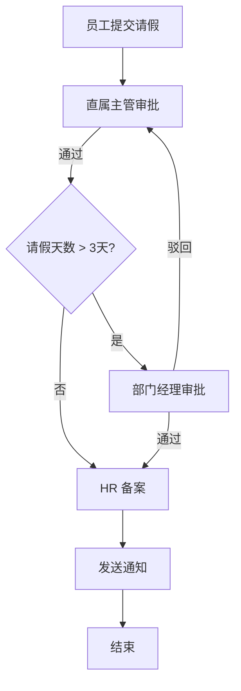

以前这种流程可能靠 Excel 表格流转、口头通知、或者写一堆 `if-else` 硬编码在业务代码里。问题来了：

- 流程一变，就得改代码、重新上线
- 审批节点一多，代码嵌套深度爆炸
- 流程没有可视化，新人接手一脸懵
- 无法灵活配置审批人、条件分支

工作流引擎就是为了解决这些问题的。

### 1.2 为什么需要工作流引擎

::: tip 工作流引擎的核心价值

1. **流程与业务解耦**：流程定义是 XML/模型，业务代码只管调用 API
2. **动态可配**：流程变更不需要改代码，重新部署流程定义即可
3. **可视化**：BPMN 图让所有人都能看懂流程
4. **状态管理**：引擎自动维护流程状态、任务分配、变量传递
5. **审计追踪**：完整的流转历史，方便追溯

:::

### 1.3 BPMN 2.0 标准概述

BPMN（Business Process Model and Notation）是 OMG 组织制定的业务流程建模标准，目前主流版本是 BPMN 2.0。它定义了一套图形化的符号来描述业务流程，同时提供了 XML 格式让机器也能理解。

核心元素就四类：

| 分类 | 元素 | 说明 |
|------|------|------|
| **事件（Event）** | Start Event、End Event、Timer Event 等 | 流程的生命周期节点 |
| **活动（Activity）** | User Task、Service Task、Script Task 等 | 具体要做什么事 |
| **网关（Gateway）** | Exclusive、Parallel、Inclusive 等 | 控制流程走向 |
| **连接（Connection）** | Sequence Flow、Message Flow 等 | 连接各个元素 |

::: warning BPMN 2.0 不是 Flowable 私有标准
BPMN 2.0 是行业标准，Flowable、Activiti、Camunda 等引擎都遵循这个标准。所以理论上你在 Flowable 里画的流程，迁移到 Camunda 也能跑（虽然有些扩展属性不通用）。

:::

### 1.4 Flowable 简介

**Flowable** 的历史有点意思：

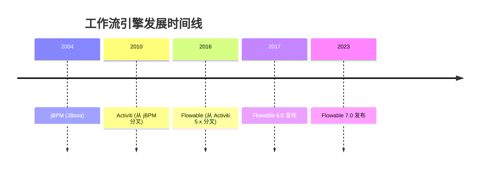

**分叉原因简述**：Activiti 的核心开发者 Tijs Rademakers 和 Joram Barrez 对 Activiti 公司（Alfresco）的商业化方向不满，于是拉出一支队伍搞了 Flowable。所以 Flowable 和 Activiti 有共同的基因，但 Flowable 走得更远。

**Flowable 的优势：**

| 特性 | 说明 |
|------|------|
| Activiti 超集 | API 高度兼容，迁移成本低 |
| CMMN 支持 | Case Management，处理非结构化流程 |
| DMN 支持 | Decision Management，决策表 |
| 性能优化 | 高并发场景下表现更好 |
| Flowable UI | 内置流程设计器、管理后台 |
| 活跃社区 | GitHub Stars 远超 Activiti |

::: details Camunda 呢？
Camunda 也是一个从 Activiti 分叉出来的工作流引擎，走的是商业化路线（有开源版和商业版）。API 设计和 Flowable/Activiti 差异较大，迁移成本高。如果你的项目对商业支持有需求，可以考虑 Camunda。

:::

---

## 二、Spring Boot 集成

### 2.1 Maven 依赖

#### 基础集成

最简配置，只需要流程引擎核心功能：

```xml
<dependency>
    <groupId>org.flowable</groupId>
    <artifactId>flowable-spring-boot-starter</artifactId>
    <version>7.1.0</version>
</dependency>
```

这一个依赖就够了，它会自动引入：
- `flowable-engine`（引擎核心）
- `flowable-spring`（Spring 集成）
- `mybatis`（持久层）
- 数据库连接池（HikariCP，如果你没配别的）

#### 完整集成（含 REST API 和 UI）

如果你需要 Flowable 的 REST API 和前端设计器：

```xml
<dependencies>
    <!-- 流程引擎 -->
    <dependency>
        <groupId>org.flowable</groupId>
        <artifactId>flowable-spring-boot-starter</artifactId>
        <version>7.1.0</version>
    </dependency>

    <!-- REST API（提供流程设计器、管理接口等） -->
    <dependency>
        <groupId>org.flowable</groupId>
        <artifactId>flowable-spring-boot-starter-rest</artifactId>
        <version>7.1.0</version>
    </dependency>

    <!-- 流程设计器 UI（前端模块） -->
    <dependency>
        <groupId>org.flowable</groupId>
        <artifactId>flowable-spring-boot-starter-ui-modeler</artifactId>
        <version>7.1.0</version>
    </dependency>

    <!-- DMN 决策引擎（可选） -->
    <dependency>
        <groupId>org.flowable</groupId>
        <artifactId>flowable-spring-boot-starter-dmn</artifactId>
        <version>7.1.0</version>
    </dependency>

    <!-- CMMN 引擎（可选） -->
    <dependency>
        <groupId>org.flowable</groupId>
        <artifactId>flowable-spring-boot-starter-cmmn</artifactId>
        <version>7.1.0</version>
    </dependency>
</dependencies>
```

::: tip 版本选择
- Flowable 6.x：稳定版本，文档丰富，适合生产环境
- Flowable 7.x：最新版本，API 有较大变化（移除了一些废弃 API），新项目推荐
- 注意：Spring Boot 3.x 需要 Flowable 7.x，Spring Boot 2.x 用 Flowable 6.x

:::

### 2.2 配置项详解

```yaml
# application.yml
spring:
  datasource:
    url: jdbc:mysql://localhost:3306/flowable?useUnicode=true&characterEncoding=utf8&nullCatalogMeansCurrent=true
    username: root
    password: your_password
    driver-class-name: com.mysql.cj.jdbc.Driver

flowable:
  # ========== 流程定义相关 ==========
  # 自动部署 resources/processes/ 下的流程文件
  process-definition-location-prefix: classpath*:/processes/
  # 是否在启动时自动部署流程定义
  check-process-definitions: true

  # ========== 数据库相关 ==========
  # 数据库 schema 更新策略：true 自动建表/更新
  database-schema-update: true
  # 数据库表前缀（默认 ACT_）
  database-table-prefix: ACT_

  # ========== 异步执行器 ==========
  # 是否激活异步执行器（生产环境必须 true）
  async-executor-activate: true
  # 异步执行器核心线程数（默认 8）
  async-executor-core-pool-size: 8
  # 异步执行器最大线程数（默认 32）
  async-executor-max-pool-size: 32
  # 异步任务锁定时间（秒，默认 30）
  async-executor-default-async-job-acquire-wait-time: 30

  # ========== 历史记录 ==========
  # 历史级别：none / activity / audit / full
  history-level: audit

  # ========== 流程图字体（解决中文乱码） ==========
  activity-font-name: 宋体
  label-font-name: 宋体
  annotation-font-name: 宋体

  # ========== 邮件服务器（用于发送任务通知） ==========
  # mail-server-host: smtp.example.com
  # mail-server-port: 465
  # mail-server-username: noreply@example.com
  # mail-server-password: your_password
  # mail-server-use-ssl: true
```

::: warning 生产环境配置建议
1. `check-process-definitions` 设为 `false`，通过 REST API 或管理界面手动部署
2. `history-level` 设为 `audit`，`full` 级别会产生大量数据
3. `async-executor-activate` 设为 `true`，确保异步任务正常执行
4. 配置独立的数据库连接池参数

:::

### 2.3 自动配置原理

Flowable 的 Spring Boot Starter 通过 `FlowableAutoConfiguration` 自动完成以下工作：

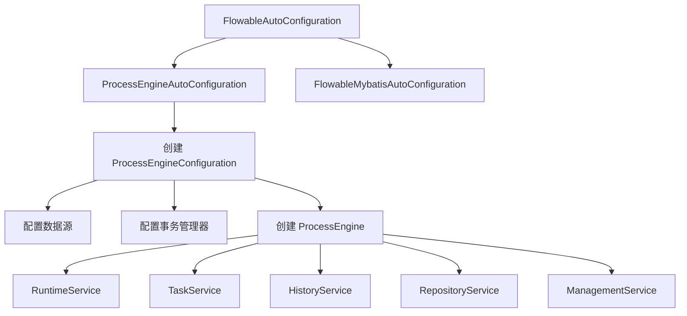

关键逻辑：

1. **检测数据源**：自动从 Spring 容器获取 `DataSource`
2. **配置事务**：使用 Spring 的 `PlatformTransactionManager`
3. **扫描流程文件**：默认扫描 `classpath:/processes/*.bpmn20.xml`
4. **创建引擎**：`ProcessEngine` 是所有 Service 的工厂
5. **注册 Service Bean**：将各 Service 注册为 Spring Bean，可直接 `@Autowired`

::: details 想自定义配置？
如果你有特殊需求，可以定义 `ProcessEngineConfigurationConfigurer`：

```java
@Configuration
public class FlowableConfig {

    @Bean
    public ProcessEngineConfigurationConfigurer processEngineConfigurationConfigurer() {
        return configuration -> {
            configuration.setActivityFontName("微软雅黑");
            configuration.setLabelFontName("微软雅黑");
            configuration.setAsyncExecutorActivate(true);
            configuration.addEventListener(new GlobalProcessEventListener());
            configuration.addTypeConverter(CustomType.class, new CustomTypeConverter());
        };
    }
}
```

:::

### 2.4 数据库表结构

Flowable 启动时会自动创建 28+ 张表，按前缀分类：

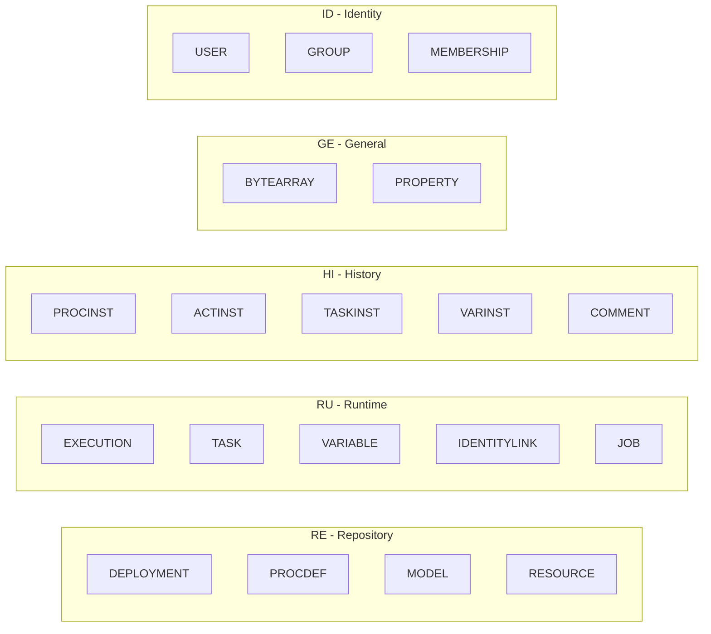

#### 仓库表（ACT_RE_*）

| 表名 | 说明 | 关键字段 |
|------|------|----------|
| `ACT_RE_DEPLOYMENT` | 部署记录 | ID_, NAME_, CATEGORY_, TENANT_ID_ |
| `ACT_RE_PROCDEF` | 流程定义 | ID_, KEY_, NAME_, VERSION_, RESOURCE_NAME_ |
| `ACT_RE_MODEL` | 模型数据 | ID_, NAME_, EDITOR_SOURCE_VALUE_ID_ |
| `ACT_RE_RESOURCE` | 部署资源 | ID_, NAME_, DEPLOYMENT_ID_, BYTES_ |

#### 运行时表（ACT_RU_*）

| 表名 | 说明 |
|------|------|
| `ACT_RU_EXECUTION` | 执行实例（流程实例 + 子执行） |
| `ACT_RU_TASK` | 当前待办任务 |
| `ACT_RU_VARIABLE` | 运行时变量 |
| `ACT_RU_IDENTITYLINK` | 参与人关系（候选人、候选组） |
| `ACT_RU_JOB` | 异步任务 |
| `ACT_RU_TIMER_JOB` | 定时器任务 |
| `ACT_RU_DEADLETTER_JOB` | 失败超过重试次数的任务 |
| `ACT_RU_EVENT_SUBSCR` | 事件订阅 |

::: danger 运行时表会被清空
流程结束后，`ACT_RU_*` 表中的对应记录会被删除。查询历史数据必须查 `ACT_HI_*` 表。这也是 `history-level` 配置很重要的原因。

:::

#### 历史表（ACT_HI_*）

| 表名 | 说明 |
|------|------|
| `ACT_HI_PROCINST` | 历史流程实例 |
| `ACT_HI_ACTINST` | 历史活动实例（每个节点的执行记录） |
| `ACT_HI_TASKINST` | 历史任务实例 |
| `ACT_HI_VARINST` | 历史变量 |
| `ACT_HI_IDENTITYLINK` | 历史参与人关系 |
| `ACT_HI_COMMENT` | 审批意见 |
| `ACT_HI_ATTACHMENT` | 附件 |
| `ACT_HI_DETAIL` | 变量变更明细（仅 `full` 级别） |

#### 通用表 & 身份表

| 表名 | 说明 |
|------|------|
| `ACT_GE_BYTEARRAY` | 二进制资源（BPMN XML、图片等） |
| `ACT_GE_PROPERTY` | 引擎属性（版本号等） |
| `ACT_ID_USER` | 用户 |
| `ACT_ID_GROUP` | 用户组/角色 |
| `ACT_ID_MEMBERSHIP` | 用户-组关系 |

::: tip 实际项目一般不用 ACT_ID_* 表
大多数项目有自己的用户系统（RBAC），不会直接用 Flowable 内置的身份管理。通常通过自定义 `TaskListener` 在任务创建时从自己的用户系统查询审批人。

:::

### 2.5 核心服务 API

Flowable 通过 `ProcessEngine` 提供各种 Service，在 Spring Boot 中可直接 `@Autowired`。

#### RepositoryService（仓库服务）

管理流程定义的部署和查询。

```java
// ========== 部署流程定义 ==========
Deployment deployment = repositoryService.createDeployment()
    .addClasspathResource("processes/leave.bpmn20.xml")
    .addClasspathResource("processes/expense.bpmn20.xml")
    .name("审批流程")
    .category("approval")
    .tenantId("tenant-001")
    .deploy();

// 从输入流部署
repositoryService.createDeployment()
    .addInputStream("process.bpmn20.xml", inputStream)
    .deploy();

// ========== 查询流程定义 ==========
ProcessDefinition processDef = repositoryService.createProcessDefinitionQuery()
    .processDefinitionKey("leaveProcess")
    .latestVersion()
    .singleResult();

// 查询所有版本
List<ProcessDefinition> allVersions = repositoryService.createProcessDefinitionQuery()
    .processDefinitionKey("leaveProcess")
    .orderByProcessDefinitionVersion().desc()
    .list();

// ========== 流程定义操作 ==========
// 挂起（新启动的流程实例会暂停）
repositoryService.suspendProcessDefinitionById(processDefId);
// 激活
repositoryService.activateProcessDefinitionById(processDefId);
// 删除部署（级联删除流程实例）
repositoryService.deleteDeployment(deploymentId, true);
```

#### RuntimeService（运行时服务）

管理流程实例的启动、执行和变量。

```java
// ========== 启动流程实例 ==========
Map<String, Object> variables = new HashMap<>();
variables.put("applicant", "张三");
variables.put("days", 3);
variables.put("reason", "家中有事");
variables.put("deptManager", "李四");

// 按 key 启动（自动使用最新版本）
ProcessInstance instance = runtimeService.startProcessInstanceByKey(
    "leaveProcess",     // 流程定义 key
    "LEAVE-2024-001",   // 业务 key（关联业务数据）
    variables
);

// ========== 流程实例查询 ==========
List<ProcessInstance> running = runtimeService.createProcessInstanceQuery()
    .processDefinitionKey("leaveProcess")
    .list();

// 按业务 key 查询
ProcessInstance inst = runtimeService.createProcessInstanceQuery()
    .processInstanceBusinessKey("LEAVE-2024-001")
    .singleResult();

// ========== 变量操作 ==========
runtimeService.setVariable(instanceId, "approved", true);
runtimeService.setVariableLocal(executionId, "localVar", "value");
Object value = runtimeService.getVariable(instanceId, "approved");

// ========== 流程实例操作 ==========
runtimeService.suspendProcessInstanceById(instanceId);
runtimeService.activateProcessInstanceById(instanceId);
runtimeService.signalEventReceived("signalName");
```

#### TaskService（任务服务）

管理用户任务的查询、认领和完成。

```java
// ========== 任务查询 ==========
// 我的待办
List<Task> myTasks = taskService.createTaskQuery()
    .taskAssignee("张三")
    .orderByTaskCreateTime().desc()
    .list();

// 我可以认领的任务（candidate）
List<Task> candidateTasks = taskService.createTaskQuery()
    .taskCandidateUser("张三")
    .list();

// 我所在组的可认领任务
List<Task> groupTasks = taskService.createTaskQuery()
    .taskCandidateGroup("hr")
    .list();

// ========== 任务操作 ==========
taskService.claim(taskId, "张三");         // 认领
taskService.unclaim(taskId);               // 取消认领
taskService.setAssignee(taskId, "李四");    // 转办
taskService.delegateTask(taskId, "王五");   // 委派
taskService.resolveTask(taskId);            // 被委派人完成后归还

// ========== 完成任务 ==========
Map<String, Object> vars = new HashMap<>();
vars.put("approved", true);
taskService.complete(taskId, vars);

// ========== 审批意见 ==========
taskService.addComment(taskId, processInstanceId, "同意，注意安全");
List<Comment> comments = taskService.getTaskComments(taskId);
```

#### HistoryService（历史服务）

查询流程的完整执行历史。

```java
// 查询已完成流程
List<HistoricProcessInstance> finished = historyService
    .createHistoricProcessInstanceQuery()
    .finished()
    .orderByProcessInstanceEndTime().desc()
    .listPage(0, 20);

// 查询历史活动（每个节点的执行记录）
List<HistoricActivityInstance> activities = historyService
    .createHistoricActivityInstanceQuery()
    .processInstanceId(instanceId)
    .orderByHistoricActivityInstanceStartTime().asc()
    .list();

// 查询某人的审批历史
List<HistoricTaskInstance> myHistory = historyService
    .createHistoricTaskInstanceQuery()
    .taskAssignee("张三")
    .finished()
    .list();
```

#### ManagementService（管理服务）

执行引擎管理操作。

```java
// 查询死信队列（失败的任务）
List<Job> deadJobs = managementService.createDeadLetterJobQuery().list();

// 重新执行失败的任务
managementService.moveDeadLetterJobToExecutableJob(deadJobId, 5);

// 执行原生 SQL
long count = managementService.executeCustomSql(
    new AbstractCustomSqlExecution<>(MyMapper.class, mapper -> mapper.count())
);
```

---

## 三、BPMN 2.0 核心元素详解

### 3.1 事件（Event）

事件是流程中"某件事发生了"的节点。按时机分为开始事件、中间事件、结束事件、边界事件。

#### 开始事件（Start Event）

```xml
<!-- 空开始事件（手动/代码触发） -->
<startEvent id="start" name="开始" />

<!-- 定时开始事件（自动触发） -->
<startEvent id="timerStart" name="每日定时触发">
    <timerEventDefinition>
        <timeCycle>0 0 9 * * ?</timeCycle>  <!-- 每天 9:00 -->
    </timerEventDefinition>
</startEvent>

<!-- 消息开始事件 -->
<startEvent id="msgStart" name="接收订单">
    <messageEventDefinition messageRef="newOrderMessage" />
</startEvent>

<!-- 信号开始事件 -->
<startEvent id="signalStart" name="系统就绪">
    <signalEventDefinition signalRef="systemReadySignal" />
</startEvent>
```

```java
// 触发消息启动流程
ProcessInstance instance = runtimeService.startProcessInstanceByMessage(
    "newOrderMessage", variables
);

// 触发信号启动所有订阅了该信号的流程
runtimeService.signalEventReceived("systemReadySignal");
```

#### 结束事件（End Event）

```xml
<!-- 空结束事件 -->
<endEvent id="end" name="结束" />

<!-- 终止结束事件（直接终止整个流程，包括并行分支） -->
<endEvent id="terminateEnd" name="强制终止">
    <terminateEventDefinition />
</endEvent>

<!-- 错误结束事件（抛出错误，可被调用方捕获） -->
<endEvent id="errorEnd" name="审批拒绝">
    <errorEventDefinition errorRef="approvalRejectError" />
</endEvent>
```

::: warning 终止 vs 普通结束
普通结束事件只结束当前分支，并行网关的其他分支不受影响。终止结束事件会干掉整个流程实例，不管有多少并行分支。使用时要慎重。

:::

#### 定时事件（Timer Event）

定时事件支持三种时间定义：

```xml
<!-- 1. timeDate：指定时间点（ISO 8601 格式） -->
<timerEventDefinition>
    <timeDate>2024-12-31T23:59:59</timeDate>
</timerEventDefinition>

<!-- 2. timeDuration：持续时间 -->
<timerEventDefinition>
    <timeDuration>PT30M</timeDuration>  <!-- 30 分钟 -->
    <!-- PT1H = 1小时, P3D = 3天, P1W = 1周 -->
</timerEventDefinition>

<!-- 3. timeCycle：循环（支持 cron 表达式） -->
<timerEventDefinition>
    <timeCycle>0 0/30 9-18 * * ?</timeCycle>  <!-- 工作时间每30分钟 -->
</timerEventDefinition>
```

::: tip ISO 8601 持续时间格式
- `PT30M` = 30 分钟
- `PT1H` = 1 小时
- `PT1H30M` = 1 小时 30 分钟
- `P1D` = 1 天
- `P1W` = 1 周
- `P1Y2M3D` = 1 年 2 个月 3 天

:::

#### 信号事件（Signal Event）

信号是广播式的，所有订阅了该信号的流程都会收到：

```xml
<!-- 定义信号 -->
<signal id="paymentSignal" name="paymentReceived" />

<!-- 信号中间捕获事件 -->
<intermediateCatchEvent id="waitPayment" name="等待付款">
    <signalEventDefinition signalRef="paymentSignal" />
</intermediateCatchEvent>

<!-- 信号中间抛出事件 -->
<intermediateThrowEvent id="sendSignal" name="发送信号">
    <signalEventDefinition signalRef="paymentSignal" />
</intermediateThrowEvent>
```

```java
// 代码触发信号
runtimeService.signalEventReceived("paymentReceived");

// 带流程变量的信号
runtimeService.signalEventReceivedWithProcessVariables(
    "paymentReceived", variables
);
```

#### 消息事件（Message Event）

消息是点对点的，只有指定的接收方会收到：

```xml
<!-- 定义消息 -->
<message id="orderMessage" name="orderCreated" />

<!-- 消息中间捕获事件 -->
<intermediateCatchEvent id="waitOrder" name="等待订单">
    <messageEventDefinition messageRef="orderMessage" />
</intermediateCatchEvent>
```

```java
// 触发消息事件（只影响订阅了该消息的执行）
Execution execution = runtimeService.createExecutionQuery()
    .processInstanceId(processInstanceId)
    .messageEventSubscriptionName("orderCreated")
    .singleResult();

runtimeService.messageEventReceived("orderCreated", execution.getId());
```

#### 错误事件（Error Event）

错误事件用于异常处理，通常与边界事件配合：

```xml
<!-- 定义错误 -->
<error id="insufficientStock" errorCode="STOCK_ERROR" />

<!-- 错误结束事件 -->
<endEvent id="stockError" name="库存不足">
    <errorEventDefinition errorRef="insufficientStock" />
</endEvent>

<!-- 错误边界事件 -->
<boundaryEvent id="errorBoundary" attachedToRef="checkStock">
    <errorEventDefinition errorRef="insufficientStock" />
</boundaryEvent>
```

### 3.2 任务（Task）

任务是最常用的 BPMN 元素，代表具体要执行的工作。

#### 用户任务（User Task）

最常用的任务类型，需要人工处理：

```xml
<userTask id="managerApprove" name="经理审批"
          flowable:assignee="${deptManager}"
          flowable:candidateUsers="${candidateUsers}"
          flowable:candidateGroups="managers">
    <documentation>请审批此申请</documentation>
    <extensionElements>
        <flowable:taskListener event="create"
            delegateExpression="${assigneeListener}" />
        <flowable:formProperty id="comment" name="审批意见" type="string" />
    </extensionElements>
</userTask>
```

- `assignee`：直接指定处理人（变量表达式）
- `candidateUsers`：候选用户列表（需要 claim）
- `candidateGroups`：候选组（组内任意一人可 claim）

```java
// 直接分配的任务，直接 complete
taskService.complete(taskId, variables);

// 候选任务，需要先 claim
taskService.claim(taskId, "张三");
taskService.complete(taskId, variables);
```

#### 服务任务（Service Task）

自动执行的任务，调用 Java 逻辑：

```xml
<!-- 方式 1：指定实现类（不推荐，无法注入 Spring Bean） -->
<serviceTask id="sendEmail" name="发送邮件"
             flowable:class="com.example.service.SendEmailDelegate" />

<!-- 方式 2：Delegate Expression（推荐，可以注入 Spring Bean） -->
<serviceTask id="sendEmail" name="发送邮件"
             flowable:delegateExpression="${sendEmailDelegate}" />

<!-- 方式 3：表达式（适合简单逻辑） -->
<serviceTask id="notify" name="发送通知"
             flowable:expression="${notifyService.send(execution)}" />
```

```java
@Component("sendEmailDelegate")
public class SendEmailDelegate implements JavaDelegate {

    @Autowired
    private EmailService emailService;

    @Override
    public void execute(DelegateExecution execution) {
        String applicant = (String) execution.getVariable("applicant");
        String reason = (String) execution.getVariable("reason");
        emailService.send(applicant, "您的申请已提交", reason);
    }
}
```

#### 脚本任务（Script Task）

执行脚本逻辑，支持 JS、Groovy、JUEL 等：

```xml
<!-- Groovy 脚本 -->
<scriptTask id="calcBonus" name="计算奖金"
            flowable:scriptFormat="groovy"
            flowable:autoStoreVariables="false">
    <script>
        def salary = execution.getVariable("salary")
        def level = execution.getVariable("level")
        def bonus = salary * 0.1 * level
        execution.setVariable("bonus", bonus)
    </script>
</scriptTask>

<!-- JavaScript 脚本 -->
<scriptTask id="calc" name="计算"
            flowable:scriptFormat="javascript">
    <script>
        var total = amount * count;
        execution.setVariable("total", total);
    </script>
</scriptTask>
```

::: warning 脚本任务的安全风险
脚本任务可以执行任意代码，生产环境要慎重使用。如果逻辑复杂，建议用 Service Task 代替。

:::

#### 接收任务（Receive Task）

等待外部信号后继续执行：

```xml
<receiveTask id="waitPayment" name="等待付款" />
```

```java
// 流程会停在这里，直到代码触发
Execution execution = runtimeService.createExecutionQuery()
    .processInstanceId(processInstanceId)
    .activityId("waitPayment")
    .singleResult();

runtimeService.trigger(execution.getId());
```

#### 发送任务（Send Task）

发送消息到外部系统（语义上的，实际用 Service Task + 消息事件更常见）：

```xml
<sendTask id="sendNotification" name="发送通知"
          flowable:type="mail">
    <extensionElements>
        <flowable:field name="to">
            <flowable:string>${applicantEmail}</flowable:string>
        </flowable:field>
        <flowable:field name="subject">
            <flowable:string>审批结果通知</flowable:string>
        </flowable:field>
    </extensionElements>
</sendTask>
```

#### 手工任务（Manual Task）

表示需要人工完成但没有系统交互的任务（纯记录用途）：

```xml
<manualTask id="printDoc" name="打印文件" />
```

### 3.3 网关（Gateway）

网关控制流程的走向，是 BPMN 中最灵活的元素之一。

#### 排他网关（Exclusive Gateway）

**只走一条分支**，按条件顺序判断，第一个为 true 的分支被选中：

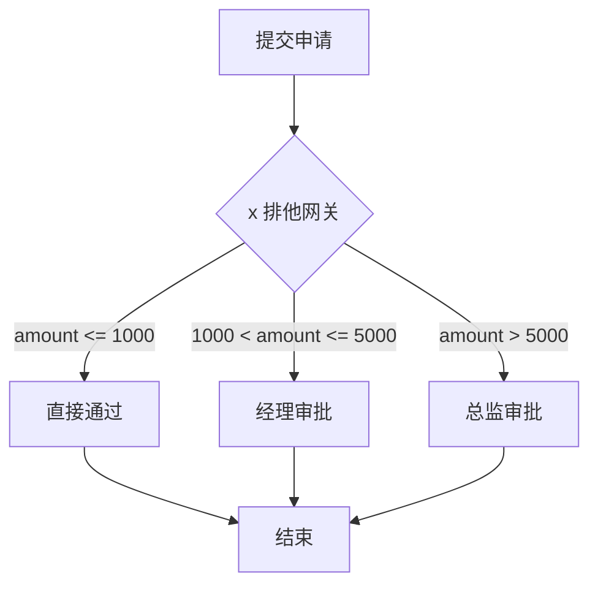

```xml
<exclusiveGateway id="amountCheck" name="金额判断" />

<sequenceFlow sourceRef="amountCheck" targetRef="autoApprove">
    <conditionExpression xsi:type="tFormalExpression">
        ${amount <= 1000}
    </conditionExpression>
</sequenceFlow>

<sequenceFlow sourceRef="amountCheck" targetRef="managerApprove">
    <conditionExpression xsi:type="tFormalExpression">
        ${amount > 1000 &amp;&amp; amount <= 5000}
    </conditionExpression>
</sequenceFlow>

<!-- 默认流（所有条件都不满足时走） -->
<sequenceFlow sourceRef="amountCheck" targetRef="reject">
    <!-- 不需要 conditionExpression，默认流不需要 -->
</sequenceFlow>
```

::: tip 排他网关的 default 属性
XML 中网关可以设置 `default` 属性指定默认流：

```xml
<exclusiveGateway id="amountCheck" default="flow_reject" />
```

如果不设置 default，且所有条件都不满足，会抛异常。建议始终设置 default。

:::

#### 并行网关（Parallel Gateway）

**同时走所有分支**，所有分支都完成后才汇聚（AND 语义）：

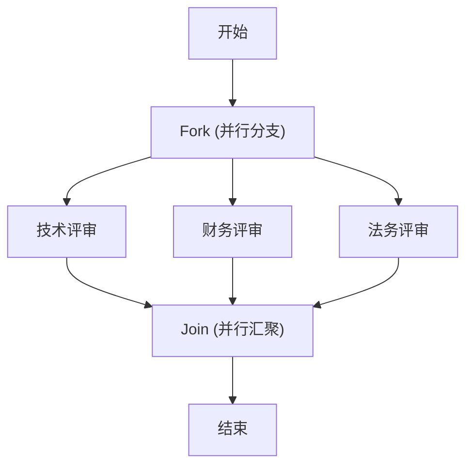

```xml
<!-- 并行分支 -->
<parallelGateway id="fork" name="开始并行" />
<parallelGateway id="join" name="合并并行" />

<sequenceFlow sourceRef="fork" targetRef="techReview" />
<sequenceFlow sourceRef="fork" targetRef="financeReview" />
<sequenceFlow sourceRef="fork" targetRef="legalReview" />

<sequenceFlow sourceRef="techReview" targetRef="join" />
<sequenceFlow sourceRef="financeReview" targetRef="join" />
<sequenceFlow sourceRef="legalReview" targetRef="join" />
```

::: danger 并行网关的配对规则
分支和汇聚的并行网关必须成对出现。分支网关会创建多条执行路径，汇聚网关会等待所有路径到达后才继续。如果汇聚网关的入度（incoming sequence flow）和分支网关的出度（outgoing sequence flow）不匹配，流程会卡死。

:::

#### 包容网关（Inclusive Gateway）

**满足条件的分支都走**，完成后汇聚时按 token 计数：

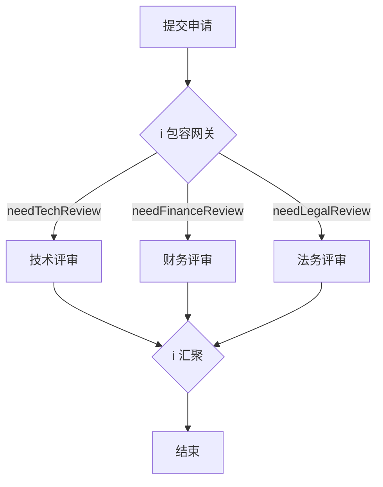

```xml
<inclusiveGateway id="fork" name="判断需要的评审" />

<sequenceFlow sourceRef="fork" targetRef="techReview">
    <conditionExpression>${needTechReview == true}</conditionExpression>
</sequenceFlow>

<sequenceFlow sourceRef="fork" targetRef="financeReview">
    <conditionExpression>${needFinanceReview == true}</conditionExpression>
</sequenceFlow>

<sequenceFlow sourceRef="fork" targetRef="legalReview">
    <conditionExpression>${needLegalReview == true}</conditionExpression>
</sequenceFlow>

<inclusiveGateway id="join" name="评审汇聚" />
```

::: details 排他 vs 并行 vs 包容 网关对比

| 特性 | 排他网关 | 并行网关 | 包容网关 |
|------|---------|---------|---------|
| 分支规则 | 只走一条 | 全走 | 满足条件的都走 |
| 汇聚规则 | 到达即过 | 全部到达才过 | 已发出的全部到达才过 |
| 条件表达式 | 必须 | 不需要 | 必须 |
| 默认流 | 支持 | 不支持 | 支持 |

:::

#### 事件网关（Event-Based Gateway）

根据发生的事件选择分支，流程会等待，哪个事件先触发就走哪个分支：

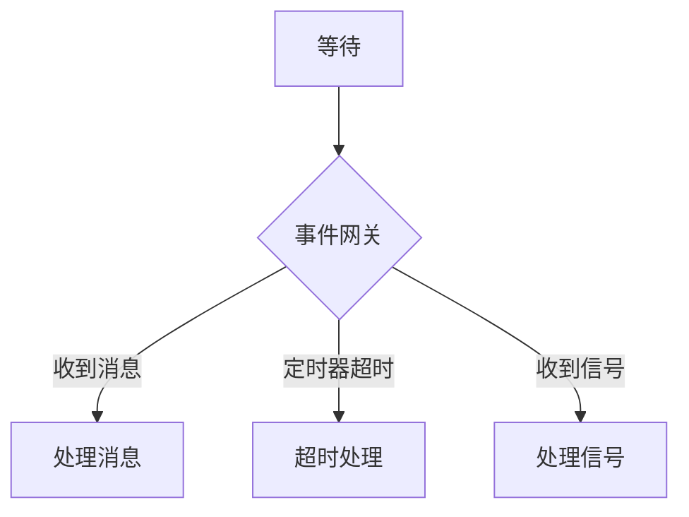

```xml
<eventBasedGateway id="eventGateway" />

<!-- 消息分支 -->
<intermediateCatchEvent id="msgCatch" name="收到消息">
    <messageEventDefinition messageRef="responseMessage" />
</intermediateCatchEvent>

<!-- 定时器分支 -->
<intermediateCatchEvent id="timerCatch" name="超时">
    <timerEventDefinition>
        <timeDuration>P3D</timeDuration>  <!-- 3 天超时 -->
    </timerEventDefinition>
</intermediateCatchEvent>

<!-- 信号分支 -->
<intermediateCatchEvent id="signalCatch" name="收到信号">
    <signalEventDefinition signalRef="cancelSignal" />
</intermediateCatchEvent>

<sequenceFlow sourceRef="eventGateway" targetRef="msgCatch" />
<sequenceFlow sourceRef="eventGateway" targetRef="timerCatch" />
<sequenceFlow sourceRef="eventGateway" targetRef="signalCatch" />
```

::: tip 事件网关的实际应用
事件网关常用于"等待外部响应，但也要设超时"的场景。比如：提交审批后，等待审批人处理，但 3 天没处理就自动催办或自动通过。

:::

### 3.4 序列流（Sequence Flow）

序列流是连接各个元素的箭头，可以带条件表达式。

```xml
<!-- 带条件的序列流 -->
<sequenceFlow id="flow1" sourceRef="gateway" targetRef="task1">
    <conditionExpression xsi:type="tFormalExpression">
        ${amount > 1000}
    </conditionExpression>
</sequenceFlow>

<!-- 默认序列流 -->
<sequenceFlow id="defaultFlow" sourceRef="gateway" targetRef="defaultTask" />

<!-- 不带条件的序列流（直接流转） -->
<sequenceFlow id="directFlow" sourceRef="start" targetRef="task1" />
```

条件表达式支持：
- UEL（Unified Expression Language）：`${variable > 100}`
- 方法调用：`${approvalService.check(execution)}`
- Spring Bean 调用：`${@myBean.isApproved(execution)}`

::: warning 条件表达式中避免复杂逻辑
条件表达式会被序列化到数据库，引擎在运行时解析执行。太复杂的表达式会影响性能且难以调试。如果判断逻辑复杂，建议在 Service Task 中计算好一个布尔变量，网关只做简单判断。

:::

### 3.5 子流程

#### 嵌入子流程（Embedded SubProcess）

子流程是嵌入在主流程中的一组活动，有自己的作用域：

```xml
<subProcess id="reviewSubProcess" name="评审子流程">
    <startEvent id="subStart" />
    <parallelGateway id="subFork" />
    <userTask id="techReview" name="技术评审" flowable:candidateGroups="tech" />
    <userTask id="securityReview" name="安全评审" flowable:candidateGroups="security" />
    <parallelGateway id="subJoin" />
    <endEvent id="subEnd" />

    <sequenceFlow sourceRef="subStart" targetRef="subFork" />
    <sequenceFlow sourceRef="subFork" targetRef="techReview" />
    <sequenceFlow sourceRef="subFork" targetRef="securityReview" />
    <sequenceFlow sourceRef="techReview" targetRef="subJoin" />
    <sequenceFlow sourceRef="securityReview" targetRef="subJoin" />
    <sequenceFlow sourceRef="subJoin" targetRef="subEnd" />
</subProcess>
```

#### 调用活动（Call Activity）

调用另一个独立的流程定义，适合复用通用流程：

```xml
<callActivity id="callBackgroundCheck" name="背景调查"
              calledElement="backgroundCheckProcess">
    <!-- 传入变量 -->
    <extensionElements>
        <flowable:in source="candidateName" target="name" />
        <flowable:in source="candidateId" target="id" />
        <!-- 传出变量 -->
        <flowable:out source="checkResult" target="bgCheckResult" />
        <flowable:out source="checkScore" target="bgCheckScore" />
    </extensionElements>
</callActivity>
```

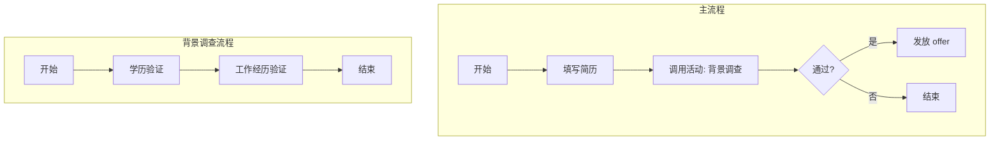

::: tip Call Activity vs SubProcess
- **SubProcess**：嵌入在主流程 XML 中，共享主流程的变量作用域
- **Call Activity**：调用独立的流程定义，有自己的变量作用域，需要显式传参

:::

### 3.6 边界事件（Boundary Event）

边界事件附着在活动上，当活动执行过程中满足条件时触发。

#### 定时器边界事件

任务超时自动触发：

```xml
<userTask id="managerApprove" name="经理审批">
    <!-- 任务创建后 3 天没处理，自动催办 -->
    <boundaryEvent id="reminderTimer" attachedToRef="managerApprove" cancelActivity="false">
        <timerEventDefinition>
            <timeCycle>0 0 9 * * ?</timeCycle>  <!-- 每天 9 点检查 -->
        </timerEventDefinition>
    </boundaryEvent>
    
    <!-- 任务创建后 7 天没处理，自动跳过 -->
    <boundaryEvent id="skipTimer" attachedToRef="managerApprove" cancelActivity="true">
        <timerEventDefinition>
            <timeDuration>P7D</timeDuration>  <!-- 7 天后触发 -->
        </timerEventDefinition>
    </boundaryEvent>
</userTask>

<!-- 催办逻辑 -->
<serviceTask id="sendReminder" name="发送催办"
             flowable:delegateExpression="${sendReminderDelegate}" />
<sequenceFlow sourceRef="reminderTimer" targetRef="sendReminder" />

<!-- 跳过后继续 -->
<sequenceFlow sourceRef="skipTimer" targetRef="nextTask" />
```

::: details cancelActivity 属性
- `cancelActivity="true"`（默认）：定时器触发后，中断附着的活动，流程继续往下走
- `cancelActivity="false"`：定时器触发后，不中断活动，而是创建一个并行分支执行额外逻辑（如催办）

:::

#### 错误边界事件

捕获子流程或服务任务抛出的错误：

```xml
<!-- 服务任务可能抛出错误 -->
<serviceTask id="checkStock" name="检查库存"
             flowable:delegateExpression="${checkStockDelegate}" />

<!-- 错误边界事件 -->
<boundaryEvent id="stockError" attachedToRef="checkStock">
    <errorEventDefinition errorRef="STOCK_ERROR" />
</boundaryEvent>

<!-- 错误处理 -->
<serviceTask id="handleStockError" name="处理库存不足"
             flowable:delegateExpression="${handleStockErrorDelegate}" />

<sequenceFlow sourceRef="stockError" targetRef="handleStockError" />
```

```java
@Component("checkStockDelegate")
public class CheckStockDelegate implements JavaDelegate {
    @Override
    public void execute(DelegateExecution execution) {
        int stock = stockService.getStock(execution.getVariable("productId"));
        if (stock <= 0) {
            throw new BpmnError("STOCK_ERROR", "库存不足");
        }
    }
}
```

#### 信号边界事件

```xml
<boundaryEvent id="cancelSignal" attachedToRef="waitApproval" cancelActivity="true">
    <signalEventDefinition signalRef="cancelOrderSignal" />
</boundaryEvent>

<sequenceFlow sourceRef="cancelSignal" targetRef="cancelProcess" />
```

```java
// 取消订单
runtimeService.signalEventReceived("cancelOrderSignal");
```

---

## 四、流程变量

### 4.1 变量类型和作用域

流程变量是流程实例在运行过程中携带的数据。Flowable 支持以下作用域：

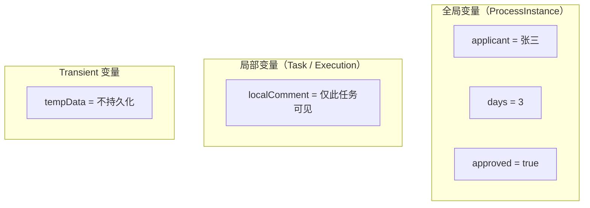

| 作用域 | 设置方式 | 可见范围 | 持久化 |
|--------|----------|----------|--------|
| **全局变量** | `setVariable()` | 整个流程实例 | 是 |
| **局部变量** | `setVariableLocal()` | 当前执行/任务 | 是 |
| **Transient 变量** | `setTransientVariable()` | 整个流程实例 | **否** |

```java
// 全局变量 —— 所有节点都能访问
runtimeService.setVariable(processInstanceId, "approved", true);
taskService.setVariable(taskId, "comment", "同意");  // 也设置到全局

// 局部变量 —— 只有当前任务/执行能访问
taskService.setVariableLocal(taskId, "localNote", "仅此任务可见");
runtimeService.setVariableLocal(executionId, "subProcessVar", 100);

// Transient 变量 —— 不会持久化到数据库
runtimeService.setTransientVariable(processInstanceId, "tempToken", "abc123");

// 获取变量
Object approved = taskService.getVariable(taskId, "approved");        // 先查局部，再查全局
Object localNote = taskService.getVariableLocal(taskId, "localNote");  // 只查局部
```

::: tip 变量查询顺序
`getVariable()` 的查询顺序是：局部变量 → 全局变量。如果局部和全局有同名变量，局部优先。

:::

### 4.2 Java 对象作为变量

Flowable 支持将 Java 对象作为流程变量，有两种序列化方式：

#### Serializable 方式

对象实现 `Serializable` 接口，以二进制方式存储在 `ACT_GE_BYTEARRAY` 表中：

```java
public class LeaveRequest implements Serializable {
    private Long id;
    private String applicant;
    private LocalDate startDate;
    private LocalDate endDate;
    private Integer days;
    private String reason;
    private String deptManager;
    // getter/setter ...
}
```

```java
LeaveRequest request = new LeaveRequest();
request.setApplicant("张三");
request.setDays(3);
request.setReason("家中有事");

Map<String, Object> variables = new HashMap<>();
variables.put("leaveRequest", request);  // 整个对象作为变量
runtimeService.startProcessInstanceByKey("leaveProcess", variables);

// 获取时需要转型
LeaveRequest request = (LeaveRequest) runtimeService.getVariable(processInstanceId, "leaveRequest");
```

::: danger Serializable 的坑
1. 类结构变更后，反序列化可能失败（`InvalidClassException`）
2. 二进制存储，无法在数据库中直接查看
3. 不同版本的类不兼容

:::

#### JSON 序列化方式（推荐）

```java
// 配置 JSON 对象类型映射
@Configuration
public class FlowableConfig {

    @Bean
    public ProcessEngineConfigurationConfigurer processEngineConfigurationConfigurer() {
        return config -> {
            // 注册可 JSON 序列化的类型
            config.addObjectType(new JsonType("LeaveRequest", LeaveRequest.class));
        };
    }
}
```

JSON 序列化的变量以 JSON 字符串存储，可读性好，且不受类结构变更影响（新增字段不影响旧数据）。

### 4.3 变量在流程中的传递

```java
// ========== 启动时传入 ==========
Map<String, Object> startVars = new HashMap<>();
startVars.put("applicant", "张三");
startVars.put("days", 3);
ProcessInstance instance = runtimeService.startProcessInstanceByKey("leaveProcess", startVars);

// ========== 完成任务时传入 ==========
Map<String, Object> completeVars = new HashMap<>();
completeVars.put("approved", true);
completeVars.put("comment", "同意");
taskService.complete(taskId, completeVars);

// ========== Service Task 中读写 ==========
@Component("myDelegate")
public class MyDelegate implements JavaDelegate {
    @Override
    public void execute(DelegateExecution execution) {
        // 读取变量
        String applicant = (String) execution.getVariable("applicant");
        
        // 写入变量
        execution.setVariable("approved", true);
        
        // 写入 transient 变量
        execution.setTransientVariable("tempResult", "computed");
    }
}

// ========== 条件表达式中使用 ==========
// XML 中
<conditionExpression>${approved == true &amp;&amp; days <= 3}</conditionExpression>

// ========== 任务监听器中修改 ==========
@Component("assigneeListener")
public class AssigneeListener implements TaskListener {
    @Override
    public void notify(DelegateTask task) {
        // 读取变量决定审批人
        String dept = (String) task.getVariable("department");
        String assignee = userService.getManagerByDept(dept);
        task.setVariable("currentApprover", assignee);
        task.setAssignee(assignee);
    }
}
```

---

## 五、监听器与执行器

### 5.1 任务监听器（Task Listener）

任务监听器在用户任务的生命周期中被调用，支持四个事件：

| 事件 | 触发时机 | 常用场景 |
|------|----------|----------|
| `create` | 任务创建时 | 自动分配审批人、发送通知 |
| `assignment` | 任务被分配时 | 记录分配日志 |
| `complete` | 任务完成时 | 触发后续通知、更新业务状态 |
| `delete` | 任务被删除时 | 清理资源 |

```java
@Component("approvalNotificationListener")
public class ApprovalNotificationListener implements TaskListener {

    @Autowired
    private NotificationService notificationService;

    @Override
    public void notify(DelegateTask delegateTask) {
        String event = delegateTask.getEventName();
        String taskId = delegateTask.getId();
        String assignee = delegateTask.getAssignee();
        String taskName = delegateTask.getName();
        
        switch (event) {
            case EVENTNAME_CREATE:
                // 任务创建时通知审批人
                if (assignee != null) {
                    notificationService.send(assignee, 
                        "您有新的审批任务：" + taskName);
                }
                break;
            case EVENTNAME_COMPLETE:
                // 任务完成时通知申请人
                String applicant = (String) delegateTask.getVariable("applicant");
                Boolean approved = (Boolean) delegateTask.getVariable("approved");
                String msg = approved ? "您的申请已通过" : "您的申请已被驳回";
                notificationService.send(applicant, msg);
                break;
            case EVENTNAME_ASSIGNMENT:
                log.info("任务 {} 已分配给 {}", taskId, assignee);
                break;
            case EVENTNAME_DELETE:
                log.info("任务 {} 已删除", taskId);
                break;
        }
    }
}
```

XML 配置：

```xml
<userTask id="managerApprove" name="经理审批">
    <extensionElements>
        <!-- 创建时自动分配审批人 -->
        <flowable:taskListener event="create"
            delegateExpression="${assigneeListener}" />
        <!-- 完成时发送通知 -->
        <flowable:taskListener event="complete"
            delegateExpression="${approvalNotificationListener}" />
        <!-- 使用 class 直接指定（不推荐，无法注入 Spring Bean） -->
        <!--
        <flowable:taskListener event="create"
            class="com.example.listener.MyTaskListener" />
        -->
    </extensionElements>
</userTask>
```

### 5.2 执行监听器（Execution Listener）

执行监听器在流程执行的各个阶段被调用，不只限于用户任务：

| 事件 | 触发时机 |
|------|----------|
| `start` | 节点开始执行时 |
| `end` | 节点执行完成时 |
| `take` | 序列流被选中时 |

```java
@Component("auditLogListener")
public class AuditLogListener implements ExecutionListener {

    @Autowired
    private AuditLogService auditLogService;

    @Override
    public void notify(DelegateExecution execution) {
        String eventName = execution.getEventName();
        String activityId = execution.getCurrentActivityId();
        String processInstanceId = execution.getProcessInstanceId();
        
        Map<String, Object> logData = new HashMap<>();
        logData.put("processInstanceId", processInstanceId);
        logData.put("activityId", activityId);
        logData.put("eventName", eventName);
        logData.put("timestamp", LocalDateTime.now());
        
        auditLogService.record(logData);
    }
}
```

XML 配置（可以加在任何元素上）：

```xml
<process id="leaveProcess" name="请假审批流程">
    <!-- 流程级别的监听器 -->
    <extensionElements>
        <flowable:executionListener event="start"
            delegateExpression="${auditLogListener}" />
    </extensionElements>
    
    <startEvent id="start">
        <!-- 节点级别的监听器 -->
        <extensionElements>
            <flowable:executionListener event="start"
                delegateExpression="${auditLogListener}" />
        </extensionElements>
    </startEvent>
    
    <!-- 序列流上的监听器 -->
    <sequenceFlow sourceRef="start" targetRef="deptApprove">
        <extensionElements>
            <flowable:executionListener event="take"
                delegateExpression="${auditLogListener}" />
        </extensionElements>
    </sequenceFlow>
</process>
```

### 5.3 Spring Bean 方式 vs Delegate Expression

| 方式 | 配置 | 是否支持 Spring 注入 | 推荐度 |
|------|------|---------------------|--------|
| `class` | `flowable:class="com.example.MyListener"` | 不支持（每次 new） | ⭐ |
| `delegateExpression` | `delegateExpression="${myListener}"` | 支持 | ⭐⭐⭐ |
| `expression` | `expression="${myBean.doSomething(execution)}"` | 支持 | ⭐⭐ |

::: tip 始终使用 delegateExpression
`class` 方式创建的监听器实例不在 Spring 容器中，无法 `@Autowired` 其他 Bean。`delegateExpression` 从 Spring 容器获取 Bean，推荐使用。

:::

### 5.4 实战：审批通知与自动分配

```java
@Component("autoAssigneeListener")
public class AutoAssigneeListener implements TaskListener {

    @Autowired
    private OrgService orgService;

    @Autowired
    private TaskService taskService;

    @Override
    public void notify(DelegateTask delegateTask) {
        if (!EVENTNAME_CREATE.equals(delegateTask.getEventName())) {
            return;
        }
        
        String taskDefinitionKey = delegateTask.getTaskDefinitionKey();
        String applicant = (String) delegateTask.getVariable("applicant");
        
        // 根据任务定义 key 和申请人信息自动分配审批人
        String assignee = switch (taskDefinitionKey) {
            case "deptApprove" -> {
                // 查询申请人的直属主管
                yield orgService.getDirectManager(applicant);
            }
            case "hrApprove" -> {
                // 查询 HR 组的值班人员
                yield orgService.getOnDutyUser("hr");
            }
            case "financeApprove" -> {
                // 查询财务审批人（金额越大级别越高）
                Integer amount = (Integer) delegateTask.getVariable("amount");
                yield orgService.getFinanceApprover(amount);
            }
            default -> null;
        };
        
        if (assignee != null) {
            delegateTask.setAssignee(assignee);
        }
    }
}
```


## 六、表单（Form）

Flowable 提供了三种表单方案，从简单到复杂，适用于不同场景。

### 6.1 表单方案对比

| 方案 | 说明 | 适用场景 | 复杂度 |
|------|------|----------|--------|
| **内置表单** | 通过 `formProperty` 在 BPMN XML 中定义 | 简单审批，字段少 | ⭐ |
| **外部表单** | 使用 Flowable Form Engine（独立 JSON 定义） | 需要表单复用、动态渲染 | ⭐⭐⭐ |
| **自定义表单** | 前端自己管表单，只传流程变量 | 生产项目主流方案 | ⭐⭐ |

::: tip 生产建议

实际项目中，**自定义表单是最主流的方案**——前端用 Vue/React 渲染表单，提交时把数据作为流程变量传给 Flowable。内置表单和外部表单适合快速原型或简单场景。

:::

### 6.2 内置表单（FormProperty）

在 BPMN XML 中通过 `flowable:formProperty` 定义表单字段：

```xml
<userTask id="submitLeave" name="提交请假申请">
    <extensionElements>
        <flowable:formProperty id="days" name="请假天数" 
                               type="long" required="true" />
        <flowable:formProperty id="reason" name="请假原因" 
                               type="string" required="true" />
        <flowable:formProperty id="startDate" name="开始日期" 
                               type="date" />
        <flowable:formProperty id="attachment" name="附件" 
                               type="string" readable="false" />
    </extensionElements>
</userTask>
```

#### formProperty 属性说明

| 属性 | 说明 | 示例 |
|------|------|------|
| `id` | 字段标识，对应流程变量名 | `days` |
| `name` | 显示名称 | `请假天数` |
| `type` | 字段类型 | `string`/`long`/`date`/`boolean`/`enum` |
| `required` | 是否必填 | `true` |
| `readable` | 任务详情中是否可读 | `true`（默认） |
| `writable` | 任务表单中是否可写 | `true`（默认） |
| `variable` | 是否作为流程变量存储 | `true`（默认） |

#### 枚举类型

```xml
<flowable:formProperty id="leaveType" name="请假类型" type="enum">
    <flowable:value id="annual" name="年假" />
    <flowable:value id="sick" name="病假" />
    <flowable:value id="personal" name="事假" />
    <flowable:value id="maternity" name="产假" />
</flowable:formProperty>
```

#### Java 代码读取表单信息

```java
// 获取任务关联的表单属性
TaskFormData formData = formService.getTaskFormData(taskId);
List<FormProperty> formProperties = formData.getFormProperties();

for (FormProperty property : formProperties) {
    log.info("字段: {} ({}) = {}", 
        property.getName(),     // 显示名
        property.getId(),       // 字段ID
        property.getType());    // 类型信息
}
```

::: warning 内置表单的局限

- 没有复杂验证（只有 required）
- 没有联动逻辑
- 没有文件上传
- UI 渲染需要自己处理
- 字段多了 XML 会很臃肿

如果表单超过 10 个字段或有联动需求，建议用自定义表单。

:::

### 6.3 外部表单（Flowable Form Engine）

Flowable 6+ 引入了独立的 Form Engine，通过 JSON 定义表单，支持动态渲染和复用。

#### 添加依赖

```xml
<dependency>
    <groupId>org.flowable</groupId>
    <artifactId>flowable-form-spring-configurator</artifactId>
    <version>7.1.0</version>
</dependency>
```

#### 表单定义（JSON）

```json
{
  "key": "leave-request-form",
  "name": "请假申请表",
  "version": 1,
  "fields": [
    {
      "id": "leaveType",
      "name": "请假类型",
      "type": "dropdown",
      "required": true,
      "options": [
        { "id": "annual", "name": "年假" },
        { "id": "sick", "name": "病假" },
        { "id": "personal", "name": "事假" }
      ]
    },
    {
      "id": "days",
      "name": "请假天数",
      "type": "integer",
      "required": true,
      "params": {
        "min": 0.5,
        "max": 30,
        "step": 0.5
      }
    },
    {
      "id": "startDate",
      "name": "开始日期",
      "type": "date",
      "required": true
    },
    {
      "id": "endDate",
      "name": "结束日期",
      "type": "date",
      "required": true
    },
    {
      "id": "reason",
      "name": "请假原因",
      "type": "multi-line-text",
      "required": true,
      "params": {
        "maxLength": 500
      }
    },
    {
      "id": "attachment",
      "name": "附件",
      "type": "file",
      "required": false,
      "params": {
        "allowedExtensions": ["pdf", "jpg", "png"],
        "maxFileSize": 10
      }
    }
  ]
}
```

#### 表单字段类型

| 类型 | 说明 | 对应 UI |
|------|------|---------|
| `text` | 单行文本 | `<input type="text">` |
| `multi-line-text` | 多行文本 | `<textarea>` |
| `integer` | 整数 | 数字输入框 |
| `decimal` | 小数 | 数字输入框 |
| `boolean` | 布尔值 | 开关/复选框 |
| `date` | 日期 | 日期选择器 |
| `dropdown` | 下拉选择 | `<select>` |
| `radio-buttons` | 单选 | 单选按钮组 |
| `multi-select` | 多选 | 多选框/标签选择 |
| `file` | 文件上传 | 文件上传组件 |
| `people` | 人员选择 | 人员选择器 |

#### 流程定义中引用外部表单

```xml
<userTask id="submitLeave" name="提交请假申请"
          flowable:formKey="leave-request-form">
    <extensionElements>
        <!-- 不需要 formProperty 了，表单由 Form Engine 管理 -->
    </extensionElements>
</userTask>
```

#### 部署和使用

```java
// 部署表单定义
FormDeployment formDeployment = repositoryService.createDeployment()
    .addClasspathResource("forms/leave-request-form.json")
    .name("请假表单")
    .deploy();

// 通过 formKey 获取表单定义
FormInfo formInfo = taskService.getTaskFormModel(taskId);
FormModel formModel = formInfo.getFormModel();

// 获取字段列表
List<FormField> fields = formModel.getFields();
for (FormField field : fields) {
    log.info("{}: {} ({})", field.getId(), field.getName(), field.getType());
}

// 提交表单数据
Map<String, Object> formData = new HashMap<>();
formData.put("leaveType", "annual");
formData.put("days", 3);
formData.put("startDate", "2024-03-01");
formData.put("endDate", "2024-03-03");
formData.put("reason", "家中有事");

taskService.completeTaskWithForm(taskId, formData, "approved", "同意");
```

::: details Form Engine REST API

Flowable Form Engine 还提供了 REST API，方便前端直接获取表单定义：

```
GET /form-api/form-definitions/{formDefinitionId}
GET /form-api/form-models/{formDefinitionId}
```

可以在 Flowable UI 中在线设计表单，导出 JSON 定义文件。

:::

### 6.4 自定义表单（推荐方案）

生产项目中最常用的方式：前端完全控制表单，Flowable 只负责接收流程变量。

#### 架构设计

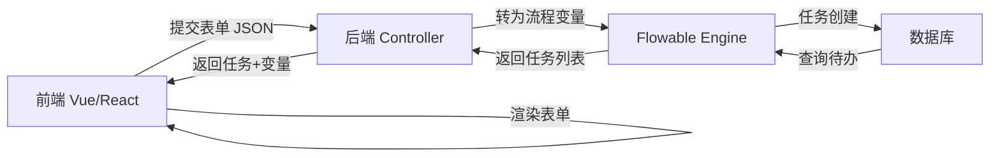

#### 前端表单配置

```json
{
  "processKey": "leaveProcess",
  "taskKey": "submitLeave",
  "formConfig": {
    "fields": [
      {
        "key": "leaveType",
        "label": "请假类型",
        "component": "select",
        "rules": [{ "required": true, "message": "请选择请假类型" }],
        "options": [
          { "label": "年假", "value": "annual" },
          { "label": "病假", "value": "sick" },
          { "label": "事假", "value": "personal" }
        ]
      },
      {
        "key": "days",
        "label": "请假天数",
        "component": "input-number",
        "rules": [
          { "required": true },
          { "type": "number", "min": 0.5, "max": 30 }
        ]
      },
      {
        "key": "reason",
        "label": "请假原因",
        "component": "textarea",
        "rules": [{ "required": true, "max": 500 }]
      }
    ]
  }
}
```

#### 后端 Service

```java
@Service
@RequiredArgsConstructor
public class FormService {

    private final RuntimeService runtimeService;
    private final TaskService taskService;
    private final FormConfigMapper formConfigMapper;

    /**
     * 提交表单并启动流程
     */
    @Transactional
    public String submitForm(String processKey, Map<String, Object> formData) {
        // 1. 表单校验（可以集成 JSR-303）
        validateForm(processKey, null, formData);

        // 2. 业务数据处理（保存附件等）
        handleAttachments(formData);

        // 3. 启动流程，formData 直接作为流程变量
        ProcessInstance instance = runtimeService.startProcessInstanceByKey(
            processKey, formData);

        return instance.getId();
    }

    /**
     * 完成任务并提交表单
     */
    @Transactional
    public void completeTask(String taskId, Map<String, Object> formData,
                            String comment) {
        // 1. 表单校验
        Task task = taskService.createTaskQuery()
            .taskId(taskId).singleResult();
        if (task == null) {
            throw new RuntimeException("任务不存在: " + taskId);
        }
        validateForm(task.getProcessDefinitionId(), 
                     task.getTaskDefinitionKey(), formData);

        // 2. 添加审批意见
        if (StringUtils.hasText(comment)) {
            taskService.addComment(taskId, null, comment);
        }

        // 3. 完成任务，传入表单数据作为流程变量
        taskService.complete(taskId, formData);
    }

    /**
     * 获取任务表单数据（回显）
     */
    public Map<String, Object> getTaskFormData(String taskId) {
        // 获取流程变量
        Map<String, Object> variables = taskService.getVariables(taskId);

        // 过滤掉系统变量，只返回业务字段
        return variables.entrySet().stream()
            .filter(e -> !e.getKey().startsWith("_"))
            .collect(Collectors.toMap(Map.Entry::getKey, Map.Entry::getValue));
    }

    /**
     * 获取表单配置（前端根据配置动态渲染）
     */
    public FormConfig getFormConfig(String processKey, String taskKey) {
        return formConfigMapper.selectByProcessAndTask(processKey, taskKey);
    }
}
```

#### Controller

```java
@RestController
@RequestMapping("/api/workflow")
@RequiredArgsConstructor
public class WorkflowController {

    private final FormService formService;
    private final TaskService taskService;

    /**
     * 获取待办任务列表（含流程变量）
     */
    @GetMapping("/tasks")
    public List<TaskVO> getMyTasks(@RequestParam String userId) {
        return taskService.createTaskQuery()
            .taskAssignee(userId)
            .orderByTaskCreateTime().desc()
            .list()
            .stream()
            .map(task -> {
                TaskVO vo = new TaskVO();
                vo.setTaskId(task.getId());
                vo.setTaskName(task.getName());
                vo.setCreateTime(task.getCreateTime());
                vo.setProcessInstanceId(task.getProcessInstanceId());
                vo.setVariables(taskService.getVariables(task.getId()));
                return vo;
            })
            .collect(Collectors.toList());
    }

    /**
     * 获取任务表单（表单配置 + 已填数据）
     */
    @GetMapping("/tasks/{taskId}/form")
    public FormDataVO getTaskForm(@PathVariable String taskId) {
        Task task = taskService.createTaskQuery()
            .taskId(taskId).singleResult();
        
        FormDataVO vo = new FormDataVO();
        vo.setTaskId(taskId);
        vo.setTaskName(task.getName());
        vo.setFormConfig(formService.getFormConfig(
            task.getProcessDefinitionId(), task.getTaskDefinitionKey()));
        vo.setFormData(formService.getTaskFormData(taskId));
        return vo;
    }

    /**
     * 提交表单完成任务
     */
    @PostMapping("/tasks/{taskId}/submit")
    public Result<Void> submitTaskForm(
            @PathVariable String taskId,
            @RequestBody TaskFormSubmitDTO dto) {
        formService.completeTask(taskId, dto.getFormData(), dto.getComment());
        return Result.success();
    }
}
```

#### 前端 Vue 3 示例（动态表单渲染）

```vue
<template>
  <div class="task-form">
    <h3>{{ taskName }}</h3>
    <el-form ref="formRef" :model="formData" :rules="rules" label-width="120px">
      <!-- 动态渲染表单字段 -->
      <el-form-item 
        v-for="field in formConfig.fields" 
        :key="field.key"
        :label="field.label"
        :prop="field.key">
        
        <!-- 文本输入 -->
        <el-input v-if="field.component === 'input'" 
                  v-model="formData[field.key]" />
        
        <!-- 数字输入 -->
        <el-input-number v-if="field.component === 'input-number'"
                         v-model="formData[field.key]"
                         :min="field.min" :max="field.max" />
        
        <!-- 下拉选择 -->
        <el-select v-if="field.component === 'select'" 
                   v-model="formData[field.key]">
          <el-option v-for="opt in field.options"
                     :key="opt.value" :label="opt.label" :value="opt.value" />
        </el-select>
        
        <!-- 多行文本 -->
        <el-input v-if="field.component === 'textarea'"
                  v-model="formData[field.key]" type="textarea" :rows="3" />
        
        <!-- 日期选择 -->
        <el-date-picker v-if="field.component === 'date-picker'"
                        v-model="formData[field.key]" type="date" />
      </el-form-item>
    </el-form>
    
    <el-form-item>
      <el-input v-model="comment" type="textarea" placeholder="审批意见" :rows="2" />
    </el-form-item>
    
    <el-form-item>
      <el-button type="primary" @click="submit">提交</el-button>
    </el-form-item>
  </div>
</template>

<script setup>
import { ref, onMounted } from 'vue'
import { getTaskForm, submitTaskForm } from '@/api/workflow'

const props = defineProps({ taskId: String })
const formRef = ref()
const taskName = ref('')
const formConfig = ref({ fields: [] })
const formData = ref({})
const comment = ref('')

onMounted(async () => {
  const res = await getTaskForm(props.taskId)
  taskName.value = res.taskName
  formConfig.value = res.formConfig
  formData.value = res.formData || {}
})

const submit = async () => {
  await formRef.value.validate()
  await submitTaskForm(props.taskId, {
    formData: formData.value,
    comment: comment.value
  })
}
</script>
```

### 6.5 表单与流程变量的映射

::: tip 核心原则

不管用哪种表单方案，最终都是 **表单字段 ↔ 流程变量** 的映射关系。Flowable 不关心表单长什么样，它只处理变量。

:::

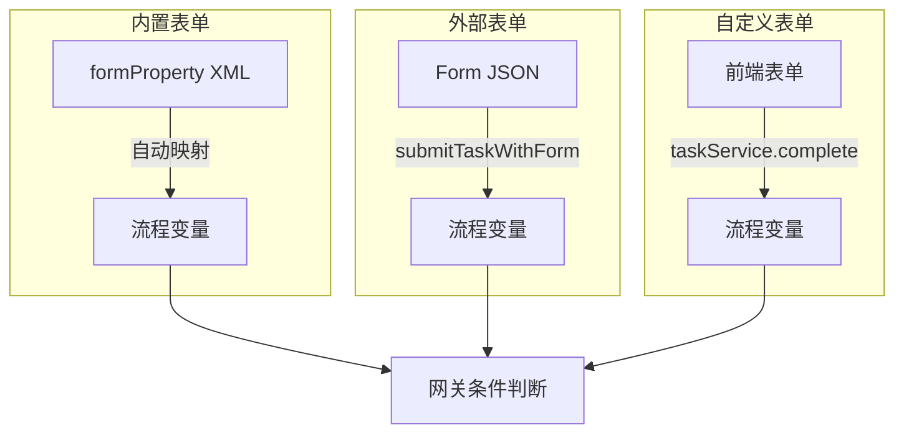

#### 不同节点的表单策略

| 节点 | 表单内容 | 建议方案 |
|------|----------|----------|
| 发起申请 | 填写申请信息 | 自定义表单（字段多） |
| 审批节点 | 查看申请详情 + 审批意见 | 自定义表单（只读 + 审批意见框） |
| 抄送节点 | 查看信息 | 自定义表单（纯只读） |
| 条件分支 | 自动判断 | 无需表单 |

### 6.6 表单数据查询

```java
/**
 * 查询历史表单数据
 */
public List<HistoryFormVO> getProcessFormHistory(String processInstanceId) {
    // 查询历史任务（按时间排序）
    List<HistoricTaskInstance> tasks = historyService
        .createHistoricTaskInstanceQuery()
        .processInstanceId(processInstanceId)
        .orderByHistoricTaskInstanceEndTime().asc()
        .list();

    return tasks.stream()
        .filter(t -> t.getEndTime() != null)
        .map(task -> {
            HistoryFormVO vo = new HistoryFormVO();
            vo.setTaskName(task.getName());
            vo.setAssignee(task.getAssignee());
            vo.setEndTime(task.getEndTime());

            // 获取任务完成时的变量快照
            Map<String, Object> variables = historyService
                .createHistoricVariableInstanceQuery()
                .processInstanceId(processInstanceId)
                .taskId(task.getId())
                .list()
                .stream()
                .collect(Collectors.toMap(
                    HistoricVariableInstance::getVariableName,
                    HistoricVariableInstance::getValue
                ));
            vo.setVariables(variables);

            // 获取审批意见
            List<Comment> comments = taskService.getTaskComments(task.getId());
            vo.setComments(comments.stream()
                .map(Comment::getFullMessage)
                .collect(Collectors.toList()));

            return vo;
        })
        .collect(Collectors.toList());
}
```

### 6.7 表单方案选择指南

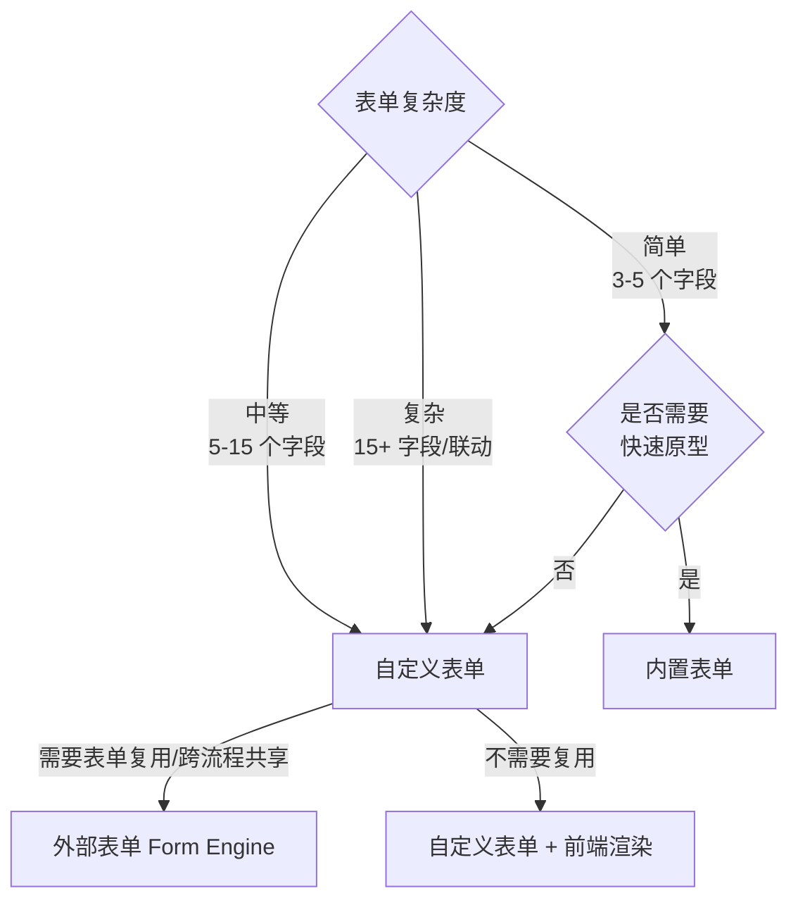

::: details 为什么生产项目推荐自定义表单？

1. **前端技术自由**：可以用 Element Plus / Ant Design 等成熟的表单组件
2. **验证能力强**：前端表单验证 + 后端 JSR-303 双重校验
3. **扩展性好**：文件上传、富文本、地址选择等复杂组件都能支持
4. **复用已有表单**：很多项目已经有表单页面，不需要重新开发
5. **维护成本低**：表单逻辑在前端项目中，修改不需要重新部署流程
6. **用户体验好**：联动、异步校验、动态显示/隐藏字段等

:::


---

## 七、完整实战项目：请假审批系统

### 7.1 流程设计

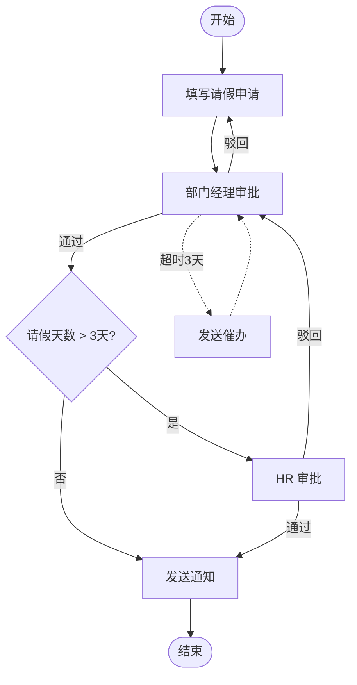

完整 BPMN XML：

```xml
<?xml version="1.0" encoding="UTF-8"?>
<definitions xmlns="http://www.omg.org/spec/BPMN/20100524/MODEL"
             xmlns:xsi="http://www.w3.org/2001/XMLSchema-instance"
             xmlns:flowable="http://flowable.org/bpmn"
             xmlns:bpmndi="http://www.omg.org/spec/BPMN/20100524/DI"
             targetNamespace="http://flowable.org/example">

    <!-- 错误定义 -->
    <error id="leaveRejectError" errorCode="LEAVE_REJECT" />

    <!-- 信号定义 -->
    <signal id="leaveCancelSignal" name="cancelLeave" flowable:scope="global" />

    <process id="leaveProcess" name="员工请假审批流程" isExecutable="true">

        <!-- ========== 开始事件 ========== -->
        <startEvent id="start" name="开始" />

        <sequenceFlow id="flow1" sourceRef="start" targetRef="deptApprove" />

        <!-- ========== 部门经理审批 ========== -->
        <userTask id="deptApprove" name="部门经理审批"
                  flowable:assignee="${deptManager}">
            <documentation>部门经理审批请假申请</documentation>
            <extensionElements>
                <flowable:taskListener event="create"
                    delegateExpression="${autoAssigneeListener}" />
                <flowable:taskListener event="create"
                    delegateExpression="${approvalNotificationListener}" />
                <flowable:taskListener event="complete"
                    delegateExpression="${approvalNotificationListener}" />
            </extensionElements>
        </userTask>

        <!-- 催办定时器（不中断任务） -->
        <boundaryEvent id="reminderTimer" attachedToRef="deptApprove" cancelActivity="false">
            <timerEventDefinition>
                <timeCycle>0 0 9 * * ?</timeCycle>
            </timerEventDefinition>
        </boundaryEvent>
        <serviceTask id="sendReminder" name="发送催办"
                     flowable:delegateExpression="${sendReminderDelegate}" />
        <sequenceFlow sourceRef="reminderTimer" targetRef="sendReminder" />
        <sequenceFlow sourceRef="sendReminder" targetRef="deptApprove" />

        <sequenceFlow id="flow2" sourceRef="deptApprove" targetRef="deptDecision" />

        <!-- ========== 部门经理决策网关 ========== -->
        <exclusiveGateway id="deptDecision" name="经理审批结果" default="flow_reject_to_apply" />

        <!-- 通过 -->
        <sequenceFlow id="flow_pass" sourceRef="deptDecision" targetRef="daysCheck">
            <conditionExpression xsi:type="tFormalExpression">
                ${approved == true}
            </conditionExpression>
        </sequenceFlow>

        <!-- 驳回 -->
        <sequenceFlow id="flow_reject_to_apply" sourceRef="deptDecision" targetRef="end_rejected">
            <conditionExpression xsi:type="tFormalExpression">
                ${approved == false}
            </conditionExpression>
        </sequenceFlow>

        <!-- ========== 判断天数网关 ========== -->
        <exclusiveGateway id="daysCheck" name="判断天数" default="flow_notify" />

        <sequenceFlow id="flow_to_hr" sourceRef="daysCheck" targetRef="hrApprove">
            <conditionExpression xsi:type="tFormalExpression">
                ${days &gt; 3}
            </conditionExpression>
        </sequenceFlow>

        <sequenceFlow id="flow_notify" sourceRef="daysCheck" targetRef="notifyApproved" />

        <!-- ========== HR 审批 ========== -->
        <userTask id="hrApprove" name="HR 审批"
                  flowable:candidateGroups="hr">
            <documentation>HR 审批超过3天的请假</documentation>
            <extensionElements>
                <flowable:taskListener event="create"
                    delegateExpression="${autoAssigneeListener}" />
            </extensionElements>
        </userTask>

        <sequenceFlow id="flow3" sourceRef="hrApprove" targetRef="hrDecision" />

        <!-- ========== HR 决策网关 ========== -->
        <exclusiveGateway id="hrDecision" name="HR 审批结果" default="flow_hr_reject" />

        <sequenceFlow id="flow_hr_pass" sourceRef="hrDecision" targetRef="notifyApproved">
            <conditionExpression xsi:type="tFormalExpression">
                ${approved == true}
            </conditionExpression>
        </sequenceFlow>

        <sequenceFlow id="flow_hr_reject" sourceRef="hrDecision" targetRef="end_rejected" />

        <!-- ========== 发送通知 ========== -->
        <serviceTask id="notifyApproved" name="发送通过通知"
                     flowable:delegateExpression="${leaveNotifyDelegate}" />

        <sequenceFlow id="flow4" sourceRef="notifyApproved" targetRef="end_approved" />

        <!-- ========== 结束事件 ========== -->
        <endEvent id="end_approved" name="审批通过" />
        <endEvent id="end_rejected" name="审批驳回" />

        <!-- ========== 取消信号边界事件 ========== -->
        <boundaryEvent id="cancelBoundary" attachedToRef="deptApprove" cancelActivity="true">
            <signalEventDefinition signalRef="leaveCancelSignal" />
        </boundaryEvent>
        <sequenceFlow sourceRef="cancelBoundary" targetRef="end_cancelled" />
        <endEvent id="end_cancelled" name="已撤销" />

    </process>
</definitions>
```

### 7.2 数据库设计

```sql
-- 请假申请表
CREATE TABLE `leave_request` (
    `id` BIGINT PRIMARY KEY AUTO_INCREMENT,
    `applicant` VARCHAR(64) NOT NULL COMMENT '申请人',
    `start_date` DATE NOT NULL COMMENT '开始日期',
    `end_date` DATE NOT NULL COMMENT '结束日期',
    `days` INT NOT NULL COMMENT '请假天数',
    `reason` VARCHAR(500) COMMENT '请假原因',
    `leave_type` VARCHAR(20) NOT NULL COMMENT '类型：annual/sick/personal',
    `status` VARCHAR(20) NOT NULL DEFAULT 'DRAFT' COMMENT '状态：DRAFT/PENDING/APPROVED/REJECTED/CANCELLED',
    `process_instance_id` VARCHAR(64) COMMENT '流程实例 ID',
    `dept_manager` VARCHAR(64) COMMENT '部门经理',
    `created_at` DATETIME DEFAULT CURRENT_TIMESTAMP,
    `updated_at` DATETIME DEFAULT CURRENT_TIMESTAMP ON UPDATE CURRENT_TIMESTAMP,
    INDEX `idx_applicant` (`applicant`),
    INDEX `idx_status` (`status`),
    INDEX `idx_process_instance_id` (`process_instance_id`)
) ENGINE=InnoDB DEFAULT CHARSET=utf8mb4 COMMENT='请假申请表';
```

### 6.3 Entity & Mapper

```java
@Data
@TableName("leave_request")
public class LeaveRequest {
    @TableId(type = IdType.AUTO)
    private Long id;
    private String applicant;
    private LocalDate startDate;
    private LocalDate endDate;
    private Integer days;
    private String reason;
    private String leaveType;
    private String status;
    private String processInstanceId;
    private String deptManager;
    private LocalDateTime createdAt;
    private LocalDateTime updatedAt;
}

@Mapper
public interface LeaveRequestMapper extends BaseMapper<LeaveRequest> {
}
```

### 6.4 Service 层完整代码

```java
@Service
@RequiredArgsConstructor
@Slf4j
public class LeaveService {

    private final RuntimeService runtimeService;
    private final TaskService taskService;
    private final HistoryService historyService;
    private final RepositoryService repositoryService;
    private final LeaveRequestMapper leaveMapper;

    /**
     * 提交请假申请
     */
    @Transactional
    public String submitLeave(LeaveRequest request) {
        // 1. 保存业务数据
        request.setStatus("PENDING");
        leaveMapper.insert(request);

        // 2. 查询部门经理
        String deptManager = orgService.getDirectManager(request.getApplicant());
        request.setDeptManager(deptManager);

        // 3. 设置流程变量
        Map<String, Object> variables = new HashMap<>();
        variables.put("applicant", request.getApplicant());
        variables.put("days", request.getDays());
        variables.put("reason", request.getReason());
        variables.put("leaveType", request.getLeaveType());
        variables.put("deptManager", deptManager);

        // 4. 启动流程
        ProcessInstance instance = runtimeService.startProcessInstanceByKey(
            "leaveProcess",
            request.getId().toString(),
            variables
        );

        // 5. 关联流程实例
        request.setProcessInstanceId(instance.getId());
        leaveMapper.updateById(request);

        log.info("请假申请已提交：id={}, processInstanceId={}", request.getId(), instance.getId());
        return instance.getId();
    }

    /**
     * 审批
     */
    @Transactional
    public void approve(String taskId, boolean approved, String comment) {
        Task task = taskService.createTaskQuery()
            .taskId(taskId)
            .singleResult();
        if (task == null) {
            throw new BusinessException("任务不存在：" + taskId);
        }

        // 添加审批意见
        if (StringUtils.isNotBlank(comment)) {
            taskService.addComment(taskId, task.getProcessInstanceId(), comment);
        }

        // 设置审批结果变量
        Map<String, Object> variables = new HashMap<>();
        variables.put("approved", approved);
        variables.put("approver", SecurityUtils.getCurrentUser());
        variables.put("approveTime", LocalDateTime.now());

        // 完成任务
        taskService.complete(taskId, variables);

        // 更新业务状态
        String businessKey = getBusinessKey(task.getProcessInstanceId());
        if (approved) {
            // 检查流程是否已结束（如果天数 <= 3，经理通过就结束了）
            ProcessInstance pi = runtimeService.createProcessInstanceQuery()
                .processInstanceId(task.getProcessInstanceId())
                .singleResult();
            if (pi == null) {
                // 流程已结束
                updateLeaveStatus(businessKey, "APPROVED");
            }
            // 否则等 HR 审批
        } else {
            updateLeaveStatus(businessKey, "REJECTED");
        }
    }

    /**
     * 撤销请假
     */
    public void cancelLeave(String processInstanceId) {
        runtimeService.signalEventReceived("cancelLeave");
    }

    /**
     * 查询我的待办
     */
    public List<TaskVO> getMyTasks(String userId) {
        return taskService.createTaskQuery()
            .taskAssignee(userId)
            .orderByTaskCreateTime().desc()
            .list()
            .stream()
            .map(this::toTaskVO)
            .collect(Collectors.toList());
    }

    /**
     * 查询可认领的任务
     */
    public List<TaskVO> getCandidateTasks(String userId, List<String> groups) {
        // 查询用户直接候选的 + 组候选的
        List<Task> tasks = new ArrayList<>();
        tasks.addAll(taskService.createTaskQuery().taskCandidateUser(userId).list());
        for (String group : groups) {
            tasks.addAll(taskService.createTaskQuery().taskCandidateGroup(group).list());
        }
        return tasks.stream().map(this::toTaskVO).collect(Collectors.toList());
    }

    /**
     * 查询审批历史
     */
    public List<ApprovalHistoryVO> getApprovalHistory(String processInstanceId) {
        return historyService.createHistoricActivityInstanceQuery()
            .processInstanceId(processInstanceId)
            .activityType("userTask")
            .orderByHistoricActivityInstanceEndTime().asc()
            .list()
            .stream()
            .map(this::toHistoryVO)
            .collect(Collectors.toList());
    }

    /**
     * 查询流程图高亮数据
     */
    public ProcessDiagramVO getProcessDiagram(String processInstanceId) {
        ProcessInstance pi = runtimeService.createProcessInstanceQuery()
            .processInstanceId(processInstanceId)
            .singleResult();

        // 已完成的节点
        List<HistoricActivityInstance> finishedActivities = historyService
            .createHistoricActivityInstanceQuery()
            .processInstanceId(processInstanceId)
            .finished()
            .list();

        // 当前活跃的节点
        List<String> activeActivityIds = new ArrayList<>();
        if (pi != null) {
            activeActivityIds = runtimeService.getActiveActivityIds(processInstanceId);
        }

        // 已完成的连线
        List<String> finishedFlows = finishedActivities.stream()
            .map(HistoricActivityInstance::getActivityId)
            .collect(Collectors.toList());

        return new ProcessDiagramVO(
            pi != null, finishedActivities, activeActivityIds, finishedFlows
        );
    }

    // ========== 私有方法 ==========
    private String getBusinessKey(String processInstanceId) {
        HistoricProcessInstance hpi = historyService.createHistoricProcessInstanceQuery()
            .processInstanceId(processInstanceId)
            .singleResult();
        return hpi != null ? hpi.getBusinessKey() : null;
    }

    private void updateLeaveStatus(String businessKey, String status) {
        if (businessKey == null) return;
        LambdaUpdateWrapper<LeaveRequest> wrapper = new LambdaUpdateWrapper<>();
        wrapper.eq(LeaveRequest::getId, Long.parseLong(businessKey))
               .set(LeaveRequest::getStatus, status);
        leaveMapper.update(null, wrapper);
    }

    private TaskVO toTaskVO(Task task) {
        TaskVO vo = new TaskVO();
        vo.setTaskId(task.getId());
        vo.setTaskName(task.getName());
        vo.setAssignee(task.getAssignee());
        vo.setCreateTime(task.getCreateTime());
        vo.setProcessInstanceId(task.getProcessInstanceId());

        // 关联业务数据
        String businessKey = getBusinessKey(task.getProcessInstanceId());
        if (businessKey != null) {
            LeaveRequest request = leaveMapper.selectById(Long.parseLong(businessKey));
            vo.setBusinessKey(businessKey);
            vo.setBusinessData(request);
        }
        return vo;
    }
}
```

### 6.5 Controller 层

```java
@RestController
@RequestMapping("/api/leave")
@RequiredArgsConstructor
@Tag(name = "请假审批")
public class LeaveController {

    private final LeaveService leaveService;

    @PostMapping("/submit")
    @Operation(summary = "提交请假申请")
    public Result<String> submit(@RequestBody @Valid LeaveRequest request) {
        String processInstanceId = leaveService.submitLeave(request);
        return Result.ok(processInstanceId);
    }

    @GetMapping("/my-tasks")
    @Operation(summary = "我的待办")
    public Result<List<TaskVO>> myTasks() {
        String userId = SecurityUtils.getCurrentUser();
        return Result.ok(leaveService.getMyTasks(userId));
    }

    @GetMapping("/candidate-tasks")
    @Operation(summary = "可认领的任务")
    public Result<List<TaskVO>> candidateTasks() {
        String userId = SecurityUtils.getCurrentUser();
        List<String> groups = SecurityUtils.getCurrentUserGroups();
        return Result.ok(leaveService.getCandidateTasks(userId, groups));
    }

    @PostMapping("/claim/{taskId}")
    @Operation(summary = "认领任务")
    public Result<Void> claim(@PathVariable String taskId) {
        taskService.claim(taskId, SecurityUtils.getCurrentUser());
        return Result.ok();
    }

    @PostMapping("/approve")
    @Operation(summary = "审批")
    public Result<Void> approve(@RequestBody ApproveDTO dto) {
        leaveService.approve(dto.getTaskId(), dto.isApproved(), dto.getComment());
        return Result.ok();
    }

    @PostMapping("/cancel/{processInstanceId}")
    @Operation(summary = "撤销")
    public Result<Void> cancel(@PathVariable String processInstanceId) {
        leaveService.cancelLeave(processInstanceId);
        return Result.ok();
    }

    @GetMapping("/history/{processInstanceId}")
    @Operation(summary = "审批历史")
    public Result<List<ApprovalHistoryVO>> history(@PathVariable String processInstanceId) {
        return Result.ok(leaveService.getApprovalHistory(processInstanceId));
    }

    @GetMapping("/diagram/{processInstanceId}")
    @Operation(summary = "流程图（含高亮）")
    public void diagram(@PathVariable String processInstanceId, HttpServletResponse response) 
            throws IOException {
        ProcessDiagramVO diagram = leaveService.getProcessDiagram(processInstanceId);
        
        // 生成流程图（使用 Flowable 自带的 diagram generator）
        BpmnModel bpmnModel = repositoryService.getBpmnModel(
            // 获取流程定义 ID
            historyService.createHistoricProcessInstanceQuery()
                .processInstanceId(processInstanceId)
                .singleResult().getProcessDefinitionId()
        );
        
        ProcessEngineConfiguration config = processEngine.getProcessEngineConfiguration();
        InputStream diagramStream = new DefaultProcessDiagramGenerator()
            .generateDiagram(bpmnModel, "png", 
                diagram.getActiveActivityIds(), 
                diagram.getFinishedFlows(),
                config.getActivityFontName(),
                config.getLabelFontName(),
                config.getAnnotationFontName(),
                null, 1.0, true);
        
        response.setContentType("image/png");
        IOUtils.copy(diagramStream, response.getOutputStream());
    }
}
```

### 6.6 前端对接思路

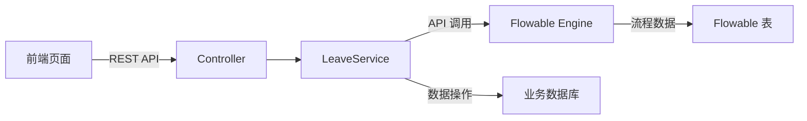

前端核心页面：

| 页面 | 说明 | 调用的 API |
|------|------|------------|
| 请假申请页 | 填写请假表单 | `POST /api/leave/submit` |
| 我的待办列表 | 展示待办任务 | `GET /api/leave/my-tasks` |
| 待认领列表 | 可认领的任务 | `GET /api/leave/candidate-tasks` |
| 审批详情页 | 查看详情 + 审批 | `POST /api/leave/approve` |
| 流程图页 | 查看流程进度 | `GET /api/leave/diagram/{id}` |
| 审批历史页 | 查看审批记录 | `GET /api/leave/history/{id}` |

::: tip 流程图查看
Flowable 自带的 `DefaultProcessDiagramGenerator` 可以生成带高亮的流程图 PNG，绿色表示已完成节点，红色表示当前活跃节点。前端直接用 `` 标签展示即可。

也可以集成 Flowable UI 的流程设计器，让业务人员自己画流程。

:::

---

## 八、高级特性

### 7.1 定时器详解

#### Timer Start Event

流程可以由定时器自动启动：

```xml
<startEvent id="dailyReport" name="每日报告">
    <timerEventDefinition>
        <timeCycle>0 0 8 * * MON-FRI</timeCycle>  <!-- 工作日每天 8:00 -->
    </timerEventDefinition>
</startEvent>
```

::: warning 定时开始事件 + 部署
每次部署新版本流程定义，定时器都会重新注册。如果同一个流程有多个版本在运行，可能会触发多次。注意 `database-schema-update` 设为 `true` 时会自动部署。

:::

#### Timer Boundary Event

```xml
<!-- 任务超时自动跳过 -->
<boundaryEvent id="autoSkip" attachedToRef="approvalTask" cancelActivity="true">
    <timerEventDefinition>
        <timeDuration>P3D</timeDuration>  <!-- 3 天后自动跳过 -->
    </timerEventDefinition>
</boundaryEvent>

<!-- 任务超时自动催办（不中断） -->
<boundaryEvent id="autoRemind" attachedToRef="approvalTask" cancelActivity="false">
    <timerEventDefinition>
        <timeCycle>R3/P1D</timeCycle>  <!-- 每 1 天提醒一次，共 3 次 -->
    </timerEventDefinition>
</boundaryEvent>
```

#### cron 表达式参考

| 表达式 | 说明 |
|--------|------|
| `0 0 9 * * ?` | 每天 9:00 |
| `0 0/30 9-18 * * ?` | 工作时间每 30 分钟 |
| `0 0 9 ? * MON-FRI` | 工作日 9:00 |
| `0 0 0 1 * ?` | 每月 1 日 0:00 |
| `R3/P1D` | 每 1 天重复，共 3 次 |

### 7.2 信号与消息事件

::: details 信号 vs 消息

| 特性 | 信号（Signal） | 消息（Message） |
|------|---------------|----------------|
| 传递方式 | 广播（一对多） | 点对点（一对一） |
| 作用域 | 全局 | 流程实例级别 |
| 是否消耗 | 不消耗，所有订阅者都会收到 | 消费后删除订阅 |
| 适用场景 | 全局通知（系统关闭、价格变更） | 特定流程的等待（等待订单确认） |

:::

### 7.3 多实例（Multi-Instance）

多实例用于并行或串行执行同一个任务多次。

#### 并行多实例

```xml
<!-- 并行多实例：所有经理同时审批 -->
<userTask id="parallelApprove" name="会签">
    <multiInstanceLoopCharacteristics 
        isSequential="false"
        flowable:collection="${approverList}"
        flowable:elementVariable="approver">
        <!-- 完成条件：所有人都审批通过 -->
        <completionCondition>${nrOfCompletedInstances == nrOfInstances}</completionCondition>
    </multiInstanceLoopCharacteristics>
    <extensionElements>
        <flowable:taskListener event="create"
            delegateExpression="${multiInstanceAssigneeListener}" />
    </extensionElements>
</userTask>
```

```java
// 设置审批人列表
List<String> approvers = Arrays.asList("张三", "李四", "王五");
variables.put("approverList", approvers);
```

#### 串行多实例

```xml
<!-- 串行多实例：经理逐个审批 -->
<userTask id="sequentialApprove" name="依次审批">
    <multiInstanceLoopCharacteristics 
        isSequential="true"
        flowable:collection="${approverList}"
        flowable:elementVariable="approver">
        <!-- 一票否决：任一人拒绝即终止 -->
        <completionCondition>${approved == false}</completionCondition>
    </multiInstanceLoopCharacteristics>
</userTask>
```

#### 多实例内置变量

| 变量名 | 说明 |
|--------|------|
| `nrOfInstances` | 总实例数 |
| `nrOfActiveInstances` | 当前活跃实例数（并行有意义） |
| `nrOfCompletedInstances` | 已完成实例数 |
| `loopCounter` | 当前循环索引（从 0 开始） |

::: tip 会签与或签
- **会签**（并行多实例）：所有人都要审批，可设置完成比例
- **或签**（串行多实例 + 一票通过条件）：任一人通过即可

:::

### 7.4 流程迁移（Change Activity State）

当流程定义更新后，正在运行的流程实例需要迁移到新版本：

```java
// 迁移单个流程实例
runtimeService.createChangeActivityStateBuilder()
    .processInstanceId(processInstanceId)
    .moveActivityIdTo("oldTaskId", "newTaskId")  // 移动单个活动
    .changeState();

// 批量迁移
runtimeService.createChangeActivityStateBuilder()
    .processDefinitionId(processDefinitionId)
    .moveActivityIdTo("oldTaskId", "newTaskId")
    .changeState();

// 迁移到新版本流程定义
runtimeService.createProcessInstanceMigrationBuilder()
    .migrateToProcessDefinition(newProcessDefinitionId)
    .addActivityMigrationMapping(
        ActivityMigrationMapping.createMappingFor("oldTaskId", "newTaskId")
    )
    .migrate(processInstanceId);
```

### 7.5 流程挂起与激活

```java
// ========== 流程定义级别 ==========
// 挂起流程定义（新启动的流程实例会暂停，已运行的不受影响）
repositoryService.suspendProcessDefinitionById(processDefId);
// 级联挂起（包括已运行的实例）
repositoryService.suspendProcessDefinitionById(processDefId, true, null);
// 激活
repositoryService.activateProcessDefinitionById(processDefId);

// ========== 流程实例级别 ==========
runtimeService.suspendProcessInstanceById(processInstanceId);
runtimeService.activateProcessInstanceById(processInstanceId);

// ========== 查询挂起的实例 ==========
List<ProcessInstance> suspended = runtimeService.createProcessInstanceQuery()
    .suspended()
    .list();
```

### 7.6 任务转办、委派、加签

```java
// ========== 转办 ==========
// 直接移交，原处理人不再可见
taskService.setAssignee(taskId, "newUser");

// ========== 委派 ==========
// 委托他人处理，处理完后回到原处理人
taskService.delegateTask(taskId, "delegateUser");
// 被委派人处理完成
taskService.resolveTask(taskId);

// ========== 加签 ==========
// Flowable 没有原生加签 API，需要通过多实例或自定义实现
// 方式 1：动态修改候选用户
List<String> newCandidates = new ArrayList<>();
newCandidates.add("originalUser");
newCandidates.add("additionalUser1");
newCandidates.add("additionalUser2");
taskService.addCandidateUsers(taskId, newCandidates);

// 方式 2：使用多实例动态添加
// 通过流程变量动态控制多实例的执行人列表
```

::: details 委派的完整流程
1. 审批人 A 委派给 B：`taskService.delegateTask(taskId, "B")`
2. B 成为处理人，A 变为 owner：`task.getOwner() = "A"`, `task.getAssignee() = "B"`
3. B 处理完：`taskService.resolveTask(taskId)`
4. 任务回到 A：`task.getAssignee() = "A"`, `task.getOwner() = "A"`

:::

---

## 九、Flowable 6 vs 7 的区别

Flowable 7.0 是一个大版本更新，有一些 Breaking Changes。

### 8.1 主要变化

| 方面 | Flowable 6.x | Flowable 7.x |
|------|-------------|-------------|
| Java 版本 | Java 8+ | Java 17+ |
| Spring Boot | 2.x / 3.x | 3.x only |
| API 兼容 | - | 移除大量废弃 API |
| 历史清理 | 手动 | 内置 History Cleanup |
| CMMN/DMN | 独立模块 | 更紧密集成 |
| 异步执行器 | 需要手动配置 | 默认激活 |
| 批量操作 | 基础 | 增强批量 API |

### 8.2 API 变化

```java
// Flowable 6.x（部分 API 在 7.x 中被移除）
// processEngine.getTaskService() 仍然可用
// 但一些过期方法被移除了

// Flowable 7.x 变化
// 1. ProcessEngineConfiguration 的配置方式变了
// 旧：
ProcessEngineConfiguration.createStandaloneProcessEngineConfiguration();
// 新（推荐 Spring Boot 自动配置）

// 2. 查询 API 更严格
// 旧：有些 null 参数会被忽略
// 新：传入 null 会抛 NullPointerException

// 3. History Cleanup 自动执行
// 不再需要手动写定时任务清理历史数据
```

### 8.3 迁移指南

```markdown
1. 升级 Java 到 17+
2. 升级 Spring Boot 到 3.x
3. 替换 Maven 依赖版本
4. 编译检查，处理编译错误（废弃 API 被移除）
5. 检查自定义 TypeHandler 和序列化配置
6. 测试所有流程场景
7. 注意：6.x 的数据库可以直接被 7.x 使用，不需要迁移脚本
```

::: warning 是否要升级到 7.x？
- 新项目：直接用 7.x
- 老项目在 6.x 上运行良好：不急着升，6.x 还在维护
- 老项目要升级到 Spring Boot 3.x：必须用 7.x

:::

---

## 十、性能优化

### 9.1 异步执行器配置

异步执行器是 Flowable 性能的关键，它负责执行异步任务、定时器等：

```yaml
flowable:
  async-executor-activate: true
  async-executor-core-pool-size: 8
  async-executor-max-pool-size: 32
  async-executor-queue-capacity: 100
  # 默认异步任务的锁定时间（秒）
  async-executor-default-async-job-acquire-wait-time: 30
  # 定时任务轮询间隔（秒）
  async-executor-default-timer-job-acquire-wait-time: 30
  # 异步任务锁定时间（秒，防止重复执行）
  async-executor-async-job-lock-time: 300
```

在 BPMN XML 中标记异步执行：

```xml
<!-- 异步 Service Task（不阻塞主流程） -->
<serviceTask id="sendEmail" name="发送邮件"
             flowable:delegateExpression="${sendEmailDelegate}"
             flowable:async="true" />

<!-- 异步开始事件 -->
<startEvent id="start" flowable:async="true" />

<!-- 排他网关也可以异步 -->
<exclusiveGateway id="decision" flowable:async="true" />
```

::: tip 异步执行的适用场景
1. 不需要即时反馈的操作（发邮件、发消息、日志记录）
2. 耗时较长的操作
3. 不影响主流程流转的操作

注意：异步任务失败会重试（默认 3 次），超过重试次数进入死信队列。

:::

### 9.2 历史级别选择

| 级别 | 记录内容 | 数据量 | 推荐场景 |
|------|----------|--------|----------|
| `none` | 不记录历史 | 最小 | 不需要历史追踪 |
| `activity` | 流程实例 + 活动实例 | 小 | 只需知道流程是否完成 |
| `audit` | 活动 + 任务 + 表单属性 | 中 | **大多数场景（推荐）** |
| `full` | 所有变量变更 | 大 | 需要审计追踪所有变量 |

```yaml
flowable:
  history-level: audit
```

### 9.3 批量操作

```java
// 批量完成同类型的任务
List<Task> tasks = taskService.createTaskQuery()
    .taskDefinitionKey("simpleApprove")
    .taskAssignee("admin")
    .list();

for (Task task : tasks) {
    taskService.complete(task.getId());
}

// 使用 Command 模式批量操作（减少事务次数）
managementService.executeCommand(commandContext -> {
    CommandContextUtil.getTaskEntityManager(commandContext)
        .deleteTasksByProcessInstanceId(processInstanceId);
    return null;
});
```

### 9.4 流程缓存

Flowable 默认启用流程定义缓存，避免每次都从数据库加载：

```java
@Bean
public ProcessEngineConfigurationConfigurer processEngineConfigurationConfigurer() {
    return config -> {
        // 流程定义缓存（默认已启用）
        config.setProcessDefinitionCacheLimit(256);
        
        // 知识库缓存（部署的资源文件）
        config.setKnowledgeBaseCacheLimit(32);
    };
}
```

::: tip 其他优化建议
1. **流程定义版本管理**：不要频繁部署新版本，累积改动后一次性部署
2. **历史数据清理**：定期清理 `ACT_HI_*` 表，Flowable 7.x 内置了 History Cleanup
3. **数据库索引**：Flowable 默认建的索引基本够用，如果有自定义查询，注意加索引
4. **连接池**：生产环境配置合理的连接池大小

:::

---

## 十一、常见问题与排错

### 10.1 流程图中文乱码

**原因**：Flowable 生成流程图时使用的字体不支持中文。

**解决方案**：

```yaml
# 方式 1：配置文件
flowable:
  activity-font-name: 宋体
  label-font-name: 宋体
  annotation-font-name: 宋体
```

```java
// 方式 2：代码配置
@Bean
public ProcessEngineConfigurationConfigurer configurer() {
    return config -> {
        config.setActivityFontName("宋体");
        config.setLabelFontName("宋体");
        config.setAnnotationFontName("宋体");
    };
}
```

::: warning Linux 服务器字体问题
如果服务器上没有安装宋体，需要手动安装字体文件，或者将字体文件放到 `resources/fonts/` 目录下，然后自定义 `ProcessDiagramGenerator` 加载字体。

:::

### 10.2 任务找不到

```java
// 错误：任务已被别人处理了
Task task = taskService.createTaskQuery()
    .taskId(taskId)
    .singleResult();
// task == null，说明任务已经被完成或删除
```

**常见原因**：
1. 任务已被其他人处理
2. 流程已结束
3. 任务 ID 错误
4. 事务未提交（查不到）

**解决方案**：加异常处理，提示用户刷新页面。

### 10.3 流程卡死

流程停在某个节点不动，常见原因：

| 现象 | 可能原因 | 解决方案 |
|------|----------|----------|
| 并行网关汇聚处卡住 | 分支数不匹配 | 检查分支和汇聚的入度出度 |
| 排他网关卡住 | 所有条件都不满足 | 设置 default 流 |
| 信号/消息事件卡住 | 信号/消息没发送 | 检查发送逻辑 |
| 异步任务卡住 | 异步执行器没启动 | 检查 `async-executor-activate` |
| Job 不执行 | 死信队列 | 检查 `ACT_RU_DEADLETTER_JOB` |

```java
// 诊断工具：查看流程当前状态
List<Execution> executions = runtimeService.createExecutionQuery()
    .processInstanceId(processInstanceId)
    .list();

List<Job> jobs = managementService.createJobQuery()
    .processInstanceId(processInstanceId)
    .list();

List<Job> timerJobs = managementService.createTimerJobQuery()
    .processInstanceId(processInstanceId)
    .list();

// 重新执行失败的任务
managementService.moveDeadLetterJobToExecutableJob(jobId, 3);
```

### 10.4 并发问题

```java
// 问题：两个用户同时 claim 同一个任务
// 用户 A 和 B 同时执行 claim(taskId, "A") 和 claim(taskId, "B")
// 后执行的人会抛出 FlowableOptimisticLockingException

// 解决方案 1：前端乐观锁
// claim 前先刷新任务列表，确认任务还是未认领状态

// 解决方案 2：异常重试
try {
    taskService.claim(taskId, userId);
} catch (FlowableOptimisticLockingException e) {
    // 提示用户任务已被认领，请刷新
    throw new BusinessException("任务已被其他人认领");
}

// 解决方案 3：数据库乐观锁
// Flowable 默认使用乐观锁（version 字段），不需要额外配置
```

### 10.5 其他常见问题

::: details 部署后流程定义找不到
检查 `process-definition-location-prefix` 配置和文件名是否正确。BPMN XML 的 `<process id="xxx">` 中的 `id` 就是流程定义的 key。

:::

::: details 变量获取为 null
1. 检查变量是否是局部变量（用 `getVariableLocal` 获取）
2. 检查变量是否是 transient 变量（不持久化）
3. 检查变量名拼写
4. 使用 `debug` 日志级别查看 Flowable 的 SQL 日志

:::

::: details 流程启动报错 "no processes deployed with key"
1. 流程文件没有在 `resources/processes/` 目录下
2. `check-process-definitions` 设为 `false`
3. 流程文件后缀不是 `.bpmn20.xml` 或 `.bpmn`
4. XML 格式错误导致解析失败

:::

---

## 十二、面试高频题

### 1. Flowable 和 Activiti 的区别？

**核心区别**：Flowable 是 Activiti 5.x 的分叉项目，由 Activiti 原核心团队创建。

| 维度 | Flowable | Activiti |
|------|----------|----------|
| 起源 | 2016 年从 Activiti 分叉 | 2010 年从 jBPM 分叉 |
| CMMN 支持 | ✅ 完整支持 | ❌ 不支持 |
| DMN 支持 | ✅ 更完善 | 基础支持 |
| Spring Boot 3 | ✅ 7.x 支持 | 7.x 支持 |
| 社区活跃度 | 更活跃 | 一般 |
| 性能 | 更优 | 一般 |
| 迁移成本 | API 兼容，成本低 | - |

**建议**：新项目用 Flowable，老项目迁移成本低。

### 2. 工作流引擎的适用场景？

**适合用工作流的场景**：
- 审批类流程（请假、报销、采购）
- 订单流转（电商订单状态机）
- 质检流程（多级质检）
- 合同审批
- 入职/离职流程

**不适合的场景**：
- 简单的状态机（3-5 个状态，用枚举 + 策略模式更简单）
- 高频低延迟场景（工作流引擎有一定开销）
- 纯计算密集型任务

### 3. 并行网关和包容网关的区别？

- **并行网关**：所有分支无条件执行，汇聚时等待所有分支完成
- **包容网关**：只执行满足条件的分支，汇聚时等待已发出的分支全部完成（按 token 计数）

**关键区别**：包容网关汇聚时，需要知道分支时发出了多少 token，所以不是简单的"等所有入度到达"。

### 4. 如何实现流程回退？

Flowable 没有原生的回退 API，但有几种实现方式：

```java
// 方式 1：Change Activity State（Flowable 6.x+ 推荐）
runtimeService.createChangeActivityStateBuilder()
    .processInstanceId(processInstanceId)
    .moveActivityIdTo("currentTask", "previousTask")
    .changeState();

// 方式 2：使用信号/消息驱动回退
// 在需要回退的节点加一个信号边界事件

// 方式 3：运行时修改序列流条件
// 不推荐，风险大

// 方式 4：终止当前实例，重新启动
// 最简单但最粗暴
```

::: warning 流程回退的风险
回退可能导致历史数据不一致、重复审批等问题。建议：
1. 回退前确认业务状态
2. 记录回退原因
3. 考虑用"驳回到申请人重新提交"代替"回退到上一步"

:::

### 5. 流程变量的作用域？

三种作用域：
- **全局变量**（ProcessInstance scope）：整个流程实例可见
- **局部变量**（Task/Execution scope）：只在当前任务或执行中可见
- **Transient 变量**：不持久化，流程结束后消失

### 6. 如何处理审批超时？

使用定时器边界事件：

```xml
<boundaryEvent id="timeout" attachedToRef="approveTask" cancelActivity="true">
    <timerEventDefinition>
        <timeDuration>P3D</timeDuration>
    </timerEventDefinition>
</boundaryEvent>
```

或使用非中断定时器定期催办 + 超时自动通过/转办。

### 7. Flowable 的历史级别有哪些？如何选择？

- `none`：不记录历史（不推荐）
- `activity`：记录流程和活动（最轻量）
- `audit`：记录活动 + 任务 + 表单属性（**推荐**）
- `full`：记录所有变量变更（审计场景）

选择依据：数据量 vs 审计需求的权衡。

### 8. 如何实现会签（多人审批）？

使用多实例（Multi-Instance）：

```xml
<userTask id="countersign" name="会签">
    <multiInstanceLoopCharacteristics 
        isSequential="false"
        flowable:collection="${approverList}"
        flowable:elementVariable="approver">
        <completionCondition>
            ${nrOfCompletedInstances / nrOfInstances >= 0.6}
        </completionCondition>
    </multiInstanceLoopCharacteristics>
</userTask>
```

### 9. Flowable 如何与业务系统集成？

- **业务表 + 流程表分离**：业务数据存自己的表，通过 `businessKey` 关联
- **流程变量传递业务数据**：适合简单的数据
- **TaskListener/ExecutionListener 同步状态**：在审批节点完成时更新业务状态
- **Event Listener 全局监听**：监听所有流程事件，统一处理

### 10. 如何实现动态审批人？

三种方式：

```java
// 方式 1：流程变量 + UEL 表达式
// XML: flowable:assignee="${approver}"
// Java: variables.put("approver", "张三");

// 方式 2：TaskListener 动态设置
@Component("assigneeListener")
public class AssigneeListener implements TaskListener {
    @Override
    public void notify(DelegateTask task) {
        String approver = orgService.getApprover(task.getVariables());
        task.setAssignee(approver);
    }
}

// 方式 3：候选组 + 用户自己 claim
// XML: flowable:candidateGroups="managers"
```

### 11. Flowable 的异步执行器是怎么工作的？

异步执行器（Async Executor）是一个后台线程池，负责：
1. 定期扫描 `ACT_RU_JOB` 和 `ACT_RU_TIMER_JOB` 表
2. 取出需要执行的任务
3. 加锁（防止重复执行）
4. 在线程池中执行
5. 成功则删除 Job，失败则重试（默认 3 次）
6. 超过重试次数移入 `ACT_RU_DEADLETTER_JOB`

::: tip 异步执行器的线程安全
异步任务在不同的线程中执行，如果操作共享资源，注意线程安全。建议异步任务尽量无状态，通过流程变量传递数据。

:::

### 12. 如何监控 Flowable 引擎的运行状态？

```java
// 查询运行中的流程实例数量
long runningCount = runtimeService.createProcessInstanceQuery().count();

// 查询待办任务数量
long pendingTaskCount = taskService.createTaskQuery().count();

// 查询死信队列
long deadJobCount = managementService.createDeadLetterJobQuery().count();

// 查询定时器任务
long timerJobCount = managementService.createTimerJobQuery().count();

// 集成 Spring Boot Actuator
// Flowable 默认不提供 Actuator endpoints，可以自定义
@Bean
public HealthIndicator flowableHealthIndicator(ProcessEngine processEngine) {
    return () -> {
        long jobCount = managementService.createJobQuery().count();
        return Health.up()
            .withDetail("runningInstances", runningCount)
            .withDetail("pendingJobs", jobCount)
            .withDetail("deadLetterJobs", deadJobCount)
            .build();
    };
}
```

---

## 参考资源

- [Flowable 官方文档](https://www.flowable.com/open-source/docs/)
- [Flowable GitHub](https://github.com/flowable/flowable-engine)
- [BPMN 2.0 规范](https://www.omg.org/spec/BPMN/2.0/)
- [Flowable vs Activiti 对比](https://flowable.com/open-source/docs/bpmn/ch02-GettingStarted/#flowable-history)
- [Flowable 7.0 Migration Guide](https://flowable.com/open-source/docs/migration/7x/)
